# Pajé Agent-Piloted Submission and Harness Support Implementation Plan

> **For agentic workers:** REQUIRED SUB-SKILL: Use superpowers:subagent-driven-development (recommended) or superpowers:executing-plans to implement this plan task-by-task. Steps use checkbox (`- [ ]`) syntax for tracking.

**Goal:** Add one provider-neutral durable centralized Agent Control Plane that
coordinates many simultaneous, possibly unrelated `ControlRun` values. Each
Codex control agent can orchestrate its long specification through parallel
child sessions across multiple projects without blocking or observing other
runs, while Pajé retains a scoped deterministic leaf-submission path over
Hatchet, makes Codex the first fully integrated harness, and aligns every
product surface with evidence-backed support truth.

**Architecture:** A new provider-neutral `controlplane.Service` owns durable
`ControlRun`, `TaskGraph`, `Task`, `ProjectRef`, ownership,
`PlacementAttempt`, persistent `AgentSession`, mailbox/event cursor, evidence,
disposition, and close state. A distinct capability-aware `AgentHarness`
discovers and implements primitive-specific dispatch/observe/send/wait/
interrupt/close lifecycle while command execution remains behind the approved
worker-profile, secret-broker, and isolated-executor layer. The existing
provider-neutral `submission.Service` remains the leaf `code-change@v1`
boundary. A separate HTTP gateway authenticates narrow Pajé tokens; a
deterministic `paje-agent` client and installable Codex plugin provide the
agent-side lifecycle. Existing code-change, artifact, approval, publisher, and
execution ports remain provider-neutral.

**Tech Stack:** Go 1.26.1, Hatchet Go SDK v0.97.0, Codex CLI 0.144.5 or the exact
version pinned when the task is executed, Go `net/http`, filesystem atomic
writes, Docker, Kubernetes, Helm 3, Node.js site regression tests, Codex plugin
skills and command hooks.

**Design:** [Pajé Agent-Piloted Submission and Harness Support Design](../specs/2026-07-25-agent-piloted-submission-and-harness-support-design.md),
with the boundary summarized in the
[initial control-plane design](../specs/2026-07-24-initial-control-plane-design.md#empirical-orchestration-contract).

## Global Constraints

- Module path remains exactly `github.com/araihu/paje`.
- `internal/workflow/codechange` and its ports must not import Hatchet, HTTP,
  Codex plugin, or submission-credential types.
- The only submit-capable template in v1 is exactly `code-change@v1`, triggered
  as Hatchet workflow `paje-code-change-v1`.
- Direct Hatchet triggering remains supported for operators.
- Fixed internal workflow phases and one black-box Codex process are
  leaf-execution mechanisms, not sufficient agent-facing orchestration.
- The Agent Control Plane must durably model `ControlRun`, `TaskGraph`, `Task`,
  `ProjectRef`, ownership, `PlacementAttempt`, persistent `AgentSession`,
  mailbox/event cursor, evidence, disposition, and close state.
- The agent-facing API exposes bounded control-run, task, work-attempt,
  persistent-session, mailbox, evidence, close, and leaf-run operations; it
  cannot trigger an arbitrary workflow, event, executable, or shell command.
- The provider-neutral `AgentHarness` exposes capability-gated dispatch,
  observe, send, wait, interrupt/cancel, and close. `AgentSession` and archive
  apply only to `persistent_session`. Runtime tool names stay in the Codex
  adapter; repository command execution stays behind `executor.Executor`.
- Persistent sessions register and acknowledge every runtime-returned child ID,
  pair callback with cursor-aware read/wait recovery, and require archive
  receipts.
- Ephemeral subagents register a runtime child ID if returned, use ack/send/
  callback only when advertised, and require wait/read terminal plus runtime-
  close evidence without archive.
- Harness-native fan-out uses bounded deterministic dispatch, exact terminal
  aggregation, and defined cancel semantics without synthetic child/session
  identity. Local/sequential work creates no child.
- Parent steering, dependency handoffs, integration order, combined gates, and
  restart recovery are durable control-plane events.
- Ready children may run across multiple and unrelated projects only with
  disjoint ownership, separate workspaces and credential scopes, and declared
  communication edges.
- A `ControlRun` closes only after every task and placement attempt is terminal
  and dispositioned, every persistent session is archived, every ephemeral
  runtime is closed, every native fan-out is terminally aggregated or canceled,
  no local work is active, combined gates pass, and every typed pending-work
  counter is exactly zero.
- The agent-facing leaf API still exposes only submit, inspect, and cancel for
  scoped `code-change@v1` runs; leaf submission must never be presented as the
  complete orchestration surface.
- Agent-side processes never receive Hatchet worker/producer, Mem0, GitHub,
  Codex worker-auth or session-provider service credentials, Git, SSH,
  executor, or publisher credentials.
- Gateway, worker, publisher, and Codex auth use distinct Kubernetes Secrets
  and distinct process environments.
- Submission tokens are high-entropy scoped Pajé credentials. Clear tokens
  never appear in argv, logs, durable records, artifacts, hook state, or Git.
- `Idempotency-Key` is required and is bound to one credential ID and one
  canonical request for the lifetime of the binding.
- Outer `run_id` and nested `codechange.Input.IdempotencyKey` use the stable
  submission identity; existing Hatchet and run-store conflict behavior remains
  authoritative.
- The server computes `root_run_id` and `depth`. Root depth is `0`, default
  credential maximum is `0`, and v1 system maximum is exactly `1`.
- The v1 control/submission stores and gateway support exactly one replica and
  one writable filesystem installation.
- Agent and verification commands never invoke a shell.
- A completed, started-but-ambiguous, timed-out, or canceled agent attempt is
  never automatically retried.
- Existing process-inspection, environment, artifact, approval, publication,
  restart-recovery, bounded-diagnostic, and monotonic-state invariants remain
  acceptance requirements.
- `generic` is the repository-language-neutral profile and requires explicit
  checks; `go` remains a first-class optimized profile.
- A toolchain is supported only when its executable exists in the worker image;
  language-neutral does not mean every runtime is preinstalled.
- `local` remains a low-level runner adapter and must never be labeled a
  certified harness.
- Codex becomes "fully integrated" only after execution certification,
  installable plugin tests, hook/skill tests, leaf agent-to-Pajé acceptance,
  and live multi-agent control acceptance pass for exact recorded versions.
- No second harness is named or implemented until the evidence gate in Task 12
  produces a committed selection decision.
- Public copy changes a capability from planned to current only in the commit
  that carries its acceptance evidence.
- Typed append-only `ControlAction` and `ControlEvent` records are authoritative;
  snapshots, YAML, prose, status, and audit files are derived projections only.
- Every external action is reserved before invocation and binds one exact result
  or ambiguity. Ambiguous dispatch, messaging, interrupt/cancel, resource
  mutation, verification, integration, publication, close, archive, and remote
  verification are reconciled before any retry.
- The centralized service supports many concurrently active `ControlRun`
  values. All IDs, cursors, leases, idempotency keys, ownership, resources,
  credentials, evidence, cleanup, and status subscriptions are scoped so one
  run cannot collide with or observe another.
- Admission applies bounded installation, principal, run, project, primitive,
  verifier, integration, publication, and shared-resource quotas with
  deterministic fairness, backpressure, bounded bursts, and starvation
  prevention.
- Ownership uses canonical repository/project identity plus normalized path or
  an explicit shared-resource namespace. Identical paths in unrelated projects
  do not conflict; actual shared resources do.
- Resource locks name the real scarce resource and mode. Global executor, test,
  integration, or publication mutexes are forbidden.
- A slow, blocked, awaiting-authority, failed, stalled, or cleanup-incomplete
  run cannot block unrelated eligible runs. Restart scans all active runs and
  due leases through a bounded fair durable cursor.
- Immutable candidates, independent verifier provenance, mandatory review
  barriers, finding/correction/supersession history, exact DAG integration,
  generated-only conflict handling, explicit publication authority, target-tree
  verification, and resource-specific closure receipts are mandatory.
- Every implementation node uses its canonical ID. `PW-FINAL` is the corrected
  portable lower-plane gate; it is not an ACP task and grants no ACP writer
  mutation of portable-worker documents or lower executor/workspace paths.

---

## Capability Negotiation and Placement Policy

Every `Task` must persist all of:

```text
execution_placement
parallelism_primitive
placement_rationale
capability_requirements
lifecycle_owner
fallback
```

The placement service evaluates expected duration/complexity, filesystem and
branch isolation, unrelated-project scope, ownership independence, shared
context, restart survival, communication/steering/monitoring, creation and
cleanup cost, concurrency limits, conflict risk, and handoff/audit needs.

Provider-neutral primitives and the required Codex mapping are:

| Primitive | Codex placement | Required use |
| --- | --- | --- |
| `persistent_session` | User-visible task/thread with isolated worktree, runtime-ID handshake, send/read/wait/interrupt, callback plus polling, and archive receipt | Prefer for long, restartable, mutating, isolated, cross-project, independently steered, or audit-critical work. |
| `ephemeral_subagent` | Local Codex subagent in the current session | Prefer for short investigation/review, normally read-only, strongly shared context, and no conflicting ownership or restart need. |
| `harness_native_parallel` | Another discovered Codex bounded fan-out such as homogeneous parallel tool calls or batch waits | Use only with exact bounded inputs/results, cancellation semantics, concurrency limit, and standalone proof. |
| `local_sequential` | Current Codex control agent | Use for dependencies, shared files, integration-owned work, uncertain cuts, high conflict risk, or work too small to repay coordination. |

Capability discovery records what the current harness actually provides; the
plan never assumes tool names. A task is not ready unless its chosen primitive
satisfies every recorded requirement and capacity is available.

Placement must be re-evaluated after scope, duration, ownership, dependency,
capability, or concurrency changes. A subagent that grows into long-running,
mutating, isolated, cross-project, restartable, or independently steered work
is stopped at a safe checkpoint and promoted to a persistent session through a
durable evidence handoff. The replacement receives exclusive ownership before
mutation resumes.

Fallback is explicit:

- missing persistent-session capability blocks isolation-required or
  cross-project mutation; no silent downgrade to a subagent;
- missing harness-native fan-out selects persistent sessions or sequential
  execution according to cost and isolation;
- missing subagent capability selects sequential execution; and
- exhausted concurrency queues ready tasks deterministically.

Ephemeral subagents are read-only by default. A mutating subagent requires an
exclusive task ownership lease, and no two subagents or mixed placements may
mutate overlapping files or resources. Unit, recovery, plugin, and live tests
must enforce placement records, concrete Codex mapping, promotion, fallback,
concurrency, and overlap denial.

Every selection creates a durable `PlacementAttempt` containing the capability
snapshot, actual returned runtime IDs, lifecycle actions, terminal evidence,
disposition, and primitive-specific close evidence. Missing runtime identity is
valid only for a primitive whose advertised contract does not provide identity;
Pajé never invents one.

---

## File Map

### Provider-neutral Agent Control Plane

- `internal/controlplane/types.go`: durable control run, graph, task, project,
  ownership, placement attempt, persistent session, mailbox, evidence,
  disposition, typed pending-work gate, and close types.
- `internal/controlplane/service.go`: graph validation, readiness, lifecycle
  action ledger, steering, handoffs, integration evidence, and close gate.
- `internal/controlplane/placement.go`: capability negotiation, primitive
  selection, re-evaluation, promotion, fallback, and concurrency policy.
- `internal/controlplane/store.go`: compare-and-swap durable state and
  append-only event/cursor port.
- `internal/controlplane/filesystem/*.go`: atomic single-installation store,
  restart reconciliation, and cursor index.
- `internal/controlplane/mock/*.go`: deterministic store and failure fixtures.
- `internal/controlplane/journal/**`: authoritative typed action/event
  reservations, atomic per-run/global append positions, installation feed,
  replay, checkpoints, and active-run index.
- `internal/controlplane/projection/**`: deterministic journal-derived control
  projections and one-time legacy snapshot migration.
- `internal/controlplane/admission/**`, `scheduler/**`, and `isolation/**`:
  scoped multi-run quotas, fair backpressure, real-resource leases, and
  run/project/credential/evidence namespace isolation.
- `internal/controlplane/ownership/**` and `resources/**`: exact claim CAS,
  origin/cleanup authority, managed-resource ledger, and terminal receipts.
- `internal/workspace/gitworktree/**`: PW-12.2-owned immutable-base managed Git-
  workspace provider consumed read-only by ACP resource orchestration.
- `internal/controlplane/reconcile/**`, `supervisor/**`, and `adoption/**`:
  all-action ambiguity reconciliation, callback-plus-cursor monitor leases,
  exact runtime registration, adopted-resource policy, and primitive closure.
- `internal/controlplane/candidate/**`, `evidence/**`, `review/**`, and
  `correction/**`: immutable candidates, independent provenance, mandatory
  review barriers, findings, correction cycles, and supersession.
- `internal/controlplane/gates/**` and `internal/verification/scheduler/**`:
  distinct candidate and integration-snapshot gate receipts, real-resource
  locks, bounded execution, and restart recovery.
- `internal/controlplane/integration/**` and `publication/**`: exact DAG-order
  integration, generated-only conflict handling, explicit publication
  authority, and remote target-tree verification.
- `internal/controlplane/status/**` and exact status-only
  `internal/controlplane/httpapi/status*.go`: delta-only per-run status and the
  separately authorized redacted central view; ACP-21 also owns the exact
  `control:list` action addition in
  `internal/submission/auth/{policy.go,policy_test.go}`.
- `internal/agentharness/harness.go`: provider-neutral capabilities plus
  dispatch/observe/send/wait/interrupt/close contract.
- `internal/agentharness/registry.go`: exact harness registration and
  capability matching.
- `internal/agentharness/mock/*.go`: controllable primitive lifecycle and cursor
  double.
- `internal/agentharness/codex/*.go`: Codex tool-mediated lifecycle action
  preparation/result validation without command execution.

### Provider-neutral submission domain

- `internal/submission/types.go`: principals, requests, records, status, and
  stable action/status enums.
- `internal/submission/errors.go`: typed public-safe domain errors.
- `internal/submission/trigger.go`: provider-neutral start/inspect/cancel port.
- `internal/submission/store.go`: reservation and durable-record port.
- `internal/submission/service.go`: scope, canonical binding, lineage,
  idempotency, status, and cancellation application service.
- `internal/submission/service_test.go`: domain and adversarial tests.
- `internal/submission/mock/*.go`: deterministic store and trigger doubles.

### Submission adapters and gateway

- `internal/submission/filesystem/*.go`: atomic durable reservation and trigger
  binding store.
- `internal/submission/hatchet/*.go`: Hatchet `RunNoWait`, status/final output,
  and cancellation adapter.
- `internal/submission/auth/*.go`: high-entropy token parsing, hashing, policy
  loading, expiry, and constant-time authentication.
- `internal/submission/httpapi/*.go`: bounded v1 JSON server and middleware.
- `internal/gatewayconfig/*.go`: gateway-only environment configuration.
- `cmd/paje-gateway/main.go`: hardened gateway composition and lifecycle.

### Agent client and Codex integration

- `internal/agentclient/*.go`: deterministic control and leaf HTTP client,
  cursor-aware waiting, action-result registration, token-file policy, hook
  context, and stable exit classification.
- `cmd/paje-agent/main.go`: capabilities; control/task/work/persistent-session/
  evidence/close; submit/status/wait/cancel; and hook command surfaces.
- `integrations/codex/paje/.codex-plugin/plugin.json`: installable plugin
  manifest.
- `integrations/codex/paje/skills/orchestrating-with-paje/SKILL.md`: long-spec
  multi-agent control workflow.
- `integrations/codex/paje/skills/orchestrating-with-paje/agents/openai.yaml`:
  control-skill UI and invocation metadata.
- `integrations/codex/paje/skills/using-paje/SKILL.md`: explicit agent-pilot
  leaf-run workflow.
- `integrations/codex/paje/skills/using-paje/agents/openai.yaml`: UI and
  invocation metadata.
- `integrations/codex/paje/hooks/hooks.json`: bounded `SessionStart`,
  `UserPromptSubmit`, and `Stop` command hooks.

### Certification, packaging, acceptance, and docs

- `internal/runner/contracttest/*.go`: reusable execution certification suite.
- `internal/runner/codex/*`: Codex adapter ratification against the suite.
- `internal/acceptance/codex_agent_pilot_test.go`: opt-in live originating
  Codex-to-Pajé leaf round trip.
- `internal/acceptance/codex_control_plane_test.go`: opt-in long-spec control
  agent over every canonical graph-node disposition and the placements selected
  by current capabilities, including concurrent unrelated projects, steering,
  restart, evidence, primitive-specific close, and typed zero-pending-work
  closure.
- `internal/acceptance/positioning_test.go`: README, Chart, docs, and matrix
  regression checks.
- `charts/paje/*`: optional gateway Deployment/Service, persistence, scoped
  credentials, and isolation assertions.
- `docs/submission-api.md`: v1 API and error contract.
- `docs/agent-control-plane.md`: graph/work API, persistent-session
  specialization, capability negotiation, placement, recovery, integration, and
  closure operations.
- `docs/codex-integration.md`: plugin/client install, token provisioning, hook
  trust, and operations.
- `docs/harness-certification.md`: certification criteria and evidence format.
- `docs/second-harness-selection.md`: evidence-gated decision record.
- `README.md`, `site/README.md`, `site/app/page.tsx`, and
  `site/tests/rendered-html.test.mjs`: aligned product truth and regressions.

## Canonical Continuation DAG

This is the only implementation DAG for this plan. `ACP-00` through `ACP-04`
are the integrated foundation present at baseline
`984d8797fc3650e2654b1413a47b1ae30b357c4c`. Their detailed task sections are
retained as the contract and verification record; they are not reimplemented.
`ACP-14` and `ACP-14.1` are integrated terminal predecessors. Remaining
`ACP-15A..ACP-15D`, `ACP-15R`, and `ACP-16..ACP-21` reconcile the three
empirical analyses into that foundation before gateway, client, plugin,
packaging, certification, acceptance, documentation, and completion work. The
old monolithic `ACP-15` writer is retired.

The accepted `PW-07` receipt at parent
`740b355660ae8f29210911ae1a5c3514797a2449` remains implementation history but
is not sufficient for the correction IDs. `PW-FINAL` in the
[portable-worker implementation plan](./2026-07-25-portable-worker-profiles-and-isolated-execution.md#canonical-remaining-work-registry)
is the external lower-execution-plane prerequisite for ACP nodes that consume
or overlap its corrected runtime/product surfaces. It does not prove Agent
Control Plane or Pajé product completion. ACP-15A/B/C/D/R may proceed on their
disjoint control-plane paths after this refreeze; ACP-16/17/19/08/09/10 wait for
integrated `PW-FINAL`. ACP-20 additionally waits for the accepted PW-12.1 truth
contract. No ACP writer owns the five portable documents or PW-12.2 workspace/
executor paths.

```mermaid
flowchart LR
    A00["ACP-00 Control foundation: integrated"] --> A01["ACP-01 Submission domain: integrated"]
    A01 --> A02["ACP-02 Submission persistence: integrated"]
    A02 --> A03["ACP-03 Hatchet trigger: integrated"]
    A00 --> A04["ACP-04 Scoped HTTP API: integrated"]
    A03 --> A04

    A04 --> A14["ACP-14 journal: integrated ab0d5aa"]
    A14 --> A141["ACP-14.1 transaction: integrated cf242c5"]
    A141 --> A15A["ACP-15A admission authority"]
    A141 --> A15B["ACP-15B isolation and operational domain"]
    A15A --> A15C["ACP-15C fair scheduler"]
    A15B --> A15D["ACP-15D combined admission/isolation gate"]
    A15C --> A15D
    A15D --> A15R["ACP-15R independent semantic review"]
    A15R --> A16["ACP-16 Ownership and managed resources"]
    A15R --> A17["ACP-17 Runtime supervisor and closure"]
    PWF["PW-FINAL corrected portable lower plane"] --> A16
    PWF --> A17

    A16 --> A18["ACP-18 Candidate review and correction"]
    A17 --> A18
    A18 --> A19["ACP-19 Gate scheduler and provenance"]
    PWF --> A19
    A18 --> A20["ACP-20 Exact integration and publication"]
    A19 --> A20
    PWF --> A20
    A15R --> A21["ACP-21 Delta status and central view"]
    A17 --> A21
    A20 --> A21

    A03 --> A05["ACP-05 Hardened gateway"]
    A17 --> A05
    A21 --> A05
    A05 --> A06["ACP-06 Deterministic client"]
    A21 --> A06
    A06 --> A07["ACP-07 Codex plugin"]
    A17 --> A07
    A05 --> A08["ACP-08 Gateway packaging"]
    A07 --> A08
    PWF --> A08
    A19 --> A09["ACP-09 Harness certification"]
    A05 --> A09
    PWF --> A09
    A07 --> A10["ACP-10 Live acceptance"]
    A08 --> A10
    A09 --> A10
    A20 --> A10
    A21 --> A10
    PWF --> A10
    A10 --> A11["ACP-11 Public documentation"]
    A11 --> A12["ACP-12 Second-harness evidence gate"]
    A12 --> A13["ACP-13 Final completion gates"]
    A14 --> A13
    A15R --> A13
    A16 --> A13
    A17 --> A13
    A18 --> A13
    A19 --> A13
    A20 --> A13
    A21 --> A13
```



### Canonical task registry

The registry supplies the scheduling fields for every ACP node. The detailed
sections below supply the executable TDD steps. A dependency means the exact
integrated predecessor SHA and its green gates are frozen inputs, not merely
that a child reported completion. Each remaining writer starts from that exact
successor base and may mutate only its listed ownership.

#### ACP-00 — Durable control and harness foundation (integrated)

- Dependencies: none.
- Ownership paths: `internal/controlplane/**`, `internal/agentharness/**` as
  listed in the ACP-00 detailed section.
- Frozen inputs: design commit `722fd15971e18c94778d8fef09df65bb98744a67`.
- Test-first acceptance gates: control-plane and harness contract, recovery,
  race, ownership, multi-project, and close tests in ACP-00.
- Integration order: historical slot 00; integrated as `3faab30` and retained
  in baseline `984d8797fc3650e2654b1413a47b1ae30b357c4c`.
- `execution_placement`: `isolated_controlplane_foundation_worktree`.
- `parallelism_primitive`: `persistent_session`.
- `placement_rationale`: restart-critical provider-neutral schema and lifecycle
  implementation with exclusive package ownership.
- `capability_requirements`: exact worktree/base, durable steering, Go race
  tests, independent review.
- `lifecycle_owner`: parent control-run owner.
- `fallback`: `local_sequential` at the exact base; otherwise block.
- `promotion_trigger`: `none`.

#### ACP-01 — Scoped submission domain (integrated)

- Dependencies: `ACP-00`.
- Ownership paths: `internal/submission/{types.go,errors.go,trigger.go,store.go,service.go,service_test.go,mock/**}`.
- Frozen inputs: ACP-00 provider-neutral boundary and `code-change@v1` template
  schema at its dispatch SHA.
- Test-first acceptance gates: strict binding, scope, idempotency, recursion,
  cancellation, race, and provider-import denial in ACP-01.
- Integration order: historical slot 01; integrated as `e2f0b0d`.
- `execution_placement`: `isolated_submission_domain_worktree`.
- `parallelism_primitive`: `persistent_session`.
- `placement_rationale`: bounded independent domain after the control contract
  froze.
- `capability_requirements`: isolated mutation, focused race tests, exact
  template fixtures.
- `lifecycle_owner`: parent control-run owner.
- `fallback`: `local_sequential`; otherwise block.
- `promotion_trigger`: `none`.

#### ACP-02 — Submission persistence and lineage (integrated)

- Dependencies: `ACP-01`.
- Ownership paths: `internal/submission/filesystem/**` plus the exact store,
  service-test, and mock files named in ACP-02.
- Frozen inputs: ACP-01 store contract and canonical reservation fixtures.
- Test-first acceptance gates: 32-way reservation, restart windows, binding
  tombstone, corruption, symlink, race, and lineage tests in ACP-02.
- Integration order: historical slot 02; integrated as `48a2393`.
- `execution_placement`: `isolated_submission_store_worktree`.
- `parallelism_primitive`: `persistent_session`.
- `placement_rationale`: durability and crash-window work requires an isolated
  restartable stream.
- `capability_requirements`: filesystem fault fixtures, race tests, exact
  canonical JSON.
- `lifecycle_owner`: parent control-run owner.
- `fallback`: `local_sequential`; otherwise block.
- `promotion_trigger`: `none`.

#### ACP-03 — Hatchet leaf trigger (integrated)

- Dependencies: `ACP-02`.
- Ownership paths: `internal/submission/hatchet/**` and the exact
  `internal/workflow/codechangehatchet/{workflow.go,workflow_test.go}` files.
- Frozen inputs: ACP-02 reservation contract and exact workflow name
  `paje-code-change-v1`.
- Test-first acceptance gates: provider collision, status/final binding,
  cancellation, race, and provider-type isolation in ACP-03.
- Integration order: historical slot 03; integrated as `11892c7`.
- `execution_placement`: `isolated_hatchet_adapter_worktree`.
- `parallelism_primitive`: `persistent_session`.
- `placement_rationale`: provider adapter is independently testable against a
  frozen port.
- `capability_requirements`: Hatchet-shaped fake, exact workflow fixtures,
  focused race tests.
- `lifecycle_owner`: parent control-run owner.
- `fallback`: `local_sequential`; otherwise block.
- `promotion_trigger`: `none`.

#### ACP-04 — Scoped control and submission HTTP API (integrated)

- Dependencies: `ACP-00`, `ACP-03`.
- Ownership paths: `internal/submission/{auth/**,httpapi/**}` and
  `internal/controlplane/httpapi/**`.
- Frozen inputs: ACP-00 service interface, ACP-03 leaf service, v1 route and
  error schemas.
- Test-first acceptance gates: auth, strict HTTP, action binding, cursor, close,
  fuzz-seed, and race tests in ACP-04.
- Integration order: historical slot 04; integrated as
  `984d8797fc3650e2654b1413a47b1ae30b357c4c` after compile fix `2361fb1`.
- `execution_placement`: `isolated_http_api_worktree`.
- `parallelism_primitive`: `persistent_session`.
- `placement_rationale`: cross-surface API work required durable isolation and
  independent contract review.
- `capability_requirements`: frozen service ports, HTTP conformance fixtures,
  race tests.
- `lifecycle_owner`: parent control-run owner.
- `fallback`: `local_sequential`; otherwise block.
- `promotion_trigger`: `none`.

#### ACP-14 — Authoritative action/event journal and projections (integrated)

- Dependencies: historical integrated `ACP-04` and the accepted journal design
  frozen at ACP-14 dispatch; already satisfied.
- Ownership paths: `internal/controlplane/journal/**`,
  `internal/controlplane/projection/**`, and exclusive migration edits to
  `internal/controlplane/{types.go,store.go,service.go}` plus their focused
  tests; no other writer may touch those shared files.
- Frozen inputs: historical dispatch base
  `c35a7a3c68e27ac935831f018f5736d815833cc9`, requirements `ACP-J01..J05`, and
  the snapshot/action compatibility fixtures accepted by review.
- Test-first acceptance gates: exact replay equality, changed-input conflict,
  corrupt/nonmonotonic journal denial, contiguous installation-wide position,
  byte-stable interleaved feed rebuild, old-snapshot migration, and crash
  injection before/after reserve, append, invoke-result bind, checkpoint, and
  per-run/global cursor advancement.
- Integration receipt: final accepted candidate
  `c1b7953d06e0f0aae5ba7983f1065cf3b40c6ae8` passed independent review with no
  Critical or Important findings and was parent-integrated as
  `ab0d5aa64b01af256ba7ee1e2ac1bc045645e2bd` (`feat: make control journal
  authoritative`). That integrated commit is an ancestor of exact refreeze base
  `1a5c3024e9a995103b218f54a4d81886d6e0715c`.
- Integration order: historical slot 14; terminal and never redispatched.
- `execution_placement`: `isolated_journal_core_worktree`.
- `parallelism_primitive`: `persistent_session`.
- `placement_rationale`: foundational restart-critical shared-schema mutation
  must complete before dependent writers.
- `capability_requirements`: isolated worktree, durable steering, fault
  injection, focused `-race` and `-count=20` tests.
- `lifecycle_owner`: parent control-run owner.
- `fallback`: `local_sequential` with sole ownership; never shared writer.
- `promotion_trigger`: `none`.

#### ACP-14.1 — Atomic semantic journal transaction and payload authority (integrated)

- Dependencies: `ACP-14` and the integrated portable execution checkpoint
  through `PW-09`.
- Ownership paths: exact exclusive edits to
  `internal/controlplane/journal/{types.go,store.go,store_test.go}`,
  `internal/controlplane/filesystem/{store.go,store_test.go}`, and
  `internal/controlplane/mock/store.go`.
- Frozen inputs: ACP-14 journal/feed/cursor authority, requirements
  `ACP-J01..J06`, and the accepted ACP-15 finding that installation-wide quota
  decisions require one global-cursor CAS with durable semantic payloads.
- Test-first acceptance gates: canonical bounded request/outcome payloads,
  atomic action/reservation/outcome/payload visibility, exact per-run plus
  global cursor CAS, response-loss replay before numeric cursor rejection,
  changed-input conflict, restart payload retrieval, whole-journal validation
  before replay or payload return, construction-time commit/staging directory
  identity, ordinary and symlink replacement denial, near-limit base64 staging
  bounds, malformed staging grammar, timestamp canonicalization, crash
  boundaries, memory/filesystem/mock parity, race, focused `-count=20`, vet,
  exact one-commit path and clean-worktree audit.
- Integration receipt: candidate
  `27297122350a8b20bae1c88013e746ec6b1065ea` passed independent review with no
  Critical or Important findings and was integrated as parent
  `cf242c529a084152c4285513e6fb439fb0ed70b7`.
- Integration order: historical slot 14.1 immediately after ACP-14; terminal
  before ACP-15A/B and never redispatched.
- `execution_placement`: `isolated_authoritative_journal_worktree`.
- `parallelism_primitive`: `persistent_session`.
- `placement_rationale`: restart-critical cross-run CAS and filesystem
  containment required an isolated durable correction stream.
- `capability_requirements`: exact-base worktree, crash injection, filesystem
  replacement and symlink fixtures, focused race/count-20 gates, independent
  review.
- `lifecycle_owner`: parent control-run owner.
- `fallback`: `local_sequential` with sole ownership; never emulate authority
  with a side store or mutable projection.
- `promotion_trigger`: `none`.

#### ACP-15A — Authoritative admission and lease transitions

ACP-15A is the sole writer of authoritative admission, lease, release/expiry,
backpressure, and evidence-handoff transition APIs and receipts. ACP-15C may
select work and request these transitions only through the integrated ACP-15A
interface; it owns no duplicate mutation path or authoritative projection.

- Dependencies: integrated `ACP-14.1` and this refrozen specification.
- Ownership paths: `internal/controlplane/admission/**` only.
- Frozen inputs: `ACP-J06`, exact existing journal kind/semantic-operation
  mapping, `ACP-M01..M15`, canonical scope/resource identity, and typed numeric
  codecs.
- Test-first acceptance gates: journal-only rebuild; installation quota race;
  response-loss; semantic rebinding; CAS sequence concurrency; `MaxUint64` and
  `2^53+1`; overflow/underflow/saturation; released/expired tombstone boundary;
  greater-than-1MiB lifetime stress; cross-run equal IDs; safe diagnostics;
  exact Commit delta bounds; and no journal-I/O-wide mutex.
- Integration order: slot 15A after ACP-14.1; may run in parallel with ACP-15B
  because their ownership is disjoint.
- `execution_placement`: `isolated_admission_authority_worktree`.
- `parallelism_primitive`: `persistent_session`.
- `placement_rationale`: restart-critical cross-run CAS and lease authority
  require durable isolated mutation and independent review.
- `capability_requirements`: deterministic clock, journal fault injection,
  typed lossless decoding, race/count-20 tests, exact base acknowledgement.
- `lifecycle_owner`: parent control-run owner.
- `fallback`: parent-local sequential sole writer; never a side store, copied
  history payload, float decoder, or installation-wide I/O mutex.
- `promotion_trigger`: `none`.

#### ACP-15B — Run isolation, inbox, gates, and operational domain

- Dependencies: integrated `ACP-14.1` and this refrozen specification.
- Ownership paths: `internal/controlplane/isolation/**` only.
- Frozen inputs: `ACP-J06`, exact scope identity, `ACP-HL01`, `ACP-HL03`,
  `ACP-HL04`, and the authoritative journal/projection contract.
- Test-first acceptance gates: cross-run equal IDs; journal-only RunInbox
  rebuild; missing/duplicate/out-of-order callbacks; terminal-visible session;
  exact gate wake event/time; deferred zero-hot-poll `QUIESCENT`; simultaneous
  unrelated ControlRuns; and status/YAML/UI observation never mutating state.
- Integration order: slot 15B after ACP-14.1; may run in parallel with ACP-15A.
- `execution_placement`: `isolated_run_isolation_worktree`.
- `parallelism_primitive`: `persistent_session`.
- `placement_rationale`: authoritative operational-domain and inbox/gate state
  is restartable cross-run mutation with disjoint package ownership.
- `capability_requirements`: journal fixtures, deterministic wake clock,
  callback permutation generator, multi-run race tests.
- `lifecycle_owner`: parent control-run owner.
- `fallback`: parent-local sequential sole writer; no hot poll, UI authority,
  single-run shortcut, or ownership expansion.
- `promotion_trigger`: `none`.

#### ACP-15C — Fair centralized scheduler

- Dependencies: integrated `ACP-15A`.
- Ownership paths: `internal/controlplane/scheduler/**` only.
- Frozen inputs: ACP-15A admission/lease receipts, `ACP-M01..M15`, versioned
  quota/fairness policy, exact `ResourceKey`, and journal-backed scan cursor.
- Test-first acceptance gates: deterministic virtual-finish saturation,
  consecutive count exactly two, aging/backoff, fairness, no starvation, no
  head-of-line blocking, resource-key-specific locks, unrelated progress,
  250ms scan with 50ms persistence reserve, cursor restart, lease expiry, and
  fenced late-result/ambiguity/no-overlapping-retry cases.
- Integration order: slot 15C after ACP-15A; it must not edit admission or
  isolation paths.
- `execution_placement`: `isolated_fair_scheduler_worktree`.
- `parallelism_primitive`: `persistent_session`.
- `placement_rationale`: long fault-heavy scheduler work consumes a frozen
  admission interface and needs isolated restart/audit value.
- `capability_requirements`: deterministic clock, controllable queue/lease and
  observation fakes, race/count-20 tests, scan-budget instrumentation.
- `lifecycle_owner`: parent control-run owner.
- `fallback`: parent-local sequential sole writer; never a global mutex across
  journal I/O or a single-run scheduler.
- `promotion_trigger`: `none`.

#### ACP-15D — Combined authoritative admission/isolation gate

- Dependencies: integrated `ACP-15B` and `ACP-15C`.
- Ownership paths: none; validation only in the parent integration worktree.
- Frozen inputs: exact integrated A/B/C SHAs, all `ACP-M01..M15`,
  `ACP-HL01`, `ACP-HL03`, `ACP-HL04`, and ACP-J06 mapping.
- Test-first acceptance gates: run every A/B/C adversarial suite together;
  journal-only rebuild; cross-run equal identifiers; global quota race;
  fairness/no HOL blocking; exact cursor/persistence reserve; terminal-visible
  callback permutations; quiescent exact wake; and concurrent unrelated-run
  progress under race/count-20.
- Integration order: slot 15D, parent-local after A/B/C integration and before
  any ACP-16/17/21 dispatch.
- `execution_placement`: parent integration worktree.
- `parallelism_primitive`: `local_sequential`.
- `placement_rationale`: combined conflict, interface, and authority validation
  shares integrated state and must not create another writer.
- `capability_requirements`: integrated repository, all focused/full Go gates,
  ownership and DAG audit.
- `lifecycle_owner`: parent control-run owner.
- `fallback`: reopen the exact owning A/B/C writer; never patch in the gate.
- `promotion_trigger`: `none`.

#### ACP-15R — Independent admission/isolation semantic review

- Dependencies: accepted terminal `ACP-15D` gate.
- Ownership paths: none; read-only candidate and evidence review.
- Frozen inputs: integrated A/B/C diffs, D evidence, `ACP-M01..M15`, and
  `ACP-HL01`, `ACP-HL03`, `ACP-HL04`.
- Test-first acceptance gates: bidirectional audit of Commit authority, replay
  binding, numeric losslessness, tombstones, lock granularity, recovery/fencing,
  evidence handoff/disclosure, operational phases/inbox/gates/quiescence, and
  simultaneous unrelated runs; zero Critical or Important findings.
- Integration order: slot 15R after D and before ACP-16/17/21.
- `execution_placement`: bounded shared-context read-only review runtime.
- `parallelism_primitive`: `ephemeral_subagent`.
- `placement_rationale`: independent semantic review is bounded and requires no
  mutation or persistent worktree.
- `capability_requirements`: repository/test evidence read only; no provider or
  writer capability.
- `lifecycle_owner`: parent control-run owner.
- `fallback`: independent parent-local read-only review; writers cannot
  self-approve, and the fallback closes with a local inactive marker rather
  than subagent runtime-close evidence.
- `promotion_trigger`: if the bounded review grows into long or mutating work,
  stop at a verified read-only checkpoint and dispatch a distinct
  `persistent_session` writer with exact exclusive ownership; review completion
  or integration is not promotion.

#### Home Lab audit-cut reconciliation (no additional writers)

The audit labels are aliases into existing exclusive owners, not dispatchable
nodes: proposed `ACP-15.1` maps to ACP-15B (`ACP-HL01`, `ACP-HL03`,
`ACP-HL04`); `ACP-16.1` maps to ACP-16 (`ACP-HL02`) and ACP-20 (`ACP-HL09`);
`ACP-17.1` maps to ACP-17 (`ACP-HL06..ACP-HL08`); `ACP-18.1` maps to ACP-18
(`ACP-HL05`); `ACP-21.1` maps to ACP-21 (`ACP-HL10`, `ACP-HL11`); and
`ACP-10.1` maps to ACP-10 (`ACP-HL12` plus the combined empirical adversarial
gate). This preserves one registry/detail entry and one writer per path while
making the empirical cut acyclic.

#### ACP-16 — Exact ownership, adopted origins, and managed resources

- Dependencies: accepted `ACP-15R` and integrated portable `PW-FINAL`.
- Ownership paths: `internal/controlplane/ownership/**`,
  `internal/controlplane/resources/**` only; no journal, portable workspace,
  supervisor, candidate, or integration paths.
- Frozen inputs: ACP-15A/15C admission/resource-key contract, accepted portable image
  and profile digests, canonical project/base fixtures, typed `AuthorityLease`,
  and requirements `ACP-G01..G03`, `ACP-R01..R02`, and `ACP-HL02`. ACP-16 does
  not define or consume `ApplyStrategy`.
- Test-first acceptance gates: one winner for overlapping same-project grants,
  unrelated-project path concurrency, expansion/transfer/release CAS,
  acknowledgement, no idle release, created/adopted cleanup authority,
  partial allocation restart, dirty/unique retention, resource-specific
  cleanup receipts, lease expansion conflict, exact Git/live/managed-resource
  scope, allowed/forbidden operation denial, precondition digest, expiry/
  renewal/handoff receipts, and no unrelated-run interference.
- Integration order: slot 16; may run in parallel with ACP-17 only after their
  frozen interfaces and disjoint paths are committed.
- `execution_placement`: `isolated_ownership_resources_worktree`.
- `parallelism_primitive`: `persistent_session`.
- `placement_rationale`: security-sensitive concurrent resource lifecycle needs
  isolated mutation and restart supervision.
- `capability_requirements`: managed-workspace provider, exact repository
  probes, Docker/profile fixtures, CAS/fault injection.
- `lifecycle_owner`: parent control-run owner.
- `fallback`: block if the frozen portable evidence digests or safe
  managed-resource observation are unavailable.
- `promotion_trigger`: `none`.

#### ACP-17 — Runtime registration, supervisor, adoption, and closure

- Dependencies: accepted `ACP-15R` and integrated portable `PW-FINAL`.
- Ownership paths: `internal/controlplane/reconcile/**`,
  `internal/controlplane/supervisor/**`,
  `internal/controlplane/adoption/**`, and narrowly bounded additions to
  `internal/agentharness/{harness.go,contracttest/**,mock/**}`.
- Frozen inputs: ACP-14 action semantics, ACP-15C fair due-lease scheduler,
  portable runtime fixtures, current primitive-specific harness contract, and
  requirements `ACP-HL06..ACP-HL08`.
- Test-first acceptance gates: wrong-ID acknowledgement, callback-first,
  poll-first, callback loss, cursor regression/future cursor, persisted
  backoff/lease takeover, adopted detach-only/none authority, every ambiguous
  lifecycle action, per-primitive receipts, executor/harness denial of
  `read_only` create/exec and `secret_metadata_only` payload reads, scoped
  incident freeze/contain/resume with unrelated progress, supervisor without
  lifecycle ownership, separately reported owned-close versus supervised
  dependencies, and one failing run not blocking an unrelated due lease.
- Integration order: slot 17; parallel with ACP-16 only on disjoint paths, then
  integrated after ACP-16 to freeze the combined lifecycle surface.
- `execution_placement`: `isolated_runtime_supervisor_worktree`.
- `parallelism_primitive`: `persistent_session`.
- `placement_rationale`: long provider-facing restart/recovery work requires a
  durable independently steerable session.
- `capability_requirements`: controllable harness, cursor/callback faults,
  archive/close/detach fixtures, deterministic clock.
- `lifecycle_owner`: parent control-run owner.
- `fallback`: `local_sequential` only with the same controllable fixtures;
  otherwise block.
- `promotion_trigger`: `none`.

#### ACP-18 — Candidate, independent review, correction, and supersession

- Dependencies: `ACP-16`, `ACP-17`.
- Ownership paths: `internal/controlplane/candidate/**`,
  `internal/controlplane/evidence/**`, `internal/controlplane/review/**`, and
  `internal/controlplane/correction/**`.
- Frozen inputs: immutable project/ownership/resource evidence from ACP-16,
  terminal/callback observation from ACP-17, and requirements
  `ACP-C01..C03`, `ACP-V01..V02`, `ACP-W01..W03`, and `ACP-HL05`.
- Test-first acceptance gates: malformed/mismatched callbacks, immutable
  candidate identity, stale-evidence invalidation, independent provenance,
  arrival-order-independent review barrier, structured findings, exact-only
  deduplication, single correction writer, RED/GREEN exception authority,
  rejection, amendment, immutable supersession, Task `EvidenceRequirement`,
  independently produced `Evidence`/`Attestation`, mandatory-attestation
  gating of `ACCEPTED`, restoration evidence before rollout, and restart during
  `VERIFYING` without a duplicate verifier.
- Integration order: slot 18 after both lifecycle predecessors.
- `execution_placement`: `isolated_candidate_review_worktree`.
- `parallelism_primitive`: `persistent_session`.
- `placement_rationale`: security-sensitive evidence and repeated correction
  state machines form one coherent independently reviewable unit.
- `capability_requirements`: repository attestation port, read-only review
  harness, durable Send, exact SHA fixtures.
- `lifecycle_owner`: parent control-run owner.
- `fallback`: `local_sequential` with read-only bounded reviewers; otherwise
  block review acceptance.
- `promotion_trigger`: `none`.

#### ACP-19 — Resource-locked gate scheduler and verification provenance

- Dependencies: `ACP-18` and integrated portable `PW-FINAL`.
- Ownership paths: `internal/controlplane/gates/**` and
  `internal/verification/scheduler/**`; publisher and integration paths are
  forbidden.
- Frozen inputs: candidate identity/provenance contract from ACP-18, accepted
  portable worker image/profile digest, distinct candidate/combined gate-subject
  schema, versioned gate definitions, and actual shared-resource key schema.
- Test-first acceptance gates: subject-kind/ID/tree/toolchain/environment
  invalidation, candidate receipt denial for combined gates, required-skip
  non-pass, bounded logs, process-group cancellation, typed environmental
  retry, lock fairness, same-resource serialization, unrelated gate
  concurrency, no head-of-line blocking, and restart at queue/lock/run/result
  boundaries.
- Integration order: slot 19 after ACP-18 and portable `PW-FINAL`.
- `execution_placement`: `isolated_gate_scheduler_worktree`.
- `parallelism_primitive`: `persistent_session`.
- `placement_rationale`: environment-heavy restartable scheduling and
  provenance need durable isolation.
- `capability_requirements`: isolated executor, accepted portable workload image,
  cancellation, deterministic locks/clock, fault injection.
- `lifecycle_owner`: parent control-run owner.
- `fallback`: local deterministic mock evidence only; release acceptance blocks
  if the frozen portable live proof cannot be reproduced.
- `promotion_trigger`: `none`.

#### ACP-20 — Exact DAG integration and authority-bound publication

- Dependencies: `ACP-18`, `ACP-19`, integrated portable `PW-FINAL`, and its
  accepted `PW-12.1` truth-contract receipt.
- Ownership paths: `internal/controlplane/integration/**`,
  `internal/controlplane/publication/**`, and narrowly reviewed extensions to
  `internal/publisher/**`; token-bearing adapters remain publisher-owned.
- Frozen inputs: integration-eligible candidate/review evidence, candidate
  pre-gate receipts, typed gate-subject contract,
  persisted integration order, generated-output manifest, secure publisher
  contract, ACP-16 `AuthorityLease`/precondition facts, and requirements
  `ACP-I01..I04`, `ACP-P01..P02`, and `ACP-HL09`; ACP-20 exclusively defines
  the typed `ApplyStrategy` contract.
- Test-first acceptance gates: exact parent/candidate/tree integration,
  response-loss ancestry reconciliation, immutable integration snapshot,
  candidate/combined gate subject separation, exact-result-tree combined
  gates, generated-only regeneration, authored/ambiguous conflict stop,
  same-target locking without global mutex, exact strategy enum and bound
  preimage/version/UID/postcondition/rollback/authority validation before any
  side effect, target drift, idempotent PR/merge, credential isolation, and
  final remote target-tree equality.
- Integration order: slot 20 after ACP-19.
- `execution_placement`: `isolated_integration_publication_worktree`.
- `parallelism_primitive`: `persistent_session`.
- `placement_rationale`: high-risk repository mutation and asynchronous
  publication require resumable isolation and independent security review.
- `capability_requirements`: disposable repositories, generator classifier,
  secure publisher fixture, provider observation, fault injection.
- `lifecycle_owner`: parent control-run owner.
- `fallback`: `local_sequential` before credential creation; authored conflict,
  authority gap, target drift, missing preimage/version/UID, postcondition,
  rollback/compensation, or apply authority blocks.
- `promotion_trigger`: `none`.

#### ACP-21 — Per-run delta status and redacted central view

- Dependencies: accepted `ACP-15R`, `ACP-17`, `ACP-20`.
- Ownership paths: `internal/controlplane/status/**` and exact status-only files
  `internal/controlplane/httpapi/status.go` and `status_test.go`, plus the
  narrowly bounded `control:list` action addition in
  `internal/submission/auth/{policy.go,policy_test.go}`.
- Frozen inputs: ACP-14 per-run cursor plus authoritative installation feed and
  `JournalPosition`, ACP-15A/15C global fair-scheduler projection, ACP-17 supervisor
  state, ACP-20 integration/publication states, v1 HTTP redaction limits, and
  `ACP-HL10..ACP-HL11`.
- Test-first acceptance gates: byte-stable rebuild, per-run `after_cursor`,
  delta-only output, unchanged silence, global/per-run cursor separation,
  concurrent/interleaved/late event ordering, restart at append boundaries,
  bounded redaction, subscriber replay, no cross-run mutation, and proof that
  status calls cannot acknowledge or mutate state, journal-only reconstruction
  of every new state, and bounded redacted non-authoritative metrics for
  callbacks, polling, conflicts, gates, leases, reopens, incidents, rollbacks,
  wakeups, and quiescence time/cost.
- Integration order: slot 21 after ACP-20; last empirical core node.
- `execution_placement`: `isolated_status_projection_worktree`.
- `parallelism_primitive`: `persistent_session`.
- `placement_rationale`: bounded API work consumes several frozen services but
  has disjoint status-only ownership.
- `capability_requirements`: frozen journal/status schemas, HTTP conformance
  fixtures, multi-run event generator.
- `lifecycle_owner`: parent control-run owner.
- `fallback`: `local_sequential`; no unredacted or snapshot-authoritative
  status fallback.
- `promotion_trigger`: `none`.

#### ACP-05 — Hardened gateway composition

- Dependencies: `ACP-03`, `ACP-17`, `ACP-21`.
- Ownership paths: `internal/gatewayconfig/**`, `cmd/paje-gateway/**`, exact
  process-guard files, `go.mod`, and `go.sum` listed in ACP-05.
- Frozen inputs: final control/submission services, status API, harness registry,
  and pairwise credential policy.
- Test-first acceptance gates: configuration, credential denial, startup/
  shutdown, readiness, race, native/Linux builds in ACP-05.
- Integration order: slot 22, first remaining product-surface node.
- `execution_placement`: `isolated_gateway_worktree`.
- `parallelism_primitive`: `persistent_session`.
- `placement_rationale`: composition and dependency changes need isolated
  durable ownership after core interfaces freeze.
- `capability_requirements`: Go builds, injected constructors, process guard,
  exact final ports.
- `lifecycle_owner`: parent control-run owner.
- `fallback`: `local_sequential`; otherwise block.
- `promotion_trigger`: `none`.

#### ACP-06 — Deterministic `paje-agent` client

- Dependencies: `ACP-05`, `ACP-21`.
- Ownership paths: `internal/agentclient/**`, `cmd/paje-agent/**`.
- Frozen inputs: final v1 control/status/leaf HTTP schemas and stable exit
  classifications.
- Test-first acceptance gates: client HTTP, token-file, two-phase action,
  cursor, ambiguity, close, hook context, race, and cross-build tests in ACP-06.
- Integration order: slot 23 after ACP-05.
- `execution_placement`: `isolated_agent_client_worktree`.
- `parallelism_primitive`: `persistent_session`.
- `placement_rationale`: installable cross-platform client is substantial and
  independently testable against frozen HTTP fixtures.
- `capability_requirements`: HTTP fixtures, Linux/Windows builds, exact token
  permission tests.
- `lifecycle_owner`: parent control-run owner.
- `fallback`: `local_sequential`; no partial client publication.
- `promotion_trigger`: `none`.

#### ACP-07 — Codex plugin and hooks

- Dependencies: `ACP-06`, `ACP-17`.
- Ownership paths: `integrations/codex/paje/**` plus exact ACP-07 client command
  files.
- Frozen inputs: final client CLI, primitive lifecycle, current official Codex
  packaging/hook documentation, and trusted hook fixtures.
- Test-first acceptance gates: manifest, skill, hook, token scan, install/
  discovery/trust, race, and diff checks in ACP-07.
- Integration order: slot 24 after ACP-06.
- `execution_placement`: `isolated_codex_plugin_worktree`.
- `parallelism_primitive`: `persistent_session`.
- `placement_rationale`: installable artifact and trust lifecycle require a
  durable isolated implementation stream.
- `capability_requirements`: current official Codex docs, isolated Codex home,
  plugin discovery/trust fixtures.
- `lifecycle_owner`: parent control-run owner.
- `fallback`: `local_sequential`; do not publish a partial plugin.
- `promotion_trigger`: `none`.

#### ACP-08 — Optional gateway/image packaging

- Dependencies: `ACP-05`, `ACP-07`, and integrated portable `PW-FINAL`.
- Ownership paths: `charts/paje/**`, `Dockerfile`, and exact ACP-08 image
  acceptance files; portable `Dockerfile.worker-codex` remains portable-owned.
- Frozen inputs: accepted portable coordinator/worker split, final gateway/client
  binaries, chart credential model.
- Test-first acceptance gates: Helm render/lint, Secret separation, image
  content, exact revision, and static acceptance in ACP-08.
- Integration order: slot 25 after ACP-07 and `PW-FINAL`; resolve shared Dockerfile
  ownership centrally, never with concurrent writers.
- `execution_placement`: `isolated_packaging_worktree`.
- `parallelism_primitive`: `persistent_session`.
- `placement_rationale`: shared release surfaces and image acceptance require a
  single durable owner.
- `capability_requirements`: accepted portable artifacts, Helm, Docker/static image
  fixtures.
- `lifecycle_owner`: parent control-run owner.
- `fallback`: block if the frozen portable artifacts are unavailable;
  `local_sequential` only for central conflict resolution.
- `promotion_trigger`: `none`.

#### ACP-09 — Formal harness certification

- Dependencies: `ACP-05`, `ACP-19`, and integrated portable `PW-FINAL`.
- Ownership paths: `internal/runner/contracttest/**`, exact Codex/local runner,
  executil/environment/processguard tests, and `docs/harness-certification.md`.
- Frozen inputs: accepted portable workload image and tool versions, ACP-19 provenance and
  gate semantics, ACP-05 process-guard baseline, and exact harness protocol.
- Test-first acceptance gates: reusable contract, transcript, cancellation,
  sandbox, credential, version, race, and certification-schema tests in ACP-09.
- Integration order: slot 26; may run after ACP-19 but must integrate before
  ACP-10.
- `execution_placement`: `isolated_harness_certification_worktree`.
- `parallelism_primitive`: `persistent_session`.
- `placement_rationale`: security-heavy independent certification benefits from
  isolated mutation and long-running tests.
- `capability_requirements`: accepted portable image, process/sandbox probes, exact Codex
  binary, race tests.
- `lifecycle_owner`: parent control-run owner.
- `fallback`: deterministic local suite only with explicit non-release concern;
  full integration blocks.
- `promotion_trigger`: `none`.

#### ACP-10 — Live leaf, control-plane, and multi-run acceptance

- Dependencies: `ACP-07`, `ACP-08`, `ACP-09`, `ACP-20`, `ACP-21`, and integrated
  portable `PW-FINAL`.
- Ownership paths: `internal/acceptance/codex*_test.go`, bounded acceptance
  helpers/testdata, plugin acceptance fixtures, and post-pass
  `docs/evidence/codex-*.yaml`.
- Frozen inputs: exact committed implementation SHA, disposable project base
  SHAs, plugin and image versions/digests, scoped non-production credentials,
  and `ACP-HL01..ACP-HL12`.
- Test-first acceptance gates: existing leaf/control scenarios plus simultaneous
  unrelated runs; missing/duplicate/out-of-order callbacks; terminal-visible
  session; lease expansion conflict; `read_only` create/exec denial;
  `secret_metadata_only` payload-request denial; scoped incident freeze/resume
  with unrelated progress; deferred quiescence and exact wake; supervisor
  without lifecycle ownership; restore-evidence gate before rollout; restart
  during `VERIFYING` without duplicate verifier; shared-resource contention;
  unrelated gate concurrency; stalled/awaiting-authority and cleanup-incomplete
  runs; fairness; and zero cross-run contamination.
- Integration order: slot 27 after every production/certification dependency.
- `execution_placement`: `isolated_live_acceptance_worktree`.
- `parallelism_primitive`: `persistent_session`.
- `placement_rationale`: long environment-heavy restartable certification must
  bind exact committed code and durable evidence.
- `capability_requirements`: live or controllable provider, Docker, two or more
  disposable projects, fault injection, scoped credentials.
- `lifecycle_owner`: parent control-run owner.
- `fallback`: deterministic mock certification plus explicit
  `DONE_WITH_CONCERNS`; public graduation remains blocked.
- `promotion_trigger`: `none`.

#### ACP-11 — Public docs and positioning

- Dependencies: `ACP-10` exact acceptance evidence.
- Ownership paths: the README, chart metadata/notes, site, public docs, and
  positioning/link tests listed in ACP-11.
- Frozen inputs: exact ACP-10 evidence files and this canonical design/plan.
- Test-first acceptance gates: positioning, Markdown links, site lint/render,
  current-versus-planned claims in ACP-11.
- Integration order: slot 28 after ACP-10.
- `execution_placement`: `isolated_docs_surface_worktree`.
- `parallelism_primitive`: `persistent_session`.
- `placement_rationale`: broad but coherent public-surface change requires one
  owner after evidence freezes.
- `capability_requirements`: exact evidence, site toolchain, link tests.
- `lifecycle_owner`: parent control-run owner.
- `fallback`: `local_sequential`; retain planned wording if evidence is absent.
- `promotion_trigger`: `none`.

#### ACP-12 — Second-harness evidence gate

- Dependencies: `ACP-11`.
- Ownership paths: the five documentation/site files listed in ACP-12 only.
- Frozen inputs: final Codex certification/support matrix and primary evidence
  available at execution time.
- Test-first acceptance gates: fixed decision schema and positioning/site
  regressions in ACP-12.
- Integration order: slot 29 after ACP-11.
- `execution_placement`: `local_evidence_gate`.
- `parallelism_primitive`: `local_sequential`.
- `placement_rationale`: policy-assisted selection and shared canonical docs are
  parent-owned.
- `capability_requirements`: primary-source research, safe local probes,
  positioning tests.
- `lifecycle_owner`: parent control-run owner.
- `fallback`: record no selection.
- `promotion_trigger`: `none`.
- Follow-on: a selected decision may create a separately registered candidate-
  specific implementation node only through a new approved graph/plan revision;
  that dependency transition is not promotion of this local evidence gate.

#### ACP-13 — Whole-system completion gates

- Dependencies: `ACP-10`, `ACP-11`, `ACP-12`, `ACP-14`, `ACP-14.1`, every
  `ACP-15A..ACP-15D` node, `ACP-15R`, and every `ACP-16..ACP-21` node.
- Ownership paths: only files already introduced by their owning ACP nodes,
  this plan's checkboxes, and narrowly reviewed final-fix files; no scope
  expansion without a graph revision.
- Frozen inputs: exact integrated head, all candidate/review/integration/close
  receipts, live evidence, and support claims.
- Test-first acceptance gates: full security, race, Go, Helm, image, site,
  docs, live, global-journal replay, typed gate-subject separation, adversarial
  review, exact changed-path, and clean-history checks in ACP-13.
- Integration order: slot 30 and final ACP integration.
- `execution_placement`: `local_final_integration`.
- `parallelism_primitive`: `local_sequential`.
- `placement_rationale`: final shared-tree integration and release authority
  remain centrally owned.
- `capability_requirements`: whole-repository ownership, all toolchains, exact
  evidence, independent review.
- `lifecycle_owner`: parent control-run owner.
- `fallback`: block; no partial completion claim.
- `promotion_trigger`: `none`.

### Task 0 (ACP-00): Establish the durable Agent Control Plane and capability-aware work lifecycle

This task is a hard predecessor for Tasks 4, 6, 7, 10, 11, and 13.
Tasks 1-5 retain the leaf submit/status/wait/cancel path, while Tasks 4-5 also
expose and compose this task's control domain. Completion of the leaf path
without Task 0 and its downstream lifecycle/acceptance work must not be
described as Agent Control Plane completion.

**Files:**
- Create: `internal/controlplane/types.go`
- Create: `internal/controlplane/errors.go`
- Create: `internal/controlplane/store.go`
- Create: `internal/controlplane/service.go`
- Create: `internal/controlplane/service_test.go`
- Create: `internal/controlplane/placement.go`
- Create: `internal/controlplane/placement_test.go`
- Create: `internal/controlplane/recovery_test.go`
- Create: `internal/controlplane/filesystem/store.go`
- Create: `internal/controlplane/filesystem/store_test.go`
- Create: `internal/controlplane/mock/store.go`
- Create: `internal/agentharness/harness.go`
- Create: `internal/agentharness/registry.go`
- Create: `internal/agentharness/contracttest/suite.go`
- Create: `internal/agentharness/mock/harness.go`
- Create: `internal/agentharness/codex/action.go`
- Create: `internal/agentharness/codex/action_test.go`

**Interfaces:**
- Produces provider-neutral `controlplane.Service` and `controlplane.Store`.
- Produces `agentharness.AgentHarness` with `Capabilities`, `Dispatch`,
  `Observe`, `Send`, `Wait`, `Interrupt`, and `Close`.
- Consumes no Hatchet, HTTP, Codex tool-name, executor, shell-command, or
  provider-native types.
- Exposes stable lifecycle action intents/results for the Codex plugin and
  deterministic client.

- [ ] **Step 1: Write failing canonical model and graph tests**

Define strict versioned records for:

```go
type ControlRun struct {
    ID            string
    PrincipalID   string
    GoalDigest    string
    GraphRevision uint64
    Status        Status
    EventCursor   uint64
    Close         CloseState
}

type TaskGraph struct {
    Revision         uint64
    Tasks            []Task
    IntegrationOrder []string
    CombinedGates    []Gate
}

type Task struct {
    ID           string
    Goal         string
    DependsOn    []string
    Projects     []ProjectRef
    Ownership    Ownership
    Placement    ExecutionPlacement
    FrozenInputs []FrozenInput
    Acceptance   []Gate
    State        TaskState
}

type PlacementAttempt struct {
    ID                 string
    TaskID             string
    Primitive          string
    CapabilitySnapshot CapabilitySnapshot
    LifecycleOwner     string
    RuntimeWorkIDs     []string
    LastCursor         string
    State              AttemptState
    TerminalEvidence   EvidenceRef
    CloseEvidence      WorkCloseEvidence
}

type AgentSession struct {
    ID                    string
    TaskID                string
    HarnessID             string
    RuntimeChildID        string
    RuntimeIDAcknowledged bool
    LastCursor            string
    State                 SessionState
    Disposition           Disposition
    ArchiveReceipt        string
}

type PendingWorkGate struct {
    PersistentSessionsUnarchived int
    EphemeralAttemptsOpen        int
    NativeFanoutsUnaggregated    int
    LocalAttemptsActive          int
    TotalPendingWork             int
}
```

Tests must reject unknown fields, cycles, missing predecessors, mutable or
missing project base SHAs, duplicate IDs, ambiguous integration order,
overlapping active ownership, undeclared cross-project communication, and an
active-task graph revision that changes a frozen input or ownership.

Also reject missing placement fields, unsatisfied capability requirements,
unsafe fallback, concurrency-limit overflow, overlapping mutable subagent
ownership, and a placement label unsupported by the recorded capability
snapshot. Table tests cover the concrete Codex mapping and every decision
factor from the placement policy.

Every primitive must create one durable `PlacementAttempt`. Only
`persistent_session` creates `AgentSession`; optional or missing runtime
identity on other primitives must round-trip without synthetic child/session
records.

Prove ready independent tasks in two unrelated `ProjectRef` values may be
active concurrently while their workspace, credential, ownership, mailbox, and
evidence namespaces remain distinct.

Prove a short read-only Codex subagent is promoted to a persistent worktree
session when injected scope growth requires mutation and restart survival. The
test must show an explicit checkpoint/handoff, lifecycle-owner transfer, no
overlapping writer, and deterministic fallback when the preferred capability
is unavailable.

- [ ] **Step 2: Write failing capability-aware agent-harness conformance tests**

The reusable suite covers:

- capability discovery for every primitive and lifecycle operation;
- stable action IDs and exact action-result binding;
- persistent dispatch returning one runtime child ID, registration and
  acknowledgement of that exact ID, cursor-aware read/wait, scoped send,
  callback plus polling, interrupt, and archive;
- ephemeral dispatch with and without a runtime ID; ack/send/callback only when
  advertised; required wait/read terminal and runtime-close evidence; and no
  archive action;
- bounded native fan-out with exact item/result correspondence, deterministic
  aggregation/cancel, and no invented child/session identity;
- local/sequential attempts with no harness dispatch or child creation;
- rejection of parent/source/worktree-derived or foreign IDs and of every
  unsupported operation;
- parent steering and dependency handoff acknowledgement when capability and
  scope permit it;
- idempotent interrupt/cancel and primitive-specific close; and
- safe bounded diagnostics without provider credentials or raw logs.

The Codex adapter stores semantic capability names and action documents. It
must not hard-code runtime tool names or execute a shell command.

- [ ] **Step 3: Write failing recovery and typed close tests**

Test the complete lifecycle:

1. reserve one placement attempt and dispatch action per primitive;
2. for persistent sessions, record and acknowledge the exact runtime child ID,
   accept a callback, recover from `after_cursor`, and record archive receipt;
3. for ephemeral subagents, register an ID only if returned, conditionally use
   ack/send/callback, and record wait/read terminal plus runtime-close evidence;
4. for native fan-out, record exact bounded inputs and deterministic terminal
   aggregation or cancel receipt without invented identity;
5. for local work, prove no child dispatch and record the inactive marker;
6. verify branch/SHA/owned paths/test evidence;
7. assign `integrated`, `handed_off`, or proven-safe `discarded`; and
8. close only after combined gates pass and every typed pending-work counter is
   zero.

Inject restart after every durable write and external-action boundary,
especially persistent-create-before-registration, registration-before-
acknowledgement, callback-before-cursor-checkpoint, ephemeral-close-before-
evidence, fan-out-aggregate-before-checkpoint, interrupt-before-result, and
archive-before-receipt. Prove:

- a known action is never repeated;
- an unprovable dispatch becomes `ambiguous_dispatch`, not duplicate work;
- cursors never regress;
- evidence and dispositions are immutable once integrated;
- missing primitive-specific close evidence leaves `cleanup_incomplete`; and
- closed state is impossible while any persistent session is unarchived,
  ephemeral attempt open, native fan-out unaggregated, or local attempt active.

- [ ] **Step 4: Run tests and verify the packages are missing**

Run:

```bash
go test ./internal/controlplane/... ./internal/agentharness/... -count=1
```

Expected: FAIL because the packages do not exist.

- [ ] **Step 5: Implement the domain service and append-only store**

The service owns graph compare-and-swap, readiness, ownership validation,
placement attempts, action reservation, capability-gated runtime-ID
registration/acknowledgement, scoped mailboxes, applicable monotonic cursors,
steering, dependency handoffs, evidence, deterministic aggregation,
disposition, integration order, typed pending-work counters, combined gates,
and close transitions.

The placement component consumes only a normalized capability snapshot and
task facts. It deterministically selects or validates the four provider-neutral
primitives, enforces required task fields and concurrency, transfers lifecycle
ownership during promotion, and returns a stable blocking/fallback reason. It
has no Codex tool-name or provider API dependency.

The filesystem adapter uses canonical JSON, atomic create/replace, directory
sync, process-local compare-and-swap for the v1 single replica, append-only
event segments, and a restart index rebuilt from authoritative records. Corrupt,
duplicate, missing, directory, symlink, or unexpected entries fail closed.

No clear prompt body, credential, provider-native runtime object, host path, or
unbounded transcript enters durable state. Dispatch and message bodies are
bounded; sensitive goal material may be stored as an encrypted artifact
reference plus digest when operator policy requires it.

- [ ] **Step 6: Implement the Codex lifecycle action boundary**

Codex lifecycle calls are two-phase:

1. Pajé durably prepares a semantic action and stable action ID.
2. The plugin discovers and invokes the matching runtime capability.
3. The plugin passes the bounded runtime result to `paje-agent`.
4. Pajé validates and durably completes the exact pending action.

Persistent create registration messages contain the exact parent and
runtime-returned child IDs; their prompts require the completion envelope and a
send-before-final callback paired with cursor-aware read/wait. Ephemeral
subagents receive only the identity, acknowledgement, messaging, callback, and
cursor contract their capability snapshot advertises, while terminal wait/read
and runtime close remain required. Native fan-out receives exact bounded inputs
and aggregation/cancel rules. Local work causes no runtime call. If a required
capability is unavailable, the recorded placement fallback applies or dispatch/
clean closure fails with a stable code; command execution is never substituted.

- [ ] **Step 7: Run focused race and restart gates**

Run:

```bash
go test -race ./internal/controlplane/... ./internal/agentharness/... -count=1
go test ./internal/controlplane/... \
  -run 'TestRestart|TestClose|TestOwnership|TestMultiProject' -count=20
git diff --check
```

Expected: PASS with no duplicate child, ownership collision, cursor regression,
unscoped message, lost evidence, repeated lifecycle action, or false closure.

- [ ] **Step 8: Commit**

```bash
git add internal/controlplane internal/agentharness
git commit -m "feat: define durable agent control plane"
```

### Task 1 (ACP-01): Define the provider-neutral submission contract and canonical binding

**Files:**
- Create: `internal/submission/types.go`
- Create: `internal/submission/errors.go`
- Create: `internal/submission/trigger.go`
- Create: `internal/submission/store.go`
- Create: `internal/submission/service.go`
- Create: `internal/submission/service_test.go`
- Create: `internal/submission/mock/store.go`
- Create: `internal/submission/mock/trigger.go`

**Interfaces:**
- Produces:
  `submission.New(Dependencies) (*Service, error)`,
  `(*Service).Submit(context.Context, Principal, SubmitRequest) (View, bool, error)`,
  `(*Service).Inspect(context.Context, Principal, string) (View, error)`, and
  `(*Service).Cancel(context.Context, Principal, string) (View, error)`.
- Produces provider-neutral `submission.Store` and `submission.Trigger`.
- Consumes the existing `template.Registry` and strict
  `template/codechange.Decode`.
- Does not import Hatchet, HTTP, filesystem, or bearer-token packages.

- [ ] **Step 1: Write failing tests for strict input, scope overwrite, action scope, and safe errors**

Create table-driven tests that use exact principal and request fixtures:

```go
func testPrincipal() submission.Principal {
    return submission.Principal{
        CredentialID: "cred-codex-service",
        Subject:      "codex@example.com",
        UserID:       "codex@example.com",
        AppID:        "service",
        Repositories: []submission.RepositoryScope{{
            Host: "github.com", Owner: "example", Name: "service",
        }},
        Actions: map[submission.Action]bool{
            submission.ActionSubmitArtifact: true,
            submission.ActionRead:           true,
            submission.ActionCancel:         true,
        },
        Harnesses: map[string]bool{"codex": true},
        MaxDepth: 0,
    }
}

func newTestService(t *testing.T) *submission.Service {
    t.Helper()
    registry, err := template.NewRegistry(templatecodechange.Definition{})
    if err != nil {
        t.Fatal(err)
    }
    service, err := submission.New(submission.Dependencies{
        Templates:      registry,
        Store:          submissionmock.NewStore(),
        Trigger:        submissionmock.NewTrigger(),
        Clock:          func() time.Time { return time.Date(2026, 7, 25, 12, 0, 0, 0, time.UTC) },
        SystemMaxDepth: 1,
    })
    if err != nil {
        t.Fatal(err)
    }
    return service
}

func testInput(repositoryURI, userID, mode string) json.RawMessage {
    input := templatecodechange.Input{
        TaskDescription: "change timeout",
        RepositoryURI:   repositoryURI,
        BaseRef:         "main",
        Tags: map[string]string{
            "user_id": userID,
            "app_id":  "service",
        },
        Profile: "generic",
        Checks: []verification.CommandSpec{{
            Name: "test", Directory: ".", Executable: "npm",
            Args: []string{"test"}, Timeout: "10m", Required: true,
        }},
        Publication: templatecodechange.Publication{Mode: mode},
    }
    if mode == "pull_request" {
        input.Publication.Provider = "github"
        input.Publication.TargetBranch = "main"
        input.Publication.Title = "Change timeout"
        input.Publication.Draft = true
    }
    raw, err := json.Marshal(input)
    if err != nil {
        panic(err)
    }
    return raw
}

func TestSubmitBindsPrincipalAndRejectsClientIdempotencyField(t *testing.T) {
    service := newTestService(t)
    raw := json.RawMessage(`{
      "idempotency_key":"client-must-not-set-this",
      "task_description":"change timeout",
      "repository_uri":"https://github.com/example/service.git",
      "base_ref":"main",
      "tags":{"user_id":"codex@example.com","app_id":"service"},
      "profile":"generic",
      "checks":[{
        "name":"test","directory":".","executable":"npm",
        "args":["test"],"timeout":"10m","required":true
      }],
      "publication":{"mode":"artifact"}
    }`)

    _, _, err := service.Submit(context.Background(), testPrincipal(), submission.SubmitRequest{
        IdempotencyKey: strings.Repeat("a", 32),
        Template:       templatecodechange.ID,
        Input:          raw,
        Origin: submission.Origin{
            Harness: "codex", SessionID: "session-1", TurnID: "turn-1",
        },
    })
    if !errors.Is(err, submission.ErrInvalidRequest) {
        t.Fatalf("Submit() error = %v, want invalid request", err)
    }
}

func TestSubmitRejectsChangedIdentityAndRepositoryScope(t *testing.T) {
    tests := []struct {
        name string
        raw  string
        want error
    }{
        {
            name: "identity",
            raw: string(testInput(
                "https://github.com/example/service.git",
                "other@example.com",
                "artifact",
            )),
            want: submission.ErrForbidden,
        },
        {
            name: "repository",
            raw: string(testInput(
                "https://github.com/other/private.git",
                "codex@example.com",
                "artifact",
            )),
            want: submission.ErrForbidden,
        },
        {
            name: "publication",
            raw: string(testInput(
                "https://github.com/example/service.git",
                "codex@example.com",
                "pull_request",
            )),
            want: submission.ErrForbidden,
        },
    }
    for _, test := range tests {
        t.Run(test.name, func(t *testing.T) {
            service := newTestService(t)
            _, _, err := service.Submit(
                context.Background(),
                testPrincipal(),
                submission.SubmitRequest{
                    IdempotencyKey: strings.Repeat("a", 32),
                    Template:       templatecodechange.ID,
                    Input:          json.RawMessage(test.raw),
                    Origin: submission.Origin{
                        Harness: "codex",
                        SessionID: "session-1",
                        TurnID: "turn-1",
                    },
                },
            )
            if !errors.Is(err, test.want) {
                t.Fatalf("Submit() error = %v, want %v", err, test.want)
            }
        })
    }
}
```

Also cover missing/short/oversized `IdempotencyKey`, unknown template,
unknown JSON fields, unsupported harness, blank session/turn IDs, generic
profile without checks, shell-shaped checks, and error messages that omit raw
input.

- [ ] **Step 2: Run the focused tests and verify the package is missing**

Run:

```bash
go test ./internal/submission/... -run 'TestSubmit' -count=1
```

Expected: FAIL because `internal/submission` does not exist.

- [ ] **Step 3: Add exact domain types and stable errors**

Implement:

```go
type Action string

const (
    ActionSubmitArtifact    Action = "submit:artifact"
    ActionSubmitPullRequest Action = "submit:pull_request"
    ActionRead              Action = "read"
    ActionCancel            Action = "cancel"
)

type RepositoryScope struct {
    Host  string
    Owner string
    Name  string
}

type Principal struct {
    CredentialID string
    Subject      string
    UserID       string
    AppID        string
    Repositories []RepositoryScope
    Actions      map[Action]bool
    Harnesses    map[string]bool
    MaxDepth     int
}

type Origin struct {
    Harness     string `json:"harness"`
    SessionID   string `json:"session_id"`
    TurnID      string `json:"turn_id"`
    ParentRunID string `json:"parent_run_id,omitempty"`
}

type SubmitRequest struct {
    IdempotencyKey string
    Template       template.ID
    Input          json.RawMessage
    Origin         Origin
}

type Status string

const (
    StatusAccepted              Status = "accepted"
    StatusQueued                Status = "queued"
    StatusRunning               Status = "running"
    StatusAwaitingApproval      Status = "awaiting_approval"
    StatusCancellationRequested Status = "cancellation_requested"
    StatusSucceeded             Status = "succeeded"
    StatusFailed                Status = "failed"
    StatusCanceled              Status = "canceled"
    StatusDeclined              Status = "declined"
)

type TriggerReference struct {
    Provider      string `json:"provider"`
    ExternalRunID string `json:"external_run_id"`
}

type TriggerRequest struct {
    RunID string
    Input json.RawMessage
}

type TriggerState struct {
    Status Status
    Result *templatecodechange.Result
}

type Trigger interface {
    Start(context.Context, TriggerRequest) (TriggerReference, error)
    Inspect(context.Context, TriggerReference) (TriggerState, error)
    Cancel(context.Context, TriggerReference) error
}

type Record struct {
    RunID                 string
    CredentialID          string
    RequestDigest         string
    IdempotencyKeyDigest  string
    Template              template.ID
    CanonicalInput        json.RawMessage
    Origin                Origin
    RootRunID             string
    Depth                 int
    Trigger               *TriggerReference
    CancellationRequested *time.Time
    CreatedAt             time.Time
    UpdatedAt             time.Time
}

type View struct {
    Record Record
    Status Status
    Result *templatecodechange.Result
}

type Dependencies struct {
    Templates      *template.Registry
    Store          Store
    Trigger        Trigger
    Clock          func() time.Time
    SystemMaxDepth int
}

type Reservation struct {
    Record         Record
    IdempotencyKey string
}

type Store interface {
    Reserve(context.Context, Reservation) (Record, bool, error)
    BindTrigger(context.Context, string, TriggerReference) (Record, error)
    Load(context.Context, string) (Record, error)
    LoadByKey(context.Context, string, string) (Record, error)
    MarkCancellationRequested(context.Context, string, time.Time) (Record, error)
}
```

Define `ErrInvalidRequest`, `ErrUnauthenticated`, `ErrForbidden`,
`ErrNotFound`, `ErrIdempotencyConflict`, `ErrDepthExceeded`,
`ErrRunNotCancelable`, and `ErrProviderUnavailable`. Wrap causes while keeping
`errors.Is` stable.

- [ ] **Step 4: Implement strict binding before reservation**

In `service.go`:

1. validate principal fields and requested action;
2. reject nested `idempotency_key` before calling `codechange.Decode`;
3. decode and normalize with the existing template definition;
4. require caller tags to match principal tags, then assign the principal
   values;
5. canonicalize repository identity using a provider-neutral parsed
   `RepositoryScope`;
6. set the nested idempotency key to
   `hex(sha256("paje-input-v1", credential_id, client_key))`;
7. encode with `run.CanonicalInput`;
8. hash the complete template, origin, principal-bound input, root, and depth.

Keep the stable public run ID helper private:

```go
func deriveRunID(credentialID, key string) string {
    sum := sha256.Sum256([]byte(
        "paje-run-v1\x00" + credentialID + "\x00" + key,
    ))
    return "paje_" + strings.ToLower(
        base32.StdEncoding.WithPadding(base32.NoPadding).EncodeToString(sum[:16]),
    )
}
```

The output is deterministic and safe for filenames, Hatchet input, and existing
run IDs. It is not treated as an authentication secret.

- [ ] **Step 5: Implement `Submit`, `Inspect`, and `Cancel` over the ports**

`Submit` must call `Store.Reserve` before `Trigger.Start`, call the trigger only
for the reservation owner or an owner record without a trigger reference, bind
the returned reference, and return `reused=true` for exact reuses.

`Inspect` and `Cancel` must require matching `CredentialID` and actions. Never
return a record that belongs to another principal.

`Cancel` records intent, calls the trigger, and keeps
`CancellationRequested` distinct from terminal `canceled`.

- [ ] **Step 6: Run focused tests**

Run:

```bash
go test -race ./internal/submission/... -count=1
```

Expected: PASS.

- [ ] **Step 7: Commit**

```bash
git add internal/submission
git commit -m "feat: define scoped submission domain"
```

### Task 2 (ACP-02): Persist deterministic reservations, lineage, and trigger bindings

**Files:**
- Create: `internal/submission/filesystem/store.go`
- Create: `internal/submission/filesystem/store_test.go`
- Create: `internal/submission/filesystem/atomic.go`
- Create: `internal/submission/filesystem/atomic_test.go`
- Modify: `internal/submission/store.go`
- Modify: `internal/submission/service_test.go`
- Modify: `internal/submission/mock/store.go`

**Interfaces:**
- Produces:
  `filesystem.New(root string) (*Store, error)`.
- `submission.Store` is the durable owner of deterministic idempotency,
  including replay, conflict, and crash-reconciliation semantics.
- `Store.Reserve` atomically binds
  `(credential_id, idempotency_key)` to `(run_id, request_digest)`.
- `Store.BindTrigger` is compare-and-swap and idempotent for an exact provider
  reference.
- `Store.LoadByKey` never makes an old key reusable.

- [ ] **Step 1: Write failing tests for exact reuse, conflict, concurrency, and crash windows**

Use the same test matrix against filesystem and mock stores:

```go
func validReservation() submission.Reservation {
    return submission.Reservation{
        IdempotencyKey: strings.Repeat("a", 32),
        Record: submission.Record{
            RunID:                "paje_abc",
            CredentialID:         "cred-codex-service",
            RequestDigest:        strings.Repeat("1", 64),
            IdempotencyKeyDigest: strings.Repeat("2", 64),
            Template:             templatecodechange.ID,
            CanonicalInput:       json.RawMessage(`{"task_description":"change timeout"}`),
            Origin: submission.Origin{
                Harness: "codex", SessionID: "session-1", TurnID: "turn-1",
            },
            RootRunID: "paje_abc",
            Depth:     0,
            CreatedAt: time.Date(2026, 7, 25, 12, 0, 0, 0, time.UTC),
            UpdatedAt: time.Date(2026, 7, 25, 12, 0, 0, 0, time.UTC),
        },
    }
}

func TestStoreContract(t *testing.T, newStore func(*testing.T) submission.Store) {
    t.Helper()
    t.Run("exact reuse", func(t *testing.T) {
        store := newStore(t)
        reservation := validReservation()
        first, owned, err := store.Reserve(context.Background(), reservation)
        if err != nil || !owned {
            t.Fatalf("first reserve = %#v, %v, %v", first, owned, err)
        }
        second, owned, err := store.Reserve(context.Background(), reservation)
        if err != nil || owned || second.RunID != first.RunID {
            t.Fatalf("reuse = %#v, %v, %v", second, owned, err)
        }
    })

    t.Run("changed digest conflicts", func(t *testing.T) {
        store := newStore(t)
        reservation := validReservation()
        _, _, _ = store.Reserve(context.Background(), reservation)
        reservation.Record.RequestDigest = strings.Repeat("f", 64)
        _, _, err := store.Reserve(context.Background(), reservation)
        if !errors.Is(err, submission.ErrIdempotencyConflict) {
            t.Fatalf("conflict error = %v", err)
        }
    })
}
```

Add:

- 32 concurrent exact reservations yield one owner and one run ID;
- different requests racing on one key yield one owner and conflicts;
- restart after reservation but before trigger bind preserves ownership;
- exact trigger bind repeats harmlessly;
- changed trigger reference conflicts;
- cancellation-request timestamps are monotonic;
- corrupt, duplicate, directory, symlink, and non-canonical files fail closed;
- `LoadByKey` survives detailed-record pruning through an immutable binding
  tombstone.

- [ ] **Step 2: Run tests and verify the adapter is missing**

Run:

```bash
go test ./internal/submission/filesystem -count=1
```

Expected: FAIL because the filesystem store does not exist.

- [ ] **Step 3: Implement the durable layout**

Use:

```text
<root>/records/<run-id>.json
<root>/idempotency/<sha256(credential-id NUL key)>.json
```

Binding JSON contains only:

```go
type binding struct {
    CredentialID  string `json:"credential_id"`
    KeyDigest     string `json:"key_digest"`
    RunID         string `json:"run_id"`
    RequestDigest string `json:"request_digest"`
}
```

Store the key digest, never the clear idempotency key, in filenames or binding
files. The record may retain the clear client key only if tests prove it is
bounded and non-secret; prefer storing its SHA-256 digest.

- [ ] **Step 4: Reuse the beta durability pattern**

For every record and binding write:

1. create a mode-`0600` temporary file in the destination directory;
2. write canonical JSON;
3. `fsync` the file;
4. close it;
5. atomically rename it without crossing filesystems;
6. `fsync` the parent directory.

Resolve and verify the root once. Reject path escape, symlink roots after
construction, non-regular entries, duplicate logical records, invalid JSON,
unknown fields, and disagreement between record and binding.

- [ ] **Step 5: Implement lineage validation in `submission.Service`**

For a missing parent set:

```go
record.Depth = 0
record.RootRunID = record.RunID
```

For a present parent:

```go
parent, err := store.Load(ctx, request.Origin.ParentRunID)
if err != nil || parent.CredentialID != principal.CredentialID {
    return Record{}, false, ErrForbidden
}
depth := parent.Depth + 1
if depth > min(principal.MaxDepth, s.systemMaxDepth) {
    return Record{}, false, ErrDepthExceeded
}
record.Depth = depth
record.RootRunID = parent.RootRunID
```

Reject blank/corrupt root IDs, self-parent, cross-principal parent, and any
stored parent whose depth/root chain fails recomputation. Set
`systemMaxDepth = 1`.

- [ ] **Step 6: Run store and domain race tests**

Run:

```bash
go test -race ./internal/submission/... -count=1
```

Expected: PASS with one reservation owner in every concurrent test.

- [ ] **Step 7: Commit**

```bash
git add internal/submission
git commit -m "feat: persist submission identity and lineage"
```

### Task 3 (ACP-03): Add the Hatchet trigger adapter without leaking provider types

**Files:**
- Create: `internal/submission/hatchet/trigger.go`
- Create: `internal/submission/hatchet/trigger_test.go`
- Create: `internal/submission/hatchet/client.go`
- Modify: `internal/submission/trigger.go`
- Modify: `internal/workflow/codechangehatchet/workflow.go`
- Modify: `internal/workflow/codechangehatchet/workflow_test.go`

**Interfaces:**
- Produces:
  `hatchettrigger.New(client Client) (*Trigger, error)`.
- `Client` contains only the minimum SDK-shaped methods needed by the adapter
  and is mockable without a Hatchet server.
- Consumes `(*hatchet.Client).RunNoWait`,
  `(*hatchet.Client).Runs().GetDetails`, and
  `(*hatchet.Client).Runs().Cancel` only inside this adapter.
- Keeps workflow name `paje-code-change-v1` and the exact outer envelope.

- [ ] **Step 1: Write failing tests for start, collision, inspect, and cancel**

Define a narrow fakeable client:

```go
type Client interface {
    Start(
        context.Context,
        string,
        map[string]any,
    ) (externalRunID string, err error)
    Details(context.Context, string) (Details, error)
    Cancel(context.Context, string) error
}
```

Test exact start input:

```go
func TestStartUsesCanonicalWorkflowEnvelope(t *testing.T) {
    client := &fakeClient{startID: "7ffeb1fe-986b-4a1b-aec1-722b8151c138"}
    trigger, err := hatchettrigger.New(client)
    if err != nil {
        t.Fatal(err)
    }
    input := json.RawMessage(`{"task_description":"change"}`)
    ref, err := trigger.Start(context.Background(), submission.TriggerRequest{
        RunID: "paje_abc", Input: input,
    })
    if err != nil {
        t.Fatal(err)
    }
    if client.workflow != "paje-code-change-v1" ||
        client.envelope["run_id"] != "paje_abc" {
        t.Fatalf("start = %q %#v", client.workflow, client.envelope)
    }
    if ref.Provider != "hatchet" || ref.ExternalRunID != client.startID {
        t.Fatalf("reference = %#v", ref)
    }
}
```

Also test:

- provider idempotency collision reconciles only when details contain the same
  outer Pajé run ID;
- queued/running/failed/canceled/completed mappings;
- completed run requires a `finalize` output;
- final output run ID and status must agree with the provider state;
- malformed, oversized, missing, or contradictory output fails closed;
- cancellation targets only the stored external UUID;
- no provider error body or token reaches the public error.

- [ ] **Step 2: Run tests and verify the adapter is missing**

Run:

```bash
go test ./internal/submission/hatchet -count=1
```

Expected: FAIL because the adapter does not exist.

- [ ] **Step 3: Implement the SDK wrapper**

The concrete wrapper calls:

```go
ref, err := client.RunNoWait(
    ctx,
    "paje-code-change-v1",
    map[string]any{
        "run_id": request.RunID,
        "input":  json.RawMessage(request.Input),
    },
)
```

Persist only `ref.RunId`. Convert SDK details into adapter-local `Details`;
never expose SDK types through `submission.Trigger`.

For cancellation, parse the stored external ID as UUID and call
`Runs().Cancel` with exactly that workflow external ID. Treat “already
terminal/not cancelable” as an inspect-and-reconcile path.

- [ ] **Step 4: Extract the workflow name as one shared adapter constant**

Export a provider-edge constant or function from
`codechangehatchet` so declaration and trigger cannot drift:

```go
const WorkflowName = "paje-code-change-v1"
```

Update the declaration test to assert the exact name, idempotency expression
`input.run_id`, status method, and 30-day TTL.

- [ ] **Step 5: Run adapter and workflow declaration tests**

Run:

```bash
go test -race ./internal/submission/hatchet ./internal/workflow/codechangehatchet -count=1
```

Expected: PASS without a live Hatchet server.

- [ ] **Step 6: Prove the core has no provider import**

Run:

```bash
if rg -n 'hatchet-dev|submission/hatchet|net/http' internal/submission \
  -g '*.go' -g '!hatchet/**' -g '!httpapi/**'; then
  exit 1
fi
```

Expected: exit zero with no matches.

- [ ] **Step 7: Commit**

```bash
git add internal/submission internal/workflow/codechangehatchet
git commit -m "feat: adapt scoped submissions to Hatchet"
```

### Task 4 (ACP-04): Authenticate scoped Pajé credentials and expose the bounded v1 API

**Files:**
- Create: `internal/submission/auth/token.go`
- Create: `internal/submission/auth/token_test.go`
- Create: `internal/submission/auth/policy.go`
- Create: `internal/submission/auth/policy_test.go`
- Create: `internal/submission/httpapi/server.go`
- Create: `internal/submission/httpapi/server_test.go`
- Create: `internal/submission/httpapi/limits.go`
- Create: `internal/submission/httpapi/response.go`
- Create: `internal/controlplane/httpapi/server.go`
- Create: `internal/controlplane/httpapi/server_test.go`
- Create: `internal/controlplane/httpapi/response.go`

**Interfaces:**
- Produces:
  `auth.LoadPolicy(path string, now func() time.Time) (*Authenticator, error)`,
  `(*Authenticator).Authenticate(string) (submission.Principal, error)`, and
  leaf and control `httpapi.New(Dependencies) (http.Handler, error)`.
- Consumes only `submission.Service` and `controlplane.Service` methods from
  their provider-neutral domains.
- Public endpoints are exactly those listed in the design.

- [ ] **Step 1: Write failing token-policy tests**

Use a fixed high-entropy test token:

```go
const clearToken = "paje_v1_codex01.ERERERERERERERERERERERERERERERERERERERERERE"

func TestAuthenticateReturnsExactScopedPrincipal(t *testing.T) {
    encodedSecret := strings.TrimPrefix(clearToken, "paje_v1_codex01.")
    secret, err := base64.RawURLEncoding.DecodeString(encodedSecret)
    if err != nil || len(secret) != 32 {
        t.Fatalf("decode fixture secret: %v, length %d", err, len(secret))
    }
    sum := sha256.Sum256(secret)
    policyJSON, err := json.Marshal(map[string]any{
        "schema_version": 1,
        "credentials": []map[string]any{{
            "id":          "codex01",
            "secret_hash": hex.EncodeToString(sum[:]),
            "subject":     "codex@example.com",
            "user_id":     "codex@example.com",
            "app_id":      "service",
            "repositories": []string{
                "https://github.com/example/service.git",
            },
            "actions": []string{
                "submit:artifact", "read", "cancel",
                "control:create", "task:create", "work:dispatch",
                "work:observe", "work:send", "work:wait",
                "work:interrupt", "work:close",
                "evidence:write", "control:close",
            },
            "harnesses":  []string{"codex"},
            "max_depth":  0,
            "expires_at": "2027-01-01T00:00:00Z",
        }},
    })
    if err != nil {
        t.Fatal(err)
    }
    policyPath := filepath.Join(t.TempDir(), "policy.json")
    if err := os.WriteFile(policyPath, policyJSON, 0o600); err != nil {
        t.Fatal(err)
    }
    authenticator, err := auth.LoadPolicy(
        policyPath,
        func() time.Time {
            return time.Date(2026, 7, 25, 12, 0, 0, 0, time.UTC)
        },
    )
    if err != nil {
        t.Fatal(err)
    }
    principal, err := authenticator.Authenticate(clearToken)
    if err != nil {
        t.Fatal(err)
    }
    if principal.CredentialID != "codex01" ||
        principal.UserID != "codex@example.com" ||
        principal.MaxDepth != 0 {
        t.Fatalf("principal = %#v", principal)
    }
}
```

Test malformed tokens, unknown public IDs, wrong secret, duplicate IDs/hashes,
expired entries, invalid repository identities, unknown actions/harnesses,
invalid project/communication scopes, depth below zero or above one, policy
symlinks, non-regular files, and policy mode other than `0600`.

Assert all authentication failures compare as `ErrUnauthenticated` and never
include the token or hash.

- [ ] **Step 2: Write failing HTTP contract and adversarial tests**

Cover:

- exact `/v1/capabilities`, control-run, task, placement-attempt work, persistent
  session specialization, mailbox, evidence, and close routes from the design;
- control action idempotency, graph revision compare-and-swap, capability
  denial, primitive-specific runtime-ID registration, applicable event cursor
  round trips, scoped message denial, deterministic fan-out aggregation, and
  typed pending-work close denial;
- required bearer, content type, and idempotency header;
- exact/changed reuse status codes `200`/`409`;
- first accepted submission `202`;
- unknown JSON fields and trailing values `400`;
- body larger than 1 MiB `413`;
- header and idempotency limits;
- principal-safe `404` for another principal's run;
- `GET`, cancel, health, and readiness;
- unsupported methods `405` with `Allow`;
- no unlisted route can provide a workflow name or event key;
- panic recovery produces bounded `internal` without a stack or input body;
- request logs redact authorization and body.

Use `httptest.Server`; do not start Hatchet.

- [ ] **Step 3: Run tests and verify packages are missing**

Run:

```bash
go test ./internal/submission/auth ./internal/submission/httpapi \
  ./internal/controlplane/httpapi -count=1
```

Expected: FAIL because the packages do not exist.

- [ ] **Step 4: Implement strict policy loading and token comparison**

Token parsing must:

1. require `paje_v1_`;
2. split one public ID and one base64url secret;
3. require exactly 32 decoded secret bytes;
4. find the public policy entry;
5. hash the supplied secret;
6. use `subtle.ConstantTimeCompare`;
7. check expiry only after the constant-time comparison;
8. return a cloned principal.

The policy file stores hashes only and is loaded before serving. A runtime
reload is out of scope for v1.

- [ ] **Step 5: Implement the bounded JSON server**

Use `http.MaxBytesReader`, `json.Decoder.DisallowUnknownFields`, a required EOF,
server-generated request IDs, and per-handler contexts.

Mount control and leaf handlers under one authenticated router. Every mutating
control request requires a stable action idempotency key; every read/wait
accepts `after_cursor` and returns `next_cursor`. No handler accepts a runtime
tool name, provider object, executable, or shell command.

Map errors exactly:

```go
var errorStatus = map[string]int{
    "invalid_request":       http.StatusBadRequest,
    "unauthenticated":       http.StatusUnauthorized,
    "forbidden":             http.StatusForbidden,
    "not_found":             http.StatusNotFound,
    "idempotency_conflict":  http.StatusConflict,
    "depth_exceeded":        http.StatusUnprocessableEntity,
    "run_not_cancelable":    http.StatusConflict,
    "capability_unavailable": http.StatusUnprocessableEntity,
    "concurrency_exhausted": http.StatusTooManyRequests,
    "placement_invalid":     http.StatusUnprocessableEntity,
    "ambiguous_create":      http.StatusConflict,
    "cleanup_incomplete":    http.StatusConflict,
    "provider_unavailable":  http.StatusServiceUnavailable,
    "internal":              http.StatusInternalServerError,
}
```

Return only the stable error code/message. Add `Retry-After` for provider
unavailability and polling responses.

- [ ] **Step 6: Run focused, race, and fuzz-seed tests**

Run:

```bash
go test -race ./internal/submission/auth ./internal/submission/httpapi \
  ./internal/controlplane/httpapi -count=1
go test ./internal/submission/httpapi ./internal/controlplane/httpapi \
  -run 'TestMalformed|TestOversized|TestRoute|TestCursor|TestClose' -count=20
```

Expected: PASS with no token or body in failure output.

- [ ] **Step 7: Commit**

```bash
git add internal/submission/auth internal/submission/httpapi \
  internal/controlplane/httpapi
git commit -m "feat: expose scoped agent API"
```

### Task 14 (ACP-14): Make the typed action/event journal authoritative — integrated receipt

This task is terminal implementation history, not remaining work. Final
candidate `c1b7953d06e0f0aae5ba7983f1065cf3b40c6ae8` was independently accepted
and parent-integrated as `ab0d5aa64b01af256ba7ee1e2ac1bc045645e2bd`, which
is present in exact refreeze base
`1a5c3024e9a995103b218f54a4d81886d6e0715c`. Preserve the steps and gates below
as its receipt; do not dispatch ACP-14 again.

**Files:**
- Create: `internal/controlplane/journal/types.go`
- Create: `internal/controlplane/journal/store.go`
- Create: `internal/controlplane/journal/store_test.go`
- Create: `internal/controlplane/projection/project.go`
- Create: `internal/controlplane/projection/project_test.go`
- Modify exclusively: `internal/controlplane/types.go`
- Modify exclusively: `internal/controlplane/store.go`
- Modify exclusively: `internal/controlplane/service.go`
- Modify exclusively: `internal/controlplane/service_test.go`
- Modify exclusively: `internal/controlplane/recovery_test.go`
- Modify exclusively: `internal/controlplane/filesystem/store.go`
- Modify exclusively: `internal/controlplane/filesystem/store_test.go`
- Modify exclusively: `internal/controlplane/mock/store.go`

**Interfaces:**
- Produces `journal.Action`, `journal.Event`, `journal.Store`, and
  `projection.RebuildRun` plus `projection.RebuildInstallation` as the
  authoritative write/replay boundary.
- Preserves strict decode and public `controlplane.Snapshot` compatibility as a
  checkpoint/projection format.
- Consumes no harness, repository, executor, HTTP, Hatchet, or publisher types.

- [x] **Step 1: Write failing authoritative journal and replay tests**

Define the exact records:

```go
type Action struct {
    ID                     string `json:"id"`
    ControlRunID           string `json:"control_run_id"`
    TaskID                 string `json:"task_id,omitempty"`
    AttemptID              string `json:"attempt_id,omitempty"`
    Kind                   Kind   `json:"kind"`
    GraphRevision          uint64 `json:"graph_revision"`
    ExpectedProjection     uint64 `json:"expected_projection"`
    CanonicalRequestDigest string `json:"canonical_request_digest"`
    IdempotencyKey         string `json:"idempotency_key"`
    AuthorityReceiptID     string `json:"authority_receipt_id,omitempty"`
}

type JournalPosition uint64

type RunCursor struct {
    InstallationID string `json:"installation_id"`
    ControlRunID   string `json:"control_run_id"`
    SchemaVersion  uint32 `json:"schema_version"`
    RunSequence    uint64 `json:"run_sequence"`
}

type GlobalCursor struct {
    InstallationID  string          `json:"installation_id"`
    SchemaVersion   uint32          `json:"schema_version"`
    JournalPosition JournalPosition `json:"journal_position"`
}

type Event struct {
    ID              string          `json:"id"`
    ControlRunID    string          `json:"control_run_id"`
    RunSequence     uint64          `json:"run_sequence"`
    JournalPosition JournalPosition `json:"journal_position"`
    ActionID        string          `json:"action_id,omitempty"`
    Kind            EventKind       `json:"kind"`
    PayloadDigest   string          `json:"payload_digest"`
    ProviderReceipt string          `json:"provider_receipt,omitempty"`
    OccurredAt      time.Time       `json:"occurred_at"`
}
```

Tests MUST prove:

- 32 concurrent exact reservations return one action and no duplicate event;
- the same idempotency key with changed request, graph, projection, task, or run
  conflicts;
- one reservation binds exactly one result, `not_performed`, supersession, or
  ambiguity outcome;
- events are contiguous per run, `JournalPosition` is contiguous across the
  installation, and cross-run action/event IDs cannot bind;
- run/global cursors with the wrong installation, schema, run, future position,
  or regressive position fail before projection mutation;
- 1,000 concurrent appends interleaved across 20 runs rebuild the same global
  bytes in ascending `JournalPosition`; restart at every append boundary and a
  late event for an older run only extend the feed suffix, with no gap,
  duplicate, renumbering, timestamp ordering, or cross-run mutation;
- `projection.RebuildRun(events)` and
  `projection.RebuildInstallation(feed)` produce byte-equivalent projections
  independent of checkpoint boundaries;
- deleting or corrupting a checkpoint rebuilds from the journal, while corrupt,
  duplicate, reordered, gapped, or foreign events fail closed; and
- an edited YAML/JSON diagnostic export never changes replayed state.

- [x] **Step 2: Run the journal tests and confirm the new packages are missing**

Run:

```bash
go test ./internal/controlplane/journal ./internal/controlplane/projection \
  ./internal/controlplane -run 'TestJournal|TestProjection|TestReplay' -count=1
```

Expected: FAIL because the journal and projection packages do not exist.

- [x] **Step 3: Implement reserve, append, and rebuild without dual authority**

`journal.Store` exposes only:

```go
type Store interface {
    Reserve(context.Context, Action) (Action, bool, error)
    Append(context.Context, string, uint64, Event) (Event, error)
    RunEvents(context.Context, RunCursor, int) ([]Event, RunCursor, error)
    Feed(context.Context, GlobalCursor, int) ([]Event, GlobalCursor, error)
    Checkpoint(context.Context, RunCursor, GlobalCursor, []byte) error
    LoadCheckpoint(context.Context, string) ([]byte, RunCursor, GlobalCursor, error)
    ActiveRuns(context.Context, string, int) ([]string, string, error)
}
```

The filesystem layout separates run scopes:

```text
<root>/journal/manifest.json
<root>/runs/<sha256-control-run-id>/actions/<action-id>.json
<root>/journal/events/<20-digit-journal-position>.json
<root>/runs/<sha256-control-run-id>/event-index/<20-digit-run-sequence>.json
<root>/runs/<sha256-control-run-id>/checkpoint.json
<root>/active/<sha256-control-run-id>.json
```

Each create/append uses mode `0600`, file and directory sync, no symlink, exact
canonical JSON, and process-local CAS for the v1 single replica. Under one
append lock, create or validate the immutable installation ID/schema manifest,
validate the expected per-run sequence, choose
`JournalPosition = committed_position + 1`, write the one canonical event, and
make it visible with both positions. The per-run event index, head cache, and
checkpoints are derived and rebuildable; none is an ordering authority. Restart
validates the contiguous canonical files and repairs derived indexes before
append. `service.go` reserves first and advances state only by appending the
typed result event. Remove every path that can mutate a projection without a
corresponding event. `OccurredAt` is never used for ordering.

In the same exclusive schema migration, add `PromotionTrigger string` to
`ExecutionPlacement`. Rebuild every existing attempt with the explicit value
`none`; new attempts must persist a non-empty trigger when capability, duration,
scope, ownership, or isolation changes can require promotion. The six base
placement fields remain mandatory on every task and attempt.

- [x] **Step 4: Migrate current snapshots and lifecycle actions once**

On first open of ACP-00 snapshots without a journal, hold the installation
migration/append lock, validate every snapshot completely, sort snapshots by
canonical control-run ID and each run's facts by the frozen migration order,
then emit `migration_started`, translated graph/attempt/session/action/evidence/
message/callback/disposition/close facts, and `migration_completed` into the
same contiguous installation feed. Each migrated event receives its global
position and per-run sequence together. Rebuild per-run and global projections
and compare them to the originals and migration manifest. Mismatch leaves the
old files untouched and returns `ErrInvalidRecord`. A completed migration
marker binds the terminal `JournalPosition` and makes every restart a read-only
replay, never a second import.

- [x] **Step 5: Inject crashes at every action boundary**

Add a failpoint matrix for before/after reservation, global-position selection,
canonical event visibility, per-run index repair, invocation handoff, result
append, per-run/global projection rebuild, checkpoint write, active-index
update, and response.
For every action kind, restart and prove one of: exact result, proven
`not_performed`, or durable unresolved ambiguity. No test may accept a duplicate
provider call or a projection-only fact.

Run:

```bash
go test -race ./internal/controlplane/... -count=1
go test ./internal/controlplane/... \
  -run 'TestJournal|TestProjection|TestMigration|TestCrash' -count=20
git diff --check
```

Expected: PASS with byte-stable replay and no duplicate effect.

- [x] **Step 6: Commit ACP-14 alone**

```bash
git add internal/controlplane
git commit -m "feat: make control journal authoritative"
```

### Task 14.1 (ACP-14.1): Add the atomic semantic journal transaction — integrated receipt

**Files:**
- Modify exclusively: `internal/controlplane/journal/types.go`
- Modify exclusively: `internal/controlplane/journal/store.go`
- Modify exclusively: `internal/controlplane/journal/store_test.go`
- Modify exclusively: `internal/controlplane/filesystem/store.go`
- Modify exclusively: `internal/controlplane/filesystem/store_test.go`
- Modify exclusively: `internal/controlplane/mock/store.go`

**Interfaces:**
- Produces `journal.CommitRequest`, `journal.CommitReceipt`, and
  `journal.AuthoritativeStore` with `Commit` and `Payload`.
- Commits one action, reservation, terminal outcome, canonical request payload,
  and canonical outcome payload under exact run/global cursor CAS.
- Preserves `journal.Store`, feed, cursor, migration, projection, memory,
  filesystem, and mock compatibility.

- [x] **Step 1: Capture the missing-authority RED**

Prove the pre-existing store cannot atomically arbitrate a semantic decision
across different runs, persist its canonical request/outcome bytes, or replay
the receipt after response loss without splitting authority into a side store.

- [x] **Step 2: Implement and test the frozen authoritative transaction**

Freeze the following provider-neutral boundary:

```go
type AuthoritativeStore interface {
    Store
    Commit(context.Context, CommitRequest) (CommitReceipt, error)
    Payload(context.Context, string) ([]byte, error)
}
```

`Commit` validates two exact canonical JSON payloads of at most 1 MiB each and
their SHA-256 bindings. A new commit atomically compares the expected run and
global cursors and publishes the action, reservation, outcome, and payloads,
advancing each cursor by exactly two. Exact replay precedes numeric cursor CAS;
changed action, key, payload, or outcome conflicts.

- [x] **Step 3: Make durable replay and containment fail closed**

Before exact replay or `Payload`, validate the merged authoritative feed,
per-run sequences, installation identity, action bindings, unique idempotency
keys, and exact commit membership. Bind `journal/commits` and
`journal/commit-staging` to their construction-time filesystem identities and
revalidate before every read, stage, recovery, rename, and publication. Reject
ordinary replacement, symlink replacement, malformed staging names,
structurally valid duplicate identities, and corrupt or globally gapped state
without mutating either source or replacement paths.

- [x] **Step 4: Verify, independently review, integrate, and persist the receipt**

The final candidate `27297122350a8b20bae1c88013e746ec6b1065ea`
passed authoritative/crash `-count=20`, full control-plane race, vet, diff,
one-commit/six-path/clean audits, and independent review with no Critical or
Important findings. The parent repeated the gates, integrated it as
`cf242c529a084152c4285513e6fb439fb0ed70b7`, archived the durable task, and
removed its isolated worktree.

### Task 15A (ACP-15A): Implement authoritative admission and lease deltas

**Files:** create/modify only `internal/controlplane/admission/**`.

**Interfaces:** consumes ACP-J06 `AuthoritativeStore.Commit`, `Feed`, and
`Payload`; produces typed `RunAdmission`, quota/backpressure, lease, tombstone,
and `EvidenceHandoffSubject` receipts for ACP-15C and downstream nodes. It uses
the frozen existing action-kind/`semantic_operation` mapping from the design.
If implementation proves a new journal kind necessary, stop and add a separate
exclusive journal predecessor; this task has no implicit journal edit authority.

- [ ] **Step 1: Write the full failing authority/replay matrix**

Cover empty-cache journal-only rebuild; two-service installation quota CAS;
response loss at every commit boundary; exact semantic binding of action,
idempotency, outcome ID/kind, installation, run, operation, subject, graph
revision, and generation; malformed reservation/outcome/payload schemas;
changed replay; concurrent CAS sequence assignment; `2^53+1`, `MaxUint64`, and
lossless decoding; overflow, underflow, and saturation; `now >= ExpiresAt`;
exact released/expired tombstone replay; more than 1 MiB of lifetime history
with bounded individual deltas; cross-run equal IDs; safe diagnostics; and
slow unrelated `ResourceKey` progress with no journal-I/O-wide mutex.

- [ ] **Step 2: Write failing authoritative handoff and fenced-recovery tests**

Bind the exact `EvidenceHandoffSubject`. Prove `Issue`, `Grant`, and
`Acknowledge` are separate commits; fabricated, changed, cross-edge/run/
generation identities fail; and `EvidenceDisclosure` cannot mutate authority.
Exercise `StartObservation`, effect-free `Observe`, `CancelOrFence`, and
scanner-owned apply, including proven not-performed retry, ambiguity with no
overlap, and late/revoked/fenced result rejection before mutation.

- [ ] **Step 3: Implement one bounded typed delta per transition**

Journal payloads contain only the changed record and minimum predecessor
identity. Process/checkpoint state is verified cache. Use typed integers or
`json.Number`, assign sequence at successful CAS, return immutable receipts,
persist exact terminal tombstones, and key every recovery action by
installation/run/action/generation.

- [ ] **Step 4: Run and commit ACP-15A alone**

```bash
go test ./internal/controlplane/admission -race -count=1
go test ./internal/controlplane/admission -run 'TestJournal|TestReplay|TestCAS|TestNumeric|TestTombstone|TestHandoff|TestFence' -count=20
go vet ./internal/controlplane/admission
git diff --check
git add internal/controlplane/admission
git commit -m "feat: persist authoritative admission deltas"
```

### Task 15B (ACP-15B): Implement isolated run domain, inbox, and quiescent gates

**Files:** create/modify only `internal/controlplane/isolation/**`.

**Interfaces:** consumes the journal authority and produces `RunScope`,
`ProjectScope`, opaque `CredentialScope`, authoritative domain-phase and run-
phase projections, monotonic `RunInbox`, and typed `PendingWorkGate` records.
It does not implement scheduling, authority leases, harness invocation, status,
or UI authority.

- [ ] **Step 1: Write failing scope, phase, inbox, and callback tests**

Use intentionally equal task/attempt/action/runtime/correlation IDs across two
runs. Require exact installation/run/generation bindings and legal transitions
among `DISCOVERED`, `AUDITING_READ_ONLY`, `READY_FOR_OWNERSHIP`, `OWNED`,
`EXECUTING`, `VERIFYING`, `ACCEPTED`, `DEFERRED`, `NEEDS_INPUT`,
`ROLLBACK_REQUIRED`, `FAILED`, plus run `FROZEN_SECURITY` and `QUIESCENT`.
Cover missing, duplicate, and out-of-order callbacks and a terminal-visible
session. Provider/UI status is observation only.

- [ ] **Step 2: Write failing gate/quiescence and rebuild tests**

Require a journal-backed `RunInbox` with `JournalPosition`, run sequence,
event/correlation/task/attempt/action-generation, producer/consumer, payload
digest, and acknowledgement receipt. Cover every gate kind:
`time_not_before`, `external_status`, `workflow_terminal`, `evidence_required`,
`no_overlap_window`, `human_approval`, and `security_containment`, with exact
resolver authority and wake event/time. Deferred-with-wakeup work must enter
zero-hot-poll `QUIESCENT`, rebuild from the journal alone, and wake exactly once.

- [ ] **Step 3: Implement and commit ACP-15B alone**

```bash
go test ./internal/controlplane/isolation -race -count=1
go test ./internal/controlplane/isolation -run 'TestScope|TestPhase|TestInbox|TestCallback|TestGate|TestQuiescent|TestRebuild' -count=20
go vet ./internal/controlplane/isolation
git diff --check
git add internal/controlplane/isolation
git commit -m "feat: isolate authoritative control-run state"
```

ACP-15A and ACP-15B may run concurrently only from the same exact base and only
with the disjoint ownership above. The parent reviews and integrates each exact
candidate before dispatching ACP-15C.

### Task 15C (ACP-15C): Implement the fair centralized scheduler

**Files:** create/modify only `internal/controlplane/scheduler/**`.

**Interfaces:** consumes integrated ACP-15A admission/lease receipts and
produces deterministic ready ordering, exact-resource locks, backpressure, and
the fair recovery scanner. It requests authoritative transitions through the
integrated ACP-15A API, never edits admission/isolation/journal state directly,
never maintains a second authority, and never invokes provider mutation
directly.

- [ ] **Step 1: Write failing arithmetic, fairness, and locking tests**

Order eligible items by saturating virtual finish, enqueue sequence, run ID,
and item ID. Add `ceil(1024/weight)`, cap consecutive admissions at exactly two
when another run is eligible, age every 60 seconds to a maximum credit of 300
without underflow, and saturate all counters/backoff. Cover 100 runs, unequal
weights, continuous arrivals, quota exhaustion, no starvation, no head-of-line
blocking, same-resource serialization, and unrelated-resource concurrency.

- [ ] **Step 2: Write failing recovery-budget and fencing tests**

One scan is at most 100 active entries and 250ms, stops starting observations
at 200ms, reserves 50ms to persist cursor/outcome, handles at most one action
per run while another is due, and resumes fairly. Cover cursor loss/restart,
expiry boundary, response loss, observation ambiguity, proven cancel/non-start,
no overlapping retry, late/revoked results, typed backoff, and one failing run
not blocking an unrelated due lease.

- [ ] **Step 3: Implement and commit ACP-15C alone**

```bash
go test ./internal/controlplane/scheduler -race -count=1
go test ./internal/controlplane/scheduler -run 'TestFair|TestQuota|TestSaturat|TestLock|TestNoHead|TestScan|TestFence' -count=20
go vet ./internal/controlplane/scheduler
git diff --check
git add internal/controlplane/scheduler
git commit -m "feat: schedule control runs fairly"
```

### Task 15D (ACP-15D): Run the parent-local combined gate

**Files:** none. Do not patch from this node.

- [ ] Integrate the independently accepted A/B/C candidates in dependency
  order and verify exact changed-path ownership and no concurrent overlap.
- [ ] Run admission, isolation, scheduler, journal/projection, full control-
  plane race, focused count-20, vet, global journal rebuild, callback
  permutations, quiescent wake, fairness/no-HOL, handoff/disclosure, fenced
  recovery, scan-reserve, and simultaneous unrelated-run gates together.
- [ ] Persist one immutable combined-gate receipt or return a finding to the
  exact owning writer. Do not create a fourth implementation writer.

### Task 15R (ACP-15R): Independently review the combined semantics

**Files:** none; bounded read-only review.

- [ ] Review implementation-to-spec and spec-to-implementation for every
  `ACP-M01..ACP-M15`, `ACP-HL01`, `ACP-HL03`, and `ACP-HL04` requirement.
- [ ] Inspect exact journal deltas/replay, numeric boundaries, tombstones,
  resource-lock granularity, recovery fencing, handoff/disclosure, phases,
  inbox, gate/quiescence, multi-run fairness, and diagnostic safety.
- [ ] Report findings without editing. Promotion requires zero unresolved
  Critical or Important findings. Close evidence follows the actual primitive:
  an `ephemeral_subagent` requires terminal wait/read plus runtime-close; the
  parent-local fallback requires terminal evidence plus an inactive marker.

### Task 16 (ACP-16): Implement exact ownership and managed resource lifecycles

Dispatch only after integrated portable `PW-FINAL`, with its accepted worker
image/profile, live-Docker evidence, and PW-12.2 self-contained workspace
contract frozen as read-only inputs.

**Files:**
- Create: `internal/controlplane/ownership/types.go`
- Create: `internal/controlplane/ownership/service.go`
- Create: `internal/controlplane/ownership/service_test.go`
- Create: `internal/controlplane/resources/types.go`
- Create: `internal/controlplane/resources/service.go`
- Create: `internal/controlplane/resources/service_test.go`

**Interfaces:**
- Consumes ACP-15A/15C `OwnershipKey`, `ResourceKey`, admission, and lease records.
- Produces `OwnershipClaim`, `ManagedResource`, `Origin`, `CleanupAuthority`,
  allocation/disposition receipts, and orchestration over the accepted managed
  Git-workspace provider without editing it.
- Does not own runtime supervision, candidate review, gate execution,
  integration, or publication.

- [ ] **Home Lab correction gate (`ACP-HL02`): write failing lease tests first**

Add a typed expiring `AuthorityLease` bound to exact Git `ProjectRef`, live
`ProjectRef`, and `ManagedResource`, with allowed/forbidden operations,
preconditions digest, expiry/renewal, scope expansion, handoff, and immutable
receipts. Cover expansion races/conflicts, changed replay, suspension/revocation
during security freeze, expiry boundaries, and unrelated-resource progress.

- [ ] **Step 1: Write failing ownership transition and namespace tests**

Define exact enums:

```go
type ClaimState string
const (
    ClaimProposed ClaimState = "proposed"
    ClaimGranted ClaimState = "granted"
    ClaimActive ClaimState = "active"
    ClaimTransferPending ClaimState = "transfer_pending"
    ClaimReleased ClaimState = "released"
    ClaimRevoked ClaimState = "revoked"
)

type Origin string
const (
    OriginCreated Origin = "created"
    OriginAdopted Origin = "adopted"
)

type CleanupAuthority string
const (
    CleanupManageAndDispose CleanupAuthority = "manage_and_dispose"
    CleanupDetachOnly CleanupAuthority = "detach_only"
    CleanupNone CleanupAuthority = "none"
)
```

Tests reject skipped/backward transitions, stale graph CAS, wrong owner ack,
partial expansion, transfer without disposition/close/handoff ack, release from
idle or callback alone, and revocation without explicit authority. Concurrent
same-project overlaps yield one grant. Identical paths in unrelated canonical
projects both become active. Explicit shared-resource namespaces conflict
across repositories.

- [ ] **Step 2: Write failing managed-resource/provider-contract tests**

`ManagedResource` binds resource ID/key, control run, task/attempt, project,
base SHA, origin, cleanup authority and its authority receipt, creating or
adoption action, state, provider identity, observation digest, disposition, and
cleanup receipt.

Table tests cover worktree, branch, process, container, network, workflow,
runtime session, verifier environment, and publisher checkout. Inject restart
before/after provider create, identity bind, use, disposition, cleanup, and
receipt. Unknown outcome is retained and reconciled. Created resources with
authority can be cleaned once. An adopted resource with an exact
`manage_and_dispose` authority receipt can be cleaned once; `detach_only`
produces only a detach receipt. `none`, dirty, unique, unmanaged, or
unintegrated resources remain pending and cannot be deleted.

Provider-contract tests consume the frozen PW-12.2 workspace conformance
fixtures to resolve an exact base SHA, observe recovery, and remove only an
eligible managed workspace. They do not edit the provider package.

- [ ] **Step 3: Run tests and verify the packages are missing**

```bash
go test ./internal/controlplane/ownership \
  ./internal/controlplane/resources -count=1
```

Expected: FAIL because the packages do not exist.

- [ ] **Step 4: Implement journal-backed claims and resource operations**

Every grant, expand, transfer, release, allocate, observe, dispose, detach, and
cleanup call reserves an ACP-14 action. Canonicalize project-relative paths
without filesystem access, then validate them against the immutable project
root during workspace allocation. Exact replay returns the original claim or
resource receipt. Changed units/authority conflict.

Resource cleanup requests must pass all of:

```go
func CleanupEligible(resource ManagedResource) bool {
    return resource.CleanupAuthority == CleanupManageAndDispose &&
        resource.CleanupAuthorityReceiptID != "" &&
        resource.Disposition.ID != "" &&
        resource.UniqueEvidenceCount == 0 &&
        resource.Observation.Clean &&
        resource.CleanupReceipt == ""
}
```

For an adopted resource, the cleanup receipt must bind the exact adoption
identity and cleanup-authority receipt. Adopted detach uses a separate predicate
and action; it never calls provider delete/archive.

- [ ] **Step 5: Run race, restart, and live managed-workspace gates**

```bash
go test -race ./internal/controlplane/ownership \
  ./internal/controlplane/resources -count=1
go test ./internal/controlplane/ownership ./internal/controlplane/resources \
  -run 'TestConcurrent|TestTransfer|TestAdopted|TestRestart|TestCleanup' -count=20
PAJE_DOCKER_ACCEPTANCE=1 go test ./internal/controlplane/resources \
  -run TestManagedContainerLifecycle -count=1 -v
git diff --check
```

Expected: PASS against exact accepted `PW-FINAL` image/profile/workspace evidence.

- [ ] **Step 6: Commit ACP-16 alone**

```bash
git add internal/controlplane/ownership internal/controlplane/resources
git commit -m "feat: manage control ownership and resources"
```

### Task 17 (ACP-17): Build the cursor supervisor and primitive closure reconciler

Dispatch from the exact head containing integrated portable `PW-FINAL` plus
this specification commit and its frozen evidence digests. ACP-17 may be
implemented in parallel with ACP-16 only after
ACP-15R freezes their disjoint interfaces; the parent integrates ACP-16 first
and ACP-17 second.

**Files:**
- Create: `internal/controlplane/reconcile/action.go`
- Create: `internal/controlplane/reconcile/action_test.go`
- Create: `internal/controlplane/supervisor/lease.go`
- Create: `internal/controlplane/supervisor/service.go`
- Create: `internal/controlplane/supervisor/service_test.go`
- Create: `internal/controlplane/adoption/service.go`
- Create: `internal/controlplane/adoption/service_test.go`
- Modify narrowly: `internal/agentharness/harness.go`
- Modify narrowly: `internal/agentharness/contracttest/suite.go`
- Modify narrowly: `internal/agentharness/mock/harness.go`
- Modify narrowly: `internal/agentharness/mock/harness_test.go`

**Interfaces:**
- Consumes ACP-14 actions and ACP-15C fair due-lease admission.
- Produces `MonitorLease`, `RuntimeBinding`, `RegistrationReceipt`,
  `AdoptionReceipt`, and primitive-specific `CloseReceipt` services.
- Extends reconciliation to every external lifecycle action without weakening
  the existing exact runtime-ID and capability contract.

- [ ] **Home Lab correction gate (`ACP-HL06..ACP-HL08`): write failing policy
  and incident tests first**

Enforce `read_only`, `secret_metadata_only`, safe redacted/denied history,
`repository_mutation`, `cluster_mutation`, and `remote_exec` before provider
invocation. Model `detected -> frozen -> containing -> contained ->
resume_authorized|closed`, scoped freeze, lease suspension/revocation,
preserved evidence, containment gate, and explicit resume. Keep `supervised_by`
distinct from `lifecycle_owner`; close-check reports owned-close obligations
separately from externally owned supervised dependencies.

- [ ] **Step 1: Write failing runtime-binding and supervisor tests**

Use a controllable harness to cover:

- dispatch response lost before/after runtime creation;
- exact runtime-ID registration and wrong/foreign/cross-run acknowledgement;
- callback before poll, poll before callback, lost callback, duplicate callback,
  changed duplicate, terminal without callback, and callback without terminal
  observation;
- persisted cursor/request binding, duplicate events, regression, future
  cursor, provider revision mismatch, and identity mismatch;
- deterministic backoff reset only on material change; and
- coordinator crash and expired-lease takeover without two active monitors.

The persisted lease is:

```go
type MonitorLease struct {
    ControlRunID       string    `json:"control_run_id"`
    AttemptID          string    `json:"attempt_id"`
    Owner              string    `json:"owner"`
    Generation         uint64    `json:"generation"`
    LastCursor         string    `json:"last_cursor,omitempty"`
    CursorSequence     uint64    `json:"cursor_sequence"`
    CallbackState      string    `json:"callback_state"`
    LastMaterialChange time.Time `json:"last_material_change"`
    NextWakeAt         time.Time `json:"next_wake_at"`
    RetryClass         string    `json:"retry_class,omitempty"`
    BackoffStep        uint8     `json:"backoff_step"`
    ExpiresAt          time.Time `json:"expires_at"`
}
```

- [ ] **Step 2: Write failing ambiguity, adoption, and closure tests**

Exercise dispatch, send, interrupt/cancel, observe/wait result binding,
runtime-close, native aggregate/cancel, persistent archive, and detach. For each
action, response loss must reconcile exact provider evidence or remain blocked;
it must never repeat blindly.

Adopted sessions reject duplicate/foreign bindings, record `OriginAdopted`, and
enforce `manage_and_dispose`, `detach_only`, or `none`. `detach_only` emits an
immutable detach receipt without provider archive. `none` cannot be closed by
Pajé and remains explicitly externally owned.

Close tests prove persistent archive, ephemeral runtime close, native aggregate
or cancel, and local inactive evidence are not interchangeable. A failing close
in run A leaves A cleanup-incomplete while due run B continues through the fair
scheduler.

- [ ] **Step 3: Run tests and verify the packages are missing**

```bash
go test ./internal/controlplane/reconcile \
  ./internal/controlplane/supervisor ./internal/controlplane/adoption -count=1
```

Expected: FAIL because the packages do not exist.

- [ ] **Step 4: Implement callback-plus-poll supervision and all-action reconciliation**

Use ACP-15A/15C admission for each due monitor action. The deterministic backoff
sequence is 30 seconds, 60 seconds, 2 minutes, then 5 minutes capped, with a
stable action-ID-derived jitter of at most 10 percent persisted in
`NextWakeAt`. Typed transient/contention results advance the step. Material
events reset it. Semantic, identity, cursor, evidence, capability, or authority
failures block.

Every reconciler returns exactly `result_bound`, `not_performed`, or
`unresolved`; only `not_performed` permits a separately authorized new action
generation. Registration acknowledgement remains a completed bound Send/
Acknowledge action, not a boolean-only patch.

- [ ] **Step 5: Run race, restart, fairness, and conformance gates**

```bash
go test -race ./internal/controlplane/reconcile \
  ./internal/controlplane/supervisor ./internal/controlplane/adoption \
  ./internal/agentharness/... -count=1
go test ./internal/controlplane/supervisor \
  -run 'TestCallback|TestCursor|TestLease|TestRestart|TestUnrelatedRunProgress' \
  -count=20
git diff --check
```

Expected: PASS with no duplicate lifecycle effect or cross-run event.

- [ ] **Step 6: Commit ACP-17 alone**

```bash
git add internal/controlplane/reconcile internal/controlplane/supervisor \
  internal/controlplane/adoption internal/agentharness
git commit -m "feat: supervise and close agent runtimes"
```

### Task 18 (ACP-18): Enforce immutable candidates, review barriers, and correction history

**Files:**
- Create: `internal/controlplane/candidate/types.go`
- Create: `internal/controlplane/candidate/service.go`
- Create: `internal/controlplane/candidate/service_test.go`
- Create: `internal/controlplane/evidence/verifier.go`
- Create: `internal/controlplane/evidence/verifier_test.go`
- Create: `internal/controlplane/review/service.go`
- Create: `internal/controlplane/review/service_test.go`
- Create: `internal/controlplane/correction/service.go`
- Create: `internal/controlplane/correction/service_test.go`

**Interfaces:**
- Consumes ACP-16 project/ownership/resource facts and ACP-17 terminal provider
  observation plus callbacks.
- Produces immutable `CandidateSnapshot`, `VerificationRun`, `ReviewGate`,
  `Finding`, `CorrectionCycle`, and supersession records.
- Does not integrate, publish, execute a mutating reviewer, or accept a semantic
  finding without policy authority.

- [ ] **Home Lab correction gate (`ACP-HL05`): write failing evidence and
  attestation tests first**

Add Task `EvidenceRequirement`, immutable `Evidence`, and independently
produced `Attestation`. `DONE` is only a claim; every mandatory attestation must
pass before `ACCEPTED`. Cover restoration evidence before rollout and restart
during `VERIFYING` without starting a duplicate verifier.

- [ ] **Step 1: Write failing candidate and provenance tests**

Define candidate identity from exact fields:

```go
type Snapshot struct {
    ID                 string `json:"id"`
    ControlRunID       string `json:"control_run_id"`
    TaskID             string `json:"task_id"`
    AttemptID          string `json:"attempt_id"`
    RepositoryIdentity string `json:"repository_identity"`
    BaseSHA            string `json:"base_sha"`
    HeadSHA            string `json:"head_sha"`
    TreeSHA            string `json:"tree_sha"`
    TargetRef          string `json:"target_ref"`
    CleanTreeDigest    string `json:"clean_tree_digest"`
    OwnedPathsDigest   string `json:"owned_paths_digest"`
    GraphRevision      uint64 `json:"graph_revision"`
    FrozenInputsDigest string `json:"frozen_inputs_digest"`
    GatePolicyDigest   string `json:"gate_policy_digest"`
    SupersedesID       string `json:"supersedes_candidate_id,omitempty"`
    CorrectionCycleID  string `json:"correction_cycle_id,omitempty"`
}
```

Tests reject dirty/moved/mismatched base, head, tree, target, owned paths, graph,
frozen input, task/attempt/run, provider evidence, and symlink escape. Replaying
the same snapshot is stable. Any field change creates a new ID and makes all
prior PASS evidence stale.

`VerificationRun` tests bind verifier principal/version, candidate, profile,
commands, toolchain, environment, start/finish, bounded result digests, and
retry class. Worker-reported tests remain `reported`; only an independent
verifier or trusted attestation may become `verified`.

- [ ] **Step 2: Write failing review, finding, correction, and supersession tests**

Table-test the exact monotonic states from the design. Two required reviewers
finishing in either order produce the same aggregate. Missing, active, stale,
failed, blocked, skipped, or inconclusive review keeps the gate closed. External
review evidence alone cannot pass.

Findings have stable exact fingerprints and immutable evidence. Exact duplicate
fingerprints may collapse; similar prose, severity, or apparent root cause may
not. One policy-authorized disposition is required for `accepted_residual`.

Correction tests allow one writer per overlapping set, bind the rejected
candidate and sorted finding digest, require RED then GREEN unless a persisted
exception authority exists, and require fresh re-review. Amendment creates a
new candidate pointing to the prior candidate. Rejected/superseded candidates
remain readable and never become integration-eligible.

- [ ] **Step 3: Run focused tests and confirm the packages are missing**

```bash
go test ./internal/controlplane/candidate ./internal/controlplane/evidence \
  ./internal/controlplane/review ./internal/controlplane/correction -count=1
```

Expected: FAIL because the packages do not exist.

- [ ] **Step 4: Implement the journal-backed state machines**

Every transition validates its exact predecessor set, action/result binding,
candidate identity, and graph revision, then appends one typed event. Review
aggregation sorts scope IDs and findings before hashing so arrival order cannot
change the outcome. `integration_eligible` requires provider confirmation,
structural verification, independent verification PASS, and every mandatory
review PASS for the same candidate.

Correction dispatch consumes ACP-16 ownership transfer and ACP-17 supervisor
contracts; it cannot grant scope itself. Policy-assisted decisions persist an
authority receipt and evidence digest but never execute code in this package.

- [ ] **Step 5: Run race, order, restart, and adversarial gates**

```bash
go test -race ./internal/controlplane/candidate \
  ./internal/controlplane/evidence ./internal/controlplane/review \
  ./internal/controlplane/correction -count=1
go test ./internal/controlplane/review ./internal/controlplane/correction \
  -run 'TestArrivalOrder|TestStale|TestFinding|TestCorrection|TestSupersession' \
  -count=20
git diff --check
```

Expected: PASS with no mutable evidence or barrier bypass.

- [ ] **Step 6: Commit ACP-18 alone**

```bash
git add internal/controlplane/candidate internal/controlplane/evidence \
  internal/controlplane/review internal/controlplane/correction
git commit -m "feat: enforce candidate review barriers"
```

### Task 19 (ACP-19): Schedule provenance-bound gates with real resource locks

Dispatch only after this specification commit, integrated portable `PW-FINAL`,
and ACP-18 are frozen with exact accepted image/profile evidence digests.

**Files:**
- Create: `internal/controlplane/gates/types.go`
- Create: `internal/controlplane/gates/service.go`
- Create: `internal/controlplane/gates/service_test.go`
- Create: `internal/verification/scheduler/scheduler.go`
- Create: `internal/verification/scheduler/scheduler_test.go`
- Create: `internal/verification/scheduler/process_test.go`

**Interfaces:**
- Consumes ACP-15A/15C `ResourceKey`/fair leases, ACP-18 immutable candidates and
  verification provenance, and the accepted portable executor/profile.
- Produces immutable `CandidateGateRun`, `CombinedGateRun`, and lock/result
  receipts. The combined subject is supplied only from ACP-20's frozen
  integration snapshot.
- Executes only declared shell-free `executor.Command` values.

- [ ] **Step 1: Write failing gate identity and invalidation tests**

```go
type GateIdentity struct {
    GateDigest        string         `json:"gate_digest"`
    ToolchainDigest   string         `json:"toolchain_digest"`
    EnvironmentDigest string         `json:"environment_digest"`
    VerifierVersion   string         `json:"verifier_version"`
    ResourceLocks     []ResourceLock `json:"resource_locks"`
    Required          bool           `json:"required"`
}

type CandidateGateRun struct {
    ID               string       `json:"id"`
    ControlRunID     string       `json:"control_run_id"`
    CandidateID      string       `json:"candidate_id"`
    CandidateTreeSHA string       `json:"candidate_tree_sha"`
    Gate             GateIdentity `json:"gate"`
}

type CombinedGateRun struct {
    ID                        string       `json:"id"`
    ControlRunID              string       `json:"control_run_id"`
    IntegrationSnapshotID     string       `json:"integration_snapshot_id"`
    IntegrationApplyReceiptID string       `json:"integration_apply_receipt_id"`
    ResultTreeSHA             string       `json:"result_tree_sha"`
    Gate                      GateIdentity `json:"gate"`
}
```

Changing subject kind, subject ID/tree, integration-apply receipt, gate,
toolchain, environment, verifier, or lock set creates a new result. A candidate
receipt is never accepted for a combined gate and vice versa. Required skip,
unavailable environment, cancellation, critical truncation, missing receipt,
or ambiguity is non-passing. Exact completed replay returns the original
immutable result.

- [ ] **Step 2: Write failing lock fairness and execution tests**

Use two unrelated runs with distinct resource keys and two contenders for one
shared registry/device/port key. Prove unrelated gates run concurrently,
contenders serialize fairly, readers share only when declared, canceled holders
release with receipts, expired leases reconcile, and no global
`executor`, `test`, or `integration` key exists. A long gate in run A and a
cleanup failure in run C must not delay run B's unrelated gate.

Process tests prove exact argv/no shell, separate bounded stdout/stderr,
process-group cancellation, timeout, no credential inheritance, and typed
classification of contention/unavailable infrastructure versus semantic test
failure.

- [ ] **Step 3: Run focused tests and verify the packages are missing**

```bash
go test ./internal/controlplane/gates ./internal/verification/scheduler -count=1
```

Expected: FAIL because the packages do not exist.

- [ ] **Step 4: Implement fair acquire-run-bind-release**

Reserve the gate, enqueue all sorted lock keys atomically, acquire through
ACP-15A/15C, record lock receipts, invoke the executor once, bind bounded output and
result, then release each exact lease. Partial acquisition releases already
held leases before retry. Only typed contention/transient infrastructure errors
may create a new generation. Semantic failure waits for a new candidate or
policy action.

Candidate pre-gates may pass early and ACP-20 may require them before apply.
`CombinedGateRun` is admitted only after ACP-20 supplies a frozen snapshot ID,
integration-apply receipt, and result tree. Before and after execution the
managed workspace tree must equal that exact result tree. Neither gate kind can
reuse the other's receipt.

- [ ] **Step 5: Run race, restart, portable-runtime, and contention gates**

```bash
go test -race ./internal/controlplane/gates \
  ./internal/verification/scheduler -count=1
go test ./internal/controlplane/gates ./internal/verification/scheduler \
  -run 'TestSubject|TestInvalidate|TestRequired|TestResourceLock|TestRestart|TestNoHOL' \
  -count=20
PAJE_DOCKER_ACCEPTANCE=1 go test ./internal/verification/scheduler \
  -run TestAcceptedWorkerProfileGate -count=1 -v
git diff --check
```

Expected: PASS with no leaked lock or false code regression.

- [ ] **Step 6: Commit ACP-19 alone**

```bash
git add internal/controlplane/gates internal/verification/scheduler
git commit -m "feat: schedule provenance-bound verification"
```

### Task 20 (ACP-20): Integrate exact candidates and publish with explicit authority

**Files:**
- Create: `internal/controlplane/integration/types.go`
- Create: `internal/controlplane/integration/service.go`
- Create: `internal/controlplane/integration/service_test.go`
- Create: `internal/controlplane/integration/repository.go`
- Create: `internal/controlplane/integration/repository_test.go`
- Create: `internal/controlplane/publication/service.go`
- Create: `internal/controlplane/publication/service_test.go`
- Modify narrowly as tests require: `internal/publisher/publisher.go`
- Modify narrowly as tests require: `internal/publisher/gitpr/**`

**Interfaces:**
- Consumes only ACP-18 integration-eligible candidates/review evidence, ACP-19
  candidate pre-gate receipts plus typed gate scheduler, the persisted graph
  integration order, and explicit publication authority.
- Produces immutable `IntegrationAttempt`, `IntegrationSnapshot`, final
  `IntegrationReceipt`, typed `ApplyStrategy`, `PublicationIntent`, and target-
  tree verification receipts. This is the sole `ApplyStrategy` owner.
- Reuses the secure publisher-owned repository/config boundary; it never runs
  token-bearing Git in a verification or integration workspace.

- [ ] **Home Lab correction gate (`ACP-HL09`): write failing strategy tests
  first**

Use typed `ApplyStrategy` values `gitops_reconcile`, `exact_remote_patch`,
`api_mutation`, and `workflow_trigger`. Bind exact preimage/version/UID,
postcondition, rollback or compensation, and authority; reject drift, absent
rollback authority, changed replay, or strategy substitution before mutation.
Validation completes before creating an integration workspace, acquiring a
credential, invoking a repository/provider operation, or persisting an apply
side effect.

- [ ] **Step 1: Write failing exact integration and replay tests**

```go
type ApplyStrategy string

const (
    ApplyGitOpsReconcile ApplyStrategy = "gitops_reconcile"
    ApplyExactRemotePatch ApplyStrategy = "exact_remote_patch"
    ApplyAPIMutation ApplyStrategy = "api_mutation"
    ApplyWorkflowTrigger ApplyStrategy = "workflow_trigger"
)

type Attempt struct {
    ID                      string `json:"id"`
    ControlRunID            string `json:"control_run_id"`
    GraphRevision           uint64 `json:"graph_revision"`
    IntegrationIndex        uint64 `json:"integration_index"`
    ExpectedParentSHA       string `json:"expected_parent_sha"`
    ExpectedParentTreeSHA   string `json:"expected_parent_tree_sha"`
    CandidateID             string `json:"candidate_id"`
    CandidateSHA            string `json:"candidate_sha"`
    CandidateTreeSHA        string `json:"candidate_tree_sha"`
    CandidateEvidenceDigest string `json:"candidate_evidence_digest"`
    OwnershipDigest         string `json:"ownership_digest"`
    GeneratorManifestDigest string `json:"generator_manifest_digest"`
    CandidateGateProfileDigest string `json:"candidate_gate_profile_digest"`
    CombinedGateProfileDigest  string `json:"combined_gate_profile_digest"`
    Strategy                ApplyStrategy `json:"strategy"`
}

type IntegrationSnapshot struct {
    ID                        string `json:"id"`
    ControlRunID              string `json:"control_run_id"`
    IntegrationAttemptID      string `json:"integration_attempt_id"`
    IntegrationApplyReceiptID string `json:"integration_apply_receipt_id"`
    GraphRevision             uint64 `json:"graph_revision"`
    IntegrationIndex          uint64 `json:"integration_index"`
    BaseSHA                   string `json:"base_sha"`
    BaseTreeSHA               string `json:"base_tree_sha"`
    CandidateID               string `json:"candidate_id"`
    CandidateSHA              string `json:"candidate_sha"`
    CandidateTreeSHA          string `json:"candidate_tree_sha"`
    ResultSHA                 string `json:"result_sha"`
    ResultTreeSHA             string `json:"result_tree_sha"`
    OwnershipDigest           string `json:"ownership_digest"`
    GeneratorManifestDigest   string `json:"generator_manifest_digest"`
    CandidateGateProfileDigest string `json:"candidate_gate_profile_digest"`
    CombinedGateProfileDigest  string `json:"combined_gate_profile_digest"`
}
```

Tests require every predecessor receipt, exact next index, clean managed
workspace, expected parent/candidate ancestry and trees, owned-path confinement,
and current candidate pre-gate evidence. Response loss reconciles by ancestry
plus tree and subtree equality, binds one immutable integration-apply receipt,
and freezes one snapshot whose ID covers every field. Replaying the same attempt
is harmless; changed parent, candidate, result, strategy, order, ownership,
apply receipt, or either gate profile conflicts. No final integration receipt,
publication eligibility, or integrated disposition exists before every required
combined-gate receipt binds this exact snapshot and result tree.

- [ ] **Step 2: Write failing generated-only and authored-conflict tests**

A versioned generator manifest lists exact input digests, executable/argv,
working directory, and output paths. Tests prove a conflict entirely within
declared outputs is resolved only by deleting those outputs, running the exact
credential-free generator, and verifying the resulting diff stays within the
manifest. Authored, mixed, unknown, dirty-tree, path-escape, or generator-drift
conflicts return `needs_input` without rebase, force, or guessed edits.

Two integration attempts for different repositories or target/resource keys
run concurrently. Attempts for the same target key serialize through ACP-15C.
There is no global integration mutex.

- [ ] **Step 3: Write failing publication authority and target-tree tests**

Authority binds repository, target ref and expected SHA, integration snapshot,
exact result head/tree, candidate lineage, strategy, provider action, policy
version, principal, and expiry. Missing, expired, changed, widened, or
admin-bypass authority fails before credentials exist. Target drift conflicts;
it never triggers automatic rebase or force.

Test idempotent PR creation/reuse, head-bound checks, ordinary merge authority,
post-response-loss observation, exact remote head, and target-tree equality.
Provider success with a different tree is a failure. Verify credential helpers,
URL rewrites, proxies, hooks, redirects, and repository-controlled config cannot
reach the publisher token.

- [ ] **Step 4: Run tests and verify the packages are missing**

```bash
go test ./internal/controlplane/integration \
  ./internal/controlplane/publication ./internal/publisher/... -count=1
```

Expected: FAIL because the control-plane packages do not exist.

- [ ] **Step 5: Implement reserve-integrate-gate-publish-verify**

Reserve integration, require the exact candidate pre-gates, acquire only its
exact target/workspace resource keys, apply the candidate once, and bind the
integration-apply receipt plus ancestry/tree evidence. Freeze the
`IntegrationSnapshot` before any combined gate. Submit each declared combined
gate through ACP-19 with that snapshot ID, apply receipt, and result tree;
verify the managed tree still matches before and after every gate. Only after
all required combined receipts pass may Pajé persist the final
`IntegrationReceipt`, mark the attempt integration-eligible for disposition,
or begin publication. Publication is a later separately authorized action in a
fresh publisher-owned validated bare repository/config. After success or
ambiguity, observe provider state and bind the exact remote head and target
tree before disposition.

No child-selected command can widen the generator or combined-gate profile.
No repository-controlled code executes after publisher credentials exist.

- [ ] **Step 6: Run race, fault, security, and exact-tree gates**

```bash
go test -race ./internal/controlplane/integration \
  ./internal/controlplane/publication ./internal/publisher/... -count=1
go test ./internal/controlplane/integration \
  ./internal/controlplane/publication \
  -run 'TestExact|TestReplay|TestSnapshot|TestCombinedGate|TestGenerated|TestAuthored|TestTarget|TestNoHOL' \
  -count=20
git diff --check
```

Expected: PASS with no duplicated integration/publication or credential
crossing.

- [ ] **Step 7: Commit ACP-20 alone**

```bash
git add internal/controlplane/integration internal/controlplane/publication \
  internal/publisher
git commit -m "feat: integrate and publish verified candidates"
```

### Task 21 (ACP-21): Expose delta-only per-run status and a safe central view

**Files:**
- Create: `internal/controlplane/status/types.go`
- Create: `internal/controlplane/status/projector.go`
- Create: `internal/controlplane/status/projector_test.go`
- Create: `internal/controlplane/httpapi/status.go`
- Create: `internal/controlplane/httpapi/status_test.go`
- Modify narrowly: `internal/submission/auth/policy.go`
- Modify narrowly: `internal/submission/auth/policy_test.go`

**Interfaces:**
- Consumes ACP-14 per-run cursors and canonical installation `Feed` ordered by
  `JournalPosition`, ACP-15A/15C admission/backpressure projection, ACP-17 supervisor
  state, and ACP-20 integration/publication state.
- Produces per-run delta status and a distinct redacted installation-wide view.
- Performs no acknowledgement, action completion, lease renewal, or workflow
  mutation.

- [ ] **Home Lab correction gate (`ACP-HL10..ACP-HL11`): write failing rebuild
  and metric tests first**

Rebuild every new operational state exclusively from the authoritative journal;
status, YAML, provider UI, and process checkpoints remain derived. Emit only
bounded redacted non-authoritative determinism metrics for callbacks, polling,
conflicts, gates, lease changes, reopens, incidents, rollbacks, wakeups, and
quiescence time/cost. Metric deletion or corruption cannot change authority.

- [ ] **Step 1: Write failing per-run delta and redaction tests**

Per-run status includes only changed active nodes, blockers, ownership,
callback/observation, candidate/review, gates, integration, publication,
resources/cleanup, and next deterministic action after the supplied run cursor.
Tests prove unchanged polls return an empty delta, duplicate delivery is
harmless, restart rebuild is byte-stable, foreign/global/future/regressive
cursors fail, and one run's cursor cannot read another run. Per-run projection
uses only `(ControlRunID, RunSequence)` from ACP-14 `RunEvents`; it never scans
or merges other runs.

Seed forbidden sentinels in credentials, prompts, provider payloads, host paths,
raw logs, transcripts, evidence bodies, and diagnostics. Assert none appears and
all arrays/strings obey explicit limits.

- [ ] **Step 2: Write failing central-view and interleaving tests**

The central view contains only safe run ID, principal-safe subject reference,
coarse state, quota/backpressure reason, pending counts, and next eligibility.
It consumes only ACP-14 `Feed` in ascending `JournalPosition`, returns a cursor
binding installation/schema/last position, and cannot acknowledge per-run
events. Interleave 1,000 concurrent events across 20 runs, restart before and
after canonical append visibility and derived-index repair, then append a late
event for the oldest run. Exact global bytes and cursor progression must be
identical after rebuild; the late event extends only the suffix. Tests reject a
gap, duplicate position, timestamp sort, mutable side counter, per-run-head
merge, foreign installation cursor, and any event that mutates the wrong run.

One stalled run and one cleanup-incomplete run remain visible while unrelated
runs advance and disappear from the active view after close. Status reads must
not acquire execution/resource locks or cause head-of-line blocking.

- [ ] **Step 3: Run tests and verify the packages are missing**

```bash
go test ./internal/controlplane/status ./internal/controlplane/httpapi \
  -run 'TestStatus|TestCentral|TestRedaction|TestCursor' -count=1
```

Expected: FAIL because the status projector and routes do not exist.

- [ ] **Step 4: Implement projections and read-only routes**

Expose:

```text
GET /v1/control-runs/{control_run_id}/status?after_cursor=...
GET /v1/control-runs/status?after_global_cursor=...
```

The per-run route authorizes the exact principal/run. The central route requires
a separately scoped `control:list` action and applies subject/project redaction.
Both read immutable journal/projection indexes with bounded pagination. Neither
accepts an idempotency key or calls a mutating service. The central projector
may checkpoint its derived bytes at one `JournalPosition`, but recovery
validates that position against the canonical feed and replays forward; the
checkpoint and HTTP cursor are never ordering authorities.

- [ ] **Step 5: Run race, replay, HTTP, and no-mutation gates**

```bash
go test -race ./internal/controlplane/status \
  ./internal/controlplane/httpapi -count=1
go test ./internal/controlplane/status ./internal/controlplane/httpapi \
  -run 'TestDelta|TestCentral|TestInterleaved|TestRedaction|TestReadOnly' \
  -count=20
git diff --check
```

Expected: PASS with bounded delta-only output and no state change.

- [ ] **Step 6: Commit ACP-21 alone**

```bash
git add internal/controlplane/status internal/controlplane/httpapi/status.go \
  internal/controlplane/httpapi/status_test.go internal/submission/auth/policy.go \
  internal/submission/auth/policy_test.go
git commit -m "feat: project isolated control status"
```

### Task 5 (ACP-05): Compose a hardened, separately credentialed gateway

Execute only after `ACP-03`, `ACP-17`, and `ACP-21` are integrated. The gateway
must compose the authoritative journal, fair multi-run admission/scheduler,
runtime supervisor, and read-only status projections; it must not preserve the
legacy snapshot-authoritative or single-active-run composition.

**Files:**
- Create: `internal/gatewayconfig/config.go`
- Create: `internal/gatewayconfig/config_test.go`
- Create: `cmd/paje-gateway/main.go`
- Create: `cmd/paje-gateway/main_test.go`
- Modify: `internal/processguard/guard_linux.go`
- Modify: `internal/processguard/guard_linux_test.go`
- Modify: `go.mod`
- Modify: `go.sum`

**Interfaces:**
- Produces:
  `gatewayconfig.Load(func(string) string) (Config, error)`.
- `cmd/paje-gateway` composes control and submission filesystem stores, token
  authenticator, journal/projections, admission/scheduler, agent-harness
  registry, supervisor, ownership/resources, candidate/review/gates,
  integration/publication, status, Hatchet trigger, control and submission
  services, and bounded `http.Server`.
- The gateway and worker use separate Hatchet client instances and environment
  keys.
- The gateway executes no repository-controlled command.

- [ ] **Step 1: Write failing configuration tests**

Define exact gateway configuration:

```go
type Config struct {
    ListenAddress       string
    ControlRoot         string
    SubmissionRoot      string
    TokenPolicyFile     string
    HatchetProducerToken string
    ReadHeaderTimeout   time.Duration
    ReadTimeout         time.Duration
    WriteTimeout        time.Duration
    IdleTimeout         time.Duration
    ShutdownTimeout     time.Duration
}
```

Test defaults and requirements:

```go
func TestLoadRequiresOnlyGatewayCredentials(t *testing.T) {
    values := map[string]string{
        "PAJE_GATEWAY_HATCHET_TOKEN":      "producer-token",
        "PAJE_GATEWAY_TOKEN_POLICY_FILE":  "/run/paje-gateway/policy.json",
        "PAJE_GATEWAY_CONTROL_ROOT":       "/var/lib/paje/control",
        "PAJE_GATEWAY_SUBMISSION_ROOT":    "/var/lib/paje/submissions",
    }
    cfg, err := gatewayconfig.Load(func(key string) string { return values[key] })
    if err != nil {
        t.Fatal(err)
    }
    if cfg.ListenAddress != "127.0.0.1:8080" {
        t.Fatalf("listen = %q", cfg.ListenAddress)
    }
}
```

Assert:

- missing producer token, policy file, control root, or submission root fails;
- listen address defaults to loopback, never public wildcard;
- all timeout defaults are positive and bounded;
- control root, submission root, and policy file cannot overlap;
- worker keys `HATCHET_CLIENT_TOKEN`, `MEM0_API_KEY`, `GITHUB_TOKEN`,
  `CODEX_HOME`, `GH_TOKEN`, Git/SSH keys, and publisher keys are ignored and
  never copied into the config;
- no generic `extraEnv` or environment allowlist exists for the gateway.

- [ ] **Step 2: Write failing composition and shutdown tests**

Inject constructor functions into `run` so tests prove:

- `processguard.Harden` runs before configuration reads;
- the Hatchet producer token goes only to the gateway Hatchet client;
- the HTTP server receives bounded timeouts and exact handler;
- context cancellation performs bounded `Shutdown`;
- listener/start errors preserve cancellation identity;
- startup closes the Hatchet client and both durable stores on every failure
  path;
- logs contain no token-policy content or credentials.

- [ ] **Step 3: Run tests and verify the command/config are missing**

Run:

```bash
go test ./internal/gatewayconfig ./cmd/paje-gateway -count=1
```

Expected: FAIL because both packages are missing.

- [ ] **Step 4: Implement fail-closed gateway configuration**

Use exact environment keys:

```text
PAJE_GATEWAY_LISTEN_ADDRESS
PAJE_GATEWAY_CONTROL_ROOT
PAJE_GATEWAY_SUBMISSION_ROOT
PAJE_GATEWAY_TOKEN_POLICY_FILE
PAJE_GATEWAY_HATCHET_TOKEN
PAJE_GATEWAY_READ_HEADER_TIMEOUT
PAJE_GATEWAY_READ_TIMEOUT
PAJE_GATEWAY_WRITE_TIMEOUT
PAJE_GATEWAY_IDLE_TIMEOUT
PAJE_GATEWAY_SHUTDOWN_TIMEOUT
```

Defaults:

```text
listen             127.0.0.1:8080
read header        5s
read               15s
write              30s
idle               60s
shutdown           10s
```

Reject wildcard listen addresses unless the operator explicitly sets one; Helm
uses the Pod IP/port behind a ClusterIP Service and does not rely on the local
binary default.

- [ ] **Step 5: Compose dependencies in the security-preserving order**

`main` must:

1. install the process-inspection guard;
2. load and validate gateway config;
3. load hashed token policy;
4. construct the authoritative control journal/projection store and the
   submission filesystem store;
5. construct the fair multi-run admission, scheduler, lease, ownership,
   resource, supervisor, candidate/review/gate, integration/publication, and
   redacted status services using the frozen interfaces from ACP-14 through
   ACP-21;
6. construct the capability-aware agent-harness registry and Codex action
   validator without a
   Codex service credential or command executor;
7. construct `controlplane.Service` without any process-global executor,
   integration, test, or publication mutex;
8. construct a Hatchet client with only
   `PAJE_GATEWAY_HATCHET_TOKEN`;
9. construct the trigger adapter and template registry;
10. construct `submission.Service`;
11. construct the combined HTTP handler and server;
12. serve until signal cancellation;
13. shut down HTTP, close Hatchet, and close stores with bounded
    non-canceled contexts.

Do not reuse `config.Config`, `runtimeDependencies`, or the worker composition
root; their credential sets are intentionally different.

- [ ] **Step 6: Add health and readiness semantics**

`/healthz` proves only that the process loop is alive.

`/readyz` performs bounded read-only checks that:

- token policy loaded successfully;
- control root is readable and writable through its dedicated readiness
  directory and its cursor index can be loaded;
- submission root is readable and writable through a temporary file inside its
  dedicated readiness directory;
- Hatchet client construction succeeded.

Readiness must not submit a workflow, consume an idempotency key, or reveal
provider details.

- [ ] **Step 7: Run focused and platform tests**

Run:

```bash
go test -race ./internal/gatewayconfig ./cmd/paje-gateway ./internal/processguard -count=1
go build ./cmd/paje-gateway
GOOS=linux GOARCH=amd64 CGO_ENABLED=0 go build ./cmd/paje-gateway
```

Expected: PASS on the native platform; the Linux cross-build succeeds. A
non-Linux runtime invocation remains fail-closed through `processguard`.

- [ ] **Step 8: Commit**

```bash
git add internal/gatewayconfig internal/processguard cmd/paje-gateway go.mod go.sum
git commit -m "feat: compose hardened agent gateway"
```

### Task 6 (ACP-06): Build the deterministic `paje-agent` client

**Files:**
- Create: `internal/agentclient/client.go`
- Create: `internal/agentclient/client_test.go`
- Create: `internal/agentclient/control.go`
- Create: `internal/agentclient/control_test.go`
- Create: `internal/agentclient/work.go`
- Create: `internal/agentclient/work_test.go`
- Create: `internal/agentclient/session.go`
- Create: `internal/agentclient/session_test.go`
- Create: `internal/agentclient/cursor.go`
- Create: `internal/agentclient/action.go`
- Create: `internal/agentclient/token.go`
- Create: `internal/agentclient/token_test.go`
- Create: `internal/agentclient/context.go`
- Create: `internal/agentclient/context_test.go`
- Create: `internal/agentclient/exit.go`
- Create: `cmd/paje-agent/main.go`
- Create: `cmd/paje-agent/main_test.go`

**Interfaces:**
- Produces:
  `agentclient.New(Config) (*Client, error)`,
  `(*Client).Capabilities`,
  `(*Client).CreateControlRun`,
  `(*Client).ListControlRuns`,
  `(*Client).ControlStatus`,
  `(*Client).AddTask`,
  `(*Client).DispatchWork`,
  `(*Client).ObserveWork`,
  `(*Client).SendWork`,
  `(*Client).WaitWork`,
  `(*Client).InterruptWork`,
  `(*Client).CloseWork`,
  `(*Client).CreateSession`,
  `(*Client).ReadSession`,
  `(*Client).SendSession`,
  `(*Client).WaitSessions`,
  `(*Client).InterruptSession`,
  `(*Client).ArchiveSession` as persistent-session shortcuts,
  `(*Client).AddEvidence`,
  `(*Client).CloseControlRun`,
  `(*Client).Submit`,
  `(*Client).Status`,
  `(*Client).Wait`, and
  `(*Client).Cancel`.
- Produces exact commands: `capabilities`; `control create/list/status/close`; `task
  create`; `work dispatch/observe/send/wait/interrupt/close`; persistent-only
  `session create/read/send/wait/interrupt/archive` shortcuts; `evidence add`;
  `submit/status/wait/cancel`; and `hook`.
- Consumes only the public v1 HTTP contract, never Hatchet.

Every tool-mediated lifecycle verb has exact `--prepare` and
`--complete --action <id> --file <result-or->` forms. The command rejects a
completion whose action ID, placement attempt, applicable runtime ID, or graph
revision does not match the pending action.

- [ ] **Step 1: Write failing HTTP-client tests**

Use `httptest.Server` and assert:

```go
func TestSubmitSendsTokenOnlyInAuthorizationHeader(t *testing.T) {
    var gotHeader string
    var gotBody []byte
    server := httptest.NewServer(http.HandlerFunc(func(
        writer http.ResponseWriter,
        request *http.Request,
    ) {
        gotHeader = request.Header.Get("Authorization")
        gotBody, _ = io.ReadAll(request.Body)
        writer.Header().Set("Content-Type", "application/json")
        writer.WriteHeader(http.StatusAccepted)
        _, _ = writer.Write([]byte(`{
          "api_version":"v1","run_id":"paje_abc",
          "status":"accepted","reused":false,
          "depth":0,"root_run_id":"paje_abc"
        }`))
    }))
    defer server.Close()

    client, err := agentclient.New(agentclient.Config{
        BaseURL:         server.URL,
        Token:           clearToken,
        HTTPClient:      server.Client(),
        MaxRequestBytes: 1 << 20,
        MaxResponseBytes: 1 << 20,
    })
    if err != nil {
        t.Fatal(err)
    }
    _, err = client.Submit(context.Background(), agentclient.SubmitRequest{
        IdempotencyKey: strings.Repeat("a", 64),
        Body: json.RawMessage(`{
          "template":{"name":"code-change","version":1},
          "origin":{
            "harness":"codex","session_id":"session-1","turn_id":"turn-1"
          },
          "input":{
            "task_description":"change timeout",
            "repository_uri":"https://github.com/example/service.git",
            "base_ref":"main",
            "tags":{"user_id":"codex@example.com","app_id":"service"},
            "profile":"generic",
            "checks":[{
              "name":"test","directory":".","executable":"npm",
              "args":["test"],"timeout":"10m","required":true
            }],
            "publication":{"mode":"artifact"}
          }
        }`),
    })
    if err != nil {
        t.Fatal(err)
    }
    if gotHeader != "Bearer "+clearToken {
        t.Fatalf("authorization = %q", gotHeader)
    }
    if bytes.Contains(gotBody, []byte(clearToken)) {
        t.Fatal("request body contains bearer token")
    }
}
```

Also test:

- canonical control/task/work requests and stable lifecycle action IDs;
- per-run delta cursors and the separately authorized/redacted global control
  view, including rejection of cross-run/global cursor substitution;
- persistent runtime-returned child-ID registration/acknowledgement, callback
  plus cursor polling, and archive receipt;
- ephemeral attempts with optional runtime ID and capability-gated ack/send/
  callback plus mandatory wait/read terminal/runtime-close evidence;
- bounded native fan-out aggregation/cancel without synthetic identity and
  local attempts without child dispatch;
- cursor propagation and duplicate-event suppression where advertised;
- scoped send and steering receipts only when supported;
- ambiguous dispatch/interrupt/close fail-close without implicit repeat;
- close rejection when combined gates, disposition, any primitive-specific
  close evidence, or typed zero-pending-work evidence is missing;
- bounded request/response bodies;
- content type, API version, run/root binding, and terminal result validation;
- `Retry-After` and jittered bounded polling;
- context cancellation and timeout identity;
- stable classification of `401`, `403`, `404`, `409`, `422`, `503`, and
  terminal workflow failure;
- malformed success response is never accepted;
- logs/stdout/stderr never include token values.

- [ ] **Step 2: Write failing token-file and hook-context tests**

Token-file tests require:

- regular file;
- owner-only `0600`;
- no symlink at the file or parent path;
- exactly one valid token line;
- no repository-relative default;
- `PAJE_AGENT_TOKEN` accepted only when
  `PAJE_AGENT_ALLOW_ENV_TOKEN=1`.

Hook context uses:

```go
type ControlRunContext struct {
    ControlRunID string `json:"control_run_id"`
    LastCursor   string `json:"last_cursor,omitempty"`
}

type HookContext struct {
    SchemaVersion        int                 `json:"schema_version"`
    SessionID            string              `json:"session_id"`
    TurnID               string              `json:"turn_id"`
    CWD                  string              `json:"cwd"`
    SelectedControlRunID string              `json:"selected_control_run_id,omitempty"`
    ControlRuns          []ControlRunContext `json:"control_runs,omitempty"`
    ActiveLeafRunID      string              `json:"active_leaf_run_id,omitempty"`
    UpdatedAt            string              `json:"updated_at"`
}
```

It is stored at `$PLUGIN_DATA/context.json` with directory `0700`, file `0600`,
atomic replace, and no prompt, transcript, request body, or token fields. The
control-run slice is sorted, duplicate-free, bounded to 16 entries, and keeps a
cursor inside its exact run scope. Selection is an explicit UI convenience,
never proof that only one control run is active.

- [ ] **Step 3: Write failing command tests for JSON output and exit codes**

Exact exit codes:

```go
const (
    ExitOK                = 0
    ExitInvalidInput      = 2
    ExitAuthentication    = 3
    ExitForbidden         = 4
    ExitConflictOrDepth   = 5
    ExitUnavailable       = 6
    ExitTimeout           = 7
    ExitCanceled          = 8
    ExitWorkflowFailed    = 9
    ExitInternal          = 10
    ExitCapability        = 11
    ExitCleanupIncomplete = 12
    ExitAmbiguousAction   = 13
)
```

Test each command with injected stdin/stdout/stderr and fake client. Assert
stdout is one JSON object, diagnostics are bounded, and tokens never appear.

- [ ] **Step 4: Run tests and verify packages are missing**

Run:

```bash
go test ./internal/agentclient ./cmd/paje-agent -count=1
```

Expected: FAIL because the client and command do not exist.

- [ ] **Step 5: Implement control actions and stable idempotency helpers**

Every lifecycle mutation derives an action ID from:

```text
sha256(
  "paje-control-action-v2\0" +
  control_run_id + "\0" +
  task_id + "\0" +
  attempt_id + "\0" +
  action_kind + "\0" +
  graph_revision + "\0" +
  expected_projection_revision + "\0" +
  canonical_request_digest
)
```

`work dispatch` durably prepares one `PlacementAttempt` and validates the
selected primitive's result. Persistent dispatch accepts exactly one
runtime-returned child ID, sends the registration message, and records the
child's acknowledgement. Ephemeral dispatch records a returned ID only when
present and never requires ack/send/callback unless advertised. Native fan-out
records exact input ordinals and returned identities only when supplied.
Local/sequential dispatch performs no runtime call. The client never infers an
identity from source, parent, worktree, or delegation metadata.

Observe and wait use the caller's stored cursor when advertised and persist only
the validated next cursor. Interrupt/cancel and close reuse the same action ID
until a terminal receipt is recorded. `control close` verifies the server's
exact close evidence and returns `cleanup_incomplete` when any persistent
archive receipt, ephemeral runtime-close proof, native aggregate/cancel receipt,
inactive-local marker, or typed pending-work condition is unresolved.

`control status --run <id> --after-cursor <cursor>` consumes only that run's
delta cursor. `control list --after-global-cursor <cursor>` consumes the
separate `control:list` view and never returns a per-run cursor, credential,
prompt, raw evidence, or provider payload. Neither command mutates, renews, or
acknowledges work.

Then implement the stable Codex leaf idempotency helper:

Implement:

```go
func CodexIdempotencyKey(
    sessionID, turnID, repository, baseRef string,
) (string, error) {
    values := []string{sessionID, turnID, repository, baseRef}
    for _, value := range values {
        if strings.TrimSpace(value) == "" {
            return "", ErrInvalidInput
        }
    }
    sum := sha256.Sum256([]byte(
        "paje-codex-submit-v1\x00" +
        sessionID + "\x00" +
        turnID + "\x00" +
        canonicalRepository(repository) + "\x00" +
        strings.TrimSpace(baseRef),
    ))
    return hex.EncodeToString(sum[:]), nil
}
```

`submit` reads a strict JSON file or stdin. If no explicit key is supplied, it
requires valid plugin hook context and derives the key above. An explicit key
is required for non-Codex/manual use.

- [ ] **Step 6: Implement cursor-aware control wait and bounded leaf wait**

Control wait uses the stored event cursor, a bounded runtime wait capability
when present, and targeted read fallback after a missed callback. It never
hot-polls, resets or guesses a cursor, or treats a missing callback as success.

Poll no faster than one second and no slower than 15 seconds, honor
`Retry-After`, add at most 20% jitter, and stop at caller timeout.

Terminal `succeeded` requires a result with matching run ID. `failed`,
`canceled`, and `declined` are successful HTTP exchanges but nonzero client
outcomes. Never resubmit from `wait`.

- [ ] **Step 7: Implement hook subcommands without side effects**

`hook user-prompt-submit` reads hook JSON from stdin, validates
`hook_event_name == "UserPromptSubmit"`, and writes safe context.

`hook session-start` and `hook stop` may perform one bounded status request for
the explicitly selected control run, the redacted central view, or the active
leaf run; they output valid hook JSON containing only a concise
`systemMessage`. They never call submit or cancel and never return
`continue:false`. They also never dispatch, send, interrupt/cancel, close work,
archive a persistent session, or close a control run.

- [ ] **Step 8: Run focused, race, and cross-build tests**

Run:

```bash
go test -race ./internal/agentclient ./cmd/paje-agent -count=1
go build ./cmd/paje-agent
GOOS=linux GOARCH=amd64 CGO_ENABLED=0 go build ./cmd/paje-agent
GOOS=windows GOARCH=amd64 CGO_ENABLED=0 go build ./cmd/paje-agent
```

Expected: PASS. Token-file platform behavior must be explicit; Windows uses an
operator-provisioned secure file and platform-specific permission checks or
fails closed until that check is implemented.

- [ ] **Step 9: Commit**

```bash
git add internal/agentclient cmd/paje-agent
git commit -m "feat: add deterministic agent control client"
```

### Task 7 (ACP-07): Package the Codex skill and lifecycle hooks

**Files:**
- Create: `integrations/codex/paje/.codex-plugin/plugin.json`
- Create: `integrations/codex/paje/skills/orchestrating-with-paje/SKILL.md`
- Create: `integrations/codex/paje/skills/orchestrating-with-paje/agents/openai.yaml`
- Create: `integrations/codex/paje/skills/using-paje/SKILL.md`
- Create: `integrations/codex/paje/skills/using-paje/agents/openai.yaml`
- Create: `integrations/codex/paje/hooks/hooks.json`
- Create: `integrations/codex/paje/testdata/session-start.json`
- Create: `integrations/codex/paje/testdata/user-prompt-submit.json`
- Create: `integrations/codex/paje/testdata/stop.json`
- Create: `integrations/codex/paje/testdata/install-smoke.txt`
- Create: `integrations/codex/paje/plugin_test.go`
- Modify: `cmd/paje-agent/main.go`
- Modify: `cmd/paje-agent/main_test.go`

**Interfaces:**
- Produces an installable Codex plugin named `paje`.
- Produces focused skills named `orchestrating-with-paje` and `using-paje`.
- The orchestration skill maps dynamically discovered Codex task, subagent, and
  bounded-parallel capabilities to prepared Pajé work actions and records exact
  results.
- Hooks invoke `paje-agent hook <event>` and receive state through
  `PLUGIN_DATA`.
- The plugin never bundles or provisions a clear credential.

- [ ] **Step 1: Refresh the official Codex manual before fixing manifest/hook fields**

Run the repository-documented OpenAI docs helper or fetch the current official
Codex manual. Verify all of:

```text
skills use SKILL.md with name and description
installable plugin manifest is .codex-plugin/plugin.json
plugin hooks use hooks/hooks.json or an explicit manifest path
PLUGIN_ROOT and PLUGIN_DATA are available
SessionStart, UserPromptSubmit, and Stop are supported command-hook events
non-managed hooks require exact-definition trust
```

Record the checked manual date and links in `docs/codex-integration.md` in
Task 11. If any interface changed, update this plan's paths in a docs-only
commit before implementation.

- [ ] **Step 2: Write failing manifest, skill, and hook fixture tests**

`plugin_test.go` must parse JSON/YAML/frontmatter and assert:

- manifest name/version/description and relative skills/hooks paths;
- all manifest paths stay under plugin root;
- exactly two skills named `orchestrating-with-paje` and `using-paje`;
- orchestration description requires an explicit long-spec coordination request
  or `$orchestrating-with-paje`;
- leaf description requires explicit delegation or explicit `$using-paje`;
- `allow_implicit_invocation` is true only with the corresponding narrow
  description;
- orchestration skill names all four provider-neutral primitives, all required
  placement fields, the concrete Codex mapping and decision factors, promotion,
  safe fallback, concurrency limits, and overlapping-writer denial;
- orchestration skill treats multiple simultaneously active `ControlRun`
  values and unrelated `ProjectRef` values as normal, uses per-run cursors and
  typed cross-project handoffs, and never infers one active spec from hook
  selection;
- orchestration skill distinguishes persistent runtime-ID/callback/archive,
  ephemeral capability-gated identity/ack/send/callback plus runtime close,
  deterministic native aggregation/cancel without synthetic identity, and local
  execution without child creation;
- hooks contain only `SessionStart`, `UserPromptSubmit`, and `Stop`;
- every hook is `type: command`, has a timeout no greater than 10 seconds, and
  invokes `paje-agent hook` without a shell-expanded token;
- no file contains `HATCHET_`, `MEM0_`, `GITHUB_TOKEN`, `GH_TOKEN`,
  `CODEX_HOME`, `PAJE_GATEWAY_HATCHET_TOKEN`, or a token-shaped string.

For each JSON hook fixture, run the actual `paje-agent hook` command with a
temporary `PLUGIN_DATA` and assert valid bounded output and mode-`0600` context.

- [ ] **Step 3: Run tests and verify plugin files are missing**

Run:

```bash
go test ./integrations/codex/paje ./cmd/paje-agent -count=1
```

Expected: FAIL because the plugin does not exist.

- [ ] **Step 4: Write the exact plugin manifest and hooks**

Use:

```json
{
  "name": "paje",
  "version": "0.1.0",
  "description": "Orchestrate and follow scoped durable agent work through Pajé",
  "skills": "./skills/",
  "hooks": "./hooks/hooks.json"
}
```

Hook commands use the installed binary by name, do not interpolate repository
content, and use timeouts of 5 seconds:

```json
{
  "description": "Safe Pajé run context for Codex",
  "hooks": {
    "SessionStart": [{
      "hooks": [{
        "type": "command",
        "command": "paje-agent hook session-start",
        "timeout": 5,
        "statusMessage": "Checking Pajé run context"
      }]
    }],
    "UserPromptSubmit": [{
      "hooks": [{
        "type": "command",
        "command": "paje-agent hook user-prompt-submit",
        "timeout": 5
      }]
    }],
    "Stop": [{
      "hooks": [{
        "type": "command",
        "command": "paje-agent hook stop",
        "timeout": 5,
        "statusMessage": "Checking Pajé run status"
      }]
    }]
  }
}
```

- [ ] **Step 5: Write the complete orchestration and leaf skill workflows**

The `orchestrating-with-paje/SKILL.md` must instruct Codex to:

1. require explicit intent and create or resume the requested durable
   `ControlRun` values without assuming it is the installation's only active
   run;
2. discover semantic primitive-specific dispatch/observe/send/wait/interrupt-
   or-cancel/callback/aggregation/runtime-close/archive capabilities and apply
   the recorded safe fallback or stop when a requirement is unavailable;
3. materialize a versioned DAG with exact `ProjectRef` base SHAs, exclusive
   ownership, frozen inputs, acceptance, integration order, combined gates,
   completion envelope, and cleanup owner;
4. record every task's placement, primitive, rationale, capability
   requirements, lifecycle owner, and fallback using the concrete Codex
   mapping; re-evaluate scope growth and promote subagent work safely;
5. submit ready work through central fair admission, dispatch only independent
   admitted tasks, and isolate every run/project's cursors, workspaces,
   credentials, ownership, messages, resources, cleanup, and evidence;
6. reserve one durable `PlacementAttempt`, invoke the selected primitive once,
   and record only runtime identities actually returned;
7. for persistent sessions, register/acknowledge the exact child ID, require
   callback plus cursor-aware read/wait, and later archive; for ephemeral
   subagents, use ID/ack/send/callback only if advertised and require wait/read
   terminal plus runtime-close evidence; for native fan-out, require bounded
   deterministic aggregation/cancel without invented identities; for local work,
   create no child;
8. send scoped parent steering and dependency handoffs, record acknowledgement,
   and represent cross-project handoffs as explicit typed graph edges rather
   than shared ownership;
9. verify exact branch/SHA/owned diff/tests/evidence and assign one disposition;
10. integrate in graph order and rerun combined gates;
11. resume after restart from durable attempts, actual registered IDs, and
    exact per-run stored cursors without duplicate lifecycle actions, while
    unrelated eligible runs continue past stalled, failed, authority-blocked,
    or cleanup-incomplete runs; and
12. refuse close until every persistent session is archived, every ephemeral
    runtime is closed, every native fan-out is terminally aggregated or
    canceled, no local work is active, and every typed pending-work counter is
    zero.

The `using-paje/SKILL.md` must instruct Codex to:

1. require explicit user intent to delegate a code change to Pajé;
2. inspect repository URI/base ref and available toolchain;
3. choose `generic` with explicit checks or `go` for Go defaults;
4. reject secrets, raw environment values, shell fragments, and unsupported
   publication modes;
5. detect `PAJE_RUN_ID` or active plugin context and enforce root/depth rules;
6. derive one key from session/turn/repository/base;
7. call `paje-agent submit` once;
8. persist only safe run context;
9. call status or wait without resubmission;
10. handle success, failure, decline, cancellation, conflict, depth denial, and
    timeout with stable next actions.

Include exact artifact and pull-request JSON examples from the public API,
using `profile: generic` in the first example.

- [ ] **Step 6: Test local discovery and trust behavior**

Create a temporary local plugin marketplace or use the current Codex plugin
development command documented by the refreshed manual. Install the plugin in
an isolated `CODEX_HOME`, then verify:

- `$using-paje` appears;
- `$orchestrating-with-paje` appears;
- the three hooks appear as untrusted on first install;
- no hook runs before trust;
- after trusting the exact definition, fixture sessions invoke each hook and
  the orchestration skill discovers mock lifecycle capabilities;
- changing `hooks.json` invalidates prior trust;
- uninstall removes skill and hooks but leaves operator token files outside the
  plugin untouched.

Capture commands and bounded output in
`integrations/codex/paje/testdata/install-smoke.txt`.

- [ ] **Step 7: Run plugin regression tests**

Run:

```bash
go test -race ./integrations/codex/paje ./cmd/paje-agent -count=1
git diff --check
```

Expected: PASS, and the repository contains no clear submission token.

- [ ] **Step 8: Commit**

```bash
git add integrations/codex/paje cmd/paje-agent
git commit -m "feat: package Codex Pajé integration"
```

### Task 8 (ACP-08): Deploy the optional gateway with pairwise credential isolation

Use integrated portable `PW-FINAL` artifacts as frozen inputs. `Dockerfile` is
then assigned to the single ACP-08 writer; `Dockerfile.worker-codex` and
portable-worker documents remain immutable inputs.

**Files:**
- Modify: `charts/paje/Chart.yaml`
- Modify: `charts/paje/values.yaml`
- Modify: `charts/paje/values.schema.json`
- Create: `charts/paje/templates/gateway-deployment.yaml`
- Create: `charts/paje/templates/gateway-service.yaml`
- Create: `charts/paje/templates/gateway-secret.yaml`
- Modify: `charts/paje/templates/_helpers.tpl`
- Modify: `charts/paje/templates/NOTES.txt`
- Modify: `charts/paje/render_test.go`
- Modify: `Dockerfile`
- Modify: `internal/acceptance/image_test.go`

**Interfaces:**
- Produces `gateway.enabled`, gateway image/listen/service/storage/timeout
  values, and distinct producer/policy Secret references.
- Keeps `replicaCount: 1` for the worker and requires
  `gateway.replicaCount: 1`.
- Installs both `paje-gateway` and `paje-agent` binaries in the exact-revision
  image; only the gateway binary runs in the gateway Deployment.

- [ ] **Step 1: Write failing Helm render tests**

Add tests for:

- default render has no gateway Deployment or Service;
- enabled render has exactly one gateway replica, one ClusterIP Service,
  non-root/read-only-root security, dropped capabilities, no privilege
  escalation, no service-account token, and bounded probes;
- gateway environment contains only gateway configuration and two Secret
  references;
- gateway contains no worker Hatchet, Mem0, GitHub, Codex, Git, SSH, or
  publisher values;
- worker contains no gateway producer token or submission token-policy value;
- all active worker/gateway/Codex/publisher Secret names are pairwise distinct;
- policy Secret and producer Secret are distinct;
- ingress is absent;
- `gateway.replicaCount != 1` fails schema validation;
- enabled gateway without persistence or exact existing Secret references
  fails rendering.

- [ ] **Step 2: Run the chart tests and verify they fail**

Run:

```bash
go test ./charts/paje -count=1
helm lint charts/paje \
  --set adapters.runner=mock \
  --set secrets.hatchet.value=test
```

Expected: FAIL because gateway values/templates do not exist.

- [ ] **Step 3: Add exact values and schema**

Use:

```yaml
gateway:
  enabled: false
  replicaCount: 1
  listenAddress: 0.0.0.0:8080
  service:
    port: 8080
  persistence:
    existingClaim: ""
    controlSubPath: control
    submissionSubPath: submissions
  hatchet:
    existingSecret: ""
    key: producer-token
  tokenPolicy:
    existingSecret: ""
    key: policy.json
  timeouts:
    readHeader: 5s
    read: 15s
    write: 30s
    idle: 60s
    shutdown: 10s
```

The chart requires an existing claim when enabled so control graphs, placement
attempts, action ledgers, event cursors, primitive-specific close evidence
including persistent archive receipts, and leaf reservations survive
replacement. Control and submission subpaths must be fixed, normalized,
distinct, non-overlapping directories. The chart does not place clear token
values in Helm values.

- [ ] **Step 4: Render the separate workload and mounts**

The gateway Deployment uses:

- the chart's security contexts;
- a dedicated ServiceAccount;
- producer token through one Secret key;
- policy file mounted read-only;
- distinct control and submission roots mounted read-write from their fixed
  subpaths;
- runtime and temp `emptyDir`;
- `/healthz` liveness and `/readyz` readiness;
- no shared process namespace;
- no worker envFrom ConfigMap.

If worker and gateway share one PVC, use separate fixed subdirectories and
document the storage-mode constraint. The gateway never mounts worker runtime,
Codex home, publisher credentials, or artifacts.

- [ ] **Step 5: Update the image and exact-revision inspection**

Build all three commands:

```text
/usr/local/bin/paje
/usr/local/bin/paje-gateway
/usr/local/bin/paje-agent
```

Retain the exact 40-character `PAJE_COMMIT` validation and pinned Codex version.
Image tests assert file ownership, executable modes, non-root UID, and that the
gateway help/version path requires no worker credentials.

- [ ] **Step 6: Run Helm and image-static checks**

Run:

```bash
go test -race ./charts/paje ./internal/acceptance -run 'Test.*Render|TestDocker' -count=1
helm lint charts/paje \
  --set adapters.runner=mock \
  --set secrets.hatchet.value=test
helm template paje charts/paje \
  --set adapters.runner=mock \
  --set secrets.hatchet.value=test \
  >/tmp/paje-default.yaml
helm template paje charts/paje \
  --set adapters.runner=mock \
  --set secrets.hatchet.existingSecret=worker-hatchet \
  --set gateway.enabled=true \
  --set gateway.persistence.existingClaim=paje-data \
  --set gateway.hatchet.existingSecret=gateway-producer \
  --set gateway.tokenPolicy.existingSecret=gateway-policy \
  >/tmp/paje-gateway.yaml
```

Expected: PASS. The enabled render has no credential alias and no Ingress.

- [ ] **Step 7: Commit**

```bash
git add charts/paje Dockerfile internal/acceptance/image_test.go
git commit -m "feat: package isolated submission gateway"
```

### Task 9 (ACP-09): Formalize execution certification and ratify Codex

Use the accepted portable `PW-FINAL` worker image/profile and live-Docker
evidence after this specification commit is integrated on top. Any digest drift
creates a new certification candidate and invalidates the frozen receipt.
ACP-05 must also be integrated first because ACP-05 and ACP-09 sequentially own the same
`internal/processguard/guard_linux_test.go` path.

**Files:**
- Create: `internal/runner/contracttest/suite.go`
- Create: `internal/runner/contracttest/suite_test.go`
- Create: `internal/runner/contracttest/helper_test.go`
- Modify: `internal/runner/codex/runner.go`
- Modify: `internal/runner/codex/runner_test.go`
- Modify: `internal/runner/local/runner_test.go`
- Modify: `internal/executil/process_unix.go`
- Modify: `internal/executil/process_unix_test.go`
- Modify: `internal/environment/policy_test.go`
- Modify: `internal/processguard/guard_linux_test.go`
- Create: `docs/harness-certification.md`

**Interfaces:**
- Produces:
  `contracttest.Run(t *testing.T, fixture Fixture)`.
- `Fixture` identifies exact executable/args/protocol/sandbox/auth behavior for
  one dedicated adapter.
- Codex remains the only adapter registered as execution-certified.
- `local` uses low-level process tests but is excluded from certification.

- [ ] **Step 1: Write a failing reusable contract suite**

Define:

```go
type Fixture struct {
    HarnessID       string
    HarnessVersion  string
    New             func(*testing.T, string) runner.Runner
    HelperCommand   string
    SuccessEvents   []string
    MissingTerminal []string
    MalformedEvents []string
    AllowedAfterTerminal []string
    ExpectedArgs    []string
}

func Run(t *testing.T, fixture Fixture) {
    t.Helper()
    tests := []struct {
        name string
        run  func(*testing.T, Fixture)
    }{
        {"deterministic invocation", testDeterministicInvocation},
        {"terminal completion", testTerminalCompletion},
        {"missing terminal", testMissingTerminal},
        {"malformed transcript", testMalformedTranscript},
        {"bounded output", testBoundedOutput},
        {"cancellation", testCancellation},
    }
    for _, test := range tests {
        t.Run(test.name, func(t *testing.T) {
            test.run(t, fixture)
        })
    }
}
```

Implement every named test function in `suite.go`. Exact assertions are:

- deterministic invocation: observed args equal `ExpectedArgs`, the child sees
  only fixture environment, stdin is closed, and no TTY or shell exists;
- terminal completion: every `SuccessEvents` line is consumed and the exact
  final message is returned with `Started` and `Completed`;
- missing terminal: exit zero plus `MissingTerminal` returns a protocol error
  and `Completed` is not treated as a successful response;
- malformed transcript: each `MalformedEvents` case returns a bounded protocol
  error and never a response;
- bounded output: the helper exceeds the configured limit, `Truncated` is true,
  and completion after truncation is not accepted;
- cancellation: a helper parent and grandchild start, context is canceled,
  `errors.Is(err, context.Canceled)` is true, `Started` is true, `Completed` is
  false, and both PIDs disappear within one second.

- [ ] **Step 2: Add Codex protocol fixtures**

Use recorded sanitized JSONL fixtures with:

- valid `item.completed` agent message and accepted trailing telemetry;
- exit zero with no completed agent message;
- invalid JSON object;
- completed non-agent item only;
- multiple agent messages with the exact documented “last completed message”
  rule;
- truncation before the terminal frame;
- nonzero exit;
- context cancellation before start and after child start.

Assert the exact Codex vector:

```text
exec --json --ephemeral --ignore-user-config --sandbox workspace-write
```

No current working-directory, prompt, auth path, or operator config is embedded
in the fixed args.

- [ ] **Step 3: Run the suite and observe the first unmet requirement**

Run:

```bash
go test ./internal/runner/contracttest ./internal/runner/codex \
  -run 'TestContract|TestCodex' -count=1
```

Expected: FAIL until the suite exists and Codex's transcript behavior satisfies
every formal assertion.

- [ ] **Step 4: Make transcript semantics explicit**

Refactor `lastCompletedAgentMessage` into a parser that returns:

```go
type Completion struct {
    Message       string
    Completed     bool
    EventCount    int
    TerminalIndex int
}
```

Keep the existing last-completed-agent-message rule if the refreshed Codex
protocol evidence confirms it. Explicitly allow only known telemetry after the
last completed agent message. Reject malformed JSON frames that claim to be
protocol events, missing completion, and truncation before completion.

Do not reject ordinary non-JSON subprocess diagnostics unless they exceed the
bounded transcript; classify them as transcript evidence, not completion.

- [ ] **Step 5: Add adversarial cancellation, sandbox, and credential probes**

Tests must prove:

- process-group cancellation terminates a helper grandchild within one second;
- canceled execution returns `context.Canceled`, `Started=true`,
  `Completed=false`;
- workspace-write args cannot be replaced by input;
- exact environment excludes parent sentinels;
- Codex auth appears only in agent-stage environment;
- verification excludes Codex and all service credentials;
- Linux process guard blocks same-UID reads of worker `/proc/<pid>/environ`,
  `/proc/<pid>/mem`, and credential-bearing descriptors when capabilities are
  dropped.

Keep platform-specific tests opt-in or build-tagged where the OS cannot provide
the boundary; production remains fail-closed.

- [ ] **Step 6: Write the certification evidence format**

`docs/harness-certification.md` must reproduce EC-1 through EC-8 and AP-1
through AP-6 from the design, then define the evidence fields and validation:

| Field | Validation |
| --- | --- |
| `harness` | exact registered harness ID |
| `support_level` | `execution-certified` or `fully-integrated` |
| `paje_commit` | exactly 40 lowercase hexadecimal characters |
| `worker_image_digest` | `sha256:` plus 64 lowercase hexadecimal characters |
| `adapter_package` | repository-relative Go package below `internal/runner` |
| `harness_version` | exact non-empty binary version output |
| `tests.unit` | exact unit-test command |
| `tests.race` | exact race-test command |
| `tests.live` | exact opt-in live command |
| `recorded_at` | UTC RFC3339 timestamp |
| `control_run_id` | exact source control run when applicable |
| `journal_cursor` | terminal authoritative journal cursor |
| `evidence_receipt_id` | immutable journal-derived evidence receipt |
| `candidate_id` | exact accepted candidate or explicit `not_applicable` |

Generated evidence files contain concrete values and are created only by
acceptance runs. YAML is a redacted diagnostic export bound to the listed
journal cursor and receipt; editing or committing it cannot authorize a support
claim or replace the authoritative journal evidence.

- [ ] **Step 7: Run certification and existing security tests**

Run:

```bash
go test -race \
  ./internal/runner/contracttest \
  ./internal/runner/codex \
  ./internal/runner/local \
  ./internal/executil \
  ./internal/environment \
  ./internal/processguard \
  -count=1
```

Expected: PASS. `local` remains absent from any certified-harness registry or
documentation claim.

- [ ] **Step 8: Commit**

```bash
git add internal/runner internal/executil internal/environment \
  internal/processguard docs/harness-certification.md
git commit -m "test: formalize Codex harness certification"
```

### Task 10 (ACP-10): Prove live Codex execution, leaf submission, and Agent Control Plane acceptance

**Files:**
- Modify: `internal/acceptance/codex_test.go`
- Create: `internal/acceptance/codex_agent_pilot_test.go`
- Create: `internal/acceptance/codex_control_plane_test.go`
- Create: `internal/acceptance/codex_central_multirun_test.go`
- Modify: `internal/acceptance/helpers_test.go`
- Modify: `internal/acceptance/prerequisites_test.go`
- Create: `internal/acceptance/testdata/agent-pilot-task.json`
- Create: `internal/acceptance/testdata/control-plane-spec.md`
- Create: `internal/acceptance/testdata/control-plane-steering.json`
- Create: `internal/acceptance/testdata/central-multirun-scenario.json`
- Modify: `integrations/codex/paje/plugin_test.go`
- Create after live pass: `docs/evidence/codex-execution.yaml`
- Create after live pass: `docs/evidence/codex-agent-pilot.yaml`
- Create after live pass: `docs/evidence/codex-control-plane.yaml`

**Interfaces:**
- Keeps `PAJE_CODEX_INTEGRATION=1` for worker-side live execution.
- Adds `PAJE_CODEX_AGENT_PILOT_ACCEPTANCE=1` for the full originating-session
  leaf round trip.
- Adds `PAJE_CODEX_CONTROL_PLANE_ACCEPTANCE=1` for the long-spec multi-agent
  control run and centralized concurrent-run isolation scenario.
- Produces concrete certification evidence only after a successful opt-in run.

- [ ] **Home Lab empirical acceptance (`ACP-HL12`): freeze the adversarial
  scenario before implementation**

The scenario includes simultaneous unrelated ControlRuns; missing, duplicate,
and out-of-order callbacks; a terminal-visible session; authority expansion
conflict; `read_only` create/exec denial; `secret_metadata_only` payload denial;
scoped incident freeze/resume while an unrelated run advances; deferred
`QUIESCENT` with exact wake; supervisor without lifecycle ownership; restore-
evidence gate before rollout; and restart during `VERIFYING` without a duplicate
verifier.

- [ ] **Step 1: Extend the existing live Codex test with formal assertions**

Keep its disposable two-module repository and exact one-line edit. Add:

- exact Codex binary version capture;
- exact Pajé commit and optional image digest;
- contract-suite protocol version;
- no submission/gateway credential in agent or verification environment;
- no submission token in artifact members, durable evidence, logs, or process
  arguments;
- source tree/status unchanged;
- process group gone;
- worktree and runtime directories empty;
- exact artifact reproduction.

- [ ] **Step 2: Write failing opt-in leaf and control-plane acceptance tests**

The test requires:

```text
PAJE_CODEX_AGENT_PILOT_ACCEPTANCE=1
PAJE_CODEX_AGENT_PILOT_GATEWAY_URL
PAJE_CODEX_AGENT_PILOT_TOKEN_FILE
PAJE_CODEX_AGENT_PILOT_REPOSITORY
PAJE_CODEX_AGENT_PILOT_BASE_REF
PAJE_CODEX_AGENT_PILOT_APP_ID
CODEX_HOME
```

When opted in, any missing variable, binary, plugin, authentication file, or
reachable gateway is fatal rather than skipped.

The test:

1. verifies the target repository is an explicitly dedicated disposable
   acceptance repository;
2. installs the local plugin into an isolated Codex home and trusts only its
   exact hook hash through the documented test-only mechanism;
3. invokes a real originating `codex exec --json --ephemeral` session with an
   explicit `$using-paje` prompt and a unique marker;
4. requires the skill to submit `artifact` mode through `paje-agent`;
5. extracts one Pajé run ID from structured client output;
6. waits for one terminal durable result;
7. verifies the changed artifact and terminal marker;
8. reruns status, not submit, and proves no second Hatchet/Pajé run exists;
9. scans originating transcript, hook state, gateway logs supplied by the
   fixture, workflow evidence, and artifact for credential sentinels;
10. removes the isolated plugin home without touching the operator token file.

The control-plane test additionally requires:

```text
PAJE_CODEX_CONTROL_PLANE_ACCEPTANCE=1
PAJE_CODEX_CONTROL_GATEWAY_URL
PAJE_CODEX_CONTROL_TOKEN_FILE
PAJE_CODEX_CONTROL_PROJECT_A
PAJE_CODEX_CONTROL_PROJECT_A_BASE_SHA
PAJE_CODEX_CONTROL_PROJECT_B
PAJE_CODEX_CONTROL_PROJECT_B_BASE_SHA
PAJE_CODEX_CONTROL_APP_ID
CODEX_HOME
```

Both repositories must be explicitly dedicated disposable fixtures; project B
must be unrelated to project A. When opted in, any missing capability,
credential file, exact base SHA, plugin, runtime, or gateway prerequisite is a
failure.

The control-plane test:

1. opens one real Codex control agent with
   `$orchestrating-with-paje` and a long specification;
2. derives the required graph and placements from stable requirement IDs and
   canonical node dispositions across the two exact `ProjectRef` values;
3. requires every simultaneously ready, disjoint node admitted by the recorded
   capability/quota policy to progress concurrently;
4. verifies every task records placement, rationale, capability requirements,
   lifecycle owner, and fallback; places one short read-only review on an
   ephemeral Codex subagent, dispatches an additional bounded homogeneous
   `harness_native_parallel` fan-out, and keeps one conflicting integration task
   `local_sequential`;
5. grows the subagent task until isolation/restart is required, proves safe
   promotion to a persistent session with an acknowledged handoff and no
   overlapping mutation, and separately exercises the recorded fallback after
   removing one advertised capability;
6. verifies every persistent runtime-returned child ID is registered and
   acknowledged; records an ephemeral runtime ID only if returned and uses
   acknowledgement/send/callback only if advertised;
7. exchanges capability-supported parent/child messages and one acknowledged
   persistent-child dependency
   handoff while proving undeclared cross-project messages are rejected;
8. injects one parent steering event and proves it is bound to the intended
   task revision;
9. requires persistent children to send completion callbacks while the parent
   independently advances through cursor-aware wait/read; completes the
   ephemeral attempt through wait/read terminal plus runtime-close evidence
   without archive;
10. proves native fan-out bounded dispatch, exact item/result correspondence,
    deterministic terminal aggregation and cancel semantics without invented
    child/session identity, and proves local/sequential work creates no child;
11. restarts the coordinator while persistent children and another attempt are
    active, then proves durable attempts, returned child IDs, applicable
    cursors, graph state, and evidence resume without duplicate work;
12. verifies exact branches, SHAs, owned-path diffs, tests, and reports, then
   integrates evidence in graph order, freezes each exact integration snapshot,
   and runs every combined gate against that snapshot's apply receipt and
   result tree before publication or disposition;
13. assigns one disposition to every placement attempt, archives every
    persistent session, records ephemeral runtime closure, native terminal
    aggregation/cancel, and no active local work, then proves every typed
    pending-work counter is zero before close; and
14. scans control/child transcripts, hook state, gateway/coordinator logs,
    durable evidence, and artifacts for Hatchet, worker, runtime-provider,
    executor, publisher, and scoped-token sentinels.

The same opt-in suite MUST also run
`TestCodexCentralMultiRunAcceptance`. It starts at least four independently
scoped `ControlRun` values: two unrelated ready projects with intentionally
equal task IDs, attempt IDs, relative owned paths, and provider-local cursor
strings; one run held awaiting publication authority; and one run whose managed
cleanup is forced to fail. The scenario MUST:

1. apply bounded installation, project, run, primitive, and shared-resource
   quotas and prove deterministic fair backpressure with no starvation;
2. interleave callbacks and events, attempt one foreign callback/result/cursor
   application, and prove rejection before any target-run mutation;
3. serialize only two contenders for one real shared-resource key while
   unrelated executor, verifier, integration, and publication work proceeds
   concurrently without a global mutex or head-of-line blocking;
4. restart the gateway while work and due leases span all four runs, then prove
   the bounded persisted scan cursor and fair due-lease selection resume each
   action without duplication, while the installation feed retains one
   contiguous `JournalPosition` order and rebuilds the same central-view bytes;
5. prove the authority-blocked and cleanup-incomplete runs remain visible but
   consume no unrelated execution slot;
6. query each run with its own delta cursor and query the separately authorized
   redacted global view, proving cursor separation and credential/evidence
   isolation; and
7. close the unaffected runs with exact primitive receipts while the two
   intentionally blocked runs remain accurately open, with no cross-run state,
   credential, resource, ownership, evidence, or cleanup contamination.

- [ ] **Step 3: Add an adversarial recursion acceptance case**

Submit a task whose worker-side Codex prompt asks it to invoke `$using-paje`
again. Prove:

- the worker environment has no gateway token or token-file path;
- the plugin/skill detects `PAJE_RUN_ID` when context is present;
- a root-only credential returns `depth_exceeded` or `forbidden` before
  Hatchet;
- exactly one root run exists.

The test uses artifact mode and a disposable repository; it never publishes a
pull request.

- [ ] **Step 4: Run default acceptance and verify explicit skips**

Run:

```bash
go test ./internal/acceptance -v -count=1
```

Expected: PASS with explicit skip messages for live Codex, live agent-pilot,
live Agent Control Plane, GitHub, Docker, and Kubernetes checks when their
opt-in variables are absent.

- [ ] **Step 5: Commit the acceptance harness before live execution**

Run:

```bash
git add internal/acceptance integrations/codex/paje
git commit -m "test: add Codex control-plane acceptance"
```

Record the resulting 40-character commit. Live evidence in the next steps must
name that exact commit; do not run release acceptance against uncommitted
production or acceptance code.

- [ ] **Step 6: Run worker-side live Codex acceptance**

Run only with authenticated Codex and explicit opt-in:

```bash
PAJE_CODEX_INTEGRATION=1 \
  go test ./internal/acceptance \
  -run TestCodexArtifactAcceptance -v -count=1
```

Expected: PASS and write one concrete execution-certification evidence file to
the test's temporary output location. Copy it into committed documentation only
after redaction review and exact revision verification.

- [ ] **Step 7: Run full leaf and Agent Control Plane acceptance**

Run only against the explicitly provisioned non-production gateway and
disposable repository:

```bash
PAJE_CODEX_AGENT_PILOT_ACCEPTANCE=1 \
PAJE_CODEX_AGENT_PILOT_GATEWAY_URL="$PAJE_CODEX_AGENT_PILOT_GATEWAY_URL" \
PAJE_CODEX_AGENT_PILOT_TOKEN_FILE="$PAJE_CODEX_AGENT_PILOT_TOKEN_FILE" \
PAJE_CODEX_AGENT_PILOT_REPOSITORY="$PAJE_CODEX_AGENT_PILOT_REPOSITORY" \
PAJE_CODEX_AGENT_PILOT_BASE_REF="$PAJE_CODEX_AGENT_PILOT_BASE_REF" \
PAJE_CODEX_AGENT_PILOT_APP_ID="$PAJE_CODEX_AGENT_PILOT_APP_ID" \
  go test ./internal/acceptance \
  -run TestCodexAgentPilotAcceptance -v -count=1
```

Expected: PASS with one run, one reproducible artifact, a terminal originating
Codex response, and no credential sentinel.

Then run the long-spec control acceptance:

```bash
PAJE_CODEX_CONTROL_PLANE_ACCEPTANCE=1 \
PAJE_CODEX_CONTROL_GATEWAY_URL="$PAJE_CODEX_CONTROL_GATEWAY_URL" \
PAJE_CODEX_CONTROL_TOKEN_FILE="$PAJE_CODEX_CONTROL_TOKEN_FILE" \
PAJE_CODEX_CONTROL_PROJECT_A="$PAJE_CODEX_CONTROL_PROJECT_A" \
PAJE_CODEX_CONTROL_PROJECT_A_BASE_SHA="$PAJE_CODEX_CONTROL_PROJECT_A_BASE_SHA" \
PAJE_CODEX_CONTROL_PROJECT_B="$PAJE_CODEX_CONTROL_PROJECT_B" \
PAJE_CODEX_CONTROL_PROJECT_B_BASE_SHA="$PAJE_CODEX_CONTROL_PROJECT_B_BASE_SHA" \
PAJE_CODEX_CONTROL_APP_ID="$PAJE_CODEX_CONTROL_APP_ID" \
  go test ./internal/acceptance \
  -run 'TestCodex(AgentControlPlane|CentralMultiRun)Acceptance' -v -count=1
```

Expected: PASS with every dispatched persistent child acknowledged across the
required unrelated projects; every selected ephemeral, native-fan-out, and
sequential placement disposition; safe subagent promotion and missing-
capability fallback;
no overlapping mutable ownership; scoped message exchange; one steering event;
persistent callback plus cursor-aware recovery; ephemeral terminal/runtime
close; deterministic fan-out aggregation/cancel; evidence integration;
successful restart recovery; an archive receipt for every persistent session;
no active local work; and every typed pending-work counter zero at close. The
central multi-run scenario also proves fair bounded admission, interleaved
callback isolation, real shared-resource contention without head-of-line
blocking, continued unaffected progress around one authority-blocked and one
cleanup-incomplete run, per-run/global cursor separation, and no cross-run
contamination.

- [ ] **Step 8: Commit redacted exact evidence**

Copy only the schema-valid, redacted evidence for the exact Step 5 commit into
`docs/evidence/codex-execution.yaml` and
`docs/evidence/codex-agent-pilot.yaml`, and
`docs/evidence/codex-control-plane.yaml`. Never commit credentials or
unredacted live logs. Each YAML file is a diagnostic projection bound to the
authoritative journal cursor and immutable evidence receipt; no YAML edit may
advance acceptance or publication:

```bash
git add docs/evidence/codex-execution.yaml \
  docs/evidence/codex-agent-pilot.yaml \
  docs/evidence/codex-control-plane.yaml
git commit -m "test: record Codex control-plane evidence"
```

### Task 11 (ACP-11): Align README, Helm metadata, site, docs, and positioning regressions

**Files:**
- Modify: `README.md`
- Modify: `charts/paje/Chart.yaml`
- Modify: `charts/paje/templates/NOTES.txt`
- Modify: `site/README.md`
- Modify: `site/app/page.tsx`
- Modify: `site/tests/rendered-html.test.mjs`
- Create: `docs/submission-api.md`
- Create: `docs/agent-control-plane.md`
- Create: `docs/codex-integration.md`
- Create: `internal/acceptance/positioning_test.go`
- Create: `internal/acceptance/docs_links_test.go`

**Interfaces:**
- Makes the design's three support matrices canonical public documentation.
- Links root/site/operator docs to the design, API, integration, and
  certification docs.
- Changes Codex leaf agent-pilot or Agent Control Plane support from planned to
  current only if the matching Task 10 live acceptance passed at the exact
  commit being documented.

- [ ] **Step 1: Write failing positioning tests before changing copy**

`positioning_test.go` reads repository files from a resolved root and asserts:

```go
func TestCanonicalProductPositioning(t *testing.T) {
    root := repositoryRoot(t)
    readme := readFile(t, filepath.Join(root, "README.md"))
    chart := readFile(t, filepath.Join(root, "charts/paje/Chart.yaml"))

    requireAll(t, readme,
        "implemented in Go",
        "`generic`",
        "`go`",
        "Codex",
        "Agent Control Plane",
        "direct Hatchet",
        "submission API",
        "local",
        "not a certified harness",
    )
    rejectAll(t, readme+"\n"+chart,
        "Go-native",
        "every runtime is included",
        "local is a supported harness",
    )
}
```

Also assert:

- matrices contain trigger/profile/harness dimensions;
- docs distinguish leaf submission from durable graph/work orchestration
  and document all four placement primitives and required task fields;
- current/planned labels agree with Task 10 evidence;
- Chart description says durable, language-neutral, and implemented in Go;
- README states toolchains must exist in the image;
- second harness remains unselected or cites the committed Task 12 decision.

- [ ] **Step 2: Extend rendered-site tests before editing the page**

Add assertions for:

- direct Hatchet is current;
- Agent Control Plane and Codex placement support are current only after the
  exact Task 10 control evidence exists;
- scoped API/client and Codex plugin are current only after Task 10;
- generic and Go profile qualifications;
- local runner is not certified;
- second harness is behind the evidence gate;
- toolchains are operator-provided;
- no `Go-native` or unsupported multi-harness claim; and
- no claim that submit/status/wait/cancel alone is orchestration.

Run:

```bash
cd site
npm test
```

Expected: FAIL on the new support matrix until the page is aligned.

- [ ] **Step 3: Write complete API and Codex integration docs**

`docs/submission-api.md` includes:

- exact endpoints, headers, request/response/error schemas;
- token scopes and policy-file schema;
- canonical idempotency and crash reconciliation;
- parent/root/depth behavior;
- cancellation semantics;
- curl examples that read the token from a protected file without placing it
  in shell history;
- direct Hatchet compatibility and migration.

`docs/agent-control-plane.md` includes:

- exact capability, control-run, task, placement-attempt work, persistent
  session specialization, mailbox, evidence, and close endpoints and two-phase
  lifecycle action schemas;
- typed authoritative action/event journal, derived projections, external
  reservation/result/ambiguity reconciliation, graph CAS, and diagnostic-only
  YAML;
- centralized multi-run admission, quotas, fairness/backpressure, bounded fair
  restart scanning, real shared-resource locks, per-run delta cursors, safe
  global status, cross-run rejection, and proof that blocked or cleanup-failing
  runs do not delay unrelated work;
- durable model, graph revisions, projects, ownership, message scope, runtime
  identity by primitive, persistent acknowledgement/callbacks/cursors/archive,
  ephemeral optional identity and runtime close, native aggregation/cancel,
  local no-child execution, steering, dependency handoffs, integration order,
  combined gates, restart recovery, dispositions, and typed zero-pending-work
  closure;
- all placement fields, provider-neutral primitives, decision factors,
  concrete Codex mapping, concurrency, promotion, safe fallback, and
  overlapping-writer denial; and
- operator reconciliation for ambiguous dispatch/interrupt/close and
  `cleanup_incomplete`.
- immutable candidate/review/correction/supersession history, independent
  verifier provenance, gate receipts, exact integration/generated-only
  conflicts, explicit publication authority, target-tree verification, and the
  deterministic-versus-policy-assisted fail-closed boundary.

`docs/codex-integration.md` includes:

- concrete persistent-session, ephemeral-subagent, harness-native parallel,
  and local/sequential Codex mapping;
- placement factors, required task fields, capability discovery, concurrency,
  promotion, lifecycle handoff, and safe fallback;
- explicit denial of overlapping mutable subagents;

- exact `paje-agent` installation/version verification;
- plugin install and removal;
- skill discovery and explicit `$orchestrating-with-paje` and `$using-paje`
  invocation;
- two-phase capability-aware work commands, persistent-session shortcuts, and
  scoped control-run resume;
- hook review/trust and changed-hash behavior;
- API URL and token-file provisioning;
- artifact and pull-request examples;
- status/wait/cancel;
- recursion behavior and safe troubleshooting;
- the official Codex manual links and date verified in Task 7.

- [ ] **Step 4: Align root README and Helm metadata**

Replace the opening with the canonical position from the design. Add compact
support matrices before operator setup. Keep detailed beta durability,
approval, publication, deployment, and security documentation intact.

Document:

- direct Hatchet and gateway paths;
- separate gateway/worker credentials;
- gateway single-replica/persistent-store limit;
- token issuance and revocation;
- deterministic key behavior;
- Codex support level;
- second-harness gate.

Do not remove existing exact beta commands or security warnings.

- [ ] **Step 5: Align the site and site README**

Render current and future capabilities separately. If Task 10 passed, the page
may say “Codex is the first fully integrated harness” and describe skill/hook
installation as available. Otherwise it must retain “designed for” and
“planned” wording.

Keep `generic` examples valid and state the worker-image toolchain requirement.

- [ ] **Step 6: Implement local Markdown link validation**

`docs_links_test.go` scans Markdown links in:

```text
README.md
docs/**/*.md
site/README.md
```

For relative links:

- strip fragments;
- URL-decode;
- resolve below repository root;
- reject missing targets and path escape.

For absolute HTTPS links, validate syntax in default tests. A separate opt-in
`PAJE_LINK_ACCEPTANCE=1` test performs bounded `HEAD`, then `GET` fallback, for
the official Codex, GitHub, and public site links.

- [ ] **Step 7: Run documentation and site regressions**

Run:

```bash
go test ./internal/acceptance \
  -run 'TestCanonicalProductPositioning|TestDocumentationLinks' \
  -count=1
cd site
npm ci
npm run lint
npm test
```

Expected: PASS. The rendered page and every local Markdown link resolve.

- [ ] **Step 8: Commit**

```bash
git add README.md charts/paje/Chart.yaml charts/paje/templates/NOTES.txt \
  site docs internal/acceptance/positioning_test.go \
  internal/acceptance/docs_links_test.go
git commit -m "docs: align Pajé product support claims"
```

### Task 12 (ACP-12): Run the evidence gate for a second dedicated harness

**Files:**
- Create: `docs/second-harness-selection.md`
- Modify: `docs/harness-certification.md`
- Modify: `README.md`
- Modify: `site/app/page.tsx`
- Modify: `site/tests/rendered-html.test.mjs`

**Interfaces:**
- Produces one committed decision: a named candidate passed the evidence gate,
  or no candidate is selected.
- Produces no production adapter, auth, image, or plugin code.
- A named passing candidate triggers a separate candidate-specific design and
  implementation plan before code work.

- [ ] **Step 1: Collect repository and user evidence before candidate research**

Search:

```bash
git log --all --oneline -- README.md docs internal site
rg -n -i \
  'harness|codex|claude|gemini|opencode|agent runner|non-interactive' \
  README.md docs internal site
```

Record concrete requests, past decisions, adapter experiments, deployment
constraints, and acceptance infrastructure. If this evidence names no desired
second harness, state that absence; do not convert popularity into user demand.

- [ ] **Step 2: Evaluate only evidence-supported candidates**

For each candidate justified by Step 1, collect primary evidence for:

1. stable non-interactive command and exact args;
2. machine-readable terminal protocol;
3. cancellation and descendant behavior;
4. workspace sandbox;
5. authentication files/environment and isolation feasibility;
6. exact package/version and redistribution terms;
7. license compatibility;
8. disposable live acceptance feasibility;
9. installable skill/hook or equivalent lifecycle surface;
10. user/deployment demand.

Run safe local `--help`/`--version` probes when installed. Do not authenticate,
submit work, install a candidate, or change external state during this docs
gate.

- [ ] **Step 3: Write the fixed decision record**

`docs/second-harness-selection.md` starts with:

```markdown
# Pajé Second Harness Selection

## Decision

The first sentence starts with `Selected:` and includes the evidence-backed
candidate name and evidence date, or is exactly:
`No selection: no candidate currently satisfies every security-critical gate.`

## Repository and User Evidence
## Candidate Evidence
## Certification Gap Analysis
## Required Candidate-Specific Design
## Support-Matrix Impact
```

The committed record contains one concrete decision sentence and no unresolved
marker.

Security-critical gates EC-1 through EC-6 and live-acceptance feasibility are
all-or-nothing. Missing evidence produces “No selection.”

- [ ] **Step 4: Apply the decision without overstating support**

If no candidate passes:

- README/site continue to say “additional harnesses are planned after an
  evidence gate”;
- link the no-selection record;
- do not add config values or code directories.

If a candidate passes:

- README/site may say “selected for implementation,” never “supported”;
- create and get approval for a design under `docs/superpowers/specs` whose
  filename contains the decision date and selected canonical harness ID;
- after approval, create the matching detailed implementation plan;
- do not implement it as part of this task or this plan.

- [ ] **Step 5: Run positioning regressions**

Run:

```bash
go test ./internal/acceptance \
  -run 'TestCanonicalProductPositioning|TestDocumentationLinks' \
  -count=1
cd site
npm test
```

Expected: PASS with no claim that two harnesses are currently supported.

- [ ] **Step 6: Commit**

```bash
git add docs/second-harness-selection.md docs/harness-certification.md \
  README.md site/app/page.tsx site/tests/rendered-html.test.mjs
git commit -m "docs: record second harness evidence gate"
```

### Task 13 (ACP-13): Run full security, compatibility, and completion gates

**Files:**
- Modify as findings require: files introduced or changed by their owning
  `ACP-00..ACP-21` task only
- Modify: this plan, checking completed task boxes

**Interfaces:**
- Produces exact verification evidence for one implementation commit.
- Does not broaden scope to another workflow template or second harness.

- [ ] **Step 1: Audit requirements against implementation**

Create a temporary checklist mapping every design acceptance criterion to:

- implementation file;
- focused test;
- live/opt-in evidence when required;
- public documentation.

Any missing mapping blocks completion and is fixed in the owning task's files.

- [ ] **Step 2: Run focused security tests**

Run:

```bash
go test -race \
	  ./internal/controlplane/... \
	  ./internal/agentharness/... \
  ./internal/submission/... \
  ./internal/gatewayconfig \
  ./internal/agentclient \
  ./cmd/paje-gateway \
  ./cmd/paje-agent \
  ./internal/runner/... \
  ./internal/environment \
  ./internal/processguard \
  ./integrations/codex/paje \
  -count=1
```

Expected: PASS with no race, credential sentinel, leaked or duplicate child,
placement-record omission, unsafe fallback, overlapping mutable subagent,
cursor regression, cross-run binding, journal/projection divergence, unfair
starvation, global work mutex, false closure, duplicate reservation owner, or
untrusted-hook bypass.

- [ ] **Step 3: Run the full Go quality gate**

Run:

```bash
go test -race ./... -count=1
go test ./... -count=1
go vet ./...
go build ./cmd/paje ./cmd/paje-gateway ./cmd/paje-agent
GOOS=linux GOARCH=amd64 CGO_ENABLED=0 \
  go build ./cmd/paje ./cmd/paje-gateway ./cmd/paje-agent
```

Expected: every command exits zero.

- [ ] **Step 4: Run Helm and image gates**

Run:

```bash
go test ./charts/paje ./internal/acceptance -count=1
helm lint charts/paje \
  --set adapters.runner=mock \
  --set secrets.hatchet.value=test
helm template paje charts/paje \
  --set adapters.runner=mock \
  --set secrets.hatchet.existingSecret=worker-hatchet \
  --set gateway.enabled=true \
  --set gateway.persistence.existingClaim=paje-data \
  --set gateway.hatchet.existingSecret=gateway-producer \
  --set gateway.tokenPolicy.existingSecret=gateway-policy \
  >/tmp/paje-final.yaml
```

If Docker acceptance is explicitly enabled, build from the exact current
40-character commit with `--no-cache`, inspect all three binaries, UID/GID,
Codex version, read-only-root operation, and absence of credentials in layers
or image config.

Expected: lint/render/tests pass; optional exact-image acceptance passes when
opted in.

- [ ] **Step 5: Run site and documentation gates**

Run:

```bash
cd site
npm ci
npm run lint
npm test
cd ..
git diff --check
```

Expected: site build, rendered HTML regressions, local link checks, and diff
hygiene pass.

- [ ] **Step 6: Run live acceptance gates**

With explicit non-production prerequisites, run:

```bash
PAJE_CODEX_INTEGRATION=1 \
  go test ./internal/acceptance \
  -run TestCodexArtifactAcceptance -v -count=1

PAJE_CODEX_AGENT_PILOT_ACCEPTANCE=1 \
PAJE_CODEX_AGENT_PILOT_GATEWAY_URL="$PAJE_CODEX_AGENT_PILOT_GATEWAY_URL" \
PAJE_CODEX_AGENT_PILOT_TOKEN_FILE="$PAJE_CODEX_AGENT_PILOT_TOKEN_FILE" \
PAJE_CODEX_AGENT_PILOT_REPOSITORY="$PAJE_CODEX_AGENT_PILOT_REPOSITORY" \
PAJE_CODEX_AGENT_PILOT_BASE_REF="$PAJE_CODEX_AGENT_PILOT_BASE_REF" \
PAJE_CODEX_AGENT_PILOT_APP_ID="$PAJE_CODEX_AGENT_PILOT_APP_ID" \
  go test ./internal/acceptance \
  -run TestCodexAgentPilotAcceptance -v -count=1

PAJE_CODEX_CONTROL_PLANE_ACCEPTANCE=1 \
PAJE_CODEX_CONTROL_GATEWAY_URL="$PAJE_CODEX_CONTROL_GATEWAY_URL" \
PAJE_CODEX_CONTROL_TOKEN_FILE="$PAJE_CODEX_CONTROL_TOKEN_FILE" \
PAJE_CODEX_CONTROL_PROJECT_A="$PAJE_CODEX_CONTROL_PROJECT_A" \
PAJE_CODEX_CONTROL_PROJECT_A_BASE_SHA="$PAJE_CODEX_CONTROL_PROJECT_A_BASE_SHA" \
PAJE_CODEX_CONTROL_PROJECT_B="$PAJE_CODEX_CONTROL_PROJECT_B" \
PAJE_CODEX_CONTROL_PROJECT_B_BASE_SHA="$PAJE_CODEX_CONTROL_PROJECT_B_BASE_SHA" \
PAJE_CODEX_CONTROL_APP_ID="$PAJE_CODEX_CONTROL_APP_ID" \
  go test ./internal/acceptance \
  -run 'TestCodex(AgentControlPlane|CentralMultiRun)Acceptance' -v -count=1
```

Run GitHub publication and Kubernetes server-side dry-run acceptance only with
their existing explicit opt-ins and verified disposable/non-production
targets.

Expected: live Codex execution, leaf agent-pilot, and Agent Control Plane
acceptance pass at the exact implementation commit. The control evidence
includes every canonical node disposition and selected persistent/ephemeral/
native-fan-out/sequential placement, subagent promotion, missing-capability
fallback, concurrency enforcement, no overlapping mutation, unrelated-project
progress, steering, restart recovery, persistent archival, ephemeral runtime
close, deterministic native aggregation, no active local work, and a zero typed
pending-work gate. Any opted-in missing
prerequisite is fatal. The same evidence proves simultaneous unrelated runs,
fair bounded admission, interleaved callback/result/cursor isolation,
resource-specific contention, unaffected progress around one
authority-blocked and one cleanup-incomplete run, bounded fair restart
reconciliation, and per-run/global status separation.

- [ ] **Step 7: Perform an independent adversarial review**

Review the complete implementation range for:

- provider leakage into core ports;
- token or service-credential exposure;
- scope widening;
- idempotency split-brain and crash windows;
- any projection-only mutation, cross-run ID/cursor/result binding, unscoped
  credential/evidence/resource lookup, or replay that changes with checkpoint
  boundaries;
- noncontiguous/reused `JournalPosition`, timestamp or mutable-side-counter
  global ordering, per-run-head merge, or restart/late append that changes an
  existing installation-feed prefix;
- admission starvation, unbounded restart scans, head-of-line blocking, or a
  global executor/test/integration/publication lock;
- lineage forgery or depth bypass;
- cancellation lies and automatic retry;
- malformed transcript false success;
- hook auto-submission or trust bypass;
- placement chosen without recorded rationale or satisfied capabilities;
- silent downgrade of isolation-required work, missed promotion, concurrency
  overflow, or overlapping mutable subagents;
- synthetic runtime/session identity, a persistent session missing ID
  acknowledgement/callback recovery/archive, an ephemeral subagent requiring
  unsupported ack/send/callback or missing runtime close, nondeterministic native
  aggregation/cancel, local child creation, cursor regression, unscoped
  steering/handoff, missing disposition, false close evidence, or a nonzero
  typed pending-work gate;
- mutable candidate/evidence history, self-reported verification accepted as
  independent, review-barrier bypass, stale gate reuse, guessed authored
  conflict resolution, publication without exact authority, or missing target
  tree verification;
- a candidate pre-gate receipt accepted as a combined gate, a combined receipt
  not bound to the exact integration snapshot/apply receipt/result tree, tree
  drift during combined gates, or publication/disposition before every required
  post-integration gate passes;
- unsafe filesystem roots/symlinks/modes;
- gateway/worker Secret aliasing;
- support-matrix claims ahead of acceptance evidence.

Resolve every blocking or important finding and rerun the affected focused
gate plus Steps 2-6.

- [ ] **Step 8: Mark the plan complete and verify diff hygiene**

Enumerate every canonical registry node and stable requirement ID, require one
terminal disposition and primitive-specific close receipt for each applicable
attempt, then run:

```bash
git diff --check
git status --short
git log --oneline --decorate -15
```

Expected: no active or unknown canonical node, no uncommitted implementation
file, and a reviewable dependency-ordered commit sequence matching integrated
`ACP-00..ACP-14.1`, `ACP-15A..ACP-15D`, `ACP-15R`, and `ACP-16..ACP-21`.

- [ ] **Step 9: Commit final review fixes and evidence**

```bash
git add internal cmd integrations charts docs README.md site Dockerfile \
  go.mod go.sum
git commit -m "test: close agent-piloted support acceptance"
```

If Step 7 required no changes, do not create an empty commit. Record the exact
verified commit in the release/PR description.
