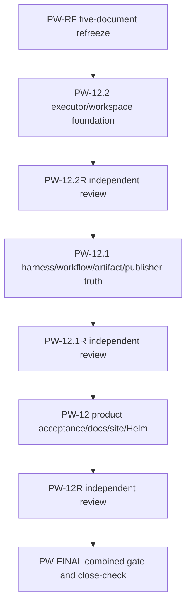

# Pajé Portable Worker Profiles and Isolated Execution Implementation Plan

> **For agentic workers:** Accepted Tasks 1–11 below are preserved receipts.
> Dispatch only the canonical remaining-work nodes and their independent review
> gates; do not treat historical unchecked boxes as active blockers.

**Goal:** Replace `code-change@v1`'s ambient runner and environment selection
with immutable operator-owned worker profiles, separately bound secret
capabilities, and isolated one-shot execution, shipping a local Docker Engine
adapter, a secret-free host development adapter, split coordinator/workload
images, and evidence-backed positioning.

**Architecture:** The workflow resolves and persists a canonical safe
`WorkerProfile` snapshot before execution, then uses provider-neutral harness,
secret-broker, and executor ports. Each probe, agent invocation, verification,
and publisher re-verification runs in a distinct sandbox; the Docker adapter
materializes commands and agent-only secrets in private container `tmpfs`
storage, while the host adapter is explicit, secret-free, and development-only.
This is the isolated leaf-execution foundation beneath the separate durable
Agent Control Plane; it is not itself multi-agent session orchestration.

**Tech Stack:** Go 1.26.1, `gopkg.in/yaml.v3` strict decoding,
`github.com/moby/moby/client` v0.5.0, Docker Engine through a local Unix socket,
Codex CLI 0.144.5, Node.js 24.4.1, Git, Helm 3, and the existing Node.js site
regression suite.

**Design:** [Pajé Portable Worker Profiles and Isolated Execution Design](../specs/2026-07-25-portable-worker-profiles-and-isolated-execution-design.md)

## Global Constraints

- The module path remains exactly `github.com/araihu/paje` and the Go version
  remains exactly `1.26.1`.
- `code-change@v1` changes in place: `worker_profile` is required,
  `environment_keys` is rejected as an unknown field, and no v2 or compatibility
  decoder is added.
- Worker-profile names match `[a-z][a-z0-9-]{0,62}`, revisions are positive,
  and workflow input accepts only exact `name@revision` references.
- OCI images use a repository reference plus a full `sha256` digest and an
  explicit `linux/<architecture>` platform; mutable tags and aliases fail.
- Profiles and secret bindings are operator-owned strict YAML. Secret values,
  source keys, provider references, host paths, Docker IDs, inspect payloads,
  socket paths, and raw engine diagnostics never enter durable or user-visible
  evidence.
- Only `stage: agent` may receive secrets. Preflight, verification, publisher
  re-verification, and host execution are secret-free.
- File and directory targets are normalized below `/run/paje/secrets`.
  Environment targets pass a separate operator allowlist and are injected by
  `paje-sandbox-init`, never Docker container configuration.
- Commands use exact executable and argument arrays. No agent, probe,
  verification, init, or publisher-verification path invokes a shell.
- Every sandbox is one-shot. Retry is permitted only after conclusive agent
  non-start; post-start uncertainty is nonretryable `ambiguous_attempt`.
- `Inspect`, `Cancel`, `Destroy`, and secret `Revoke` are idempotent. Cleanup
  uses bounded non-canceled contexts, and cleanup or revocation failure overrides
  success and disables retry.
- The Docker adapter accepts only a local Unix socket and never inherits a
  Docker context or TCP endpoint. Workloads never receive that socket.
- OCI workloads are non-root with read-only root filesystems, no-new-privileges,
  all Linux capabilities dropped, bounded CPU/memory/PIDs, private home/temp/
  secret `tmpfs` mounts, no host namespaces/devices/published ports, and only
  the declared `none` or isolated `outbound` network mode.
- The coordinator image contains no Codex, Node.js, or repository language
  runtime. The workload image contains no coordinator, Hatchet client, memory
  client, submission client, publisher, or provider credential.
- Publisher re-verification uses the persisted worker profile in fresh
  secret-free sandboxes. GitHub credentials enter only publisher-owned trusted
  Git state after verification succeeds.
- Helm remains coordinator-only and mounts no Docker socket. Kubernetes,
  Podman, remote, and distributed execution remain planned until independent
  adapters pass the common conformance and live gates.
- Existing artifact, approval, publication, memory, fencing, cancellation,
  race, vet, cross-build, chart, image, and opt-in GitHub gates must remain
  green.
- The higher-level Agent Control Plane owns capability negotiation and records
  each task's execution placement, parallelism primitive, rationale, capability
  requirements, lifecycle owner, and fallback plus one durable
  `PlacementAttempt` before invoking this layer.
- Execution placement never weakens the worker-profile, secret-broker,
  executor, sandbox, or publisher boundary. Agent-harness lifecycle and
  subagent coordination do not gain arbitrary command execution.

---

## Canonical Remaining-Work Registry

This registry supersedes the fixed historical implementation-session cut. It
is a development control plane, not product runtime. Accepted Tasks 1–11 and
their implementation receipts remain intact. Rejected ACP-15, PW-12, PW-12.1,
and PW-12.2 candidates are evidence only and must not be reused or cherry-picked.



No two concurrent writer nodes own overlapping paths. A review node is
read-only and reports findings to its lifecycle owner; it never fixes the
candidate. Completion, review acceptance, integration, and cleanup are terminal
or dependency transitions, never promotion. Static `persistent_session` and
`local_sequential` nodes record `promotion_trigger: none`. An ephemeral review
promotes only when its bounded read-only scope grows into long or mutating work;
it stops at a verified checkpoint and hands off to a distinct persistent writer
with exact exclusive ownership. Close evidence always follows the primitive
actually selected: ephemeral review requires runtime-close, while its parent-
local fallback requires an inactive marker.

#### PW-RF — five-document specification refreeze

- Dependencies: exact accepted main base recorded by the lifecycle owner.
- Owned paths: only the five canonical design/plan documents named by this
  refreeze contract.
- Acceptance: stable `PW-*` IDs, non-overlapping ownership, an acyclic dynamic
  registry, resolved Markdown links/fences/Mermaid, and one clean docs commit.
- `execution_placement`: isolated specification-refreeze worktree.
- `parallelism_primitive`: `persistent_session`.
- `placement_rationale`: long, restartable, audit-critical mutation of shared
  product contracts with exact ownership.
- `capability_requirements`: local Git/read/write/test tools; no provider,
  secret, publication, or child-dispatch capability.
- `lifecycle_owner`: parent control task.
- `fallback`: block; never edit these documents from a shared or user worktree.
- `promotion_trigger`: `none`.

#### PW-12.2 — executor/workspace foundation

- Dependencies: integrated `PW-RF`.
- Owned paths: `internal/executor/**`, `internal/sandboxinit/**`,
  `cmd/paje-sandbox-init/**`, and `internal/workspace/gitworktree/**` only.
- Acceptance: `PW-EX01`, `PW-EX02`, `PW-EX03`, `PW-WS01`, and `PW-EN01`, plus
  focused count-20, race, vet, full Go, Linux amd64/arm64 build, ownership, and
  clean-worktree gates.
- `execution_placement`: isolated implementation worktree.
- `parallelism_primitive`: `persistent_session`.
- `placement_rationale`: restart-sensitive, mutating lower-plane work with
  process, Docker, filesystem, and recovery side effects.
- `capability_requirements`: Go 1.26.1, local Docker where available, Linux
  cross-builds, exact Git base; no repository or publisher credential.
- `lifecycle_owner`: parent control task.
- `fallback`: block when isolated placement or exact lower ownership is
  unavailable; do not widen into harness/workflow/product paths.
- `promotion_trigger`: `none`.

#### PW-12.2R — independent executor/workspace review

- Dependencies: terminal candidate from `PW-12.2`.
- Owned paths: none; read-only review of the candidate diff and test evidence.
- Acceptance: bidirectional review against `PW-EX01..PW-EX03`, `PW-WS01`, and
  `PW-EN01`, including pre-child retry, post-receipt ambiguity, signal/exit
  fidelity, workspace self-containment, cleanup, and no ownership escape.
- `execution_placement`: bounded shared-context review runtime.
- `parallelism_primitive`: `ephemeral_subagent`.
- `placement_rationale`: bounded independent read-only audit needs shared
  candidate context but no durable mutation lifecycle.
- `capability_requirements`: repository read and test evidence only.
- `lifecycle_owner`: parent control task.
- `fallback`: parent-local read-only review; never let the writer self-approve,
  and close with terminal evidence plus an inactive local-work marker.
- `promotion_trigger`: if the bounded review grows into long or mutating work,
  stop at a verified read-only checkpoint and hand off to a distinct
  `persistent_session` writer with exact exclusive ownership.

#### PW-12.1 — harness/workflow/artifact/publisher truth

- Dependencies: integrated `PW-12.2` after accepted `PW-12.2R`.
- Owned paths: this canonical plan and its linked portable-worker design,
  `internal/harness/harness.go`, `internal/harness/registry.go`,
  `internal/harness/registry_test.go`, `internal/harness/codex/adapter.go`,
  `internal/harness/codex/adapter_test.go`,
  `internal/workflow/codechange/execute.go`,
  `internal/workflow/codechange/execute_test.go`,
  `internal/workflow/codechange/resolve_test.go`,
  `internal/workflow/codechange/publish.go`, `internal/publisher/publisher.go`,
  `internal/publisher/publisher_test.go`, and the fixture-only refreeze of
  `internal/publisher/gitpr/publisher_test.go`, plus the final exact refreeze of
  `internal/verification/types.go` and the canonical-digest fixture migration
  in `internal/artifact/filesystem/store_test.go` only.
- Acceptance: `PW-SC01`, `PW-H01`, `PW-EV01`, and `PW-PU01`, including exact
  Codex tuple denial, defensive-copy mutation tests, no pre-child presented-key
  evidence, separately derived confirmed-attempt state and exact key unions,
  plus publisher cases for no attempt, confirmed-empty declaration with exact
  baseline, confirmed-nonempty declaration, stripped-empty, partial, extra,
  inverse, and drift.
- `execution_placement`: isolated implementation worktree.
- `parallelism_primitive`: `persistent_session`.
- `placement_rationale`: durable workflow and evidence mutation crosses several
  disjoint packages and needs restartable, independently reviewable ownership.
- `capability_requirements`: Go 1.26.1, accepted executor contract, local tests;
  no live Codex, publisher, GitHub, or production secret credential.
- `lifecycle_owner`: parent control task.
- `fallback`: block until the accepted foundation is integrated; do not alter
  executor, sandbox-init, workspace, documentation, site, or chart paths.
- `promotion_trigger`: `none`.

Requirement coverage, not a historical session or criterion count, closes
this node:

- `PW-SC01`: every executor request runs `ValidateDeclaration` before executor
  dispatch, and the full agent declaration is validated before first acquire;
- `PW-H01`: `AgentEnvironment` receives a defensive requirement copy and only
  the exact Codex auth tuple yields the exact `CODEX_HOME` binding;
- `PW-EV01`: child-start receipt confirmation controls per-attempt state and
  the derived agent/verification key unions, after recomputing the exact
  request-bound environment/materialization digest; and
- `PW-PU01`: portable publisher validation covers skipped, confirmed-empty
  declaration with exact baseline, confirmed-nonempty declaration,
  stripped-empty, partial, extra, inverse, missing, and generation-drifted
  evidence against the defensively copied, manifest-authenticated frozen
  verification plan without historical compatibility.

#### PW-12.1R — independent truth-contract review

- Dependencies: terminal candidate from `PW-12.1`.
- Owned paths: none; read-only candidate review.
- Acceptance: adversarial validation of collision-before-acquire, exact harness
  tuple, defensive clones, child-confirmed evidence derivation, publisher
  confirmation/key-union truth including the complete seven-case matrix,
  durable redaction, and ownership.
- `execution_placement`: bounded shared-context review runtime.
- `parallelism_primitive`: `ephemeral_subagent`.
- `placement_rationale`: independent focused semantic audit is bounded and
  mutation-free.
- `capability_requirements`: repository read and test evidence only.
- `lifecycle_owner`: parent control task.
- `fallback`: parent-local independent read-only review, closed by terminal
  evidence plus an inactive local-work marker.
- `promotion_trigger`: if the bounded review grows into long or mutating work,
  stop at a verified read-only checkpoint and hand off to a distinct
  `persistent_session` writer with exact exclusive ownership.

#### PW-12 — product acceptance, documentation, site, and Helm

- Dependencies: integrated `PW-12.1` after accepted `PW-12.1R`.
- Owned paths: `internal/acceptance/**`, `docs/worker-profiles.md`,
  `docs/worker-secrets.md`, `docs/executors.md`, `README.md`, `site/**`,
  `charts/paje/values.yaml`, `charts/paje/values.schema.json`,
  `charts/paje/templates/configmap.yaml`,
  `charts/paje/templates/deployment.yaml`,
  `charts/paje/templates/secret.yaml`, `charts/paje/templates/NOTES.txt`,
  `charts/paje/templates/_helpers.tpl`, and `charts/paje/render_test.go` only.
- Acceptance: `PW-AC01`, `PW-AC02`, and `PW-AC03`; the product task removes
  the retired `_helpers.tpl` source for `.Values.adapters.runner` and
  `.Values.codexAuth`, proves the standard rendered `codex-go@1` profile live,
  and makes no current/support claim before that proof.
- `execution_placement`: isolated product-acceptance worktree on a Linux Docker
  host with disposable repositories and test-owned resources.
- `parallelism_primitive`: `persistent_session`.
- `placement_rationale`: long, credential-sensitive live acceptance and broad
  but exclusive product-surface mutation require restartable isolation.
- `capability_requirements`: local production Docker workflow, standard
  `codex-go@1`, opt-in Codex auth, site/Helm toolchains; GitHub publication is
  not required and no push/release authority is granted.
- `lifecycle_owner`: parent control task.
- `fallback`: missing live prerequisites leaves `PW-AC01..PW-AC03` unverified
  and blocks support claims and promotion; no acceptance-only workaround.
- `promotion_trigger`: `none`.

#### PW-12R — independent product/security/live review

- Dependencies: terminal candidate from `PW-12` with raw live evidence.
- Owned paths: none; read-only review of candidate, logs, stores, and resource
  cleanup evidence with secret values redacted.
- Acceptance: independently confirms standard-profile live execution,
  coordinator `SIGKILL` recovery, unrelated-run progress, raw/base64 secret
  denial across every durable boundary, truthful product claims, Helm source
  retirement, and no leaked resource.
- `execution_placement`: bounded isolated review runtime.
- `parallelism_primitive`: `ephemeral_subagent`.
- `placement_rationale`: security/live evidence needs independent scrutiny but
  no writer authority.
- `capability_requirements`: read-only candidate and redacted live evidence;
  no secret acquisition or mutation.
- `lifecycle_owner`: parent control task.
- `fallback`: parent-local independent read-only security review; unavailable
  evidence blocks rather than passes; the fallback closes with terminal
  evidence plus an inactive local-work marker.
- `promotion_trigger`: if the bounded review grows into long or mutating work,
  stop at a verified read-only checkpoint and hand off to a distinct
  `persistent_session` writer with exact exclusive ownership.

#### PW-FINAL — combined gate, publication readiness, cleanup, and close-check

- Dependencies: integrated `PW-12` after accepted `PW-12R`, and terminal
  dispositions for every canonical portable node.
- Owned paths: none during validation; any correction is dispatched back to
  the single owning writer as a new reviewed candidate.
- Acceptance: dynamically enumerates every stable requirement ID and canonical
  node disposition, runs combined/security/live gates, proves primitive-
  specific close evidence, verifies cleanup and publication readiness, and
  records unavailable optional gates as unverified rather than passing.
- `execution_placement`: parent integration worktree.
- `parallelism_primitive`: `local_sequential`.
- `placement_rationale`: final integration, conflict, security, publication,
  cleanup, and lifecycle accounting share authoritative state.
- `capability_requirements`: integrated repository, all required local/live
  tools and evidence; publication authority remains separately explicit.
- `lifecycle_owner`: parent control task.
- `fallback`: reopen the exact owning node; never patch across ownership or
  close with nonzero/unknown pending work.
- `promotion_trigger`: `none`.

## Agent Control Plane Placement Contract

The production Agent Control Plane must not copy the retired historical session layout.
For every task it negotiates the current harness capability set and selects
exactly one provider-neutral primitive:

- `persistent_session` for long, restartable, mutating, isolated,
  independently owned, cross-project, steering-heavy, or audit-critical work;
- `ephemeral_subagent` for short investigation/review, normally read-only,
  strongly shared context, and no conflicting ownership;
- `harness_native_parallel` for homogeneous bounded fan-out whose advertised
  limits, cancellation, identity, and results are verified; or
- `local_sequential` for dependencies, shared files, integration ownership,
  uncertain cuts, high conflict risk, or work too small to repay coordination.

For Codex, these map respectively to a user-visible worktree-backed task/thread,
a local same-session subagent, another discovered bounded Codex parallel
capability, and the current control agent. The choice must evaluate duration/
complexity, filesystem/branch/project isolation, ownership independence,
shared context, restart survival, communication/steering/monitoring, creation
cost, concurrency limits, conflict risk, and handoff/audit needs.

Every task record requires `execution_placement`, `parallelism_primitive`,
`placement_rationale`, `capability_requirements`, `lifecycle_owner`, and
`fallback`.
Capability absence follows that fallback: isolation-required or cross-project
mutation blocks rather than silently becoming a subagent; bounded fan-out falls
back to persistent or sequential work; absent subagents fall back to
sequential; exhausted concurrency queues deterministically.

Placement is re-evaluated after scope or capability changes. A growing
subagent is stopped at a safe checkpoint and promoted to a persistent session
through an explicit evidence handoff and lifecycle-owner transfer. Ephemeral
subagents are read-only by default; a mutating one requires exclusive
ownership, and no two subagents or mixed placements may mutate the same files
or resources. Placement records, Codex mapping, promotion, fallback,
concurrency, and overlap denial are mandatory acceptance gates.

Every selection also creates a durable `PlacementAttempt` with the capability
snapshot, actual runtime IDs returned, lifecycle actions, terminal evidence,
disposition, and primitive-specific close evidence. The capability-aware
`AgentHarness` contract is:

- persistent session: exact runtime-ID registration/acknowledgement,
  send/read/wait/interrupt, callback plus cursor polling, and archive receipt;
- ephemeral subagent: optional returned runtime ID and capability-gated
  ack/send/callback, but mandatory wait/read terminal and runtime-close evidence
  without archive;
- native parallel: bounded deterministic dispatch, exact aggregation, and
  defined cancel semantics without invented child/session identity; and
- local sequential: no child creation and an explicit inactive-local marker.

Closure requires every persistent session archived, every ephemeral runtime
closed, every native fan-out terminally aggregated or canceled, no local work
active, and every field of the typed pending-work gate zero.

## File Map

### Worker profiles

- `internal/workerprofile/types.go`: portable profile, snapshot, identity,
  harness, tool, runtime, resource, and secret declarations.
- `internal/workerprofile/validate.go`: normalization and fail-closed contract
  validation.
- `internal/workerprofile/registry.go`: provider-neutral resolution port and
  canonical digest helper.
- `internal/workerprofile/filesystem/registry.go`: atomic strict-YAML directory
  registry with last-known-good reload behavior.
- `internal/workerprofile/mock/registry.go`: deterministic workflow double.

### Secrets

- `internal/secret/types.go`: binding references, delivery, transient material,
  leases, and non-serializability guards.
- `internal/secret/registry.go`: strict operator binding and authorization
  contract.
- `internal/secret/filesystem/registry.go`: atomic strict-YAML binding-directory
  registry that retains previously loaded revisions.
- `internal/secret/provider.go`: bounded source-provider port.
- `internal/secret/provider/filesystem.go`: descriptor-anchored regular-file and
  symlink-free directory reads.
- `internal/secret/provider/environment.go`: bounded allowlisted environment
  value reads.
- `internal/secret/broker.go`: acquisition, expiry, exact-value detector, zeroing,
  and idempotent revocation.
- `internal/secret/mock/broker.go`: deterministic acquisition/revocation double.

### Execution and harnesses

- `internal/executor/types.go`: attempt identity, command, workspace, result,
  state, request, and lifecycle port.
- `internal/executor/registry.go`: `runtime.kind` to executor mapping and profile
  capability validation.
- `internal/executor/mock/executor.go`: controllable lifecycle double.
- `internal/executor/contracttest/suite.go`: reusable lifecycle/security
  conformance suite.
- `internal/executor/host/executor.go`: explicit secret-free local development
  executor.
- `internal/executor/dockerengine/*.go`: local Unix-socket Docker lifecycle,
  image/platform verification, archive materialization, bounded logs, cleanup,
  and generic error mapping.
- `internal/harness/harness.go`: provider-neutral harness command/parser port and
  exact registry.
- `internal/harness/codex/adapter.go`: deterministic Codex 0.144.5 protocol.
- `internal/sandboxinit/protocol.go`: private command document shared by the
  Docker adapter and init binary.
- `cmd/paje-sandbox-init/main.go`: validated no-shell environment construction,
  transient removal, and `execve`.

### Workflow, durable state, and publication

- `internal/template/codechange/input.go`: breaking `worker_profile` input.
- `internal/run/run.go` and `internal/run/state.go`: immutable resolved profile,
  binding references, lifecycle evidence, and transition validation.
- `internal/workflow/codechange/{service,resolve,execute}.go`: new ports,
  persisted resolution, isolated stage execution, recovery, secret lifecycle,
  and artifact binding.
- `internal/repository/{repository,profile}.go`: repository discovery through an
  injected sandbox command runner rather than a process-local verifier.
- `internal/artifact/artifact.go`: executor-safe execution evidence and persisted
  worker-profile identity.
- `internal/publisher/publisher.go` and `internal/publisher/gitpr/publisher.go`:
  safe profile transport and secret-free sandbox re-verification before
  credential preparation.

### Composition, images, deployment, and evidence

- `internal/config/config.go`: profile, binding, executor, Docker, host, secret,
  and production-mode configuration.
- `cmd/paje/main.go`: registry/broker/executor/harness composition without using
  the global runner for `code-change@v1`.
- `Dockerfile`: coordinator-only image.
- `Dockerfile.worker-codex`: Codex/Node/Go/Git workload plus sandbox init.
- `deploy/worker-profiles/codex-go-v1.yaml.tmpl`: exact-digest release template.
- `deploy/secret-bindings/example.yaml`: secret-free binding schema example.
- `internal/acceptance/*`: Docker, image, restart, adversarial, and live Codex
  acceptance.
- `charts/paje/*`, `README.md`, `site/app/page.tsx`, and supporting tests:
  coordinator-only Kubernetes and current/planned support positioning.

---

### Task 1: Worker Profile Domain and Atomic Registry

**Files:**
- Create: `internal/workerprofile/types.go`
- Create: `internal/workerprofile/validate.go`
- Create: `internal/workerprofile/registry.go`
- Create: `internal/workerprofile/types_test.go`
- Create: `internal/workerprofile/filesystem/registry.go`
- Create: `internal/workerprofile/filesystem/registry_test.go`
- Create: `internal/workerprofile/mock/registry.go`
- Create: `internal/workerprofile/mock/registry_test.go`

**Interfaces:**
- Produces: `ProfileID`, `ParseProfileID`, `Snapshot`, `Registry.Resolve`,
  `Canonicalize`, `filesystem.New`, `(*filesystem.Registry).Reload`, and
  `mock.NewRegistry`.
- Consumed by: Tasks 2-12.

- [ ] **Step 1: Write strict identity, schema, normalization, and digest tests**

```go
func TestParseProfileIDRequiresExactRevision(t *testing.T) {
    got, err := ParseProfileID("codex-go@1")
    if err != nil || got != (ProfileID{Name: "codex-go", Revision: 1}) {
        t.Fatalf("ParseProfileID() = %#v, %v", got, err)
    }
    for _, value := range []string{"codex-go", "codex-go@latest", "Codex@1", "codex-go@0"} {
        if _, err := ParseProfileID(value); err == nil {
            t.Fatalf("ParseProfileID(%q) succeeded", value)
        }
    }
}

func TestCanonicalizeIsStableAndRejectsMutableOCIImage(t *testing.T) {
    first := validOCIProfile()
    second := validOCIProfile()
    slices.Reverse(second.Tools)
    gotA, errA := Canonicalize(first)
    gotB, errB := Canonicalize(second)
    if errA != nil || errB != nil || gotA.Digest != gotB.Digest {
        t.Fatalf("canonical snapshots differ: %v %v", errA, errB)
    }
    first.Runtime.Image = "ghcr.io/araihu/paje-worker-codex-go:latest"
    if _, err := Canonicalize(first); err == nil {
        t.Fatal("mutable image was accepted")
    }
}
```

- [ ] **Step 2: Run the domain tests and confirm they fail**

Run: `go test ./internal/workerprofile/...`

Expected: FAIL because the package and declared API do not exist.

- [ ] **Step 3: Implement the portable types and exact registry port**

```go
type ProfileID struct {
    Name     string `json:"name" yaml:"name"`
    Revision uint64 `json:"revision" yaml:"revision"`
}

type SecretRequirement struct {
    Capability      string `json:"capability" yaml:"capability"`
    BindingRevision uint64 `json:"binding_revision" yaml:"binding_revision"`
    Stage           string `json:"stage" yaml:"stage"`
    Delivery        string `json:"delivery" yaml:"delivery"`
    Target          string `json:"target" yaml:"target"`
    Required        bool   `json:"required" yaml:"required"`
}

type Snapshot struct {
    APIVersion string              `json:"api_version" yaml:"api_version"`
    Kind       string              `json:"kind" yaml:"kind"`
    Metadata   ProfileID           `json:"metadata" yaml:"metadata"`
    Runtime    Runtime             `json:"runtime" yaml:"runtime"`
    Resources  Resources           `json:"resources" yaml:"resources"`
    Harness    Harness             `json:"harness" yaml:"harness"`
    Tools      []Tool              `json:"tools" yaml:"tools"`
    Secrets    []SecretRequirement `json:"secrets,omitempty" yaml:"secrets,omitempty"`
    Digest     string              `json:"digest" yaml:"-"`
}

type Registry interface {
    Resolve(context.Context, ProfileID) (Snapshot, error)
}
```

Implement the exact schema from the design, sort tools and secret declarations
by stable identity before hashing, exclude `Digest` from canonical JSON, and
return defensive copies. `host` rejects images and secrets; `oci` requires the
digest, Linux platform, positive bounded resources, and read-only root.

- [ ] **Step 4: Write registry reload tests**

```go
func TestReloadIsAtomicAndKeepsLastKnownGood(t *testing.T) {
    dir := t.TempDir()
    writeProfile(t, dir, "codex-go.yaml", validYAML("codex-go", 1))
    registry, err := New(dir, workerprofile.LimitsForTests())
    if err != nil { t.Fatal(err) }
    before, _ := registry.Resolve(context.Background(), workerprofile.ProfileID{Name: "codex-go", Revision: 1})
    writeProfile(t, dir, "broken.yaml", "kind: Unknown\n")
    if err := registry.Reload(context.Background()); err == nil { t.Fatal("reload succeeded") }
    after, err := registry.Resolve(context.Background(), before.Metadata)
    if err != nil || after.Digest != before.Digest { t.Fatalf("last-known-good lost: %v", err) }
}
```

- [ ] **Step 5: Implement strict YAML directory loading and mock registry**

Use `yaml.Decoder.KnownFields(true)`, require exactly one document and EOF per
`.yaml` or `.yml` file, reject duplicate `name@revision`, build the complete new
map before swapping it under a mutex, and return generic errors without file
contents. The mock records requests and supports configured snapshots/errors.

- [ ] **Step 6: Run, format, and commit Task 1**

Run:

```bash
gofmt -w $(rg --files internal/workerprofile -g '*.go')
go test ./internal/workerprofile/... -race
git diff --check
git add internal/workerprofile
git commit -m "feat: add immutable worker profiles"
```

### Task 2: Secret Bindings, Providers, Broker, and Detection

**Files:**
- Create: `internal/secret/types.go`
- Create: `internal/secret/registry.go`
- Create: `internal/secret/provider.go`
- Create: `internal/secret/broker.go`
- Create: `internal/secret/broker_test.go`
- Create: `internal/secret/filesystem/registry.go`
- Create: `internal/secret/filesystem/registry_test.go`
- Create: `internal/secret/provider/filesystem.go`
- Create: `internal/secret/provider/filesystem_test.go`
- Create: `internal/secret/provider/environment.go`
- Create: `internal/secret/provider/environment_test.go`
- Create: `internal/secret/mock/broker.go`

**Interfaces:**
- Consumes: `workerprofile.ProfileID` and `workerprofile.SecretRequirement`.
- Produces: `BindingRef`, `Registry.Resolve`, `Broker.Acquire`, `Broker.Revoke`,
  `Lease`, `Materialization`, and `Detector`.
- Consumed by: Tasks 3, 6, 8, 9, and 11.

- [ ] **Step 1: Write binding authorization and non-serialization tests**

```go
func TestResolveRequiresExactAuthorizationTuple(t *testing.T) {
    ref := BindingRef{Capability: "harness.codex-auth", Revision: 1}
    request := ResolveRequest{
        ProfileID: workerprofile.ProfileID{Name: "codex-go", Revision: 1},
        Ref: ref,
        Requirement: workerprofile.SecretRequirement{
            Capability: "harness.codex-auth", Stage: "agent",
            Delivery: "directory", Target: "/run/paje/secrets/codex", Required: true,
        },
    }
    if _, err := registry.Resolve(context.Background(), request); err != nil { t.Fatal(err) }
    request.Requirement.Target = "/run/paje/secrets/other"
    if _, err := registry.Resolve(context.Background(), request); err == nil { t.Fatal("mismatch accepted") }
}

func TestLeaseCannotBeJSONEncoded(t *testing.T) {
    if _, err := json.Marshal(Lease{}); !errors.Is(err, ErrSecretSerialization) {
        t.Fatalf("json.Marshal() error = %v", err)
    }
}
```

- [ ] **Step 2: Run the secret tests and confirm they fail**

Run: `go test ./internal/secret/...`

Expected: FAIL because the secret packages do not exist.

- [ ] **Step 3: Implement safe references and transient lease types**

```go
type BindingRef struct {
    Capability string `json:"capability"`
    Revision   uint64 `json:"revision"`
}

type AcquireRequest struct {
    RunID      string
    Attempt    int
    StartedAt  time.Time
    ProfileID  workerprofile.ProfileID
    Capability string
    Binding    uint64
    Delivery   workerprofile.SecretRequirement
    Deadline   time.Time
}

type Broker interface {
    Acquire(context.Context, AcquireRequest) (Lease, error)
    Revoke(context.Context, string) error
}
```

`Lease` and `Materialization` must implement `json.Marshaler` and
`encoding.TextMarshaler` by returning `ErrSecretSerialization`. Clone all byte
slices on input/output, expose only opaque lease ID and expiry as safe accessors,
and overwrite broker-owned bytes during revocation.

- [ ] **Step 4: Implement the strict binding registry and bounded providers**

Each operator-owned `.yaml` or `.yml` file uses the approved versioned wrapper.
The `bindings` map may contain multiple capabilities, with one revision of each
capability per file. Additional immutable revisions use additional files in the
same configured directory; the registry aggregates the directory and rejects a
duplicate `(capability, revision)` pair.

```yaml
api_version: paje.araihu.com/v1alpha1
kind: SecretBindings
bindings:
  harness.codex-auth:
    revision: 1
    authorize:
      profile: codex-go@1
      stage: agent
      delivery: directory
      target: /run/paje/secrets/codex
    source:
      provider: filesystem
      reference: /etc/paje/secrets/codex
```

Reject reserved capability namespaces, duplicate revisions, optional secrets,
non-agent stages, target mismatch, symlinks, devices, sockets, oversized values,
oversized trees, unsafe modes/owners, path escapes, and environment source keys
outside the operator allowlist. Require exactly one strict wrapper document and
EOF per file, reject symlinked entries, build the complete directory snapshot
before swapping it, and retain every previously loaded revision in the in-memory
catalog so active runs survive file removal until process restart.

- [ ] **Step 5: Implement acquisition, revocation, and exact/reversible detection**

```go
type Detector interface {
    Scan([]byte) bool
    Redact([]byte) (redacted []byte, detected bool)
}
```

The broker resolves the exact binding tuple, reads the provider only during
`Acquire`, creates a cryptographically random opaque lease ID, caps expiry at
the attempt deadline, and stores material under a mutex. The detector scans raw
values plus standard/base64url encodings without persisting values, lengths, or
digests. Partial acquisition revokes all earlier leases in reverse order.

- [ ] **Step 6: Run adversarial secret tests and commit Task 2**

Run:

```bash
gofmt -w $(rg --files internal/secret -g '*.go')
go test ./internal/secret/... -race
go test ./internal/workerprofile/... -race
git diff --check
git add internal/secret
git commit -m "feat: add isolated secret capabilities"
```

### Task 3: Provider-Neutral Executor Contract and Conformance Suite

**Files:**
- Create: `internal/executor/types.go`
- Create: `internal/executor/validate.go`
- Create: `internal/executor/registry.go`
- Create: `internal/executor/types_test.go`
- Create: `internal/executor/mock/executor.go`
- Create: `internal/executor/mock/executor_test.go`
- Create: `internal/executor/contracttest/suite.go`

**Interfaces:**
- Consumes: `workerprofile.Snapshot` and transient `secret.Materialization`.
- Produces: `AttemptID`, `Command`, `Workspace`, `Request`, `Result`, `State`,
  `Executor`, `Registry`, and `contracttest.Run`.
- Consumed by: Tasks 4-12.

- [ ] **Step 1: Write identity, request, registry, and defensive-copy tests**

```go
func TestAttemptIDRequiresCompleteDeterministicIdentity(t *testing.T) {
    valid := AttemptID{RunID: "run-1", Stage: "execute", Attempt: 2,
        StartedAt: time.Unix(100, 7).UTC(), Purpose: PurposeVerification, Sequence: 3}
    if err := valid.Validate(); err != nil { t.Fatal(err) }
    valid.StartedAt = time.Time{}
    if err := valid.Validate(); err == nil { t.Fatal("zero StartedAt accepted") }
}

func TestRequestRejectsSecretsOutsideAgent(t *testing.T) {
    request := validRequest()
    request.Attempt.Purpose = PurposeVerification
    request.Secrets = []secret.Materialization{testMaterialization(t)}
    if err := request.Validate(); err == nil { t.Fatal("verification secret accepted") }
}
```

- [ ] **Step 2: Run executor tests and confirm they fail**

Run: `go test ./internal/executor/...`

Expected: FAIL because the executor packages do not exist.

- [ ] **Step 3: Implement the lifecycle contract**

```go
type AttemptID struct {
    RunID string; Stage string; Attempt int; StartedAt time.Time
    Purpose Purpose; Sequence int
}

type Command struct {
    Executable string
    Args []string
    Directory string
    Environment map[string]string
}

type Request struct {
    Attempt AttemptID
    Profile workerprofile.Snapshot
    Command Command
    Workspace Workspace
    Environment map[string]string
    Secrets []secret.Materialization
    Timeout time.Duration
    OutputLimit int64
}

type Executor interface {
    Execute(context.Context, Request) (Result, error)
    Inspect(context.Context, AttemptID) (State, error)
    Cancel(context.Context, AttemptID) error
    Destroy(context.Context, AttemptID) error
}
```

Define stable states `absent`, `created`, `running`, `completed`, `destroyed`,
and `unknown`. `Result` records created/started/completed, exit code, separately
bounded stdout/stderr, duration, truncation, secret-detected flag, and safe
runtime facts only. Provider errors remain wrapped but serialize only stable
class/cause codes.

- [ ] **Step 4: Implement executor registry and reusable conformance suite**

The registry maps only `host` and `oci`, validates a profile before selection,
and rejects duplicates. `contracttest.Run(t, factory)` exercises create/start/
complete, start failure, nonzero exit, timeout, cancellation, descendant death,
bounded output, workspace isolation, secret stage isolation, deterministic
identity collision, idempotent inspect/cancel/destroy, and safe diagnostics.

- [ ] **Step 5: Run, format, and commit Task 3**

Run:

```bash
gofmt -w $(rg --files internal/executor -g '*.go')
go test ./internal/executor/... -race
git diff --check
git add internal/executor
git commit -m "feat: define isolated executor lifecycle"
```

### Task 4: Harness Registry, Codex Protocol, and Sandbox Init

**Files:**
- Create: `internal/harness/harness.go`
- Create: `internal/harness/registry.go`
- Create: `internal/harness/registry_test.go`
- Create: `internal/harness/codex/adapter.go`
- Create: `internal/harness/codex/adapter_test.go`
- Create: `internal/sandboxinit/protocol.go`
- Create: `internal/sandboxinit/protocol_test.go`
- Create: `cmd/paje-sandbox-init/main.go`
- Create: `cmd/paje-sandbox-init/main_test.go`
- Modify: `internal/runner/codex/runner.go`
- Modify: `internal/runner/codex/runner_test.go`

**Interfaces:**
- Consumes: `workerprofile.Snapshot` and `executor.Command/Result`.
- Produces: `harness.Adapter`, `harness.Registry`, `codex.New`, and the exact
  `sandboxinit.Document` archive protocol.
- Consumed by: Tasks 6, 8, 9, and 11.
- This is the execution-harness command/parser contract. The separate Agent
  Control Plane `AgentHarness` owns capability-aware dispatch/observe/send/wait/
  interrupt-or-cancel/close, with `AgentSession` only for persistent sessions,
  and does not execute commands.

- [ ] **Step 1: Write deterministic command/parser and protocol tests**

```go
func TestAgentCommandIsExact(t *testing.T) {
    adapter := New("0.144.5")
    command, err := adapter.AgentCommand("change the file")
    if err != nil { t.Fatal(err) }
    want := []string{"exec", "--json", "--ephemeral", "--ignore-user-config",
        "--sandbox", "workspace-write", "change the file"}
    if command.Executable != "codex" || !slices.Equal(command.Args, want) {
        t.Fatalf("command = %#v", command)
    }
}

func TestDocumentRejectsShellAndEscapingPaths(t *testing.T) {
    document := validDocument()
    document.Command.Executable = "sh"
    if err := document.Validate(); err == nil { t.Fatal("shell accepted") }
    document = validDocument()
    document.Command.Directory = "/outside"
    if err := document.Validate(); err == nil { t.Fatal("outside directory accepted") }
}
```

- [ ] **Step 2: Run harness/init tests and confirm they fail**

Run: `go test ./internal/harness/... ./internal/sandboxinit/... ./cmd/paje-sandbox-init`

Expected: FAIL because the new packages and binary do not exist.

- [ ] **Step 3: Implement the exact harness port and Codex adapter**

```go
type Adapter interface {
    ID() string
    Version() string
    Probe() executor.Command
    AgentCommand(prompt string) (executor.Command, error)
    Parse(executor.Result) (string, error)
    AcceptsCapability(string) bool
}
```

The registry requires exact ID/version matches from the persisted profile.
Codex recognizes only `harness.codex-auth`, probes with `codex --version`, uses
the existing deterministic JSONL protocol, and requires one final completed
agent message. Keep `internal/runner/codex` as a thin compatibility wrapper for
the separate legacy workflow, delegating parsing to this adapter.

- [ ] **Step 4: Implement and test the private init document**

```go
type Document struct {
    WorkspaceRoot string            `json:"workspace_root"`
    Command       executor.Command  `json:"command"`
    Environment   map[string]string `json:"environment"`
    EnvironmentFiles map[string]string `json:"environment_files,omitempty"`
}
```

Bound JSON to 1 MiB, disallow unknown fields and trailing values, require the
fixed workspace and secret roots, validate every executable/argument/key/path,
and read environment secret files after container start. `PW-EX03` supersedes
the historical direct-`syscall.Exec` instruction: the final helper is a
no-shell PID 1 supervisor that unlinks transient material, starts the declared
child, publishes the bound receipt only after post-success OS observation,
forwards signals, reaps descendants, and returns the exact child exit status.
Tests execute a helper binary and assert argv/env, receipt binding, signal/exit
fidelity, file removal, malformed input denial, and no shell expansion.

- [ ] **Step 5: Run, format, and commit Task 4**

Run:

```bash
gofmt -w $(rg --files internal/harness internal/sandboxinit cmd/paje-sandbox-init internal/runner/codex -g '*.go')
go test ./internal/harness/... ./internal/sandboxinit/... ./cmd/paje-sandbox-init ./internal/runner/codex -race
git diff --check
git add internal/harness internal/sandboxinit cmd/paje-sandbox-init internal/runner/codex
git commit -m "feat: add exact worker harness protocol"
```

### Task 5: Host Executor and Sandbox-Backed Repository Commands

**Files:**
- Create: `internal/executor/host/executor.go`
- Create: `internal/executor/host/executor_test.go`
- Create: `internal/executor/host/contract_test.go`
- Create: `internal/executor/commandrunner/runner.go`
- Create: `internal/executor/commandrunner/runner_test.go`
- Modify: `internal/repository/repository.go`
- Modify: `internal/repository/profile.go`
- Modify: `internal/repository/profile_test.go`
- Modify: `internal/verification/types.go`
- Modify: `internal/verification/types_test.go`

**Interfaces:**
- Consumes: Tasks 1-4 executor and harness contracts.
- Produces: host executor and `commandrunner.Runner`, used by repository
  preflight, workflow verification, and publisher verification.
- Consumed by: Tasks 8-11.

- [ ] **Step 1: Write host policy and repository-runner tests**

```go
func TestHostRejectsOCISecretsAndProductionMode(t *testing.T) {
    for _, request := range []executor.Request{ociRequest(), hostRequestWithSecret()} {
        target, _ := New(Config{Enabled: true})
        if _, err := target.Execute(context.Background(), request); err == nil {
            t.Fatal("unsafe host request succeeded")
        }
    }
    if _, err := New(Config{Enabled: true, ProductionOnly: true}); err == nil {
        t.Fatal("production host executor enabled")
    }
}

func TestRepositoryProfileUsesInjectedSandboxRunner(t *testing.T) {
    runner := &recordingCommandRunner{results: gitAndGoResults()}
    profile, _ := NewGoProfile(verification.DefaultLimits)
    _, err := profile.Inspect(context.Background(), ProfileRequest{
        Workspace: t.TempDir(), Commands: runner,
    })
    if err != nil { t.Fatal(err) }
    if runner.calls == 0 { t.Fatal("profile bypassed injected runner") }
}
```

- [ ] **Step 2: Run tests and confirm the new assertions fail**

Run: `go test ./internal/executor/host ./internal/executor/commandrunner ./internal/repository`

Expected: FAIL because host/commandrunner do not exist and profiles still own a
process-local verifier.

- [ ] **Step 3: Implement the explicit host executor**

Use `exec.CommandContext`, exact environment ordering, existing process-group
configuration, separate bounded stdout/stderr, and attempt-keyed in-memory
state. Reject unless `Config.Enabled`, reject all secrets and OCI profiles,
report non-certified safe facts, and implement idempotent process-group cancel
and state removal. Run the common contract suite with Docker-specific cases
declared unsupported.

- [ ] **Step 4: Inject sandbox command execution into repository profiles**

```go
type CommandRunner interface {
    Run(context.Context, verification.Command) verification.Result
}

type ProfileRequest struct {
    Workspace string
    Commands CommandRunner
    Checks []verification.CommandSpec
    ModuleExclusions []ModuleExclusion
}
```

Remove `verification.NewExecutor` from profile constructors. Every Git, Go,
tool, and verification probe must pass through the injected runner. Preserve
repository-relative directories in durable `verification.Command` evidence and
resolve them against the transient workspace only in the command runner.

- [ ] **Step 5: Run, format, and commit Task 5**

Run:

```bash
gofmt -w $(rg --files internal/executor/host internal/executor/commandrunner internal/repository internal/verification -g '*.go')
go test ./internal/executor/... ./internal/repository ./internal/verification -race
git diff --check
git add internal/executor/host internal/executor/commandrunner internal/repository internal/verification
git commit -m "feat: add secret-free host execution"
```

### Task 6: Local Docker Engine Executor

**Files:**
- Modify: `go.mod`
- Modify: `go.sum`
- Create: `internal/executor/dockerengine/client.go`
- Create: `internal/executor/dockerengine/executor.go`
- Create: `internal/executor/dockerengine/image.go`
- Create: `internal/executor/dockerengine/materialize.go`
- Create: `internal/executor/dockerengine/logs.go`
- Create: `internal/executor/dockerengine/errors.go`
- Create: `internal/executor/dockerengine/labels.go`
- Create: `internal/executor/dockerengine/executor_test.go`
- Create: `internal/executor/dockerengine/security_test.go`
- Create: `internal/executor/dockerengine/contract_test.go`

**Interfaces:**
- Consumes: Tasks 1-5 and Moby client v0.5.0.
- Produces: `dockerengine.New(Config) (executor.Executor, error)`.
- Consumed by: Tasks 7-12.

- [ ] **Step 1: Add the official client and write local-socket/security tests**

Run: `go get github.com/moby/moby/client@v0.5.0`

```go
func TestNewAcceptsOnlyLocalUnixSocket(t *testing.T) {
    for _, endpoint := range []string{"tcp://127.0.0.1:2375", "ssh://host", "", "unix://relative.sock"} {
        if _, err := New(Config{Endpoint: endpoint}); err == nil {
            t.Fatalf("New(%q) succeeded", endpoint)
        }
    }
}

func TestContainerConfigHasNoSecretOrDeclaredChildCommand(t *testing.T) {
    api := newFakeEngine(t)
    target := newExecutorForTest(t, api)
    _, _ = target.Execute(context.Background(), requestWithEnvironmentSecret(t, "exact-secret"))
    created := api.LastCreate()
    encoded, _ := json.Marshal(created)
    for _, forbidden := range []string{"exact-secret", "codex exec", "CODEX_HOME="} {
        if bytes.Contains(encoded, []byte(forbidden)) { t.Fatalf("container config leaked %q", forbidden) }
    }
}
```

- [ ] **Step 2: Run Docker adapter tests and confirm they fail**

Run: `go test ./internal/executor/dockerengine`

Expected: FAIL because the adapter does not exist.

- [ ] **Step 3: Implement engine construction, image verification, and labels**

Construct the Moby client from the explicit absolute Unix endpoint only; do not
use `FromEnv`. Pull only the exact digest, use executor-owned registry auth,
inspect the resulting repository digest/OS/architecture, and reject mismatch.
Derive deterministic labels from every `AttemptID` field and rediscover exactly
one container; zero or multiple matches map to stable absent/conflict states
without persisting IDs or raw inspect data.

- [ ] **Step 4: Implement hardened container creation and archive materialization**

Create containers with fixed command
`/usr/local/bin/paje-sandbox-init /run/paje/command.json`, a worktree bind at
`/workspace`, private `/run/paje`, `/home/paje`, and `/tmp` tmpfs mounts, exact
resource limits, non-root user, read-only root, dropped capabilities,
no-new-privileges, no devices/ports/host namespaces, and the declared network.
Build an in-memory tar archive containing the command document plus secret
files/directories with private modes and copy it through the Engine archive API
before start. Never bind-mount a secret source.

- [ ] **Step 5: Implement bounded logs and lifecycle recovery**

Attach before start, demultiplex stdout/stderr into separate bounded buffers,
wait for a terminal state, and return exact created/started/completed evidence.
`Inspect` maps engine state to the generic enum, `Cancel` stops then kills with
bounded waits, and `Destroy` force-removes container and attempt network state.
All operations are idempotent; unknown/disconnect after start stays unknown.

- [ ] **Step 6: Run fake-engine, race, and common conformance tests**

Run:

```bash
gofmt -w $(rg --files internal/executor/dockerengine -g '*.go')
go test ./internal/executor/dockerengine ./internal/executor/contracttest -race
go test ./internal/executor/... -race
git diff --check
```

- [ ] **Step 7: Commit Task 6**

```bash
git add go.mod go.sum internal/executor/dockerengine
git commit -m "feat: add local Docker executor"
```

### Task 7: Split Images, Real Docker Conformance, and Worker Profile Fixture

**Files:**
- Modify: `Dockerfile`
- Create: `Dockerfile.worker-codex`
- Create: `deploy/worker-profiles/codex-go-v1.yaml.tmpl`
- Create: `deploy/secret-bindings/example.yaml`
- Modify: `internal/acceptance/image_test.go`
- Create: `internal/acceptance/docker_executor_test.go`
- Create: `internal/acceptance/sandbox_init_test.go`

**Interfaces:**
- Consumes: Docker executor and init protocol from Tasks 4 and 6.
- Produces: coordinator image, workload image, exact profile template, and
  opt-in real-engine conformance.
- Consumed by: Tasks 8-12.

- [ ] **Step 1: Write image-content and live-container acceptance first**

```go
func TestCoordinatorAndWorkerImageSeparation(t *testing.T) {
    requireOptIn(t, "PAJE_DOCKER_ACCEPTANCE", "split image acceptance")
    coordinator := buildImage(t, "Dockerfile")
    worker := buildImage(t, "Dockerfile.worker-codex")
    assertCommandMissing(t, coordinator, "codex")
    assertCommandMissing(t, coordinator, "node")
    assertCommandMissing(t, coordinator, "go")
    assertCommandPresent(t, worker, "codex")
    assertCommandPresent(t, worker, "go")
    assertCommandPresent(t, worker, "paje-sandbox-init")
    assertCommandMissing(t, worker, "paje")
}
```

- [ ] **Step 2: Run the opt-in image test and confirm it fails**

Run: `PAJE_DOCKER_ACCEPTANCE=1 go test ./internal/acceptance -run 'TestCoordinatorAndWorkerImageSeparation|TestDockerExecutor' -count=1 -v`

Expected: FAIL because the split worker image and real executor fixture do not
exist.

- [ ] **Step 3: Split the Dockerfiles and add safe examples**

The coordinator final stage contains only the Pajé binary, CA certificates,
Git, and SSH client required by trusted workspace/publisher operations. The
worker final stage combines Node.js 24.4.1, Codex 0.144.5, Go 1.26.1, Git, CA
certificates, and `paje-sandbox-init`, defaults to UID/GID 65532, and contains no
`paje` coordinator binary. Bind source revision and every tool version in OCI
labels. The profile template uses `${IMAGE_DIGEST}` and `${PLATFORM}` tokens so
release/acceptance tooling must substitute an inspected exact value before the
strict registry sees it; the registry never expands environment variables.

- [ ] **Step 4: Run real Docker conformance and security probes**

Build and tag the workload, start a temporary local registry, push the image,
resolve its repository digest, render the profile into `t.TempDir`, and run the
common executor suite. Add probes for read-only root, non-root user, no Docker
socket, no source/sibling paths, no published ports, dropped capabilities,
PID/output bounds, descendant cancellation, secret disappearance, and
environment secret absence from `docker inspect`.

- [ ] **Step 5: Run and commit Task 7**

Run:

```bash
gofmt -w $(rg --files internal/acceptance -g '*.go')
go test ./internal/acceptance
PAJE_DOCKER_ACCEPTANCE=1 go test ./internal/acceptance -run 'TestCoordinator|TestWorker|TestDockerExecutor|TestSandboxInit' -count=1 -v
git diff --check
git add Dockerfile Dockerfile.worker-codex deploy internal/acceptance
git commit -m "build: split coordinator and worker images"
```

### Task 8: Breaking Input and Durable Resolution

**Files:**
- Modify: `internal/template/codechange/input.go`
- Modify: `internal/template/codechange/input_test.go`
- Modify: `internal/run/run.go`
- Modify: `internal/run/state.go`
- Modify: `internal/run/state_test.go`
- Modify: `internal/run/filesystem/store_test.go`
- Modify: `internal/workflow/codechange/service.go`
- Modify: `internal/workflow/codechange/resolve.go`
- Modify: `internal/workflow/codechange/resolve_test.go`
- Modify: `internal/workflow/codechange/service_test.go`

**Interfaces:**
- Consumes: profile, binding, executor, and harness registries.
- Produces: required `worker_profile`, immutable safe resolved state, and
  bidirectional durable validation.
- Consumed by: Tasks 9-12.

- [ ] **Step 1: Write the breaking input and durable-binding tests**

```go
func TestDecodeRequiresExactWorkerProfileAndRejectsEnvironmentKeys(t *testing.T) {
    raw := validRawInput()
    delete(raw, "worker_profile")
    assertDecodeFails(t, raw)
    raw = validRawInput()
    raw["worker_profile"] = "codex-go"
    assertDecodeFails(t, raw)
    raw = validRawInput()
    raw["environment_keys"] = []string{"TOKEN"}
    assertDecodeFails(t, raw)
}

func TestResolvedProfileAndBindingsAreWriteOnce(t *testing.T) {
    record := resolvedRecord(t)
    next := run.CloneRecord(record)
    next.WorkerProfile.Digest = strings.Repeat("f", 64)
    if _, err := run.PrepareSave(record, next); err == nil {
        t.Fatal("profile mutation accepted")
    }
}
```

- [ ] **Step 2: Run targeted tests and confirm they fail**

Run: `go test ./internal/template/codechange ./internal/run ./internal/workflow/codechange -run 'WorkerProfile|EnvironmentKeys|ResolvedProfile|Binding'`

Expected: FAIL because the old input and run record are still authoritative.

- [ ] **Step 3: Change `code-change@v1` in place**

Replace `EnvironmentKeys []string` with
`WorkerProfile string \`json:"worker_profile"\``. Normalize with
`workerprofile.ParseProfileID`, require an exact reference, preserve repository
`Profile`, checks, exclusions, and publication behavior, and update canonical
input tests so the old field fails through unknown-field rejection.

- [ ] **Step 4: Persist and validate the safe resolved snapshot**

```go
type Record struct {
    // existing fields
    WorkerProfile *workerprofile.Snapshot `json:"worker_profile,omitempty"`
    SecretBindings []secret.BindingRef `json:"secret_bindings,omitempty"`
}
```

Deep-clone both fields. Require them together once Resolve succeeds, bind the
snapshot ID to canonical input, require the digest to match canonical content,
require one exact binding per declared capability and its independently pinned
positive `SecretRequirement.BindingRevision`, forbid provider/source
fields by type construction, and make the fields write-once across every CAS
transition and filesystem round trip.

- [ ] **Step 5: Resolve registries without acquiring or executing**

Extend `codechange.Dependencies` with `WorkerProfiles`, `SecretBindings`,
`Executors`, and `Harnesses`. During Resolve: parse exact ID, resolve snapshot,
select and validate executor/harness, resolve every exact binding authorization,
using only the profile requirement's exact `BindingRevision` (never the profile
revision), then persist snapshot/digest/capability/binding evidence before memory lookup.
Tests must prove no broker acquire, image pull, probe, or executor call occurs.

- [ ] **Step 6: Run, format, and commit Task 8**

Run:

```bash
gofmt -w $(rg --files internal/template/codechange internal/run internal/workflow/codechange -g '*.go')
go test ./internal/template/codechange ./internal/run/... ./internal/workflow/codechange -race
git diff --check
git add internal/template/codechange internal/run internal/workflow/codechange
git commit -m "feat: resolve worker profiles for code changes"
```

### Task 9: Isolated Execute Lifecycle, Recovery, and Artifact Evidence

**Files:**
- Modify: `internal/workflow/codechange/service.go`
- Modify: `internal/workflow/codechange/execute.go`
- Modify: `internal/workflow/codechange/execute_test.go`
- Modify: `internal/workflow/codechange/prompt.go`
- Modify: `internal/artifact/artifact.go`
- Modify: `internal/artifact/artifact_test.go`
- Modify: `internal/policy/change.go`
- Modify: `internal/policy/change_test.go`
- Modify: `internal/workflow/codechangehatchet/workflow_test.go`

**Interfaces:**
- Consumes: all contracts from Tasks 1-8.
- Produces: the design's complete Resolve-to-Execute sandbox lifecycle and
  durable generic evidence.
- Consumed by: Tasks 10-12.

- [ ] **Step 1: Replace fixtures with an ordered lifecycle test**

```go
func TestExecuteUsesDistinctSecretFreeAndAgentSandboxes(t *testing.T) {
    fixture := resolvedIsolatedFixture(t)
    _, err := fixture.service.Execute(context.Background(), fixture.runID)
    if err != nil { t.Fatal(err) }
    got := fixture.executor.Requests()
    assertPurposes(t, got, []executor.Purpose{
        executor.PurposeProbe, executor.PurposeProbe,
        executor.PurposePreflight, executor.PurposePreflight,
        executor.PurposeAgent, executor.PurposeVerification,
    })
    for _, request := range got {
        if request.Attempt.Purpose != executor.PurposeAgent && len(request.Secrets) != 0 {
            t.Fatalf("%s received secrets", request.Attempt.Purpose)
        }
    }
}
```

Add tests for partial lease compensation, secret detection in output/patch,
destroy-before-revoke ordering, every ownership boundary, cancellation,
cleanup failure, checkpoint authority, expired-created non-start retry,
expired-running ambiguity, missing-after-start ambiguity, and no agent rerun.

- [ ] **Step 2: Run execute tests and confirm the lifecycle tests fail**

Run: `go test ./internal/workflow/codechange -run 'Execute|Recovery|Secret|Sandbox' -count=1`

Expected: FAIL because execution still uses ambient environment/runner/verifier.

- [ ] **Step 3: Replace ambient execution with one-shot sandbox helpers**

Implement helpers that derive full `AttemptID`s, execute profile/harness probes,
adapt repository preflight through `commandrunner`, build the prompt, acquire
all agent leases, run the harness, scan/redact output and a transient Git
capture, destroy the agent sandbox, revoke leases in reverse order, run fresh
secret-free verification sandboxes, recapture, apply policy, and persist the
artifact. Check exact durable ownership before and after every executor, broker,
capture, save, checkpoint, and final CAS side effect.

- [ ] **Step 4: Implement restart classification and compensation**

Before taking over an expired Execute stage, inspect the deterministic prior
agent `AttemptID`. `absent` or `created` with no durable started evidence proves
non-start and permits bounded destroy plus retry. `running`, `completed`,
`unknown`, or absence after a durable start marker becomes terminal
`ambiguous_attempt`. A checkpointed artifact remains authoritative. Cancellation
must confirm termination before `canceled`; unknown termination is ambiguous.

- [ ] **Step 5: Persist only safe profile/executor evidence**

Replace artifact runner metadata with executor evidence containing only profile
ID/digest, image digest/platform, harness ID/version, tool probe outcomes,
generic lifecycle flags, exit/duration/truncation, safe environment key names,
and verification results. Reject any artifact or diagnostic containing a
detector match, provider/source value, engine detail, or ephemeral host path.
Record confirmed attempt identity/generation separately from each attempt's
presented-key names. After accepting the exact child-start receipt, persist the
sorted keys-only command declaration as `verification.Command.EnvironmentKeys`
and derive top-level key unions from confirmed receipts only; a confirmed
attempt with zero command-specific keys remains explicit while its union still
contains the canonical baseline.

- [ ] **Step 6: Run the workflow, artifact, policy, race, and fencing gates**

Run:

```bash
gofmt -w $(rg --files internal/workflow/codechange internal/artifact internal/policy internal/workflow/codechangehatchet -g '*.go')
go test ./internal/workflow/codechange ./internal/workflow/codechangehatchet ./internal/artifact ./internal/policy -race -count=1
go test ./internal/run/... ./internal/executor/... -race
git diff --check
```

- [ ] **Step 7: Commit Task 9**

```bash
git add internal/workflow/codechange internal/workflow/codechangehatchet internal/artifact internal/policy
git commit -m "feat: isolate code-change execution"
```

### Task 10: Secret-Free Publisher Re-Verification

**Files:**
- Modify: `internal/publisher/publisher.go`
- Modify: `internal/publisher/gitpr/publisher.go`
- Modify: `internal/publisher/gitpr/publisher_test.go`
- Modify: `internal/workflow/codechange/publish.go`
- Modify: `internal/workflow/codechange/service_test.go`

**Interfaces:**
- Consumes: persisted profile snapshots and executor command runner.
- Produces: publisher-owned re-verification before credential preparation.
- Consumed by: Tasks 11-12.

- [ ] **Step 1: Write credential-ordering and profile-binding tests**

```go
func TestPublishVerifiesPersistedProfileBeforeCredentials(t *testing.T) {
    events := []string{}
    publisher := newPublisher(t,
        withSandboxVerifier(func(executor.Request) { events = append(events, "verify") }),
        withCredentials(func() { events = append(events, "credentials") }),
    )
    _, err := publisher.Publish(context.Background(), validRequestWithProfile())
    if err != nil { t.Fatal(err) }
    if !slices.Equal(events, []string{"verify", "credentials"}) {
        t.Fatalf("events = %v", events)
    }
}
```

Persist or derive confirmed verification-attempt identities separately from
their presented-key union. Add the complete `PW-PU01` table before production
changes:

| Case | Confirmed attempts | Presented-key union | Expected |
| --- | --- | --- | --- |
| no attempt | frozen plan requires zero | empty | accept |
| confirmed-empty declaration | exact child-start receipt and authenticated `EnvironmentKeys: []` | exact baseline | accept |
| stripped confirmed union | exact child-start receipt and authenticated declaration | empty | reject |
| confirmed-nonempty declaration | exact child-start receipt and authenticated declared keys | exact baseline plus declaration union | accept |
| partial | exact receipts | missing derived key | reject |
| extra | exact receipts | unpresented key | reject |
| inverse | receipt facts and claimed confirmation disagree | any | reject |
| drift | attempt identity/generation or keys differ from receipts | any | reject |

An empty union is valid only for a frozen zero-attempt plan. Missing confirmed-
attempt evidence or authenticated command-key declarations fail when
verification was scheduled or receipts prove a child started.

- [ ] **Step 2: Run publisher tests and confirm they fail**

Run: `go test ./internal/publisher/gitpr ./internal/workflow/codechange -run 'Publish|Verification|Credential'`

Expected: FAIL because publisher verification still uses the local process
runner and ambient environment.

- [ ] **Step 3: Carry the safe profile and verify through the executor**

Add the safe persisted profile snapshot to `publisher.Request`, bind it to the
run and artifact manifest, and reconstruct every required repository-relative
verification command in the publisher worktree. Execute each in a fresh
secret-free sandbox with deterministic `publish-verification` attempt identity.
Only after all pass may `Credentials.Prepare` run. Publisher credentials remain
exclusive to the trusted bare-repository Git client.

- [ ] **Step 4: Run and commit Task 10**

Run:

```bash
gofmt -w $(rg --files internal/publisher internal/workflow/codechange -g '*.go')
go test ./internal/publisher/... ./internal/workflow/codechange -race
git diff --check
git add internal/publisher internal/workflow/codechange
git commit -m "fix: isolate publisher verification"
```

### Task 11: Configuration, Composition, and Fixture Migration

**Files:**
- Modify: `internal/config/config.go`
- Modify: `internal/config/config_test.go`
- Modify: `cmd/paje/main.go`
- Modify: `cmd/paje/main_test.go`
- Modify: `internal/workflow/codechangehatchet/*.go`
- Modify: `internal/workflow/codechangehatchet/*_test.go`
- Modify: `internal/acceptance/codex_test.go`
- Modify: `internal/acceptance/github_test.go`
- Modify: every repository fixture containing `environment_keys` or a
  `code-change@v1` input without `worker_profile`

**Interfaces:**
- Consumes: all implemented adapters and workflow ports.
- Produces: runnable mock, explicit host-development, and local-Docker
  compositions.
- Consumed by: Task 12.

- [ ] **Step 1: Write configuration isolation tests**

```go
func TestLoadDockerExecutionRequiresProfileAndBindingConfiguration(t *testing.T) {
    env := validEnvironment()
    env["PAJE_CODECHANGE_EXECUTOR"] = "docker"
    delete(env, "PAJE_WORKER_PROFILE_DIR")
    if _, err := Load(mapGetenv(env)); err == nil { t.Fatal("missing profile dir accepted") }
}

func TestLoadRejectsRemoteDockerAndProductionHost(t *testing.T) {
    for _, mutate := range []func(map[string]string){
        func(env map[string]string) { env["PAJE_DOCKER_ENDPOINT"] = "tcp://engine:2375" },
        func(env map[string]string) { env["PAJE_CODECHANGE_EXECUTOR"] = "host"; env["PAJE_PRODUCTION_ONLY"] = "true" },
    } {
        env := validEnvironment(); mutate(env)
        if _, err := Load(mapGetenv(env)); err == nil { t.Fatal("unsafe configuration accepted") }
    }
}
```

- [ ] **Step 2: Run composition tests and confirm they fail**

Run: `go test ./internal/config ./cmd/paje ./internal/workflow/codechangehatchet`

Expected: FAIL because composition still selects a global code-change runner.

- [ ] **Step 3: Replace code-change composition inputs**

Load explicit profile directory, binding directory, environment-secret source
allowlist, environment-delivery target allowlist, provider byte/tree limits,
executor kind, Unix endpoint, registry-auth file, host-enabled flag, and
production-only flag. Construct worker-profile and binding registries, secret
providers/broker, harness registry, mock/host/Docker executor registry, and the
new code-change service. Keep `PAJE_RUNNER_ADAPTER` only for the separate legacy
`paje-agent-run` task; it must not influence `code-change@v1`.

- [ ] **Step 4: Migrate every fixture and verify no old field remains**

Run:

```bash
rg -n 'environment_keys|codexAuth|adapters\.runner' --glob '!docs/superpowers/**'
```

Expected after migration: no `environment_keys`; `adapters.runner` appears only
in explicitly legacy tests/config; `codexAuth` remains nowhere in coordinator
configuration. All `code-change@v1` fixtures include an exact profile and use
mock registries/executors unless they are opt-in Docker tests.

- [ ] **Step 5: Run the complete Go gate and commit Task 11**

Run:

```bash
gofmt -w $(rg --files internal/config cmd/paje internal/workflow/codechangehatchet internal/acceptance -g '*.go')
go test ./... -race -count=1
go vet ./...
GOOS=linux GOARCH=amd64 go build ./cmd/paje ./cmd/paje-sandbox-init
GOOS=linux GOARCH=arm64 go build ./cmd/paje ./cmd/paje-sandbox-init
git diff --check
git add internal/config cmd/paje internal/workflow/codechangehatchet internal/acceptance
git commit -m "feat: compose portable worker execution"
```

### Task 12: Adversarial Acceptance, Docs, Site, and Helm Positioning

**Files:**
- Create: `docs/worker-profiles.md`
- Create: `docs/worker-secrets.md`
- Create: `docs/executors.md`
- Modify: `README.md`
- Modify: `site/app/page.tsx`
- Modify: `site/tests/rendered-html.test.mjs`
- Modify: `charts/paje/values.yaml`
- Modify: `charts/paje/values.schema.json`
- Modify: `charts/paje/templates/configmap.yaml`
- Modify: `charts/paje/templates/deployment.yaml`
- Modify: `charts/paje/templates/secret.yaml`
- Modify: `charts/paje/templates/NOTES.txt`
- Modify: `charts/paje/templates/_helpers.tpl`
- Modify: `charts/paje/render_test.go`
- Create: `internal/acceptance/worker_isolation_test.go`
- Create: `internal/acceptance/worker_restart_test.go`
- Modify: `internal/acceptance/prerequisites_test.go`
- Modify: `internal/acceptance/codex_test.go`

**Interfaces:**
- Consumes: the complete implementation.
- Produces: acceptance evidence and accurate current/planned product surfaces.

- [ ] **Step 1: Write positioning and Helm regression tests first**

```go
func TestHelmIsCoordinatorOnly(t *testing.T) {
    rendered := renderChart(t, nil)
    for _, forbidden := range []string{"/var/run/docker.sock", "codex-auth", "kind: Job"} {
        if strings.Contains(rendered, forbidden) { t.Fatalf("chart contains %q", forbidden) }
    }
}
```

The site regression test must require “Local Docker Engine — current”, “Host —
development only”, and “Kubernetes Jobs — planned”, while rejecting claims that
the Helm Deployment executes agent workloads.

- [ ] **Step 2: Run docs/chart tests and confirm they fail**

Run: `go test ./charts/paje ./internal/acceptance -run 'Helm|Positioning' && npm --prefix site test`

Expected: FAIL because the current chart still mounts Codex auth and the public
surfaces describe the combined image.

- [ ] **Step 3: Make Helm coordinator-only and document operations**

Remove runner/Codex-auth values, init container, and mounts. Keep only
coordinator-plane credentials and state. Add explicit notes that the chart does
not execute code-change workloads until a Kubernetes Job executor exists and
never mounts a Docker socket. Document profile/binding ownership, revisioning,
rotation, environment-delivery risks, Docker host/VM topology, host-development
limits, cleanup/recovery, image build/publish/digest rendering, and support
matrix semantics. Remove the retired `_helpers.tpl` validation source that
still references `.Values.adapters.runner` or `.Values.codexAuth`; no rendered
or dead template path may retain either source.

- [ ] **Step 4: Add the full adversarial and live acceptance gates**

The Docker workload must try to read/mutate coordinator credentials, parent
environment/file descriptors, Docker socket, source checkout, sibling
worktrees, host filesystem, publisher state, and post-exit secret paths. It must
fork descendants, ignore termination, fill output/PID limits, escape paths and
symlinks, and write raw/base64 secret variants to output and tracked files.
Tests require denial, generic diagnostics, confirmed cleanup, and absence of all
attempt resources. A deliberate coordinator interruption must prove created
non-start retry, running ambiguity, cancellation confirmation, checkpoint
authority, and no agent rerun.

The coordinator case uses a real process `SIGKILL` and production restart
recovery: a conclusive pre-child case retries, a persisted child-start receipt
becomes ambiguity with no rerun, and an unrelated simultaneous ControlRun keeps
making progress. Inject raw and base64 variants through the production broker/
workflow and prove denial by Git capture, change policy, run store, and artifact
store with no durable bytes or resources.

- [ ] **Step 5: Run a real Codex disposable-repository acceptance**

With `PAJE_CODEX_ACCEPTANCE=1` and `PAJE_DOCKER_ACCEPTANCE=1`, use the standard
rendered production `codex-go@1` profile without an acceptance-only command,
image, path, secret, or runtime override. Bind a disposable Codex auth
directory, run a real code change, verify in a fresh secret-free sandbox,
reproduce the exact Git tree from the artifact, and assert source/sibling/
engine/secret/descendant cleanup. Missing auth is explicit unverified evidence
and blocks current/support claims; never print or persist auth.

- [ ] **Step 6: Run all final gates**

Run:

```bash
go test ./... -count=1
go test ./... -race -count=1
go vet ./...
GOOS=linux GOARCH=amd64 go build ./cmd/paje ./cmd/paje-sandbox-init
GOOS=linux GOARCH=arm64 go build ./cmd/paje ./cmd/paje-sandbox-init
go test ./charts/paje -count=1
npm --prefix site ci
npm --prefix site test
PAJE_DOCKER_ACCEPTANCE=1 go test ./internal/acceptance -count=1 -v
git diff --check
```

If Codex and GitHub acceptance credentials are present, also run:

```bash
PAJE_DOCKER_ACCEPTANCE=1 PAJE_CODEX_ACCEPTANCE=1 go test ./internal/acceptance -run TestCodex -count=1 -v
PAJE_GITHUB_ACCEPTANCE=1 go test ./internal/acceptance -run TestGitHub -count=1 -v
```

- [ ] **Step 7: Commit Task 12**

```bash
git add docs README.md site charts internal/acceptance
git commit -m "docs: publish portable worker support"
```

---

## Final Portable-Runtime Control-Task Verification

`PW-FINAL` is local-sequential and dynamically derives its gate from the
stable requirement index and canonical registry. It must:

1. confirm clean Git state and inspect every accepted integrated commit and
   independent review disposition;
2. enumerate every `PW-EX*`, `PW-WS*`, `PW-EN*`, `PW-SC*`, `PW-H*`, `PW-EV*`,
   `PW-PU*`, and `PW-AC*` requirement; reject missing, duplicate, stale, or
   unverified required evidence;
3. run all combined, race, vet, cross-build, site, chart, Docker, standard
   `codex-go@1`, coordinator-restart, unrelated-run, and secret-denial gates;
4. inspect Docker for Pajé-labeled containers, networks, or volumes and remove
   only exact test-owned resources after confirming their labels;
5. run a fresh independent security review of profile, secret, executor,
   workflow, artifact, publisher, image, docs, site, and chart boundaries;
6. require primitive-specific close evidence: archive receipts for every
   persistent writer, runtime-close receipts for every ephemeral review, exact
   terminal aggregation/cancel evidence for any native fan-out, and an inactive
   marker for local-sequential work;
7. require a terminal disposition for every registry node and a typed pending-
   work gate with no active, unknown, deferred-without-wakeup, or unreviewed
   entry; record optional credential-backed gates as unverified, never passing;
8. reopen the exact owning writer for every correction, then repeat its
   independent review and integration gate; and
9. declare the portable lower execution plane complete only after all required
   evidence and cleanup are conclusive. This is not evidence that the separate
   Agent Control Plane or the full Pajé product is complete, and publication
   still requires explicit authority.
