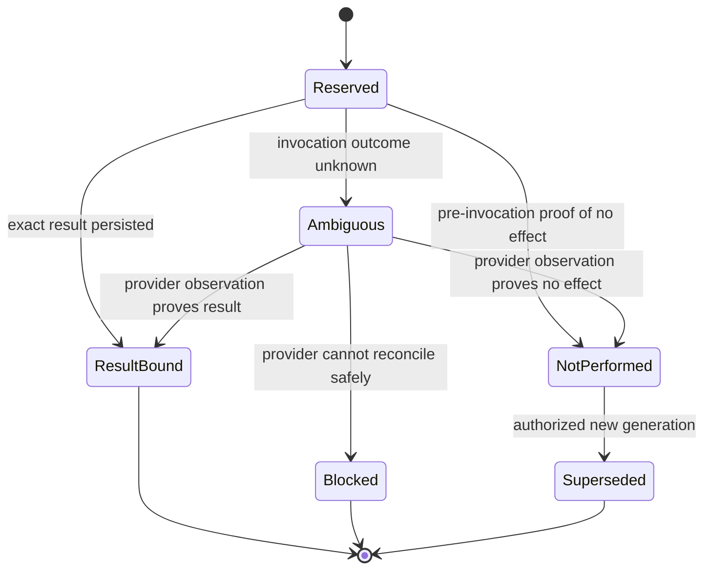
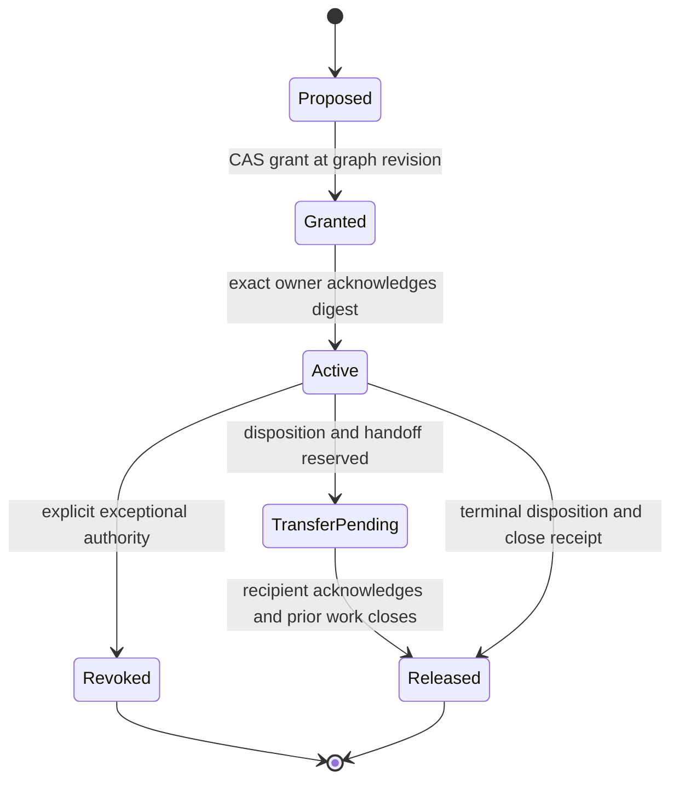
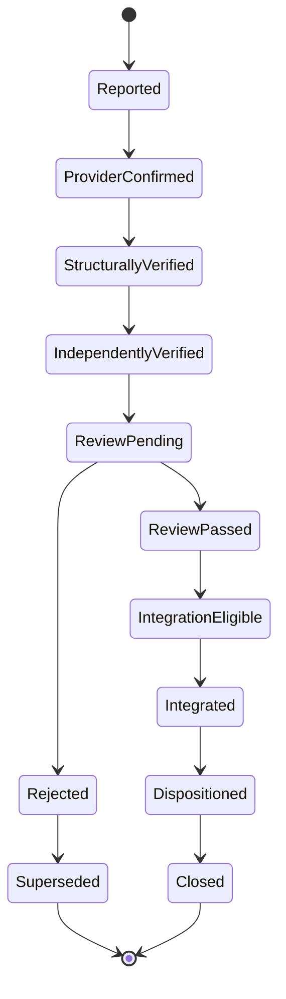
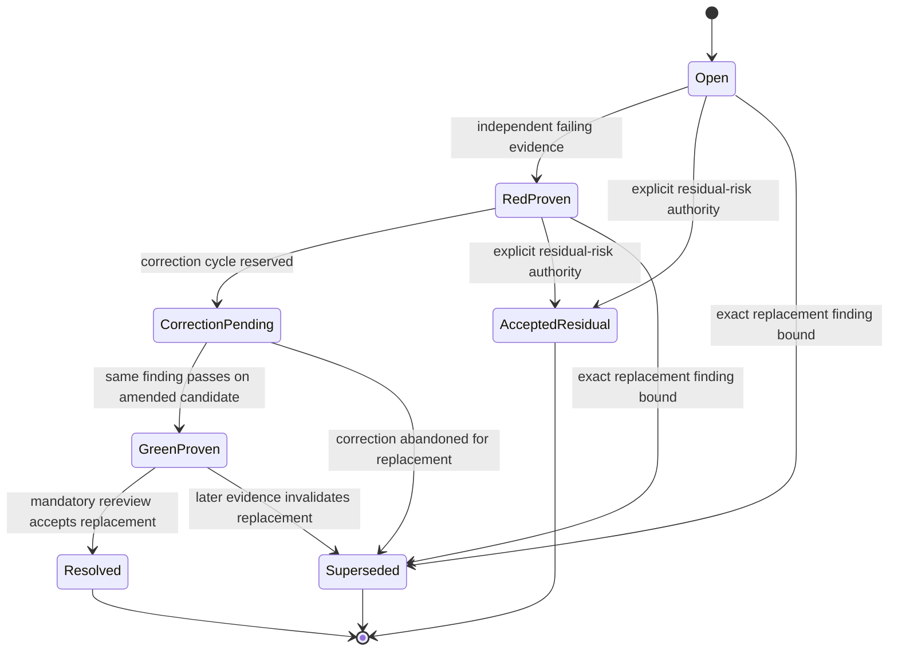
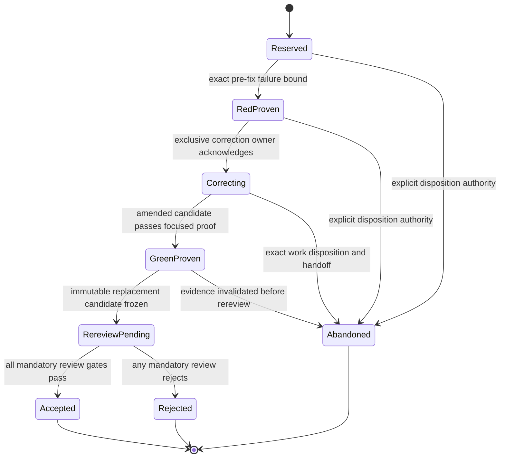

# Pajé Agent-Piloted Submission and Harness Support Design

## Status

Approved by the product direction supplied on 2026-07-25 and grounded in the
independent positioning audit of repository commit `df9137b`. This document
supersedes ambiguous product-positioning language; it does not replace the
durable `code-change@v1` design.

Corrected on 2026-07-25 to make agent-facing orchestration explicit core scope.
The earlier submit/status/wait/cancel proposal remains a required leaf-run
surface, but submission alone is not orchestration. This revision productizes
the durable coordination behavior defined by the installed
`orchestrating-control-planes` protocol while preserving the approved portable
worker, secret-broker, isolated-executor, approval, artifact, and publisher
boundaries.
The installed skill is the behavioral reference used to write this contract,
not a runtime dependency or a provider-specific API imported by Pajé.

The repository state inspected for this design is `86537ae`. The current beta
implementation remains the source of truth for shipped behavior until the
implementation plan for this design is completed.

Refrozen on 2026-07-26 from exact base
`1a5c3024e9a995103b218f54a4d81886d6e0715c` after the ACP-15 adversarial audit
and empirical Home Lab control-plane analysis. Integrated receipts remain
historical truth. Rejected ACP-15 implementation commits are evidence of failed
approaches only and MUST NOT be reused or cherry-picked. Requirements
`ACP-M09..ACP-M15` and `ACP-HL01..ACP-HL12` below are the canonical correction
contract, and the canonical continuation plan is the only active task cut.

## Canonical Product Position

Pajé is a self-hosted durable Agent Control Plane for code agents. It lets one
control agent turn a long specification into a dependency graph, coordinate
parallel child sessions across one or more unrelated projects, steer and
integrate their work, survive coordinator restart, and prove that every
placement reached its capability-appropriate terminal state and every
persistent child session was archived. Pajé is implemented in Go, while its
workflow and agent-harness contracts are repository-language-neutral:
`code-change@v1`
supports an explicit `generic` profile for any toolchain available in the
worker image and a first-class `go` profile with Go-specific discovery and
defaults.

Pajé is designed to be piloted by an agent through an installable harness
integration. The current beta is still triggered directly through Hatchet and
executes one Codex process at a time. Codex becomes the first fully integrated
harness only when the plugin, deterministic client, durable Agent Control Plane,
capability-aware agent-work adapter, and live multi-agent acceptance in this
design ship.
Additional dedicated harnesses are a planned extension point, not a currently
shipped capability.

The canonical short form is:

> Pajé is implemented in Go, works with repositories in any language through
> explicit profiles and checks, and provides a durable Agent Control Plane for
> long-running, multi-agent code changes. The beta uses Hatchet as its direct
> leaf-workflow trigger and Codex as its first dedicated execution harness.
> Scoped agent-side orchestration, including capability-aware placement,
> persistent child-session lifecycle, and multi-project coordination, is planned
> by this design.

## Why This Design Exists

The independent audit and subsequent control-plane review found six different
truths being collapsed into one
marketing claim:

1. Pajé currently launches an agent; the agent does not yet have a supported
   Pajé skill, hook, API, or CLI with which to launch Pajé.
2. The workflow is language-neutral, but the worker image does not contain
   every language toolchain and Go remains a privileged built-in profile.
3. Codex is the first named, packaged, deterministic, live-tested execution
   harness, although the low-level `local` runner existed first.
4. The core runner port admits more adapters, but no second dedicated harness
   has been selected, packaged, or accepted.
5. A submit/status/wait/cancel API makes one durable leaf run accessible; it
   does not let a control agent create, message, steer, reconcile, integrate, or
   archive a graph of child sessions.
6. Fixed internal workflow phases and one black-box Codex process do not model
   multi-project ownership, dependency handoffs, restart-safe child identity,
   callback recovery, or graph closure.

The missing product layer is therefore not another workflow template or only a
submission gateway. It is a provider-neutral durable Agent Control Plane
between an agent harness, session runtimes, and existing leaf workflows, plus
an explicit definition of what "supported harness" means.

## Goals

- Let one external control agent deliberately create and resume a durable
  `ControlRun` from a long specification.
- Let the centralized service admit and fairly supervise many simultaneous,
  unrelated `ControlRun` values without cross-run identity, cursor, ownership,
  resource, credential, evidence, cleanup, or status leakage.
- Persist the task graph, exact projects, dependencies, ownership, child
  sessions, placement attempts, scoped messages, evidence, dispositions,
  integration order, and close state independently of one coordinator process.
- Let the control agent discover per-primitive capabilities and dispatch,
  observe, send to, wait for, interrupt/cancel, and close work, including
  persistent child-session archive, without receiving a runtime-provider or
  Hatchet credential.
- Support ready independent children across multiple and unrelated projects
  concurrently, with separate workspaces, credentials, ownership, and scoped
  communication.
- Preserve deliberate submit, inspect, wait, and cancel as the leaf
  `code-change@v1` run surface.
- Ship an installable Codex integration made of focused Pajé skills, bounded
  lifecycle hooks, and a deterministic `paje-agent` client.
- Put a narrow Pajé authorization boundary in front of Hatchet so an agent
  never receives a worker, publisher, memory, or Hatchet service credential.
- Preserve the existing outer Hatchet envelope and the provider-neutral
  `code-change@v1` application service.
- Bind every submission idempotency key to one principal and one canonical
  request for the lifetime of the binding.
- Reject accidental or malicious recursive submission with server-computed
  run depth and fail-closed defaults.
- Define execution certification and full-integration certification in terms
  that can be tested for Codex and reused for another harness.
- Make current and future support status explicit across the root README, Helm
  metadata, site, operator docs, and regression tests.
- Establish an evidence gate for selecting a second dedicated harness without
  naming one based only on architectural preference.

## Non-Goals

- Replacing Hatchet, exposing Hatchet as part of Pajé's public agent protocol,
  or moving Hatchet types into provider-neutral packages.
- Giving an agent approval authority, publisher credentials, direct artifact
  store access, or unrestricted workflow-trigger permissions.
- Automatically inferring that any user prompt should become a Pajé run.
- Allowing repository-owned files or hooks to mint, widen, or read submission
  credentials.
- Adding an arbitrary workflow or shell-command DSL, multiple worker replicas,
  automatic merge, or direct pushes to target branches. The bounded
  `TaskGraph` is an agent-coordination model, not a command DSL.
- Bundling every repository-language toolchain in the standard worker image.
- Calling the generic `local` process adapter a certified harness.
- Selecting or implementing a second dedicated harness before the evidence
  gate in this design has produced a committed decision record.
- Weakening artifact binding, approval binding, restart recovery, publisher
  isolation, cancellation, or credential isolation from the beta design.

## Product Vocabulary

### Trigger

A trigger accepts a validated request to start a durable workflow. Hatchet is
the current trigger provider. The planned submission service is the stable
Pajé-facing boundary over that provider.

### Agent Control Plane

The provider-neutral durable service that owns a `ControlRun`, its `TaskGraph`,
placement attempts, persistent `AgentSession` lifecycles, scoped mailboxes,
evidence, dispositions, and close gate. Hatchet may schedule leaf workflows,
but Hatchet tasks and events are not the public Agent Control Plane model.

### Control run

A durable orchestration instance created from one long goal or specification.
It owns a graph revision, safe principal and policy binding, project
references, event cursor, task, placement-attempt, and persistent-session state,
integration evidence, and close state.

### Project reference

An immutable, principal-scoped repository identity and exact base SHA plus its
workspace and credential policy. Two `ProjectRef` values may name unrelated
repositories. A child receives only the references assigned to its task.

### Task graph and task

`TaskGraph` is a versioned DAG of bounded `Task` records. A task contains one
goal, predecessor IDs, assigned projects, frozen inputs, exclusive ownership,
forbidden paths, acceptance gates, integration order, and current state. Graph
updates use durable compare-and-swap and may not invalidate an active task's
frozen boundary.

### Ownership

A validated set of exclusive mutable paths or resources plus explicit
parent-owned and forbidden paths. Ready tasks with overlapping ownership do
not run concurrently. Shared integration files remain parent-owned unless
exactly one task owns them and every other task is forbidden from editing them.

### Agent session

A persistent, separately addressable logical child bound to one task and one
runtime-returned child ID. It records capability snapshot, dispatch
fingerprint, runtime-ID acknowledgement, lifecycle state, mailbox cursor,
completion state, disposition, and archive receipt. `AgentSession` is created
only for `persistent_session`; an ephemeral subagent, native fan-out item, or
execution-harness process is not automatically an `AgentSession`.

### Placement attempt

A durable execution record created for every task placement. It binds the
selected primitive, capability snapshot, rationale, lifecycle owner, action
IDs, optional runtime work IDs, observation cursor, terminal evidence,
disposition, and primitive-specific close evidence. It never invents a session
or child identity that the harness did not return.

### Mailbox and event cursor

An append-only, control-run-scoped stream of bounded messages and lifecycle
events. Every read and wait accepts an `after_cursor`; every returned event has
a monotonic cursor. A task or session can address only its parent, children,
declared dependencies, and explicitly shared control-run channels.

### Evidence, disposition, and close state

Evidence binds exact branches, SHAs, artifacts, test results, reports, reviews,
and integration gates to their producing task and placement attempt. A
terminal attempt receives exactly one disposition: `integrated`, `handed_off`,
or `discarded` with proof that no unique work remains. A control run closes
only after every task and placement attempt is terminal, every persistent
session is dispositioned and archived, every ephemeral runtime is closed,
every native fan-out is terminally aggregated, no local task remains active,
combined gates pass, and the durable typed pending-work gate is zero.

### Repository profile

A repository profile turns a repository and explicit check declarations into
preflight facts and shell-free verification commands. A profile does not imply
that its toolchain is installed in the worker image.

### Execution adapter

An implementation of `runner.Runner` that invokes an agent command as a black
box. `local` is an execution adapter, but it has no harness-specific protocol,
packaging, authentication policy, or live acceptance promise.

### Execution-certified harness

A named harness adapter that passes every execution certification requirement
in this document, including deterministic invocation, transcript completion,
cancellation, sandboxing, credential isolation, packaging, and live
acceptance.

### Fully integrated harness

An execution-certified harness that also ships an installable agent-side
integration with certified orchestration and leaf skills, hooks, deterministic
control/submission client, recursion protection, and live leaf plus multi-agent
Agent Control Plane acceptance.

## Current and Future Support Matrix

Status terms are deliberately limited to `current`, `planned by this design`,
`future after evidence gate`, and `not planned`.

### Trigger support

| Surface | Status at `86537ae` | Target status | Product boundary |
| --- | --- | --- | --- |
| Direct `paje-code-change-v1` Hatchet workflow trigger | current | current, retained for operators | Provider-specific outer adapter |
| Pajé submission HTTP API | absent | planned by this design | Stable agent and automation boundary |
| `paje-agent` submit/status/wait/cancel client | absent | planned by this design | Deterministic client over the HTTP API |
| Pajé Agent Control Plane API | absent | planned by this design | Durable graph, placement attempt, persistent session, mailbox, evidence, and close boundary |
| `paje-agent` capabilities and work dispatch/observe/send/wait/interrupt/close lifecycle | absent | planned by this design | Deterministic client over provider-neutral control APIs |
| Codex skill-driven leaf submission | absent | planned by this design | Deliberate single-run entrypoint |
| Codex long-spec multi-agent orchestration | absent | planned by this design | First supported Agent Control Plane entrypoint |
| Generic webhook, CRD, or arbitrary event router | absent | not planned in this milestone | Separate future adapters |

### Repository language and profile support

| Profile or claim | Status at `86537ae` | Target status | Qualification |
| --- | --- | --- | --- |
| `generic` profile | current | current | Requires at least one explicit shell-free check |
| `go` profile | current | current | Built-in module discovery and `GOWORK=off` defaults |
| Any repository language | current at contract level | current | Required executables must exist in the worker image |
| Every language runtime preinstalled | absent | not planned | Operators derive an image with required toolchains |
| Repository-owned shell fragments | rejected | rejected | Commands remain executable-plus-arguments structures |

### Harness support

| Harness surface | Status at `86537ae` | Target status | Support label |
| --- | --- | --- | --- |
| Codex worker-side adapter | current, dedicated and live-tested | formally recertified | execution-certified |
| Codex agent-side skills, hooks, and client | absent | planned by this design | required for full integration |
| Codex agent-work lifecycle adapter | absent | planned by this design | capability-aware work operations plus persistent-session specialization |
| Codex end-to-end Agent Control Plane flow | absent | planned by this design | first fully integrated harness |
| `local` runner | current | current | low-level adapter, not a certified harness |
| Second dedicated harness | unselected | future after evidence gate | no support claim before live acceptance |
| Additional unnamed harnesses | architectural extension point | future direction | not current support |

## Invariants Carried Forward

The following constraints are inherited from the beta design and are not open
for reinterpretation:

- `internal/workflow/codechange` and the ports it consumes do not import
  Hatchet, HTTP, Codex plugin, or submission-credential types.
- Hatchet remains a thin outer adapter. Durable IDs and references cross task
  boundaries; workspaces and secret values do not.
- The outer `run_id` owns Hatchet status idempotency. The nested
  `idempotency_key` remains bound to the template and canonical input.
- A completed or ambiguously interrupted agent execution is never
  automatically retried.
- Cancellation preserves `context.Canceled` or `context.DeadlineExceeded`,
  terminates descendants, and records a truthful terminal result.
- Run records and artifacts are monotonic, restart-safe, bounded, redacted, and
  bidirectionally validated.
- Approval remains bound to run, artifact digest, base SHA, target branch, and
  publication mode.
- Publisher credentials appear only after repository-controlled verification
  and only in the isolated publisher process and trusted publisher-owned Git
  configuration.
- Agent and verification children cannot read Hatchet, Mem0, GitHub,
  submission-gateway, runtime-provider service, executor, Git, or SSH
  credentials.
- Token-bearing operations never execute in a repository or worktree that ran
  repository-controlled code.
- The packaged Linux worker fails closed if its process-inspection guard cannot
  be installed.
- The beta remains a single-worker, single-writable-filesystem installation.

## Approaches Considered

### 1. Durable Agent Control Plane, leaf gateway, and installable harness integration

A separate `paje-gateway` process authenticates a narrowly scoped Pajé token,
persists the agent-control graph and placement-attempt lifecycle, validates and
binds leaf submissions, computes lineage and depth, and calls provider-neutral
agent-harness and trigger ports. A Hatchet adapter implements the leaf trigger.
An installable
Codex plugin ships orchestration and leaf skills plus hooks that call a small
`paje-agent` HTTP client and map negotiated placement to discovered runtime
capabilities.

This is the selected approach. It provides a stable Pajé protocol, keeps broad
Hatchet and runtime-provider credentials out of the agent, gives graph,
placement, idempotency, recursion, recovery, and closure policy authoritative
owners, and leaves the code-change and isolated-execution cores unchanged.

### 2. Ship only submit/status/wait/cancel

The plugin and client could expose one durable `code-change@v1` run while
leaving multi-agent coordination to conversation prose. This is rejected
because it has no durable graph, placement decision, session identity,
mailbox/cursor, steering, dependency handoff, integration evidence, restart
recovery, disposition, archival, or close gate. A submission API remains a
required leaf surface, not the orchestration product.

### 3. Let the agent trigger Hatchet directly

The skill could call the Hatchet SDK or API with `paje-code-change-v1`.
This avoids a new server, but exposes Hatchet concepts and credentials to the
agent, cannot express Pajé-specific scopes cleanly, and duplicates
idempotency/depth rules in each harness integration.

This approach is rejected.

### 4. Embed agent submission in the worker process

The worker could expose HTTP alongside its Hatchet listener and reuse the
worker token and in-memory composition. This reduces deployment objects, but it
combines public ingress with the credential-bearing execution process, makes
least-privilege separation difficult, and increases the blast radius of an HTTP
or authentication flaw.

This approach is rejected. The gateway and worker use separate processes,
service accounts, credentials, and Kubernetes workloads.

## Architecture

```text
Codex control conversation
  -> Pajé Codex plugin
       -> orchestration and leaf-run skills
       -> bounded lifecycle hooks
       -> paje-agent client
            -> HTTPS + scoped Pajé bearer token
                 -> paje-gateway HTTP adapter
                      -> token authenticator
                      -> provider-neutral controlplane.Service
                           -> controlplane.Store
                           -> AgentHarness port
                                -> Codex capability-aware work lifecycle
                           -> provider-neutral submission.Service
                                -> submission.Trigger port
                                     -> Hatchet trigger adapter
                                          -> paje-code-change-v1 leaf workflow
                                               -> worker profile + secret broker
                                               -> isolated executor
                                               -> execution harness adapter
```

There are five independently testable planes:

1. **Agent Control Plane:** persists `ControlRun`, `TaskGraph`, `Task`,
   `ProjectRef`, ownership, `PlacementAttempt`, persistent `AgentSession`,
   mailbox/event cursor, evidence, disposition, and close state.
2. **Agent harness plane:** discovers semantic capabilities and dispatches,
   observes, sends to, waits for, interrupts, and closes work according to the
   selected primitive. It does not execute repository commands or manufacture
   session semantics for runtimes that do not expose them.
3. **Submission plane:** authenticates a principal, validates one leaf request,
   binds idempotency and lineage, starts or reuses a workflow, exposes safe
   status, and requests cancellation.
4. **Durable workflow plane:** the existing typed `code-change@v1` phases,
   stores, artifacts, approval, and publication.
5. **Execution plane:** worker profiles, secret broker, executor, and
   execution-harness command/parser adapter for isolated leaf work.

Failure or replacement in one plane must not require provider types in another.

The worker-profile, secret-broker, and isolated-executor work is a required
lower-layer foundation. It is not deleted or redesigned here. It proves how one
leaf command runs safely; it does not prove child-session orchestration.

## Provider-Neutral Durable Agent Control Plane

### Empirical Orchestration Contract

This section is the canonical reconciliation of the 2026-07-26
execution/runtime, review/integration, and meta-control-plane analyses. It does
not add another orchestration layer beside the model below. It makes that model
executable by defining authority, action, ownership, candidate, verification,
integration, publication, supervision, and closure state machines. The
[initial control-plane design](./2026-07-24-initial-control-plane-design.md#empirical-orchestration-contract)
summarizes the boundary, and the
[canonical continuation DAG](../plans/2026-07-25-agent-piloted-submission-and-harness-support.md#canonical-continuation-dag)
is the only implementation ordering for these requirements.

The provider-neutral Agent Control Plane remains above the portable isolated
execution plane. Worker profiles, secret materialization, executors, sandbox
initialization, and runner adapters execute one bounded leaf command. They do
not own graph revisions, runtime supervision, review acceptance, integration,
publication authority, or closure.

#### Authoritative journal and derived projections

The authoritative state is a typed append-only journal. A `ControlAction` is an
immutable reservation for one intended effect. A `ControlEvent` is an immutable
fact about that reservation or another internal transition. `ControlRun`,
`TaskGraph`, `PlacementAttempt`, `AgentSession`, mailbox, resource, candidate,
review, gate, integration, publication, status, and close records are derived
projections that can be rebuilt from journal position zero.

The existing durable `Snapshot`, `LifecycleAction`, and ordered `Event` records
are the migration base. Until journal migration is complete they remain shipped
behavior, but new orchestration semantics MUST NOT expand snapshot mutation as
an alternative source of truth. After migration, a snapshot is a versioned
checkpoint plus a verified journal cursor. It may accelerate reads but cannot
authorize a transition that the journal cannot replay.

```go
type ControlAction struct {
    ID                     string
    ControlRunID           string
    TaskID                 string
    AttemptID              string
    Kind                   ControlActionKind
    GraphRevision          uint64
    ExpectedProjection     uint64
    CanonicalRequestDigest string
    IdempotencyKey         string
    AuthorityReceiptID     string
}

type JournalPosition uint64

type RunCursor struct {
    InstallationID string
    ControlRunID   string
    SchemaVersion  uint32
    RunSequence    uint64
}

type GlobalCursor struct {
    InstallationID  string
    SchemaVersion   uint32
    JournalPosition JournalPosition
}

type ControlEvent struct {
    ID               string
    ControlRunID     string
    RunSequence      uint64
    JournalPosition  JournalPosition
    ActionID         string
    Kind             ControlEventKind
    PayloadDigest    string
    ProviderReceipt  string
    OccurredAt       time.Time
}

type CommitRequest struct {
    Action         ControlAction
    ExpectedRun    RunCursor
    ExpectedGlobal GlobalCursor
    RequestPayload []byte
    Outcome        ControlEvent
    OutcomePayload []byte
}

type CommitReceipt struct {
    Action      ControlAction
    Reservation ControlEvent
    Outcome     ControlEvent
    Created     bool
}
```

`JournalPosition` is the authoritative installation-wide append identity. The
single-replica v1 store first creates or validates an immutable journal-root
manifest containing installation identity and schema, then assigns the next
position while holding the same append
CAS that validates and assigns the event's next per-run `RunSequence`; the
persisted event becomes visible with both values or not at all. Positions start
at one, are contiguous, never reused, and order all runs without timestamps.
`OccurredAt` is diagnostic metadata and MUST NOT order replay.

The canonical installation feed pages immutable events by
`JournalPosition`. Per-run feeds are derived indexes over that same event set
and page by `(ControlRunID, RunSequence)`; an event is stored authoritatively
once, and indexes/checkpoints are rebuildable. A global cursor binds
installation identity, journal schema, and last consumed `JournalPosition`. A
per-run cursor binds installation identity, exact `ControlRunID`, schema, and
last consumed `RunSequence`. Neither cursor is accepted by the other feed.
Concurrent appends, coordinator restart, or a late event for an older run may
change only the feed suffix: they cannot renumber, reorder, or rewrite an
existing position.

Semantic control-plane transitions that must arbitrate state across runs use
one provider-neutral authoritative transaction. `Commit` validates exact
canonical JSON request and outcome payloads, each bounded to 1 MiB and bound by
its SHA-256 digest, then performs one compare-and-swap over both the expected
per-run cursor and expected installation-global cursor. The action,
reservation event, terminal outcome event, and immutable payload bytes become
visible together or not at all. A successful new commit advances both cursors
by exactly two events. Admission, backpressure, lease, ownership, gate, and
integration payload schemas MUST exclude credentials, secrets, prompts, raw
provider output, and other unsafe evidence bodies.

Exact response-loss replay is checked before numeric cursor comparison and
returns the original immutable receipt even when the supplied cursor numbers
are now stale. The same action ID or idempotency key with any changed action,
payload, or outcome conflicts. `Payload(digest)` returns bytes only when the
digest belongs to an exact validated authoritative commit. Both replay and
payload lookup first validate the complete merged journal: contiguous global
and per-run order, installation binding, action/event bindings, unique
idempotency identities, and exact action/reservation/outcome membership. An
internally plausible record inside a globally corrupt feed is never readable.

The filesystem implementation binds the construction-time identity of the
authoritative commit and staging directories and revalidates their mode, type,
and filesystem identity immediately before every read, prepared write,
recovery, rename, and visibility boundary. Ordinary replacement, symlink
replacement, malformed staging names, duplicate identities, oversized encoded
records, or corruption fail closed without mutating either the original or
replacement path. Crash recovery may publish only a fully validated prepared
transaction and must preserve exact receipt and payload bytes across restart.

`ControlActionKind` covers at least `dispatch`, `register_runtime`, `send`,
`observe`, `wait`, `interrupt`, `cancel`, `allocate_resource`,
`dispose_resource`, `verify_candidate`, `run_gate`, `integrate`, `publish`,
`verify_target_tree`, `close_runtime`, `archive_session`, and `close_run`.
Provider-neutral adapters may add typed kinds only by schema version; they may
not persist provider payloads as an untyped escape hatch.

The stable action key is derived from control run, task and attempt when
applicable, action kind, graph revision, expected projection revision, and the
canonical request digest. Exact replay returns the original reservation and
bound result. Reusing a key with changed input is a conflict. A later retry of a
typed transient failure uses a new generation linked to the prior action; it
does not overwrite history.

Every durable key is scoped by the centralized installation and exact
`ControlRunID` before task, attempt, action, candidate, cursor, lease,
idempotency, evidence, subscription, or resource-local identity. Provider IDs
are never sufficient keys on their own. A callback or provider event is applied
only after the runtime binding proves the same control run, task, attempt,
primitive, provider identity, and action generation. An event from one run can
therefore never advance another run even when provider-local IDs, relative
paths, task names, or client idempotency strings are equal.



The invocation may start only after `Reserved` is durable. Response loss or a
coordinator crash leaves `Ambiguous`, never an implicit failure. Pajé observes
the provider by action ID, runtime ID, provider receipt, repository ancestry,
remote ref, resource identity, or target-tree equality, as appropriate. It MUST
NOT blindly repeat an ambiguous dispatch, message, interrupt/cancel, resource
mutation, integration, publication, runtime close, archive, or target-tree
verification. If the required observation capability is absent or contradictory,
the action and its dependents remain fail-closed `blocked`.

YAML and prose control records are diagnostic exports only. A renderer binds
its schema version and terminal journal cursor. Editing or repairing an export
does not mutate the control run, advance a cursor, release ownership, accept
evidence, or close work.

#### Central multi-run admission, isolation, and fairness

Pajé is one centralized control plane for many concurrently active
`ControlRun` values. A run is an isolation and accounting boundary, not a
singleton service mode. Unrelated graphs and projects advance concurrently;
one run that is slow, blocked, awaiting authority, failed, or
`cleanup_incomplete` cannot hold a global progress lock or prevent another
ready run from admission, supervision, verification, integration, publication,
or closure.

Central admission records a durable `RunAdmission` and `ReadyWorkItem` for each
eligible task/action. It enforces bounded installation, principal, run,
canonical-project, primitive, verifier, integration, publication, and named
resource quotas. Admission uses a versioned deterministic weighted-fair policy:
FIFO within equal run/priority class, round-robin or virtual-finish ordering
across runnable runs, bounded per-run burst, and age-based promotion that
prevents starvation. A rejected or deferred item records its limiting quota,
queue position class, and next eligibility condition. Backpressure leaves the
item durably ready; it does not create a runtime or spin a poll loop.

Quota and fairness policy is independent of semantic task priority. A control
agent may submit a policy-assisted priority recommendation, but only an
authorized versioned admission policy turns it into deterministic weight.
Awaiting-input and cleanup-only work consumes only its actual monitor or cleanup
budget, not an execution slot. Per-run and per-project ceilings prevent one
large graph from exhausting centralized capacity.

Ownership conflict keys combine canonical repository/project identity with the
normalized mutable path or named shared-resource namespace. Identical relative
paths in unrelated repositories do not conflict. Projects that intentionally
share a deployment target, cluster namespace, database, cache, device, local
registry, publisher target, or other scarce resource declare the same canonical
shared-resource key and therefore contend even when their repositories differ.
Cross-project handoff is an explicit typed graph edge with bounded evidence and
acknowledgement; it never creates implicit shared ownership or credential
visibility.

Credential handles are keyed by installation, control run, principal,
canonical project, and declared purpose. The journal stores only the opaque
handle identity, policy/authority digest, and use receipt, never clear secret
material. Evidence, cleanup, and subscription namespaces use the same run and
project scope. Equal provider-local credential or evidence IDs in two scopes
remain distinct, and a typed cross-project handoff grants only its declared
evidence—not credential lookup, publication authority, ownership, or cleanup
authority. Publication credentials are resolved later inside the isolated
publisher boundary from the exact authorized project/target scope.

Resource locks are keyed to the real scarce resource and requested mode, not to
the executor, verifier, integration subsystem, or whole installation. Compatible
read/shared modes and unrelated keys proceed concurrently. A lock request binds
run, action, resource key, mode, lease generation, queue order, and expiry.
Locks use the same fair admission discipline, impose bounded hold times, and
release only through result or recovery evidence. Pajé MUST NOT implement a
global executor, test, integration, or publication mutex that causes
head-of-line blocking across unrelated work.

Restart recovery enumerates all nonterminal runs and due leases through a
stable paginated index. Each recovery tick has a bounded item/time budget,
advances a durable scan cursor, and selects due work through the same fair
policy. A repeatedly failing reconciliation is classified and backed off for
that run/action; the scan continues to other runs. Recovery never scans one run
to exhaustion before allowing another due run to progress.

Each run has its own monotonic run sequence and status cursor. The central
status view is a separate redacted projection rebuilt only from the canonical
installation feed in ascending `JournalPosition` and keyed by its global cursor. It
contains only safe run IDs, coarse states, quota/backpressure reasons, counts,
and next eligibility; it cannot expose project secrets, prompts, provider
payloads, evidence bodies, or per-run cursor tokens. Per-run subscribers can
never use a global cursor, and global subscribers cannot acknowledge or mutate
a run. A timestamp sort, mutable global counter outside the journal, scan of
per-run heads, or arrival-time merge is not an authoritative global ordering.

Central acceptance MUST exercise at least two simultaneous unrelated runs over
different canonical projects, interleaved callbacks, one genuinely shared
resource contention key, unrelated noncontending gates, one stalled or
awaiting-authority run, one cleanup-incomplete run, and a coordinator restart.
Evidence must show fair bounded admission, continued progress and closure of
unaffected runs, no cross-run callback/event/cursor/idempotency collision, no
credential or evidence leakage, and deterministic recovery of every due lease.

#### Refrozen authoritative admission, scheduling, and handoff contract

Every admission, queue, backpressure, release, lease, expiry, and
authoritative-handoff transition is one bounded typed delta committed through
ACP-J06 `AuthoritativeStore.Commit`. The journal `Feed` and `Payload` bytes are
the only authority. Process memory and checkpoints are verified caches rebuilt
from position zero; they cannot accept a transition, retain an otherwise lost
reservation, or fill a missing tombstone. A delta contains the changed record
and the minimum predecessor identity required to validate it. It never copies
the queue, lease table, run history, or lifetime admission history into every
outcome payload.

Semantic replay binds all of: installation ID, `ControlRunID`, action ID,
idempotency key, outcome event ID and kind, semantic operation, exact subject,
graph revision, and generation. Rebuild decodes the exact typed reservation and
outcome schema, loads the exact payload digest, recomputes the semantic key,
and rejects any rebinding, missing member, duplicate identity, or changed
replay. The canonical JSON decoder preserves integers losslessly with typed
fields or `json.Number`; a `float64` round trip is forbidden. Sequence numbers
are assigned inside the successful global/run CAS, never before it, and the
returned immutable receipt is the only proof that an assignment won.

No new journal kind is required by this refreeze. The following
`ControlActionKind` plus typed `semantic_operation` mapping is frozen; changing
it or adding a kind requires a separate predecessor that exclusively owns
`internal/controlplane/journal/**` and updates schema, migration, replay, and
projection fixtures before any consumer dispatch:

| Transition | Existing action kind | Exact `semantic_operation` values |
| --- | --- | --- |
| admission and queue | `allocate_resource` | `admission_reserve`, `queue_enqueue`, `queue_admit`, `backpressure_defer` |
| release and tombstone | `dispose_resource` | `admission_release`, `queue_release`, `lease_release`, `lease_expire` |
| lease acquire or renew | `allocate_resource` | `lease_acquire`, `lease_renew` |
| recovery observation | `observe` | `start_observation`, `observe_effect`, `cancel_or_fence`, `scanner_apply` |
| authoritative evidence handoff | `send` | `evidence_handoff_issue`, `evidence_handoff_grant`, `evidence_handoff_acknowledge` |

The ACP-15A/ACP-15C layering has one mutation authority. ACP-15A exclusively
owns journal-authoritative admission, lease, release/expiry, backpressure, and
handoff transition APIs plus their immutable receipts. ACP-15C consumes that
integrated interface to select fair work and drive recovery; it cannot write an
admission/lease/handoff record directly, maintain a second authoritative
projection, or bypass ACP-15A when applying a scheduler decision.

Weighted-fair arithmetic is explicit and saturating. Virtual finish, enqueue
sequence, age credit, retry generation, and recovery step use lossless unsigned
integers. Virtual finish saturates at `MaxUint64`; age credit and release
subtraction cannot underflow; the consecutive-admission ceiling is exactly two
while another run is eligible; aging and backoff saturate at their policy
caps. Zero or invalid weight is a typed policy error, never division by zero.
Values `2^53+1`, `MaxUint64`, and every overflow/underflow boundary are
mandatory fixtures.

Released and expired records are exact immutable tombstones retaining the
original request identity and terminal receipt. `now >= ExpiresAt` is terminal;
an expired lease cannot be acquired or renewed. Exact replay returns the
original tombstone, while changed request, subject, mode, generation, expiry,
or outcome conflicts. Locks are scoped by exact `ResourceKey` and mode. There
is no process-wide or installation-wide mutex spanning journal I/O; unrelated
keys and unrelated runs continue while one commit, provider observation, or
filesystem operation is slow.

Recovery identity is the tuple `(installation_id, ControlRunID, ActionID,
generation)`. Diagnostics use typed safe codes and bounded redacted fields;
they exclude prompts, provider payloads, host paths, credentials, secret
metadata, and raw errors. One scan pass has a 250 millisecond hard budget and
reserves the final 50 milliseconds for persisting its cursor/outcome. It stops
starting provider observations after the 200 millisecond work boundary,
persists before the deadline, and resumes fairly from the durable cursor.

Ambiguous provider work uses certified two-phase fenced reconciliation:

1. `StartObservation` reserves an observation generation bound to the exact
   installation/run/action/subject.
2. `Observe` is effect-free and returns a typed provider fact plus receipt or
   explicit ambiguity.
3. `CancelOrFence` proves cancellation/not-performed or establishes a provider
   fence that prevents the observed generation from mutating state.
4. The fair recovery scanner alone performs `scanner_apply` through ACP-J06.

Observation code cannot apply projections, release a lease, start a retry, or
acknowledge a handoff. A retry is permitted only after proven canceled or
not-performed evidence. Ambiguity creates no overlapping generation. Late,
revoked, foreign, or fenced results are rejected before any mutation.

An authoritative evidence handoff uses one store-backed
`EvidenceHandoffSubject` binding installation, control run, graph revision,
edge ID, producer project/task/attempt/action/generation, consumer
project/task/attempt/action/generation, and exact evidence digest. `Issue`,
`Grant`, and `Acknowledge` are separate ACP-J06 commits and return opaque IDs
whose payload membership is revalidated on every use. Fabricated, mutated,
cross-run, cross-edge, or cross-generation IDs fail closed. An
`EvidenceDisclosure` is a bounded redacted view for UI or diagnostics and is
explicitly non-authoritative: reading or editing it cannot grant, acknowledge,
release, or advance work.

Acceptance includes journal-only rebuild with empty caches; two-service global
quota races; response loss at every commit boundary; semantic rebinding; CAS
sequence concurrency; `MaxUint64` and `2^53+1`; arithmetic saturation;
tombstones at, before, and after expiry; more than 1 MiB of lifetime history
with every individual delta bounded; equal IDs across runs; safe diagnostics;
fairness and no head-of-line blocking; fenced late results and ambiguity; exact
handoff versus disclosure; and the scan-cursor persistence reserve.

#### Empirical Home Lab operational contract

The Home Lab analysis adds operational truth without making harness/UI state
authoritative. A managed task progresses only through journal-backed domain
phases `DISCOVERED`, `AUDITING_READ_ONLY`, `READY_FOR_OWNERSHIP`, `OWNED`,
`EXECUTING`, `VERIFYING`, and `ACCEPTED`. Exceptional phases are `DEFERRED`,
`NEEDS_INPUT`, `ROLLBACK_REQUIRED`, and `FAILED`. A control run may additionally
be `FROZEN_SECURITY` or `QUIESCENT`. Provider, terminal, YAML, and UI labels are
observations; they cannot skip or synthesize these phases.

`AuthorityLease` is typed and expiring across exact Git/live `ProjectRef` and
`ManagedResource` subjects. It binds allowed and forbidden operations,
preconditions digest, issued/expiry times, renewal generation, expansion or
handoff subject, authority principal, and immutable receipts. Expansion is a
new conflict-checked grant. Expiry, suspension, revocation, and handoff are
journal facts; none is inferred from silence or provider state.

`RunInbox` is an append-only run-scoped projection over the journal. Each item
binds `JournalPosition`, run sequence, event ID, correlation ID, task, attempt,
action generation, producer, consumer, payload digest, and optional immutable
acknowledgement receipt. Missing, duplicate, and out-of-order callbacks are
claims reconciled by these identities. A provider-visible terminal session is
still observed until its exact terminal event and close obligation are
committed.

`PendingWorkGate` has one exact kind from `time_not_before`,
`external_status`, `workflow_terminal`, `evidence_required`,
`no_overlap_window`, `human_approval`, or `security_containment`. Each gate
binds resolver authority and an exact wake event ID or wake time. Deferred work
with a wake condition enters zero-hot-poll `QUIESCENT`; only its exact wake fact
can make it ready again.

A task declares `EvidenceRequirement` values. Submitted `Evidence` is an
immutable claim, and an `Attestation` is an independently produced verdict over
one exact evidence subject and policy. `DONE` or a terminal provider status is
only a claim. Every mandatory attestation must pass before `ACCEPTED`, and a
restart during `VERIFYING` resumes the exact verifier generation without
duplicating it.

Executor and harness capability enforcement occurs before provider invocation.
The declared capability set is exactly `read_only`, `secret_metadata_only`,
`safe_history`, `repository_mutation`, `cluster_mutation`, and `remote_exec`.
`safe_history` applies a deny/redaction policy; it is not unrestricted history.
`read_only` forbids create, update, delete, and exec. `secret_metadata_only`
forbids secret payload retrieval. Missing capability is a pre-invocation
denial, never an adapter best effort.

`SecurityIncident` progresses `detected -> frozen -> containing -> contained ->
resume_authorized | closed`. Detection records preserved evidence and applies
the narrowest scoped freeze. Freeze suspends or revokes affected leases,
creates a `security_containment` gate, and does not stall unrelated runs or
resources. Resume requires explicit authority and an exact containment
receipt; UI dismissal or provider recovery is insufficient.

`supervised_by` is distinct from `lifecycle_owner`. A supervisor may observe,
correlate, and request action but cannot close, archive, release ownership, or
dispose a resource without lifecycle authority. Close-check reports owned
close obligations separately from externally owned supervised dependencies.

`ApplyStrategy` is one of `gitops_reconcile`, `exact_remote_patch`,
`api_mutation`, or `workflow_trigger`. It binds exact preimage/version/UID,
postcondition, rollback or compensation, required authority, and observation
path. A rollout that depends on restore evidence remains behind an
`evidence_required` gate until the exact attestation passes.

ACP-20 integration/publication exclusively owns the typed `ApplyStrategy`
contract. ACP-16 owns `AuthorityLease`, its subject, operation bounds, and
preconditions, but neither defines nor consumes an apply strategy. ACP-20
validates the strategy enum and its exact preimage/version/UID, postcondition,
rollback or compensation, observation, and authority against the ACP-16 lease
facts before any repository, provider, credential, or publication side effect.

All new operational state rebuilds exclusively from the authoritative journal.
Status, YAML, provider views, and UI remain derived. Bounded redacted
determinism metrics may measure callback duplicates/reordering, poll results,
conflicts, gates, lease changes, reopens, incidents, rollbacks, wakeups, and
quiescence time/cost. Metrics are non-authoritative and cannot change replay or
scheduling. Acceptance exercises these requirements across simultaneous
unrelated `ControlRun` values.

Adversarial fixtures include missing, duplicate, and out-of-order callbacks;
terminal-visible sessions without a committed terminal fact; authority
expansion conflict; `read_only` create/exec; `secret_metadata_only` payload
request; incident freeze/resume while unrelated work progresses; deferred
quiescence and exact wake; supervision without lifecycle ownership; restore
evidence gating before rollout; and restart during `VERIFYING` without a
duplicate verifier.

#### CAS graph revisions, exact ownership, and managed resources

Every graph update is an immutable `TaskGraphRevision` written with
compare-and-swap against the expected revision. It binds task definitions,
project/base SHAs, dependency order, frozen-input digests, ownership claims,
placement policy inputs, integration order, combined gates, and the prior
revision. A stale revision is rejected. A changed frozen input creates a new
revision and suspends affected ready or active dependents; it never rewrites
their historical boundary.

Ownership is a journaled lease over canonical project-relative paths or named
resources. The only states are `proposed`, `granted`, `active`,
`transfer_pending`, `released`, and `revoked`. `revoked` is an exceptional
policy-authorized terminal state and does not imply that resources are safe to
delete.



Grant, expansion, transfer, and release each bind control run, graph revision,
canonical project/repository or shared-resource namespace, normalized ownership
units, owner, action ID, and acknowledgement
digest. Expansion is a new claim and MUST fail while any added unit overlaps an
active or undispositioned owner. Transfer requires immutable handoff evidence,
recipient acknowledgement, prior-owner disposition, and primitive-specific
closure. Silence, idle runtime state, callback receipt, terminal worker prose,
or coordinator restart never releases ownership.

Every isolated workspace and external resource belongs in a managed resource
ledger. A `ManagedResource` binds resource kind, stable provider identity,
creating action, attempt, project, immutable base, origin, cleanup authority,
current state, observation evidence, and disposition receipt. Resource kinds
include worktrees/checkouts, branches, processes, containers, networks,
workflow runs, runtime sessions, verification environments, publisher-owned
repositories, and other provider resources created by an attempt.

Session and resource origin is exactly `created` or `adopted`. Cleanup authority
is exactly `manage_and_dispose`, `detach_only`, or `none`. Adoption grants no
mutation, interruption, archive, deletion, or cleanup authority beyond the
separately recorded ownership and cleanup grants. An adopted session with
`detach_only` closes through an immutable detach receipt; one with `none`
remains externally owned and is excluded from automated cleanup without being
misreported as archived.

Managed workspace creation resolves an immutable base SHA before allocation,
uses a dedicated attempt root, records partial creation before continuing, and
fails closed on a stale base, dirty source, path escape, symlink ambiguity, or
unmanaged pre-existing resource. Cleanup is idempotent and may automatically
remove only a managed resource whose authority, terminal disposition,
cleanliness, and content-addressed integration or proven-safe discard are all
verified. Unique, dirty, unmanaged, or ambiguously owned evidence requires a
policy decision.

#### Runtime registration, callback recovery, leases, and status

Persistent dispatch keeps the existing exact runtime-ID registration contract:
reserve dispatch, bind the runtime-returned child ID, send the parent/child
registration message once, and require acknowledgement of that exact digest
before accepting completion evidence. An ID inferred from a parent, source
thread, worktree, prompt, or delegation envelope is invalid. Ephemeral and
native primitives record only identities actually returned by their advertised
capabilities.

A completion callback is a wake-up claim. It never substitutes for provider
observation, immutable candidate creation, or independent verification. Every
persistent attempt combines callback delivery with cursor-aware observe/wait.
Missing callbacks are recovered by polling; callbacks received before polling
are confirmed by polling. Cursors are request-bound and monotonic. Duplicate
events are harmless only when identity and digest match; regression, future
cursor, identity mismatch, or changed duplicate payload blocks the attempt.

The restart supervisor persists a `MonitorLease` containing attempt, owner,
generation, last confirmed cursor, callback state, last material change,
`next_wake_at`, retry class, backoff step, and expiry. Lease acquisition and
renewal use CAS. A restart or replacement supervisor may take an expired lease
and resume the same due action; it may not create a second monitor. Backoff is
deterministic from the action identity and persisted step, is reset only by a
material state change, and is bounded by policy. Only typed transient or
contention failures are retryable; semantic, authority, identity, and evidence
failures require a new candidate, graph revision, or authorization.

Status is a redacted derived projection. `after_cursor` returns only material
deltas in active nodes, blockers, ownership, callback/observation state,
candidate/review status, gate status, integration eligibility, resource
cleanup, and the next deterministic action. Unchanged polls emit no user-facing
event. Payloads are bounded and exclude secrets, raw provider payloads, host
paths, full prompts, raw transcripts, and unbounded logs. A subscriber cursor
does not become an authority cursor and cannot advance workflow state.

#### Immutable candidates, independent verification, and review barriers

Every reported implementation result creates an immutable `CandidateSnapshot`
bound to repository identity, expected base SHA, head/tree SHA, target ref,
clean-tree proof, owned-path manifest and digest, graph revision, frozen-input
digest, gate-policy digest, producing attempt, and callback/provider evidence.
Any changed field creates a different candidate and invalidates all prior PASS
evidence for integration purposes.

Candidate state is monotonic:



Worker-reported commands and callback text remain claims. `VerificationRun`
binds candidate ID, verifier implementation/version, verification profile and
command digests, toolchain and environment digests, exact start/finish state,
bounded result digests, retry classification, and verifier principal. Parent
acceptance requires an independently executed verifier or a separately trusted
cryptographic attestation. Verification and publisher credentials remain
separated from repository-controlled code.

Every required `ReviewGate` contains immutable reviewer scope identities and a
versioned policy. Reviewer attempts are read-only, use the exact candidate, and
aggregate independently of arrival order. The gate cannot pass while any
required review is missing, active, stale, failed, blocked, skipped, or
inconclusive. Mechanical tests do not replace a mandatory review, and an
external review tool cannot be the sole authoritative verdict.

A `Finding` has exactly one of `open`, `red_proven`, `correction_pending`,
`green_proven`, `resolved`, `accepted_residual`, or `superseded`. Only exact
duplicate finding identities may be collapsed mechanically. Semantic
equivalence, severity, shared-root-cause grouping, and residual acceptance are
policy-assisted and recorded with authority and evidence.



A `CorrectionCycle` binds one rejected candidate, one immutable finding-set
digest, one exclusive mutation owner, and one generation. Its states are
`reserved`, `red_proven`, `correcting`, `green_proven`, `rereview_pending`,
`accepted`, `rejected`, and `abandoned`. At most one correction cycle may own an
overlapping path set. Except for a separately authorized documented exception,
each resolved finding requires failing pre-fix evidence and passing post-fix
evidence.



Transitions are forward-only and journal-bound. A new attempt after `rejected`
or `abandoned` is a new correction generation; no state is reopened or
overwritten.

An amended head creates a new candidate whose `supersedes_candidate_id` points
to the rejected candidate and whose `correction_cycle_id` binds the exact
finding set. Supersession never deletes or mutates the earlier candidate,
review, findings, or evidence. A rejected or superseded candidate can never
become integration-eligible.

#### Gate scheduling, exact integration, and secure publication

Gate receipts have two non-interchangeable subjects. A `CandidateGateRun` is a
pre-integration gate bound to an immutable candidate. A `CombinedGateRun` is a
post-integration gate bound to an immutable `IntegrationSnapshot`:

```go
type CandidateGateRun struct {
    ID                string
    ControlRunID      string
    CandidateID       string
    CandidateTreeSHA  string
    GateDigest        string
    ToolchainDigest   string
    EnvironmentDigest string
    VerifierVersion   string
    ResourceLocks     []ResourceLock
    Required          bool
}

type IntegrationSnapshot struct {
    ID                        string
    ControlRunID              string
    IntegrationAttemptID      string
    IntegrationApplyReceiptID string
    GraphRevision             uint64
    IntegrationIndex          uint64
    BaseSHA                   string
    BaseTreeSHA               string
    CandidateID               string
    CandidateSHA              string
    CandidateTreeSHA          string
    ResultSHA                 string
    ResultTreeSHA             string
    OwnershipDigest           string
    GeneratorManifestDigest   string
    CandidateGateProfileDigest string
    CombinedGateProfileDigest  string
}

type CombinedGateRun struct {
    ID                        string
    ControlRunID              string
    IntegrationSnapshotID     string
    IntegrationApplyReceiptID string
    ResultTreeSHA             string
    GateDigest                string
    ToolchainDigest           string
    EnvironmentDigest         string
    VerifierVersion           string
    ResourceLocks             []ResourceLock
    Required                  bool
}
```

The store freezes `IntegrationSnapshot` immediately after the reserved apply
action binds its immutable integration-apply receipt and exact result SHA/tree.
The snapshot ID covers every listed field. Candidate pre-gates may authorize
starting the apply, but they can never satisfy a required combined gate.
Likewise, a combined-gate receipt for one integration snapshot cannot verify a
candidate or another integration result.

Each gate result key covers its exact typed subject and subject tree, gate
definition, toolchain, environment, verifier version, and required
resource-lock set. Results are reusable only for that identical key. A change
to subject kind/ID/tree, candidate, integration receipt, policy, toolchain,
environment, verifier, or locks creates a new run and invalidates reuse. A
required skip, canceled run, critical truncation, missing environment, or
ambiguous outcome is non-passing.

The scheduler acquires deterministic resource locks before execution, records
queue and lock evidence, executes shell-free bounded commands, cancels process
groups, and releases locks with receipts. Contention and unavailable
infrastructure are typed environmental outcomes, not code regressions.
Semantic failures require a new candidate or explicit policy action. Focused
candidate gates may run early. Every required combined gate executes against a
managed workspace whose SHA/tree equals its `IntegrationSnapshot` before and
after the gate; drift is non-passing. The exact integrated result tree requires
all declared `CombinedGateRun` receipts before publication or disposition.

Integration follows the persisted graph's exact `IntegrationOrder`. An
`IntegrationAttempt` binds control run, graph revision, integration index,
expected parent SHA/tree, candidate SHA/tree, candidate evidence digest,
ownership manifest, strategy, candidate pre-gate profile, combined-gate
profile, and clean managed integration workspace. It reserves before mutation
and records resulting head/tree plus ancestry and subtree equality evidence in
the integration-apply receipt. Replay proves the result from ancestry and trees
and never applies the same candidate twice. The resulting immutable
`IntegrationSnapshot` is then the sole subject for post-integration combined
gates. A final `IntegrationReceipt` binds that snapshot and the complete sorted
set of required passing combined-gate receipt IDs.

Only a conflict confined to outputs declared by a versioned generator manifest
may be resolved automatically, by discarding the conflicted generated output,
running the exact trusted generator in a credential-free environment, and
verifying the regenerated diff is confined to declared outputs. Any authored
conflict, ambiguous generated/authored classification, dirty integration tree,
unexpected path, or predecessor mismatch transitions to `needs_input`; Pajé
does not guess, rebase, force, or widen ownership.

Publication is a separate action after the final `IntegrationReceipt`. It
requires an explicit
authority receipt binding repository, target ref, expected target SHA, exact
head/tree, publication strategy, policy version, and allowed provider action.
Administrative branch-protection bypass is never an automatic fallback.
Credential-bearing Git runs only in a fresh publisher-owned validated
repository/config that did not execute repository-controlled verification.
After success or ambiguity, Pajé observes the provider and verifies the exact
remote head and target tree. A pull-request merge is not complete until the
target tree equals the authorized integrated tree.

#### Primitive-specific disposition and close-check

Terminal reporting, terminal provider observation, candidate verification,
review, integration eligibility, integration, disposition, and runtime closure
are separate states. Exactly one disposition binds each attempt to
`integrated`, `handed_off`, or `discarded`; discard requires immutable proof
that no unique work remains.

Close evidence remains primitive-specific:

- `persistent_session` requires provider-confirmed archive receipt, or an
  adopted-session detach receipt when cleanup authority is exactly
  `detach_only`;
- `ephemeral_subagent` requires terminal runtime evidence and runtime-close
  receipt, never a fabricated archive;
- `harness_native_parallel` requires exact deterministic aggregate completion
  or a cancel receipt covering every declared ordinal; and
- `local_sequential` requires an inactive marker plus terminal evidence.

A managed resource also requires its own disposition/cleanup receipt; a child
archive is not a worktree, process, container, branch, or publisher-workspace
cleanup receipt. `close-check` derives a typed pending gate from the journal and
fails while any task, action, candidate, review, finding, correction,
candidate gate, integration snapshot, combined gate, integration, publication,
handoff, ownership claim, monitor lease, placement, or managed resource lacks
its required terminal fact. The existing five
primitive counters remain public compatibility fields; the detailed close-check
projection supplies the reasons behind `TotalPendingWork`.

#### Deterministic and policy-assisted boundary

Pajé deterministically validates canonical input, reserves and replays actions,
rebuilds projections, supervises cursors and callbacks, arbitrates exact
ownership, schedules declared gates, verifies immutable identity/evidence,
integrates conflict-free candidates in declared order, performs generated-only
regeneration under a frozen manifest, invokes explicitly authorized
publication, reconciles provider results, and closes managed resources with
receipts.

Pajé may produce evidence-bound recommendations but MUST NOT autonomously
choose complementary review scopes, decide semantic finding equivalence or
severity, design a correction, accept residual risk or `DONE_WITH_CONCERNS`,
resolve authored conflicts, delete unique unmanaged evidence, change an
integration strategy after target drift, request or use administrative bypass,
or broaden publication authority. Unless a versioned deterministic policy plus
explicit authority fully resolves the choice, the state is `needs_input` or
`blocked`. Missing capability, evidence, authority, or reconciliation never
downgrades a mandatory invariant.

#### Normative requirement index

- `ACP-J01` The typed append-only journal MUST be authoritative; every
  per-run projection/export MUST bind its terminal run sequence and every
  installation-wide projection/export MUST bind its terminal
  `JournalPosition`.
- `ACP-J02` Every external action MUST be durably reserved with a stable key and
  canonical request digest before invocation.
- `ACP-J03` Every reservation MUST bind exactly one result, proven
  not-performed fact, supersession, or unresolved ambiguity; history is never
  overwritten.
- `ACP-J04` An ambiguous external effect MUST be reconciled through a certified
  observation path before retry; unsupported ambiguity MUST remain blocked.
- `ACP-J05` Every event MUST receive one contiguous immutable installation-wide
  `JournalPosition` atomically with its per-run sequence; the authoritative
  global feed MUST replay only by that position and MUST rebuild every global
  projection byte-stably after concurrency or restart.
- `ACP-J06` Every semantic transition that depends on installation-wide
  capacity or ordering MUST atomically commit its exact canonical request and
  outcome payloads with one reservation and one terminal outcome under both
  expected run and global cursors. Exact replay and payload retrieval MUST
  validate whole-journal consistency and exact commit membership, and durable
  commit/staging paths MUST remain bound to their construction-time filesystem
  identities across every I/O and recovery boundary.
- `ACP-M01` The centralized service MUST support multiple concurrently active
  control runs and MUST scope every durable identity and event application by
  exact control run.
- `ACP-M02` Admission MUST enforce bounded installation, principal, run,
  project, primitive, and shared-resource quotas with deterministic fairness,
  backpressure, and starvation prevention.
- `ACP-M03` Ownership conflicts MUST be evaluated by canonical project or
  shared-resource namespace; identical paths in unrelated projects MUST NOT
  conflict.
- `ACP-M04` Resource locks MUST name the actual scarce resource and mode and
  MUST NOT become a global executor, gate, integration, or publication mutex.
- `ACP-M05` A blocked, awaiting-authority, failed, stalled, or
  cleanup-incomplete run MUST NOT prevent unrelated eligible runs from
  advancing.
- `ACP-M06` Restart recovery MUST scan all active runs and due leases with a
  stable cursor, bounded work, deterministic fairness, and per-action backoff.
- `ACP-M07` Per-run status cursors and the redacted central status cursor over
  `JournalPosition` MUST be distinct, bounded, replayable, and incapable of
  cross-run acknowledgement or mutation.
- `ACP-M08` Project credentials, evidence namespaces, publication authority,
  and handoffs MUST remain isolated; cross-project flow requires an explicit
  typed edge.
- `ACP-M09` Every admission, queue, backpressure, release, lease, expiry, and
  authoritative-handoff transition MUST be one bounded typed ACP-J06
  `AuthoritativeStore.Commit` delta; `Feed` plus `Payload` are authority and
  process/checkpoint state is verified cache only; lifetime history MUST NOT be
  copied into every payload.
- `ACP-M10` Semantic replay MUST bind action ID, idempotency key, outcome event
  ID/kind, installation, run, semantic operation, exact subject, graph
  revision, and generation, and rebuild MUST reject any reservation, outcome,
  payload-schema, or subject rebinding.
- `ACP-M11` Numeric decoding MUST be typed and lossless; sequence assignment
  MUST occur at successful CAS time; receipts MUST be immutable; virtual
  finish, consecutive-admission count two, aging, and backoff arithmetic MUST
  use explicit saturating rules.
- `ACP-M12` Released and expired state MUST retain exact immutable tombstones,
  `now >= ExpiresAt` MUST be terminal, changed replay MUST conflict, locks MUST
  be `ResourceKey`-specific, and no global mutex may span journal I/O.
- `ACP-M13` Recovery MUST bind installation, `ControlRunID`, `ActionID`, and
  generation, emit typed secret-safe diagnostics, and enforce a 250 millisecond
  scan budget with the final 50 milliseconds reserved for persistence.
- `ACP-M14` Ambiguous work MUST use certified fenced `StartObservation`,
  effect-free `Observe`, `CancelOrFence`, and scanner-owned apply; retry
  requires proven canceled/not-performed state, overlapping retry is forbidden,
  and late or revoked results MUST be ignored before mutation.
- `ACP-M15` Authoritative evidence handoff MUST bind an
  `EvidenceHandoffSubject` to installation, run, graph revision, edge, producer
  and consumer project/task/attempt/action/generation, and evidence digest;
  `Issue`, `Grant`, and `Acknowledge` MUST commit through ACP-J06, while
  `EvidenceDisclosure` remains explicitly non-authoritative.
- `ACP-HL01` Operational task phases `DISCOVERED`, `AUDITING_READ_ONLY`,
  `READY_FOR_OWNERSHIP`, `OWNED`, `EXECUTING`, `VERIFYING`, `ACCEPTED`,
  `DEFERRED`, `NEEDS_INPUT`, `ROLLBACK_REQUIRED`, and `FAILED`, plus run
  `FROZEN_SECURITY` and `QUIESCENT`, MUST be journal-backed and independent of
  harness or UI observation.
- `ACP-HL02` Typed expiring `AuthorityLease` records MUST bind exact Git
  `ProjectRef`, live `ProjectRef`, or `ManagedResource`, allowed/forbidden
  operations, preconditions digest, expiry/renewal, expansion/handoff, and
  receipts.
- `ACP-HL03` `RunInbox` MUST be monotonic and journal-backed with exact
  position, run sequence, event/correlation, task/attempt/action generation,
  producer/consumer, payload digest, and acknowledgement receipt.
- `ACP-HL04` Typed pending-work gates `time_not_before`, `external_status`,
  `workflow_terminal`, `evidence_required`, `no_overlap_window`,
  `human_approval`, and `security_containment` MUST bind one resolver authority
  and one exact wake event/time, and deferred-with-wakeup work MUST enter zero-
  hot-poll `QUIESCENT`.
- `ACP-HL05` `EvidenceRequirement`, immutable `Evidence`, and independent
  `Attestation` MUST remain distinct; `DONE` is a claim and mandatory
  attestations gate `ACCEPTED`.
- `ACP-HL06` Executor/harness capabilities MUST be enforced before provider
  invocation for `read_only`, `secret_metadata_only`, safe history with
  redaction/deny, `repository_mutation`, `cluster_mutation`, and `remote_exec`.
- `ACP-HL07` `SecurityIncident` MUST follow detected/frozen/containing/
  contained/resume-authorized-or-closed transitions with scoped freeze, lease
  suspension or revocation, preserved evidence, containment gate, and explicit
  resume.
- `ACP-HL08` `supervised_by` MUST remain distinct from `lifecycle_owner`, and
  close-check MUST separately report owned close obligations and externally
  owned supervised dependencies.
- `ACP-HL09` `ApplyStrategy` MUST be one of `gitops_reconcile`,
  `exact_remote_patch`, `api_mutation`, or `workflow_trigger` and bind exact
  preimage/version/UID, postcondition, rollback or compensation, observation,
  and authority; ACP-20 MUST own and validate the typed contract before every
  side effect, while ACP-16 remains the earlier owner of lease/precondition
  facts only.
- `ACP-HL10` Every new operational state MUST rebuild exclusively from the
  authoritative journal; provider status, YAML, and UI remain derived.
- `ACP-HL11` Callback, polling, conflict, gate, lease, reopen, incident,
  rollback, wake, and quiescence metrics MUST be bounded, redacted, and
  non-authoritative.
- `ACP-HL12` Acceptance MUST prove the empirical contract across simultaneous
  unrelated `ControlRun` values without cross-run blocking or contamination.
- `ACP-G01` Graph revisions, frozen inputs, ownership, and handoffs MUST be
  immutable and CAS-versioned.
- `ACP-G02` Grant, expansion, transfer, release, and revocation MUST bind exact
  normalized units, graph revision, owner, acknowledgement, and evidence.
- `ACP-G03` Idle, silence, callback, terminal prose, and restart MUST NOT imply
  ownership release.
- `ACP-R01` Every created or adopted external resource MUST record origin,
  lifecycle owner, cleanup authority, provider identity, and terminal receipt.
- `ACP-R02` Automated cleanup MUST be limited to managed, authorized,
  dispositioned resources with no unique unintegrated evidence.
- `ACP-S01` Persistent runtime IDs MUST use returned-ID registration and exact
  acknowledgement before child evidence is accepted.
- `ACP-S02` Persistent supervision MUST combine callbacks with cursor-aware
  observation and MUST reject cursor or identity inconsistency.
- `ACP-S03` Monitor leases, wake times, retry classifications, and backoff steps
  MUST persist and resume by CAS after restart.
- `ACP-S04` Status MUST be cursor-addressable, delta-only, bounded, redacted,
  and inert with respect to authoritative state.
- `ACP-C01` Every candidate MUST be immutable and content-bound to repository,
  base, head/tree, target, ownership, graph, frozen inputs, and policy.
- `ACP-C02` Candidate changes MUST invalidate prior verification and review PASS
  evidence.
- `ACP-C03` Worker reports and callbacks MUST remain claims until provider and
  independent verifier evidence confirm them.
- `ACP-V01` Required verification MUST record independent provenance and a
  complete candidate/toolchain/environment/profile identity.
- `ACP-V02` Required skipped, unavailable, canceled, truncated-critical, stale,
  or ambiguous verification MUST be non-passing.
- `ACP-W01` A mandatory review barrier MUST remain closed while any required
  attempt is missing, active, stale, failed, blocked, skipped, or inconclusive.
- `ACP-W02` Findings, correction cycles, RED/GREEN evidence, residual
  acceptance, and supersession MUST be immutable and auditable.
- `ACP-W03` At most one correction owner may mutate an overlapping ownership
  set, and a rejected or superseded candidate MUST never integrate.
- `ACP-I01` Integration MUST follow the exact persisted DAG index and bind
  parent, candidate, ownership, gate, result, ancestry, and tree evidence.
- `ACP-I02` Only declared generated outputs MAY be regenerated automatically;
  authored or ambiguous conflicts MUST stop for policy input.
- `ACP-I03` Gate execution MUST use deterministic resource locks and MUST NOT
  classify contention as a product regression.
- `ACP-I04` Candidate pre-gates and post-integration combined gates MUST use
  distinct immutable subjects. Every combined-gate receipt MUST bind the exact
  `IntegrationSnapshot`, integration-apply receipt, and result tree; all
  required combined gates MUST pass before final integration receipt,
  publication, or disposition.
- `ACP-P01` Publication MUST require explicit authority bound to the exact head,
  target, strategy, and policy and MUST NOT infer administrative bypass.
- `ACP-P02` Credentialed publication MUST preserve publisher-owned isolation
  and verify the resulting remote head and target tree.
- `ACP-L01` Each primitive and managed resource MUST have its own disposition
  and closure receipt; one receipt MUST NOT stand in for another resource.
- `ACP-L02` Close-check MUST fail until all journal-derived pending categories
  and compatibility `PendingWorkGate` counters are zero.
- `ACP-D01` Every implementation node MUST record
  `execution_placement`, `parallelism_primitive`, `placement_rationale`,
  `capability_requirements`, `lifecycle_owner`, and `fallback`.
- `ACP-D02` A node whose scope can outgrow its primitive MUST also record
  `promotion_trigger`; a static node records the explicit value `none`.
- `ACP-D03` Missing capability, evidence, authority, or policy MUST select only a
  semantics-preserving fallback or a fail-closed blocked state.

### Durable model

The core model is provider-neutral and safe to persist:

```go
type ControlRun struct {
    ID              string
    PrincipalID     string
    GoalDigest      string
    GraphRevision   uint64
    Status          ControlStatus
    EventCursor     uint64
    Close           CloseState
}

type TaskGraph struct {
    ControlRunID    string
    Revision        uint64
    Tasks           []Task
    IntegrationOrder []string
    CombinedGates   []Gate
}

type Task struct {
    ID              string
    Goal            string
    DependsOn       []string
    Projects        []ProjectRef
    Ownership       Ownership
    Placement       ExecutionPlacement
    FrozenInputs    []FrozenInput
    Acceptance      []Gate
    State           TaskState
}

type PlacementAttempt struct {
    ID                 string
    TaskID             string
    Primitive          string
    CapabilitySnapshot CapabilitySnapshot
    LifecycleOwner     string
    RuntimeWorkIDs     []string
    LastCursor         string
    State              AttemptState
    TerminalEvidence   EvidenceRef
    CloseEvidence      WorkCloseEvidence
}

type AgentSession struct {
    ID                    string
    TaskID                string
    HarnessID             string
    RuntimeChildID        string
    RuntimeIDAcknowledged bool
    LastCursor            string
    State                 SessionState
    Disposition           Disposition
    ArchiveReceipt        string
}
```

`PlacementAttempt` is created for every selected primitive, including
`local_sequential`, and is the durable execution/audit record for placement.
`RuntimeWorkIDs` is empty unless the harness actually returns identities.
`AgentSession` is a persistent specialization referenced only by a
`persistent_session` attempt.

`ProjectRef` binds canonical repository identity, immutable base ref and SHA,
workspace policy, credential scope, and allowed ownership. `Ownership` includes
exclusive mutable paths or resources, parent-owned paths, and forbidden paths.
The real records also bind stable schema versions, request digests, timestamps,
attempts, safe diagnostics, and compare-and-swap versions.

`ControlRun` states are `open`, `closing`, `closed`, `blocked`, and `canceled`.
Task states are `pending`, `ready`, `dispatched`, `active`, `needs_input`,
`completed`, `failed`, and `canceled`. Persistent session state is recorded
independently because a task can require a replacement session without losing
the original session's evidence.

### Graph, readiness, and multi-project isolation

Before dispatch, Pajé validates:

- every predecessor and immutable input is complete;
- every `ProjectRef` resolves to its exact base SHA;
- ready writers have disjoint ownership;
- the task has standalone acceptance, known integration order, and a combined
  parent gate;
- the selected dispatch or local lifecycle is authorized by principal, harness,
  project, and action scope; and
- expected work repays its primitive-specific setup, monitoring, review, and
  cleanup cost.

Tasks in unrelated repositories may run concurrently. Their workspaces,
worker profiles, credentials, messages, evidence namespaces, and ownership are
isolated. A child assigned project A cannot read or address project B merely
because both belong to one control run. Cross-project communication requires a
declared dependency or a parent-authored handoff containing only bounded safe
evidence.

Graph revisions use compare-and-swap. A revision may add a newly discovered
task or dependency, but it cannot rewrite the goal, base SHA, ownership, or
frozen inputs of an active task. A changed contract pauses dependent tasks and
creates a new explicit handoff checkpoint.

### Capability negotiation and execution placement

Every `Task` records a placement decision before it becomes ready:

```go
type ExecutionPlacement struct {
    ParallelismPrimitive   string
    ExecutionPlacement     string
    Rationale              string
    CapabilityRequirements []string
    LifecycleOwner         string
    Fallback               string
    PromotionTrigger       string
}
```

The durable JSON field names are `parallelism_primitive`,
`execution_placement`, `placement_rationale`, `capability_requirements`,
`lifecycle_owner`, and `fallback`. Those six fields are mandatory.
`promotion_trigger` is additionally mandatory when scope growth, capability
loss, or duration can require movement to another primitive; tasks with no
promotion path persist the explicit value `none`. Missing or implied required
values invalidate dispatch.

Promotion is specifically the handoff of work whose current primitive has
become insufficient, such as a bounded read-only ephemeral review growing into
long or mutating work that needs a distinct persistent session and exclusive
ownership. Candidate completion, review acceptance, integration, cleanup, and
ordinary dependency readiness are not promotion triggers. A static persistent
or local-sequential node records `none`. If fallback selects a different
primitive, terminal closure follows the primitive actually selected:
ephemeral execution requires runtime-close, while local-sequential execution
requires terminal evidence plus an inactive marker and never fabricates or
requires subagent runtime-close.

Placement is provider-neutral and selects exactly one primitive:

1. `persistent_session`: a separately addressable, restartable, normally
   worktree-backed child session;
2. `ephemeral_subagent`: bounded work inside the current session with strongly
   shared context and no independent durable lifecycle;
3. `harness_native_parallel`: another bounded fan-out primitive advertised by
   the harness; or
4. `local_sequential`: execution by the control agent without parallel
   dispatch.

The decision evaluates at least:

- expected duration, complexity, and likelihood of scope growth;
- need for a separate filesystem, branch, worktree, or unrelated project;
- ownership independence and conflict risk;
- how much parent context must be shared;
- restart/survival and durable audit requirements;
- communication, steering, monitoring, and handoff needs;
- creation and cleanup cost;
- runtime and principal concurrency limits; and
- integration dependencies and combined-gate order.

The default policy is:

| Primitive | Choose when | Reject when |
| --- | --- | --- |
| `persistent_session` | Work is long, restartable, mutating, independently owned, worktree-isolated, cross-project, communication-heavy, or audit-critical. | Required create/read/send/wait/interrupt/archive or isolation capability is absent and no equivalent certified capability exists. |
| `ephemeral_subagent` | Investigation, short review, read-only analysis, or tightly bounded work benefits from strongly shared context and needs no independent restart. | Work may outlive the parent turn, needs a separate project/worktree, has conflicting mutable ownership, or needs durable steering/archival. |
| `harness_native_parallel` | The harness advertises a bounded homogeneous fan-out with exact inputs, bounded results, and independent proof; setup cost is lower than sessions. | Items mutate overlapping state, require bespoke steering, or the primitive lacks bounded cancellation/result identity. |
| `local_sequential` | Dependencies, shared files, uncertain boundaries, integration ownership, low task value, or capability/setup cost makes parallelism unsafe or uneconomic. | None; this is the fail-safe placement when continuing locally is authorized and safe. |

For Codex, the concrete mapping is:

- a user-visible Codex task/thread with an isolated worktree maps to
  `persistent_session`; it must expose runtime IDs and the discovered
  create/read/send/wait/interrupt/archive lifecycle;
- a Codex local subagent maps to `ephemeral_subagent`; it is preferred for
  short read-only investigation or review with shared context and no conflicting
  writer;
- Codex-advertised bounded parallel tool calls, batch waits, or other
  semantically equivalent fan-out map to `harness_native_parallel` only after
  capability discovery records their identity, limits, cancellation, and
  result semantics; and
- work performed by the current Codex control agent maps to
  `local_sequential`.

Verification must prove the chosen Codex primitive actually satisfies every
recorded capability requirement. A label is not evidence.

Placement is re-evaluated when duration, scope, ownership, dependencies,
capabilities, or concurrency limits change. An ephemeral subagent that grows
into mutating, long-running, cross-project, restartable, or independently
steered work is stopped at a safe checkpoint and promoted to a new persistent
session through an explicit evidence handoff. It does not continue mutating in
parallel with its replacement.

Fallbacks are explicit and fail closed:

- if persistent-session capability is missing, cross-project or
  isolation-required mutation remains pending or blocked; it is never silently
  downgraded to a same-session subagent;
- if harness-native fan-out is unavailable, the task runs sequentially or uses
  persistent sessions when their cost is justified;
- if ephemeral subagents are unavailable, short work runs sequentially; and
- if concurrency is exhausted, ready tasks remain queued in deterministic
  priority order rather than exceeding the limit.

Every mutable ownership unit has at most one active lifecycle owner across all
placements. Ephemeral subagents are read-only by default; a mutating subagent
must hold an exclusive task ownership lease, and two subagents may never mutate
the same files or resources concurrently.

### Capability-aware agent harness boundary

The provider-neutral agent harness is distinct from the execution harness:

```go
type AgentHarness interface {
    Capabilities(context.Context, Principal, string) (HarnessCapabilities, error)
    Dispatch(context.Context, DispatchWorkRequest) (DispatchWorkResult, error)
    Observe(context.Context, ObserveWorkRequest) (WorkEvents, error)
    Send(context.Context, SendWorkRequest) (MessageReceipt, error)
    Wait(context.Context, WaitWorkRequest) (WorkEvents, error)
    Interrupt(context.Context, InterruptWorkRequest) (InterruptReceipt, error)
    Close(context.Context, CloseWorkRequest) (WorkCloseEvidence, error)
}
```

`HarnessCapabilities` is discovered at runtime per primitive. It records
dispatch, observe/read, wait, optional runtime identity, acknowledgement,
send, callback, cursor, interrupt/cancel, idempotency, restart, runtime close,
persistent archive, deterministic aggregation, isolation, and concurrency
semantics. It also records whether local/sequential execution remains
available. `Dispatch`, `Observe`, `Send`, `Wait`, `Interrupt`, and `Close` are
capability-gated operations: a primitive may support only the subset its
recorded contract requires. The service rejects an unsupported operation; it
never simulates one or invents a child/session identity.

Requests contain a `ControlRun` ID, task ID, `ProjectRef` IDs, exact dispatch
prompt digest, ownership and frozen-input digest, stable action ID, and bounded
timeouts. They never contain an executable, shell fragment, raw service
credential, or provider-native object. Repository and verification commands
remain shell-free `executor.Command` values behind the isolated executor
layer.

The four primitive contracts are executable and distinct:

- `persistent_session` requires dispatch/create, an exact runtime-ID handshake,
  cursor-aware observe/read and wait, send, interrupt, completion callback plus
  independent polling, and a confirmed archive receipt. It creates an
  `AgentSession`.
- `ephemeral_subagent` requires bounded dispatch and wait/read observation.
  The parent records a runtime child ID when the harness returns one, but
  acknowledgement, send, cursor, callback, and interrupt are used only when
  advertised. Completion requires terminal result evidence and confirmed
  runtime close; it never requires archive and never becomes an
  `AgentSession`.
- `harness_native_parallel` requires one bounded deterministic dispatch,
  declared concurrency, exact input/result correspondence, deterministic
  terminal aggregation, and defined cancel semantics. Pajé records runtime item
  IDs only when returned and otherwise does not create child or session
  identities. Its close evidence is the terminal aggregate or cancel receipt,
  never archive.
- `local_sequential` creates no runtime child and calls no harness dispatch.
  The control agent owns the durable `PlacementAttempt`; its terminal evidence
  and inactive local-work marker close the attempt.

Codex is the first `AgentHarness`. The plugin discovers current Codex task,
subagent, and bounded-parallel capabilities semantically and uses `paje-agent`
to durably prepare and record each supported action. If the Codex runtime later
exposes a direct stable server-side API, that adapter may move behind the
gateway without changing the domain contract.

### Runtime identity and primitive-specific acknowledgement

Pajé durably reserves the `PlacementAttempt`, action, and dispatch fingerprint
before invoking the runtime. For `persistent_session`, the actual child ID is
never inferred from parent, source thread, worktree, or prompt metadata:

1. call the discovered create capability once with the reserved action;
2. register the exact runtime-returned child ID immediately;
3. send a registration message containing the exact parent and child IDs;
4. require the child to acknowledge that exact ID; and
5. reject a completion envelope that uses an unregistered or unacknowledged ID.

If the coordinator fails after create but before registration, it does not
blindly create a second child. It reconciles by stable action ID or dispatch
fingerprint through available list/read capabilities. If the runtime cannot
prove the result, Pajé records `ambiguous_create`, blocks the task, and requires
operator disposition.

For `ephemeral_subagent`, Pajé registers the exact runtime child ID only when
one is returned. It requests acknowledgement or sends messages only when those
capabilities were advertised. A native fan-out without returned item identity
is tracked by attempt/action ID and exact item ordinals, not synthetic child
IDs. `local_sequential` performs no child registration.

### Callback, cursor-aware recovery, aggregation, and steering

A persistent-session prompt contains the parent address and a compact
completion envelope with child ID, terminal status, branch, base/head/pushed
SHA, owned paths, test evidence, handoffs, concerns, report, and recommended
parent action. The persistent child sends that callback before its final
response. The parent still stores a monotonic mailbox/event cursor and
independently performs bounded cursor-aware wait/read recovery; callbacks are
primary notification, not the only source of truth.

An ephemeral subagent uses callback, acknowledgement, send, or cursor semantics
only when its capability snapshot advertises them. Its required completion path
is bounded wait/read observation followed by terminal-result and runtime-close
evidence. Native fan-out completes through deterministic aggregation of every
declared item or a durable cancel receipt. Duplicate events are idempotent by
attempt plus runtime event identity when available, otherwise by the stable
action and result digest.

Parent steering is an append-only message event bound to one task revision.
Steering may clarify the goal, provide an approved frozen checkpoint, request
fixes, interrupt obsolete work, or publish a dependency handoff. It may not
silently widen project scope or ownership. Dependency handoffs bind producer
task, exact evidence digest, consumer task, and acknowledgement.

### Evidence, integration, restart recovery, and closure

`Evidence` records exact branch and SHA, owned-path diff digest, artifact or
report reference, command/result summaries, review findings, and integration
gate results. The parent verifies reported state and integrates in graph order;
focused child tests never replace combined gates.

On coordinator restart Pajé reloads the graph, placement attempts, capability
snapshots, action ledger, returned runtime IDs, applicable acknowledgement
flags, cursors, callbacks, aggregation state, dispositions, and close evidence.
It resumes each primitive through its advertised observe/wait contract, never
repeats a completed lifecycle action, and fail-closes an ambiguous dispatch,
interrupt/cancel, runtime-close, aggregate, or persistent archive outcome until
reconciliation.

Closure is a durable transition, not a UI convention. `CloseState` proves:

1. all graph tasks are terminal;
2. every placement attempt has terminal evidence and exactly one disposition;
3. every persistent session has exactly one disposition and confirmed archive
   receipt;
4. all dependency handoffs and combined gates are acknowledged and complete;
5. every ephemeral subagent has terminal-result and runtime-close evidence;
6. every native fan-out has a terminal deterministic aggregate or cancel
   receipt;
7. no local/sequential placement remains active; and
8. the durable typed pending-work gate is exactly zero.

```go
type PendingWorkGate struct {
    PersistentSessionsUnarchived int
    EphemeralAttemptsOpen        int
    NativeFanoutsUnaggregated    int
    LocalAttemptsActive          int
    TotalPendingWork             int
}
```

All five fields must be zero. A missing persistent archive receipt, ephemeral
runtime-close proof, native aggregate/cancel receipt, or inactive-local marker
leaves the run `closing` with `cleanup_incomplete`; Pajé must not claim clean
completion.

## Provider-Neutral Leaf Submission Domain

`internal/submission` owns the stable application contract for one durable leaf
workflow. It is consumed by the Agent Control Plane when a task needs
`code-change@v1`, but it does not own the task graph, placement attempts, or
persistent child-session lifecycle:

```go
type Principal struct {
    CredentialID string
    Subject      string
    UserID       string
    AppID        string
    Repositories []RepositoryScope
    Actions      map[Action]bool
    Harnesses    map[string]bool
    MaxDepth     int
}

type Origin struct {
    Harness     string `json:"harness"`
    SessionID   string `json:"session_id"`
    TurnID      string `json:"turn_id"`
    ParentRunID string `json:"parent_run_id,omitempty"`
}

type SubmitRequest struct {
    IdempotencyKey string
    Template       template.ID
    Input          json.RawMessage
    Origin         Origin
}

type TriggerRequest struct {
    RunID string
    Input json.RawMessage
}

type Trigger interface {
    Start(context.Context, TriggerRequest) (TriggerReference, error)
    Inspect(context.Context, TriggerReference) (TriggerState, error)
    Cancel(context.Context, TriggerReference) error
}

type Store interface {
    Reserve(context.Context, Reservation) (Record, ReserveResult, error)
    BindTrigger(context.Context, string, TriggerReference) (Record, error)
    Load(context.Context, string) (Record, error)
    LoadByKey(context.Context, string, string) (Record, error)
    MarkCancellationRequested(context.Context, string, time.Time) (Record, error)
}
```

`Principal` is already authenticated when it reaches the service. HTTP bearer
parsing and secret comparison remain outer adapters. Repository scopes are
parsed canonical repository identities, never unvalidated string prefixes.

`submission.Service` performs the following work in order:

1. Require an authenticated principal and allowed action.
2. Strictly decode the public envelope and reject unknown fields.
3. Resolve the template from the existing registry and canonicalize its typed
   input.
4. Overwrite `tags.user_id` and `tags.app_id` from the principal; caller values
   may match but cannot widen the scope.
5. Check canonical repository identity, publication mode, and harness against
   the principal.
6. Resolve the parent record, root, and server-computed depth.
7. Canonically encode the complete bound request and calculate its SHA-256
   digest.
8. Reserve the principal-scoped idempotency key.
9. Start Hatchet only for the reservation owner.
10. Persist the Hatchet reference before returning `202 Accepted`.

No HTTP or Hatchet value appears in `codechange.Input`.

## Agent-Facing HTTP Contract

The gateway exposes only versioned JSON endpoints. Agent-control endpoints are:

```text
GET  /v1/capabilities
POST /v1/control-runs
GET  /v1/control-runs/status?after_global_cursor=...
GET  /v1/control-runs/{control_run_id}
GET  /v1/control-runs/{control_run_id}/status?after_cursor=...
POST /v1/control-runs/{control_run_id}/tasks
POST /v1/control-runs/{control_run_id}/tasks/{task_id}/attempts
GET  /v1/control-runs/{control_run_id}/attempts/{attempt_id}?after_cursor=...
POST /v1/control-runs/{control_run_id}/attempts/{attempt_id}/messages
POST /v1/control-runs/{control_run_id}/attempts:wait
POST /v1/control-runs/{control_run_id}/attempts/{attempt_id}/interrupt
POST /v1/control-runs/{control_run_id}/attempts/{attempt_id}/close
POST /v1/control-runs/{control_run_id}/evidence
POST /v1/control-runs/{control_run_id}/close
```

Every mutating request requires a stable action idempotency key. The per-run
status route returns only that run's bounded material delta; the central status
route requires separate `control:list` authority and returns only the redacted
global projection in authoritative `JournalPosition` order. Their cursor
domains are disjoint and read-only. Other
reads and waits
accept an event cursor when the selected primitive advertises one and return
the next cursor. Attempt creation durably records placement before dispatch.
The action result records only runtime identities actually returned. Message,
interrupt/cancel, runtime-close, aggregate, and persistent archive evidence bind
the action ID, attempt ID, applicable runtime IDs, and resulting cursor or
provider revision. `close` is primitive-specific; it maps to persistent archive,
ephemeral runtime close, native terminal aggregation/cancel, or a local inactive
marker.

The existing leaf-run endpoints remain:

```text
POST /v1/submissions
GET  /v1/submissions/{run_id}
POST /v1/submissions/{run_id}/cancel
GET  /healthz
GET  /readyz
```

There is no generic workflow-name endpoint, arbitrary event endpoint, admin
endpoint, approval endpoint, artifact-file endpoint, or credential-minting
endpoint in the agent-facing server. There is also no endpoint that accepts an
arbitrary executable or command line; command execution remains an executor
responsibility.

### Submit request

Required headers:

```text
Authorization: Bearer <scoped-paje-token>
Content-Type: application/json
Idempotency-Key: <16-to-128-byte-stable-client-key>
```

Body:

```json
{
  "template": {
    "name": "code-change",
    "version": 1
  },
  "origin": {
    "harness": "codex",
    "session_id": "stable-harness-session-id",
    "turn_id": "stable-harness-turn-id"
  },
  "input": {
    "task_description": "Raise the API timeout and update its tests.",
    "repository_uri": "https://github.com/example/service.git",
    "base_ref": "main",
    "memory_query": "service timeout conventions",
    "memory_limit": 5,
    "tags": {
      "user_id": "must-match-token-scope",
      "app_id": "must-match-token-scope"
    },
    "profile": "generic",
    "checks": [
      {
        "name": "test",
        "directory": ".",
        "executable": "npm",
        "args": ["test"],
        "timeout": "10m",
        "required": true
      }
    ],
    "publication": {
      "mode": "artifact"
    }
  }
}
```

The public envelope does not accept `run_id`, `root_run_id`, `depth`,
Hatchet metadata, a raw nested `idempotency_key`, secret values, or arbitrary
environment values.

Successful first submission returns `202`; an exact reuse returns `200`:

```json
{
  "api_version": "v1",
  "run_id": "paje_7q5m7jzsw4k9v3wx7f0v9p6m8c",
  "status": "accepted",
  "reused": false,
  "depth": 0,
  "root_run_id": "paje_7q5m7jzsw4k9v3wx7f0v9p6m8c"
}
```

### Status response

Status is a safe projection of the submission record and Hatchet run details.
Terminal results contain the durable `codechange.Result`, not unbounded task
logs or raw provider diagnostics.

```json
{
  "api_version": "v1",
  "run_id": "paje_7q5m7jzsw4k9v3wx7f0v9p6m8c",
  "status": "succeeded",
  "depth": 0,
  "root_run_id": "paje_7q5m7jzsw4k9v3wx7f0v9p6m8c",
  "result": {
    "run_id": "paje_7q5m7jzsw4k9v3wx7f0v9p6m8c",
    "status": "succeeded"
  }
}
```

The gateway may report `accepted`, `queued`, `running`,
`awaiting_approval`, `cancellation_requested`, `succeeded`, `failed`,
`canceled`, or `declined`. Provider-specific statuses are mapped at the
Hatchet adapter.

### Cancellation

Cancellation is idempotent and principal-scoped:

- A terminal run returns its existing terminal state.
- A first valid request records `cancellation_requested`, calls the trigger
  adapter, and returns `202`.
- A repeat returns the existing request state and does not create another
  provider action.
- `cancellation_requested` is not presented as `canceled`; only the durable
  workflow result can make that terminal claim.
- Cancellation must preserve the existing stage compensation and descendant
  termination behavior.

### HTTP errors

Errors use a bounded stable shape:

```json
{
  "error": {
    "code": "idempotency_conflict",
    "message": "the idempotency key is already bound to different input"
  }
}
```

The stable codes are `invalid_request`, `unauthenticated`, `forbidden`,
`not_found`, `idempotency_conflict`, `depth_exceeded`,
`run_not_cancelable`, `capability_unavailable`, `concurrency_exhausted`,
`placement_invalid`, `ambiguous_create`, `cleanup_incomplete`,
`provider_unavailable`, and `internal`.
Diagnostics never include bearer tokens, service credentials, raw provider
bodies, repository credentials, or unbounded transcripts.

## Scoped Agent Credentials

The gateway uses high-entropy static v1 bearer tokens because the beta is a
single self-hosted installation. This is not an OAuth or multi-tenant identity
system.

A token has the form:

```text
paje_v1_<public-id>.<32-random-bytes-base64url>
```

The gateway Secret stores only:

- public credential ID
- SHA-256 hash of the high-entropy secret
- human subject
- exact `user_id` and `app_id`
- allowed canonical repositories
- allowed leaf actions: `submit:artifact`, `submit:pull_request`, `read`,
  `cancel`
- allowed control actions: `control:create`, `task:create`, `work:dispatch`,
  `work:observe`, `work:send`, `work:wait`, `work:interrupt`, `work:close`,
  `evidence:write`, and `control:close`; separately privileged operator
  credentials may add `control:list` for the redacted installation-wide view
- allowed harness IDs
- allowed project identities and cross-project communication edges
- maximum child depth
- optional expiry

Lookup uses the public ID and constant-time hash comparison. Unknown,
expired, malformed, and mismatched credentials return the same
`unauthenticated` response. Clear tokens are issued once through an
operator-only offline command that reads and writes secrets through standard
input/output, never command-line arguments.

The agent receives only this Pajé token. The gateway receives only its own
Hatchet producer credential and token-policy Secret. The worker retains its
separate Hatchet worker, Mem0, GitHub, and Codex credentials. Active Secret
names must remain pairwise distinct.

## Deterministic Idempotency

The Codex client calculates its default client key from stable harness facts:

```text
hex(sha256(
  "paje-codex-submit-v1\0" +
  session_id + "\0" +
  turn_id + "\0" +
  canonical_repository + "\0" +
  base_ref
))
```

The API scopes that key by credential ID. It does not trust the key as a
request digest. Instead it:

1. canonicalizes the authenticated, scope-bound request;
2. computes `request_digest = sha256(canonical_request)`;
3. derives a stable public run ID from
   `sha256("paje-run-v1", credential_id, idempotency_key)`;
4. durably reserves `(credential_id, idempotency_key)` to
   `(run_id, request_digest)`;
5. reuses the record only when both digest and principal match;
6. returns `idempotency_conflict` for any changed request.

The reservation is written before the Hatchet call. A crash after reservation
but before provider binding is reconciled by the same reservation owner; it
never allocates a second run ID. A crash after Hatchet accepts the trigger is
reconciled by the deterministic outer `run_id` and Hatchet's existing
status-based idempotency.

The gateway passes the stable outer `run_id` to Hatchet and sets the nested
`codechange.Input.IdempotencyKey` to the same principal-scoped submission
identity. The existing workflow therefore independently rejects mismatched
owners or changed canonical input.

Idempotency bindings are not automatically garbage-collected in v1. Removing a
run's detailed status must never make its key reusable.

## Recursion and Run Depth

The caller may provide only an optional `origin.parent_run_id`. It cannot
provide depth or root identity.

For a root submission:

```text
depth = 0
root_run_id = run_id
```

For a child submission, the service loads the parent and computes:

```text
depth = parent.depth + 1
root_run_id = parent.root_run_id
```

The service rejects a child when:

- the parent does not exist or is outside the same principal;
- the parent belongs to another harness scope;
- the parent chain is corrupt;
- the credential does not permit child submission;
- the computed depth exceeds the lesser of the credential limit and system
  limit;
- the request tries to use its own deterministic run ID as a parent.

The default credential limit is `0`, which permits root submissions only. The
v1 system maximum is `1`. Raising either value is an explicit operator action.
This lineage depth applies to nested leaf workflow submissions. It does not
limit the number of sibling `AgentSession` records in a `ControlRun`; session
fan-out is instead bounded by principal policy, graph readiness, ownership,
per-project concurrency, and global session quotas.

Defense in depth at the harness layer:

- The Codex skill refuses to submit when it detects a Pajé execution context
  unless an explicit parent is present and the credential permits children.
- Pajé-launched agent and verification processes never receive a submission
  token or gateway credential.
- Non-secret `PAJE_RUN_ID`, `PAJE_ROOT_RUN_ID`, and `PAJE_RUN_DEPTH` may be
  passed as execution context only after environment-policy tests prove they
  cannot widen authority.
- Lifecycle hooks never submit automatically.

## Hatchet Trigger Adapter

`internal/submission/hatchet` implements `submission.Trigger` and owns every
Hatchet SDK type.

`Start` calls `RunNoWait` for exactly `paje-code-change-v1` with:

```json
{
  "run_id": "<stable-paje-run-id>",
  "input": "<strict normalized code-change@v1 object>"
}
```

It stores the returned Hatchet external run ID as `TriggerReference`. `Inspect`
maps Hatchet status and the `finalize` task output into the provider-neutral
`TriggerState`. It rejects a completed Hatchet run whose final output is
missing, malformed, bound to another Pajé run ID, or inconsistent with terminal
status. `Cancel` targets only the stored external run ID.

The adapter uses a Hatchet producer credential distinct from the worker
credential. The credential stays in `paje-gateway`; it is never returned,
logged, persisted in submission records, or forwarded to the agent.

## Gateway Deployment

The Helm chart adds one optional `paje-gateway` Deployment and ClusterIP
Service. It is disabled by default until its ingress, credentials, and
persistent store are configured.

The gateway:

- runs as the same non-root UID/GID and read-only-root security posture as the
  worker;
- has its own ServiceAccount with token automount disabled;
- receives no Mem0, GitHub, Codex runtime-provider service, worker Hatchet,
  repository, executor, Git, or SSH credential;
- receives a distinct Hatchet producer Secret and submission-policy Secret;
- persists control graphs, placement records, action ledgers, event cursors,
  evidence, dispositions, primitive-specific close evidence including
  persistent archive receipts, submission reservations, and provider bindings
  atomically;
- uses distinct non-overlapping control and submission roots on the persistent
  volume;
- supports exactly one replica in v1 because the filesystem store uses
  process-local compare-and-swap;
- exposes only the documented HTTP paths;
- sets request-body, header, timeout, connection, and response-size limits;
- logs request ID, credential ID, safe control/run/task/attempt IDs, optional
  persistent-session ID, action, result code, and duration, never authorization
  headers or input bodies.

TLS terminates at an operator-controlled ingress or trusted private network
boundary. The chart does not create public ingress by default.

## `paje-agent` Client

`cmd/paje-agent` is the deterministic harness-facing client. It is not a worker
and does not contain Hatchet code.

Commands:

```text
paje-agent capabilities
paje-agent control create --file <path-or->
paje-agent control list [--after-global-cursor <cursor>]
paje-agent control status --control-run <id> [--after-cursor <cursor>]
paje-agent task create --control-run <id> --file <path-or->
paje-agent work dispatch --control-run <id> --task <id> --file <path-or->
paje-agent work observe --control-run <id> --attempt <id> [--after-cursor <cursor>]
paje-agent work send --control-run <id> --attempt <id> --file <path-or->
paje-agent work wait --control-run <id> --file <path-or->
paje-agent work interrupt --control-run <id> --attempt <id>
paje-agent work close --control-run <id> --attempt <id> --file <path-or->
paje-agent session create|read|send|wait|interrupt|archive ... # persistent-session shortcuts
paje-agent evidence add --control-run <id> --file <path-or->
paje-agent control close --control-run <id>
paje-agent submit --file <path-or-> [--idempotency-key <key>]
paje-agent status --run <run-id>
paje-agent wait --run <run-id> --timeout <duration>
paje-agent cancel --run <run-id>
paje-agent hook session-start
paje-agent hook user-prompt-submit
paje-agent hook stop
```

Lifecycle mutations use explicit two-phase forms: `--prepare` returns the
stable action document, and `--complete --action <id> --file <result-or->`
records the bounded result of the dynamically discovered runtime capability.
Read and wait use the same pattern when the runtime call occurs in the plugin.
The exact action ID binds both phases and prevents implicit repeat.

Configuration:

- `PAJE_API_URL` identifies the gateway.
- `PAJE_AGENT_TOKEN_FILE` points to a regular file owned by the user with mode
  `0600`; the client rejects symlinks and group/world-readable files.
- `PAJE_AGENT_TOKEN` is an explicit CI-only alternative and is never printed.
- Plugin hooks use `PLUGIN_DATA` for non-secret run context.

The client:

- never accepts a token on the command line;
- never stores a token in the repository, hook state, transcript, or request
  body;
- writes JSON to stdout and bounded human diagnostics to stderr;
- uses stable exit codes for success, invalid input, authentication,
  conflict/depth denial, provider unavailability, timeout, cancellation, and
  terminal workflow failure;
- implements bounded polling with jitter and `Retry-After`;
- preserves caller cancellation;
- verifies that every response run ID matches the requested run;
- treats malformed or successful-but-incomplete terminal responses as errors.
- derives a stable action ID from control run, task/attempt, lifecycle verb,
  graph revision, and canonical request digest;
- records only exact runtime-returned IDs and uses acknowledgement only when the
  primitive advertises it, rather than deriving IDs from surrounding metadata;
- passes stored event cursors on observe and wait when advertised, deduplicates
  repeated events, and never substitutes cadence polling for required callback
  recovery;
- never repeats an ambiguous dispatch, interrupt/cancel, runtime-close,
  aggregation, or archive action without reconciliation evidence; and
- refuses `control close` unless the server returns durable combined-gate,
  disposition, primitive-specific close evidence, and a zero typed
  `PendingWorkGate`.

For Codex, lifecycle commands are two-phase. `paje-agent` durably prepares the
action, the skill invokes the matching dynamically discovered runtime
capability, and the client records the bounded result. The client never shells
out to manufacture a runtime action and never receives a Codex service
credential.

## Installable Codex Integration

Codex is integrated through a skills-and-hooks plugin:

```text
integrations/codex/paje/
├── .codex-plugin/
│   └── plugin.json
├── hooks/
│   └── hooks.json
└── skills/
    ├── orchestrating-with-paje/
    │   ├── SKILL.md
    │   └── agents/
    │       └── openai.yaml
    └── using-paje/
        ├── SKILL.md
        └── agents/
            └── openai.yaml
```

The plugin depends on a compatible `paje-agent` binary and a separately
provisioned scoped token. Installation does not imply hook trust; Codex must
show the hooks for review and the user or administrator must trust the exact
definitions.

This layout follows the documented Codex plugin, skill, and hook surfaces:

- skills are focused `SKILL.md` workflows: one for durable multi-agent
  control, one for a deliberate leaf run;
- installable packages use `.codex-plugin/plugin.json`;
- plugin hooks default to `hooks/hooks.json`;
- hook commands receive `PLUGIN_ROOT` and `PLUGIN_DATA`;
- command hooks are reviewed and trusted before they run.

### Codex skill behavior

`orchestrating-with-paje` triggers when a user gives Codex a substantial
multi-step specification and asks Pajé to coordinate it, or invokes the skill
by name. `using-paje` remains the explicit single-leaf-run skill.

The orchestration skill must:

1. Confirm explicit orchestration intent and create or resume one `ControlRun`.
2. Discover the available primitive-specific dispatch, observe/read, send,
   wait, interrupt/cancel, callback, aggregation, runtime-close, and persistent
   archive capabilities semantically; never assume provider tool names.
3. Materialize the complete graph, exact project/base SHAs, ownership,
   frozen inputs, dispatch prompts, primitive-specific identity and completion
   rules, integration order, combined gates, polling cursors, and cleanup owner
   before dispatch.
4. Negotiate capabilities and record each task's
   `execution_placement`, `parallelism_primitive`, rationale, capability
   requirements, lifecycle owner, and fallback using the verified Codex
   mapping; re-evaluate and promote growing subagent work when required.
5. Dispatch only ready tasks with disjoint ownership and standalone proof,
   including tasks in unrelated projects only when credentials and
   communication scopes are separate.
6. For persistent sessions, register and acknowledge every runtime-returned
   child ID and pair callbacks with cursor-aware read/wait recovery. For
   ephemeral subagents, register an ID and use ack/send/callback only when
   advertised, then require wait/read terminal and runtime-close evidence. For
   native fan-out, require deterministic terminal aggregation/cancel without
   invented identities. For local work, create no child.
7. Send parent steering and dependency handoffs through scoped mailboxes and
   durably record acknowledgements.
8. Verify child branches, SHAs, owned diffs, tests, and evidence before assigning
   an `integrated`, `handed_off`, or proven-safe `discarded` disposition.
9. Integrate in graph order, run combined gates, survive client or coordinator
   restart from durable attempts and applicable cursors, and collect the exact
   close evidence required by each primitive.
10. Refuse clean completion until every persistent session has an archive
    receipt, every ephemeral subagent has runtime-close evidence, every native
    fan-out is terminally aggregated or canceled, no local work is active, and
    every field of `PendingWorkGate` is zero.

The leaf `using-paje` skill must:

1. Confirm explicit submission intent; never infer it solely from repository
   presence.
2. Inspect the current repository identity, immutable base ref, available
   toolchain, and requested publication mode.
3. Select `generic` unless the Go-specific defaults are useful; generic
   requires explicit shell-free checks.
4. Refuse to include secret values, shell fragments, or unsupported
   environment keys.
5. Read stable session and turn identity written by the hooks and derive the
   default idempotency key.
6. Detect existing Pajé execution context and apply the recursion rules.
7. Submit once, persist only the returned run ID and safe context, then inspect
   or wait through `paje-agent`.
8. On terminal success, summarize the artifact or publication result and
   continue the user's task with that durable evidence.
9. On failure, cancellation, decline, conflict, or timeout, report the stable
   failure code and safe next action without silently resubmitting.

### Codex lifecycle hooks

Hooks support the skill but never create authority or automatic side effects:

- `SessionStart` loads safe active `ControlRun` and leaf-run context from
  `PLUGIN_DATA`, optionally performs one cursor-aware read, and emits a concise
  resume message.
- `UserPromptSubmit` records only `session_id`, `turn_id`, `cwd`, and active
  control/run IDs and last safe cursor in a mode-`0600` context file. It does
  not store prompt text.
- `Stop` performs at most one bounded control or leaf status check and emits a
  system message. It does not block stop indefinitely and does not dispatch,
  send, interrupt/cancel, close work, archive a persistent session, close a
  control run, submit, cancel, approve, publish, or trust another hook.

Hook state excludes tokens, prompts, raw transcripts, repository credentials,
and workflow input. Malformed state is ignored with a safe warning, not
executed.

## Codex as the First Fully Integrated Harness

Codex currently has:

- a dedicated `runner.Runner` adapter;
- fixed non-interactive arguments;
- JSONL terminal-message parsing;
- exact environment construction;
- process-group cancellation;
- workspace-write sandbox selection;
- a pinned worker-image installation;
- dedicated authentication handling;
- unit, integration, image, and opt-in live acceptance.

That is enough to describe Codex as the first execution-certified harness once
the formal suite below ratifies the evidence. It is not yet enough to describe
Codex as fully integrated.

Codex becomes the first fully integrated harness only when:

1. the execution adapter passes the formal conformance suite;
2. the plugin is installable and discoverable;
3. the skills act only on explicit intent and produce canonical control or
   leaf requests;
4. the agent-harness adapter covers capability discovery and the
   primitive-specific dispatch, observe, send, wait, interrupt/cancel, close,
   aggregation, and persistent archive contracts without exposing a Codex
   service credential;
5. the hooks obey their bounded, non-submitting lifecycle contract;
6. the Agent Control Plane preserves placement attempts, capability-gated
   identity/acknowledgement and messages, required callbacks plus cursor
   recovery, evidence, disposition, restart recovery, and typed zero-pending-
   work closure;
7. a scoped token cannot exceed its project, repository, identity, action,
   harness, or leaf-depth policy;
8. a live Codex control session materializes every persistent-session scenario
   required by the canonical requirement registry across at least two projects,
   exercises every additionally required primitive scenario, exchanges
   capability-supported messages, handles
   parent steering, integrates evidence, resumes after coordinator restart,
   archives every persistent session, and records close evidence for every
   other attempt;
9. the same acceptance completes without any Hatchet, worker, runtime-provider,
   executor, or publisher service-token exposure.

## Formal Harness Certification

Certification is evidence attached to one harness ID, adapter version, harness
binary version, worker image revision, and plugin version. Passing one version
does not automatically certify another.

### Execution certification

#### EC-1: Deterministic non-interactive invocation

- The adapter uses one exact executable and argument vector without a shell.
- Interactive prompts and TTY dependencies are disabled.
- User configuration is ignored or replaced by an operator-controlled,
  versioned configuration.
- The command, protocol mode, sandbox mode, and output limit are unit-tested.

#### EC-2: Transcript and completion semantics

- Machine-readable output has a documented or pinned protocol.
- A terminal success requires an explicit completed agent response.
- Exit zero without terminal completion is a failure.
- Malformed protocol frames, truncation before completion, contradictory
  terminal frames, and extra output after a terminal frame are classified
  explicitly.
- Raw transcript and final response are bounded and remain distinguishable.

#### EC-3: Cancellation and retry safety

- Context cancellation reaches the harness process and every descendant.
- Tests prove descendants terminate within a bounded interval.
- Canceled execution is never marked completed.
- A started, completed, timed-out, or ambiguous agent attempt is not
  automatically retried.
- Cancellation identity survives every error wrapper.

#### EC-4: Sandboxing and workspace boundary

- The adapter selects the narrowest supported workspace-write sandbox.
- The harness cannot write outside the prepared workspace and per-attempt
  runtime directories.
- Unsupported sandbox platforms fail closed.
- Adversarial tests attempt path escape, sibling-worktree mutation, and
  persistence outside the attempt.

#### EC-5: Credential isolation

- The agent receives only harness authentication and approved non-secret
  values required for that stage.
- It cannot read worker, Hatchet, submission, Mem0, publisher, Git, SSH, or
  verification credentials through environment variables, arguments, files,
  process inspection, Git configuration, or inherited descriptors.
- Verification receives no harness authentication.
- Durable records, artifacts, logs, and diagnostics contain neither values nor
  reversible encodings of credentials.

#### EC-6: Packaging and version pinning

- The worker image installs an exact harness version and records it.
- The image is non-root, reproducible from an exact Pajé revision, and
  compatible with the chart security context.
- Harness auth seed material is read-only and copied only into a private
  writable runtime location when the harness requires writes.
- Package/license terms permit the documented installation path.

#### EC-7: Unit and integration conformance

- A reusable contract suite exercises invocation, completion, malformed output,
  output limits, non-zero exit, cancellation, descendant cleanup, sandbox
  escape, and credential denial.
- Adapter-specific tests add only protocol-specific fixtures and assertions.
- Tests run without live credentials unless explicitly marked opt-in.

#### EC-8: Live acceptance

- Opt-in is explicit and missing prerequisites fail when opted in.
- A real harness changes a disposable repository from an immutable base.
- Required checks run, the artifact reproduces the exact changed tree, and the
  source checkout remains unchanged.
- No descendant, worktree, runtime directory, or credential artifact remains.
- The evidence records exact Pajé, image, adapter, and harness versions.

### Agent-pilot certification

#### AP-1: Installable packaging

- The integration has a valid manifest, focused orchestration and leaf-run
  skills, declared hooks, and documented deterministic client dependency.
- Installation, discovery, update, removal, and hook-trust flows are tested.

#### AP-2: Skill behavior

- Explicit and implicit trigger prompts are tested.
- Ambiguous intent does not create a control run or submit a leaf run.
- Canonical profile/check selection, idempotency, status handling, and safe
  failure instructions are tested.
- Capability discovery, graph/ownership validation, primitive-specific runtime
  identity and completion, persistent callback recovery, native aggregation,
  steering, integration, disposition, and typed closure instructions are
  tested.
- The skill never handles worker service credentials.

#### AP-3: Hook behavior

- Each supported event receives recorded fixture input and produces valid
  bounded JSON output.
- Hooks never dispatch, send, interrupt/cancel, close work, archive a persistent
  session, close a control run, submit, approve, publish, or cancel.
- Hook state permissions, corruption handling, concurrent invocation, and
  absence of prompt/transcript/token persistence are tested.
- Changed hooks require a new trust decision; documentation never recommends
  bypassing trust for normal use.

#### AP-4: Idempotency and recursion

- Repeating one Codex turn produces one Pajé run.
- Changing the canonical request under the same key returns conflict.
- Root-only credentials reject child submission.
- Allowed child submission computes depth server-side and stops at the exact
  configured maximum.
- A Pajé-launched agent has no submission credential by default.

#### AP-5: Live end-to-end acceptance

- A real originating harness session invokes the installed skill.
- The skill submits through the gateway with a scoped token.
- Hatchet starts exactly one durable run.
- The certified harness adapter completes the task.
- The originating session obtains and reports the bound terminal result.
- Adversarial probes confirm no worker or gateway service credential appears in
  the originating session, worker child, artifact, logs, or hook state.

#### AP-6: Durable multi-agent control

- One real originating Codex control agent receives a long specification and
  creates every acknowledged `persistent_session` child required by the
  canonical acceptance graph across at least two `ProjectRef` values.
- The same graph records all placement fields for one short read-only
  `ephemeral_subagent` task, one bounded `harness_native_parallel` fan-out, and
  one dependency-conflicted `local_sequential` task.
- A fixture grows the ephemeral task beyond its original bounds and proves
  promotion to a persistent session through an explicit handoff with no
  overlapping mutation. A second fixture removes one advertised capability and
  exercises the recorded safe fallback.
- At least two children run concurrently with disjoint ownership; one project
  is unrelated to the other and has separate workspace and credential scope.
- Persistent sessions complete the runtime-ID handshake, exchange scoped
  messages, send completion callbacks, and are independently recovered through
  cursor-aware wait/read. One child-to-child dependency handoff is acknowledged
  and the parent sends at least one steering event.
- The ephemeral subagent records its runtime child ID only if returned, uses
  ack/send/callback only if advertised, and completes through wait/read plus
  terminal/runtime-close evidence without archive.
- Native fan-out proves bounded dispatch, exact result correspondence,
  deterministic aggregation, and cancel semantics without synthetic child or
  session identity. Local/sequential placement creates no child.
- A coordinator restart occurs with children active. The resumed controller
  uses durable placement attempts, returned runtime IDs, and applicable stored
  cursors, creates no duplicate work, and retains all evidence.
- The parent verifies and integrates child evidence in graph order, runs the
  combined gates, assigns every attempt a disposition, archives every
  persistent session, proves runtime closure for subagents, terminal aggregation
  for fan-out, no active local work, and every `PendingWorkGate` field zero
  before close.

## Second Dedicated Harness

The second harness reuses the same boundaries:

- a dedicated `internal/runner/<harness>` adapter;
- exact adapter configuration at the composition root;
- isolated authentication handling in `internal/environment`;
- an exact worker-image version pin or a separately versioned image;
- the reusable execution conformance suite;
- a harness-specific opt-in live acceptance test;
- an installable skill and hooks only if the integration is intended to be
  fully integrated rather than execution-only.

No candidate is selected in this design. Selection requires a committed
evidence record scoring:

1. demonstrated user or deployment demand;
2. stable, documented non-interactive invocation;
3. machine-readable terminal completion semantics;
4. cancellable process behavior;
5. enforceable workspace sandboxing;
6. isolatable authentication and credential transport;
7. exact redistributable or reproducible packaging;
8. license compatibility;
9. ability to run a disposable live acceptance fixture;
10. lifecycle skill/hook surface if full integration is intended.

A candidate fails the gate if any security-critical item lacks evidence. The
decision record must cite observed commands, protocol fixtures, packaging
terms, and live-probe results. Only then may a candidate-specific spec and
implementation plan name directories, configuration keys, image packages, and
acceptance variables.

This design therefore commits to the second-harness architecture and acceptance
bar, not to an unevidenced vendor choice.

## Test Strategy

### Agent Control Plane

- strict `ControlRun`, `TaskGraph`, `Task`, `ProjectRef`, ownership,
  `PlacementAttempt`, persistent `AgentSession`, mailbox/event cursor,
  evidence, disposition, and close-state decoding and canonicalization;
- required execution-placement fields, capability negotiation, concrete Codex
  primitive mapping, concurrency limits, and deterministic fallback;
- promotion of a growing ephemeral subagent to a persistent session with a
  durable handoff and no overlapping writer;
- denial of two subagents or mixed primitives attempting to mutate the same
  ownership unit;
- graph revision compare-and-swap, dependency readiness, ownership overlap
  denial, immutable active-task boundaries, and integration ordering;
- per-primitive capability snapshots and exact dispatch/observe/send/wait/
  interrupt/close action idempotency;
- persistent runtime-ID registration/acknowledgement, callback plus polling, and
  archive receipt; optional ephemeral identity/ack/send/callback plus required
  wait/read terminal and runtime-close proof;
- bounded native fan-out dispatch, deterministic aggregation/cancel, no
  synthetic identity, and local placement with no child creation;
- cursor-aware recovery where supported, parent steering, dependency handoff
  scope, multi-project message denial, and per-project concurrency limits;
- restart at every action/result boundary with no duplicate work, lost
  evidence, repeated interrupt/close, or cursor regression; and
- disposition proof, primitive-specific close evidence, combined gates, and
  every field of the typed pending-work gate exactly zero.

### Submission domain

- strict decoding, normalization, principal overwrites, repository scope, mode
  scope, and harness scope;
- deterministic run-ID derivation and canonical request digests;
- exact reuse, changed-input conflict, concurrent reservation ownership, and
  restart recovery before and after provider binding;
- parent/root/depth computation, cross-principal denial, corrupt-chain denial,
  and exact boundary values;
- cancellation request idempotency and terminal-state preservation.

### Authentication and HTTP

- malformed, unknown, expired, wrong-hash, wrong-scope, and revoked tokens;
- constant response shape for authentication failures;
- body/header/timeout limits and unknown-field rejection;
- safe error projection, request logging, and redaction;
- one endpoint cannot invoke an unlisted workflow or arbitrary event.

### Hatchet adapter

- exact workflow name and outer envelope;
- no Hatchet types cross the port;
- accepted-trigger reference persistence;
- status mapping, final-result binding, missing-finalize denial, provider
  collision reconciliation, and cancellation;
- live duplicate transport produces one workflow owner.

### Client and Codex plugin

- stable JSON/exit-code behavior and no token on argv/stdout/stderr;
- file ownership, mode, and symlink rejection for token files;
- session/turn idempotency derivation;
- orchestration skill intent, capability discovery, graph/ownership validation,
  primitive-specific runtime identity, scoped send/wait/steering, deterministic
  aggregation, restart resume, disposition/close, and typed close-gate fixtures;
- leaf skill canonical request, wait, resume, conflict, timeout, decline,
  cancellation, and terminal failure fixtures;
- hook input/output fixtures, state permissions, corruption, concurrency, and
  bounded runtime;
- local plugin install/discovery/trust smoke test.

### Harness certification

- shared execution contract suite against Codex fixtures;
- adversarial process, filesystem, environment, descriptor, and transcript
  probes;
- opt-in live Codex execution;
- opt-in live Codex agent-piloted round trip;
- opt-in live Codex multi-agent control with every canonical placement node,
  at least two projects, required ephemeral and native fan-out attempts, steering,
  coordinator restart, evidence integration, persistent archival, subagent
  runtime close, native terminal aggregation, and no active local work;
- a second harness may not be labeled supported until the same required suite
  passes.

### Positioning regression

- README, Chart metadata, site, and docs use the canonical short form.
- The support matrix labels direct Hatchet, generic/Go profiles, Codex
  execution, Codex leaf agent-pilot, Codex Agent Control Plane, local runner,
  and second harness accurately.
- Regression tests reject `Go-native`, generic “all runtimes included,”
  agent-side hooks presented as already shipped before completion, or `local`
  presented as certified.
- Local Markdown links and public site documentation links resolve.

## Documentation and Public-Surface Alignment

Implementation must update these surfaces in the same release:

- `README.md`: canonical position, support matrix, control and leaf gateway/
  client usage, credential model, project and message scope, idempotency,
  closure, depth, and migration from direct Hatchet.
- `charts/paje/Chart.yaml`: replace `Go-native` with the canonical durable
  language-neutral description.
- `charts/paje/values.yaml`, schema, templates, notes, and render tests:
  optional gateway deployment and distinct credentials.
- `site/app/page.tsx`: current-versus-planned matrix and eventual graduation of
  Codex full integration only after live acceptance.
- `site/README.md`: source-of-truth and toolchain qualification.
- `site/tests/rendered-html.test.mjs`: product-positioning regressions.
- `docs/`: Agent Control Plane and leaf submission APIs, token provisioning,
  Codex plugin installation, hook trust, support definitions, certification
  evidence, restart/cleanup operations, and second-harness decision record.

Public copy changes from “planned” to “current” only in the commit that carries
the corresponding acceptance evidence.

## Rollout

### Phase 1: Contract and safe submission

Add the provider-neutral Agent Control Plane and capability-aware agent-harness
lifecycle
contract alongside the leaf submission service, durable stores, scoped token
authentication, Hatchet adapter, HTTP gateway, and client. Keep the gateway
disabled by default. Direct Hatchet triggering remains supported.

### Phase 2: Codex agent pilot

Package the Codex plugin, orchestration and leaf skills, bounded hooks, and
Codex agent-work adapter. Test local installation, explicit control-run
creation, all four placement lifecycles including persistent sessions, and leaf
submission with mock and real gateway environments.

### Phase 3: Formal certification and public graduation

Refactor existing Codex evidence into the shared certification suite, run live
execution, leaf agent-pilot, and durable multi-agent control acceptance, then
change Codex from
execution-certified/planned-agent-pilot to fully integrated/current.

### Phase 4: Second-harness evidence gate

Collect demand and protocol/package evidence, commit the selection decision,
and write a candidate-specific spec and implementation plan. No support claim
changes in this phase.

## Acceptance Criteria

This design is complete only when evidence proves all of the following:

1. An installed Codex orchestration skill can deliberately create or resume a
   `ControlRun` without receiving Hatchet, worker, executor, publisher, or
   Codex service credentials.
2. `ControlRun`, `TaskGraph`, `Task`, `ProjectRef`, ownership,
   `PlacementAttempt`, persistent `AgentSession`, mailbox/event cursor,
   evidence, disposition, and close state are durable, provider-neutral,
   strictly validated, and restart-safe.
3. `AgentHarness` discovers and enforces primitive-specific capabilities over
   dispatch, observe, send, wait, interrupt/cancel, and close; command execution
   remains behind the isolated executor.
4. Persistent sessions use exact runtime-ID registration/acknowledgement,
   callbacks plus cursor-aware recovery, and archive receipts. Ephemeral
   subagents use only advertised identity/ack/send/callback capabilities and
   require wait/read terminal plus runtime-close evidence. Native fan-out uses
   deterministic aggregation/cancel without invented identity, and local work
   creates no child. Restart creates no duplicate work.
5. Parent steering, dependency handoffs, integration order, combined gates,
   multi-project isolation, and scoped communication are enforced.
6. Every task records execution placement, parallelism primitive, rationale,
   capability requirements, lifecycle owner, and fallback; Codex placement,
   promotion, missing-capability fallback, concurrency limits, and overlapping
   subagent mutation denial pass acceptance.
7. A live control agent receives a long specification, creates every
   persistent child session required by the canonical acceptance graph across
   at least two projects, additionally exercises each required nonpersistent
   primitive, exchanges
   capability-supported messages, handles one steering event, integrates
   evidence, survives coordinator restart, archives every persistent session,
   closes every nonpersistent attempt with its required evidence, and proves
   the typed pending-work gate is zero.
8. An installed Codex leaf skill can deliberately submit a valid
   `code-change@v1` request without receiving a Hatchet or worker service token.
9. An exact retry from one Codex turn returns the same Pajé run; changed input
   under the same key returns conflict.
10. Scope tests prevent identity, project, repository, communication,
   publication-mode, harness, action,
   and depth escalation.
11. Root-only credentials and server-computed depth prevent recursive leaf
   runs.
12. Gateway restart at every reservation/trigger boundary creates neither a
   duplicate Pajé run nor a lost binding.
13. Cancellation is idempotent, reaches Hatchet and the execution harness
   process, kills
   descendants, and becomes terminal only through durable workflow evidence.
14. Agent, verification, gateway, and publisher processes cannot read one
   another's credentials.
15. Codex passes every execution and agent-pilot certification requirement for
   exact recorded versions.
16. A live originating Codex session submits, observes, and reports one durable
   successful result.
17. Direct Hatchet triggers and existing beta artifact/approval/publication
   behavior remain compatible.
18. README, Helm metadata, site, docs, and regression tests present the same
   current-versus-future matrix.
19. The second harness remains unnamed until a committed evidence record passes
   the selection gate.
20. The journal replays every typed action and event into byte-equivalent
    per-run and installation-wide projections by contiguous immutable
    `JournalPosition`; concurrent, late, and restart-boundary appends neither
    reorder the global feed nor produce duplicate external work or an invented
    outcome.
21. Ownership grants, expansion, transfer, release, adopted-session detach,
    managed resource allocation, cleanup, and primitive-specific closure are
    each receipt-backed and survive restart.
22. Immutable candidate snapshots, independent verifier provenance, mandatory
    review barriers, finding/correction/supersession transitions, resource-
    locked gates, exact DAG integration, generated-only conflict handling,
    candidate pre-gates, post-integration combined gates bound to the exact
    `IntegrationSnapshot` result tree, explicit publication authority, and
    target-tree verification enforce the empirical orchestration contract.
23. At least two unrelated control runs advance simultaneously through
    interleaved callbacks and gates while another run is stalled or awaiting
    authority and another remains cleanup-incomplete; unaffected runs continue
    and close without cross-run identity, cursor, ownership, credential,
    evidence, resource, or status contamination.
24. Central admission applies bounded installation, principal, run, project,
    primitive, and shared-resource quotas with deterministic fairness and
    starvation prevention. Real shared resources serialize only their
    contenders; unrelated executor, gate, integration, and publication work has
    no global mutex or head-of-line blocking.
25. Coordinator restart performs a bounded fair scan across all active runs and
    due leases, resumes exact actions by CAS, and does not scan or retry one
    failing run to the exclusion of others.

## External Interface References

The Codex packaging choices in this design are based on the current official
Codex manual:

- [Build skills](https://learn.chatgpt.com/docs/build-skills)
- [Build plugins](https://learn.chatgpt.com/docs/build-plugins)
- [Hooks](https://learn.chatgpt.com/docs/hooks)

Those interfaces are external and may evolve. The implementation plan must
recheck the current manual before finalizing plugin manifests or hook fixtures.
