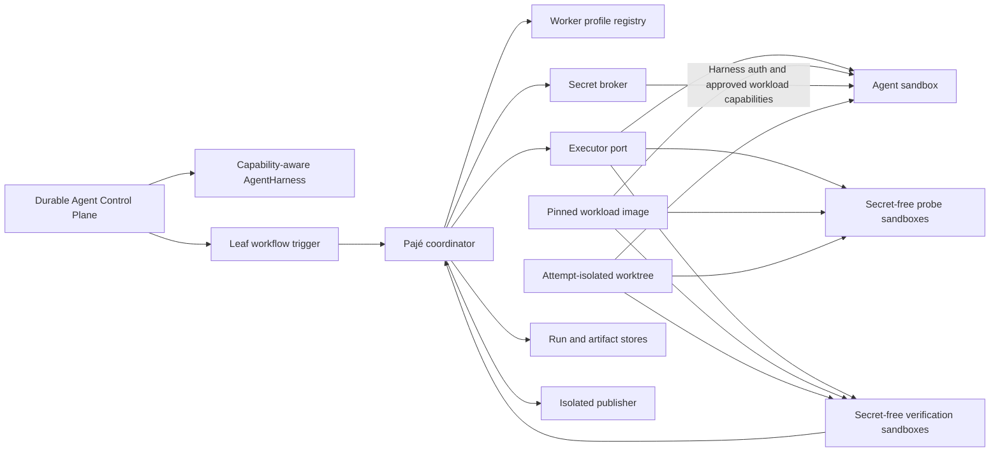

# Pajé Portable Worker Profiles and Isolated Execution Design

## Status

Approved through design review on 2026-07-25. This document is based on
repository commit `a9ea794` and extends both the durable
[`code-change@v1`](./2026-07-24-beta-code-change-workflow-design.md) design and
the approved
[`agent-piloted submission and harness`](./2026-07-25-agent-piloted-submission-and-harness-support-design.md)
design.

The agent-piloted design now defines a provider-neutral durable Agent Control
Plane above this substrate. This portable runtime remains an approved required
foundation; the correction does not delete or redesign its worker-profile,
secret-broker, executor, sandbox, artifact, approval, or publisher security
boundaries.

The current implementation remains authoritative until this design has an
approved implementation plan and its acceptance gates pass. The user confirmed
that `code-change@v1` has no external consumers or production run records, so
this design intentionally changes that contract in place. It does not create a
legacy decoder, migration path, or `code-change@v2` alias.

## Problem

The current Pajé image combines two responsibilities:

1. the long-running Pajé and Hatchet worker; and
2. the Codex, Node, Git, and SSH execution toolchain used by an agent process.

`code-change@v1` prepares a worktree and launches Codex as a child operating
system process in that same image. Repository profiles describe preflight and
verification behavior, but they do not declare which execution environment
provides the required tools. `environment_keys` lets workflow input request
operator-allowlisted values, but it does not model logical secret capabilities,
their delivery boundary, or the execution substrate.

This creates five problems:

- Adding a repository toolchain requires rebuilding the Pajé service image.
- The agent and credential-bearing coordinator share one operating-system and
  image boundary.
- A run cannot durably identify the exact toolchain that executed it.
- Secret requirements are expressed as environment variable names rather than
  portable capabilities.
- Kubernetes deployment details risk becoming the workflow model even though
  Pajé must also run on hosts, VMs, and other schedulers.

Pajé therefore needs a provider-neutral worker contract that declares an exact
runtime, toolchain, harness, and logical secret set while keeping secret values
and backend-specific objects out of workflow input and durable records.

## Relationship to the Agent Control Plane

This design proves isolated execution of one leaf command or
`code-change@v1` attempt. Fixed workflow phases and a single Codex process are
not sufficient agent-facing orchestration. They do not own a durable
`ControlRun`, `TaskGraph`, `Task`, `ProjectRef`, ownership,
`PlacementAttempt`, persistent `AgentSession`, mailbox/event cursor, evidence,
disposition, or close state.

The Agent Control Plane decides which ready task should run and which
parallelism primitive should own it. A persistent agent session may invoke
leaf workflows that use the worker profile, secret broker, and executor in this
design. Ephemeral subagents and harness-native bounded fan-out may perform
eligible coordination work without becoming executor commands. Local/sequential
work remains in the control agent. Each choice creates a durable
`PlacementAttempt`; only the persistent choice creates an `AgentSession`. The
agent-work lifecycle never gains an arbitrary command API; repository commands
continue through `Executor`.

Every control-plane task that reaches this layer has already recorded
`execution_placement`, `parallelism_primitive`, `placement_rationale`,
`capability_requirements`, `lifecycle_owner`, and `fallback`. The exact
provider-neutral primitive values are `persistent_session`,
`ephemeral_subagent`, `harness_native_parallel`, and `local_sequential`. The
placement decision considers
duration/complexity, filesystem/branch/project isolation, ownership
independence, shared context, restart survival, communication/steering/
monitoring, creation cost, concurrency limits, conflict risk, and handoff/audit.

For Codex:

- long, restartable, mutating, isolated, cross-project, or audit-heavy work
  prefers a persistent user-visible worktree-backed session;
- short read-only investigation/review with strongly shared context and no
  ownership conflict may use an ephemeral subagent;
- another advertised Codex bounded fan-out may be used for homogeneous work
  only after capability, limit, cancellation, and result semantics are
  verified; and
- dependent, overlapping, integration-owned, or uneconomic work remains
  local/sequential.

Placement is re-evaluated when the work or capability set changes. A growing
subagent is checkpointed and promoted to a persistent session with an explicit
handoff and lifecycle-owner transfer. Missing capabilities use the recorded
safe fallback; isolation-required work may block rather than downgrade.
Ephemeral subagents are read-only by default, and no two placements may mutate
overlapping ownership. These requirements are part of Agent Control Plane
acceptance even though their scheduler is outside this portable-runtime slice.

Primitive closure is equally capability-aware: persistent sessions require the
runtime-ID handshake, callback plus cursor-aware polling, and archive receipt;
ephemeral subagents use optional identity/ack/send/callback only when advertised
and require wait/read terminal plus runtime-close evidence; native fan-out
requires bounded deterministic aggregation or cancel evidence without synthetic
session identity; local/sequential work creates no child and must be inactive.
The control run closes only when every field of its typed pending-work gate is
zero.

## Goals

- Separate Pajé coordination services from agent and repository toolchains.
- Make the execution environment an explicit, immutable input to each run.
- Let operators define versioned worker profiles without embedding secret
  values in those profiles.
- Resolve logical secret capabilities through replaceable provider adapters.
- Execute preflight, agent, and verification work in isolated sandboxes with
  stage-specific credentials.
- Keep Docker, Kubernetes, Podman, VM, and scheduler types outside the durable
  workflow domain.
- Preserve artifact, approval, publication, retry, cancellation, cleanup,
  redaction, and restart-recovery guarantees from the beta design.
- Ship one bounded implementation slice: a local Docker Engine executor plus a
  non-secret host executor for development.
- Record enough safe evidence to reproduce which runtime and tools were used
  without persisting secret values or host paths.

## Non-Goals

- Building container images or installing tools dynamically during a run.
- Accepting repository-owned worker profiles, secret bindings, shell
  fragments, mutable image tags, or arbitrary container settings.
- Implementing a general workflow, build, package, or infrastructure DSL.
- Shipping Kubernetes Job, Podman, Nomad, VM, remote-Docker, or distributed
  worker-pool executors in the first slice.
- Implementing domain-aware network egress policy in the first slice.
- Exposing Hatchet, Mem0, submission, publisher, repository, registry-pull, or
  executor credentials to an agent or verification command.
- Letting a workload publish changes, approve a run, access the artifact store,
  or talk to the Docker Engine.
- Preserving the old `code-change@v1` wire shape or existing beta image layout.
- Making the Helm chart claim end-to-end Kubernetes execution before a
  Kubernetes executor passes the common conformance suite.

## Vocabulary

### Coordinator

The trusted Pajé process that owns leaf-workflow coordination, durable state,
memory access, workspace preparation, policy, artifact capture, approval, and
publication. It may contain infrastructure Git tooling, but it contains no
agent harness or repository language runtime.

### Repository profile

The existing `generic` or `go` behavior that discovers repository facts and
compiles shell-free verification commands. A repository profile describes how
to inspect and verify a repository. It does not provide a toolchain.

### Worker profile

An operator-owned, versioned, strictly decoded document that declares the
runtime, harness, tools, resource limits, network mode, and logical secret
capabilities for one class of workload. It never contains secret values.

### Executor

A provider-neutral port that creates, observes, cancels, and destroys one-shot
execution sandboxes. The first isolated adapter talks to a local Docker Engine.

### Sandbox

One isolated execution of one exact command. Preflight probes, the agent, and
verification commands use distinct sandboxes over one attempt worktree.

### Secret capability

A logical name such as `harness.codex-auth`. A capability states what a
workload needs without identifying where the value is stored.

### Secret binding

An operator-owned, versioned mapping from a capability to a provider-specific
source. Provider names, references, host paths, and values do not enter
workflow input or safe durable evidence.

### Secret lease

A bounded, attempt-scoped materialization returned by a secret broker. A lease
has an opaque identifier and expiry and must support idempotent revocation.

## Approaches Considered

### 1. Continue the combined service and toolchain image

This requires the fewest code changes and preserves the current process model.
It is rejected because every toolchain expands the service image and its attack
surface, and the agent remains in the credential-bearing coordinator boundary.

### 2. Split coordinator and per-command workload sandboxes

The coordinator resolves a versioned worker profile and asks an executor to run
one-shot sandboxes for tool probes, the agent, and verification. A shared
worktree carries repository changes, while secret leases are materialized only
for the exact agent sandbox that needs them.

This is the selected approach. It provides an enforceable credential boundary,
keeps the workflow domain portable, and admits both local-container and future
scheduler-backed executors without making Pajé a build system.

### 3. Build a distributed capability-matched worker pool immediately

Long-running workers could advertise tool and secret capabilities, receive
jobs remotely, attest their environment, and transport workspaces and results.
This is a useful future direction but requires scheduling, authentication,
attestation, distributed cancellation, workspace transport, and reconciliation
protocols. It is deferred until the local executor contract has proven the
domain boundary.

## Architecture



`AgentHarness` is shown only to locate the boundary; its lifecycle is
specified in the Agent Control Plane design. This document owns the path from a
leaf trigger through the coordinator and executor.

The coordinator has no dependency on Docker request or response types. The
executor port accepts only validated domain values and returns bounded,
provider-neutral execution results. Adapter diagnostics remain in returned
error chains and are projected into generic safe durable failures.

The workload image contains the harness, repository tools, and a minimal
`paje-sandbox-init` process, but no Pajé coordinator, Hatchet client, memory
client, publisher, submission gateway, secret provider client, or
container-engine client. `paje-sandbox-init` only reads the executor-created
private command material, constructs the exact child environment, and replaces
itself with the declared command. The workload does not receive the Docker
socket or any provider control credential.

## Worker Profile Contract

### Profile identity and registry

The first registry adapter loads operator-owned YAML documents from a configured
directory. Startup and reload are atomic: Pajé either validates the complete
set or keeps the last known-good set. Duplicate `name@revision` values,
unknown fields, invalid identifiers, and unsupported contract versions reject
the new set.

Workflow input references an exact `name@revision`. A bare name, `latest`,
mutable alias, floating tag, or version range is invalid. The registry returns
a normalized snapshot and SHA-256 digest of its canonical JSON encoding.

Names match `[a-z][a-z0-9-]{0,62}`. Revisions are positive integers. A profile
revision is immutable; changing any normalized field requires a new revision.

### Profile schema

```yaml
api_version: paje.araihu.com/v1alpha1
kind: WorkerProfile

metadata:
  name: codex-go
  revision: 1

runtime:
  kind: oci
  image: ghcr.io/araihu/paje-worker-codex-go@sha256:0123456789abcdef0123456789abcdef0123456789abcdef0123456789abcdef
  platform: linux/amd64
  network: outbound
  read_only_root: true

resources:
  cpu_millis: 2000
  memory_bytes: 4294967296
  pids: 256

harness:
  id: codex
  version: 0.144.5

tools:
  - name: go
    version: 1.26.1
    probe:
      executable: go
      args: ["version"]
      output_contains: go1.26.1

secrets:
  - capability: harness.codex-auth
    binding_revision: 1
    stage: agent
    delivery: directory
    target: /run/paje/secrets/codex
    required: true
```

The initial schema supports `runtime.kind` values `oci` and `host`:

- `oci` requires an image reference containing a full `sha256` digest, an
  explicit `linux/<architecture>` platform, `read_only_root: true`, positive
  resource limits, and network mode `none` or `outbound`.
- `host` contains no image and is accepted only by the development host
  executor. It cannot declare secrets and is disabled unless the operator
  explicitly enables it.

The OCI adapter rejects a pulled image whose inspected repository digest or
platform does not match the snapshot. Registry-pull credentials belong to the
executor infrastructure and are never made available inside a workload.

### Harness and tools

`harness.id` selects one registered, certified harness protocol adapter. The
declared version must exactly match the probed executable version. The harness
adapter owns the deterministic executable and argument vector, machine-readable
completion protocol, and final-result parser. A profile cannot replace those
arguments with arbitrary commands.

This is the execution-harness contract. The Agent Control Plane has a separate
provider-neutral `AgentHarness` for capability-aware dispatch, observe, send,
wait, interrupt/cancel, and primitive-specific close. `AgentSession` is only
its persistent-session specialization. Expanding that boundary does not add
command execution to it and does not weaken this execution-harness/executor
isolation.

Tools are operator assertions verified by bounded, shell-free probes before
secret materialization. A probe has one executable, an argument array, a
maximum output inherited from the executor policy, and a required literal
`output_contains` value. Empty matches, regular expressions, shell expansion,
and repository-supplied probes are rejected in the initial contract.

Tool and harness names are unique within a profile. Executables are bare names
resolved through the workload image's exact `PATH`; absolute host paths and
path traversal are invalid.

### Resource and network policy

Every OCI profile declares positive CPU, memory, and PID limits within
operator-configured maxima. The adapter also applies the existing command
timeouts and output limits.

`network: none` disables networking. `network: outbound` creates an isolated
network namespace with outbound connectivity, no published ports, no host
networking, and no inbound listener exposure through the executor. Domain or
address allowlists require a future executor capability and are not implied by
`outbound`.

An executor must fail closed when it cannot enforce any declared runtime,
resource, security, platform, or network requirement.

## Secret Contract

### Capabilities and reserved namespaces

Capability names use dot-separated lowercase identifiers. The profile registry
rejects duplicates and names under reserved platform namespaces including
`paje`, `hatchet`, `mem0`, `submission`, `publisher`, `git`, `ssh`,
`registry`, and `executor`.

Harness authentication uses a harness-managed namespace such as
`harness.codex-auth`. A registered harness adapter must explicitly recognize
every harness capability it consumes. Generic workload capabilities require an
operator policy entry that authorizes the exact profile, capability, stage,
delivery kind, and target.

The initial contract supports only `stage: agent`. Preflight and verification
secrets are rejected because those stages run repository-controlled commands.
Publisher credentials remain in the isolated publisher path after verification
and approval; they are not worker-profile capabilities.

All listed capabilities are required. The initial schema requires
`required: true`; optional secret behavior is deferred rather than silently
changing a workload when a binding is absent.

### Bindings

Bindings are loaded from a separate operator-owned registry:

```yaml
api_version: paje.araihu.com/v1alpha1
kind: SecretBindings

bindings:
  harness.codex-auth:
    revision: 1
    source:
      provider: filesystem
      reference: /etc/paje/secrets/codex
```

The initial broker supports:

- a filesystem source containing one bounded regular file or one bounded,
  symlink-free directory tree; and
- an environment source containing one bounded value from the coordinator's
  operator-controlled environment.

A change to provider, reference, authorization, or delivery policy requires a
new binding revision. Every operator-owned profile secret requirement pins its
exact positive `binding_revision`; it is independent of the worker-profile
revision and participates in the canonical profile digest. Resolve never
infers one revision from the other. It validates the exact capability and
binding revision against operator policy, then persists only that safe
`BindingRef`. The registry retains revisions referenced by nonterminal runs.
Rotating the secret value behind an unchanged source is allowed and does not
require a run migration.

Provider name, reference, host path, source environment key, secret length,
secret digest, and value are excluded from safe durable evidence.

### Delivery

The initial schema supports `file`, `directory`, and `environment` delivery:

- File and directory targets must be absolute, normalized paths below
  `/run/paje/secrets`, must not overlap the workspace, home, temporary, or
  another secret target, and are private to the agent sandbox.
- Environment targets must be valid environment keys, must pass a separate
  operator allowlist, and cannot be baseline, stage-managed, platform, Git,
  SSH, or publisher keys.
- File and directory delivery are the default. Environment delivery is
  explicit because values are more observable to workload descendants.

The Docker adapter creates a private in-container `tmpfs`, copies materialized
bytes through the Engine API before process start, applies private ownership
and modes, and then starts `paje-sandbox-init`. For environment delivery, the
init process reads the private file after container start, adds the value only
to the target child environment, removes the materialization, and `execve`s the
declared command. No value appears in Docker container configuration,
inspection metadata, CLI arguments, image layers, bind-mount sources, durable
requests, or container labels.

Harnesses that need writable state receive a private writable copy in another
attempt-scoped `tmpfs`; the operator's source is never mutated. Codex uses this
mechanism for `CODEX_HOME`.

The broker returns an in-memory lease with an opaque identifier and expiry no
later than the attempt deadline. Revocation is idempotent. The executor and
workflow retain leased bytes only for the materialization window and use them
as transient exact-match redaction inputs. Pajé makes no claim that transformed
or deliberately exfiltrated values can be identified, so least-privilege
bindings and artifact secret policy remain mandatory.

## `code-change@v1` Changes

The strict input adds a required worker profile and removes arbitrary
environment-key requests:

```go
type Input struct {
    IdempotencyKey   string
    TaskDescription  string
    RepositoryURI    string
    BaseRef          string
    MemoryQuery      string
    MemoryLimit      int
    Tags             map[string]string
    WorkerProfile    string
    Profile          string
    Checks           []verification.CommandSpec
    ModuleExclusions []repository.ModuleExclusion
    Publication      Publication
}
```

`WorkerProfile` is required and contains the exact `name@revision` reference.
`Profile` remains the repository profile (`generic` or `go`).
`EnvironmentKeys` is removed. Unknown-field rejection means old requests that
include it fail validation.

The current global runner adapter, runner command, runner arguments, Codex
home, and child environment allowlist stop selecting the code-change workload.
The composition root instead provides a worker-profile registry, secret
broker, executor registry, and harness registry.

All repository fixtures, Hatchet examples, gateway examples, README examples,
site examples, Helm values, and acceptance requests move to the new v1 shape in
the same implementation. Existing local beta run data is intentionally
discarded before starting the changed binary.

## Provider-Neutral Ports

### Worker profile registry

```go
type ProfileID struct {
    Name     string
    Revision uint64
}

type Registry interface {
    Resolve(context.Context, ProfileID) (Snapshot, error)
}
```

`Snapshot` is fully normalized, safely serializable, and contains its canonical
digest. The workflow never re-resolves a profile after Resolve succeeds.

### Secret broker

```go
type AcquireRequest struct {
    RunID        string
    Attempt      int
    StartedAt    time.Time
    ProfileID    workerprofile.ProfileID
    Capability   string
    Binding      uint64
    Delivery     Delivery
    Deadline     time.Time
}

type Broker interface {
    Acquire(context.Context, AcquireRequest) (Lease, error)
    Revoke(context.Context, string) error
}
```

`Lease` contains an opaque ID, expiry, and transient materialization. It has no
JSON representation and must not be attached to a run record, Hatchet payload,
artifact, or log field.

### Executor

```go
type AttemptID struct {
    RunID     string
    Stage     string
    Attempt   int
    StartedAt time.Time
    Purpose   string
    Sequence  int
}

type Executor interface {
    Execute(context.Context, Request) (Result, error)
    Inspect(context.Context, AttemptID) (State, error)
    Cancel(context.Context, AttemptID) error
    Destroy(context.Context, AttemptID) error
}
```

An executor request contains an exact profile snapshot, one shell-free command,
workspace access, bounded non-secret environment values, transient secret
materializations, time and output limits, and the deterministic attempt ID.
Provider handles and secret values are never durable fields.

Each command uses a one-shot sandbox. `Purpose` is one of `probe`, `agent`, or
`verification`; `Sequence` distinguishes multiple probes and checks. Adapter
resources use deterministic labels derived from the complete attempt identity.
`Inspect`, `Cancel`, and `Destroy` rediscover resources from those labels and
are idempotent.

`Result` preserves whether the command was created, started, and completed;
exit status; bounded stdout and stderr; duration; truncation; and generic safe
runtime facts. This evidence is sufficient to enforce retry semantics without
persisting raw provider responses.

## Execution Lifecycle

### Resolve

Resolve performs the existing input, repository, capability, and memory work
with these additions:

1. Strictly decode the changed `code-change@v1` input.
2. Resolve the exact worker profile ID.
3. Validate the profile against the selected executor and harness registries.
4. Validate every secret capability and its profile-pinned exact binding
   revision against operator policy; never select it from the profile revision.
5. Persist the normalized safe profile snapshot, profile digest, capability
   names, and binding revisions in the run record.
6. Bind those fields bidirectionally to the run's canonical input and status.

Resolve never acquires a secret, pulls an image, starts a sandbox, or runs a
tool probe. Transient provider unavailability before durable resolution may be
retried under the existing Resolve lease semantics.

### Execute

Execute uses one attempt-isolated worktree and the persisted profile snapshot:

1. Acquire exact durable Execute ownership.
2. Prepare a fresh worktree at the resolved base SHA.
3. Ask the executor to verify the exact runtime image and platform.
4. Run each harness and tool probe in a secret-free one-shot sandbox.
5. Run repository preflight through secret-free sandboxes and compile the
   verification commands.
6. Build the bounded agent prompt.
7. Acquire the exact agent-stage secret leases.
8. Run the harness command in one agent sandbox with the worktree writable.
9. Destroy the agent sandbox and revoke every lease with bounded non-canceled
   compensation.
10. Run each verification command in a fresh secret-free sandbox over the
    modified worktree.
11. Capture and validate the Git artifact, apply change policy, persist and
    checkpoint the artifact, and record bounded safe evidence.
12. Destroy every remaining sandbox and remove runtime and worktree state.
13. Persist the final Execute attempt only while exact ownership still holds.

The workflow checks durable ownership before and after every sandbox, secret,
artifact, and final-state side effect. A stale worker may clean only resources
whose complete deterministic attempt identity it owns.

### Publication

Publication remains outside agent workload execution. The publisher applies
the approved artifact to publisher-owned trusted state and asks the executor to
rerun required checks in fresh secret-free verification sandboxes using the
same persisted worker profile. Those sandboxes receive neither agent nor
publisher secrets and cannot access the agent worktree.

Only after those checks pass does the isolated publisher process receive
GitHub credentials and perform token-bearing Git operations in publisher-owned
configuration that was never exposed to repository-controlled execution. The
executor never receives publisher credentials or remote push authority.

## Durable Evidence

The run record persists:

- worker profile ID, revision, canonical safe snapshot, and digest;
- runtime kind, exact image digest, and platform;
- harness ID and declared/probed version;
- tool names, declared versions, bounded redacted probe outcomes, and pass or
  failure status;
- secret capability names and binding revisions;
- executor attempt identities and generic lifecycle states;
- agent and verification environment key names, never values;
- existing transcript, verification, capture, artifact, policy, approval,
  publication, and cleanup evidence under current size and safety limits.

The run record, Hatchet payloads, artifacts, logs, metrics, errors, and outcome
memory exclude:

- secret values, lengths, digests, or reversible encodings;
- provider names or references;
- source environment keys and filesystem paths;
- Docker IDs, socket paths, raw inspect responses, and engine diagnostics;
- worktree, runtime, home, temp, and secret-materialization host paths;
- registry-pull, Docker, Hatchet, Mem0, submission, publisher, Git, or SSH
  credentials.

Canonical run validation treats the resolved profile snapshot and digest as
immutable and write-once. A retry cannot observe a newer profile revision.

## Failure, Retry, Cancellation, and Recovery

Pajé retries only when it can prove the agent did not start.

| Condition | Class | Retryable |
| --- | --- | --- |
| Missing, malformed, or unsupported profile | `input` | no |
| Forbidden capability, target, or delivery | `policy` | no |
| Image pull or secret-provider outage before start | `environment` | yes |
| Image digest/platform mismatch or failed tool probe | `environment` | no |
| Sandbox creation failure before process start | `environment` | yes |
| Agent non-zero exit or incomplete response after start | `agent` | no |
| Executor state loss or disconnect after agent start | `internal` with `ambiguous_attempt` | no |
| Required verification failure | `verification` | no |
| Sandbox destruction, secret revocation, or worktree cleanup failure | `cleanup` | no |

Provider errors use stable generic diagnostics and cause codes. Raw causes
remain in the returned error chain for trusted local diagnostics but are not
serialized.

On restart, Pajé inspects the deterministic attempt identity:

- If the executor proves that the agent sandbox never started, Pajé destroys
  attempt resources and may retry within the existing attempt budget.
- If the agent started, completed without a durable checkpoint, is still
  running past the lease, or cannot be found with conclusive non-start proof,
  Pajé records nonretryable `ambiguous_attempt` and cleans up.
- If an immutable artifact reference was checkpointed, it remains
  authoritative and the agent is never rerun to reproduce it.

Cancellation propagates to the executor, which stops the sandbox and every
descendant. Pajé revokes leases, destroys resources, and removes the worktree
using bounded non-canceled contexts. The run becomes `canceled` only when
termination is confirmed. Unknown termination becomes `ambiguous_attempt`.

Cleanup failure overrides success and makes any earlier failure nonretryable.
Lease expiry limits exposure if explicit revocation fails, but expiry does not
turn a cleanup failure into success.

## Docker Executor

The first isolated adapter talks directly to a local Docker Engine through its
Unix socket. It does not shell out to `docker`, accept a TCP endpoint, inherit a
Docker context, or support a remote daemon. The coordinator and engine must see
the same attempt worktree filesystem so the adapter can bind-mount it.

For each one-shot sandbox the adapter:

1. Validates the local Unix socket and engine capabilities.
2. Pulls the exact digest when absent, using executor-only registry
   credentials.
3. Inspects and binds the actual image digest and platform.
4. Creates a container with deterministic attempt labels, no entrypoint shell,
   the exact executable and arguments, an exact environment, and the worktree
   at a fixed container path.
5. Applies a non-root user, read-only root filesystem, no-new-privileges,
   dropped Linux capabilities, PID/memory/CPU limits, private home and temp
   `tmpfs` mounts, no devices, no privileged mode, no host namespaces, no
   published ports, and the declared network mode.
6. Creates a private secret `tmpfs` and copies leased material and bounded
   command metadata through the Engine archive API before start.
7. Starts `paje-sandbox-init`, which constructs the exact child environment,
   removes transient environment materializations, and replaces itself with
   the declared executable without invoking a shell.
8. Streams bounded stdout and stderr, waits for an exact terminal state, and
   records generic lifecycle evidence.
9. Cancels by stopping and then force-killing within bounded intervals.
10. Removes the container and attempt-owned network resources idempotently.

The workload never receives the engine socket. Docker resource names, IDs,
inspect payloads, and host bind paths are ephemeral adapter state and are
scrubbed from durable diagnostics.

The initial certified deployment runs the coordinator binary on a Linux host
or VM with a local Docker Engine. Running the coordinator itself in a container
with an engine socket grants that container engine-level authority and is not
part of the initial acceptance claim.

## Host Development Executor

The existing local process behavior becomes an explicitly enabled development
executor for `runtime.kind: host` profiles. It retains exact shell-free process
execution, process-group cancellation, bounded output, and stage environment
filtering.

Host profiles cannot declare secrets, cannot be labeled isolated or certified,
and are rejected when production-only mode is enabled. They exist for fast
unit, integration, and contributor workflows, not as the target security
boundary.

## Images and Packaging

The current Dockerfile is split into two concerns:

- The coordinator artifact contains Pajé and only the operating-system tools
  needed for trusted workspace, artifact, and publisher responsibilities. It
  omits Node, Codex, and repository language runtimes.
- `paje-worker-codex` contains the exact Codex harness, required runtime
  dependencies, Git without credentials, the declared repository tools, and
  the minimal `paje-sandbox-init` helper. It has no coordinator or service
  entrypoint and defaults to a non-root user.

The first repository-provided worker profile is `codex-go@1`, backed by an
exact image digest and pinned Codex, Node, Git, and Go versions. Operators may
build additional immutable images and profiles, but Pajé does not build them.

Every supported profile version has image metadata and acceptance evidence
binding the Pajé revision, profile digest, image digest, platform, harness
version, and tool versions.

## Deployment and Helm Positioning

The provider-neutral contract does not assume Kubernetes. The first complete
deployment target is a Linux host or VM running the Pajé coordinator with a
local Docker Engine.

The Helm chart may continue to deploy the coordinator plane, gateway, durable
storage, and service credentials, but it must not claim that code-change
workloads execute in Kubernetes until a Kubernetes Job executor exists. The
chart does not mount a Docker socket by default and does not deploy
Docker-in-Docker.

A future Kubernetes executor maps the same persisted profile snapshot to a Job,
uses Kubernetes-native secret materialization and workspace transport, and must
pass the same executor conformance and credential-isolation suite. Kubernetes
objects remain adapter details.

README, site, chart notes, values descriptions, and support matrices must label
local Docker execution as current only after acceptance, host execution as
development-only, and Podman, remote, and Kubernetes execution as planned.

## Implementation Scope

The implementation is delivered in five ordered slices:

1. Worker-profile and secret-binding contracts, strict registries, canonical
   snapshots, and unit tests.
2. Provider-neutral executor lifecycle, mock and host adapters, harness command
   separation, and the reusable conformance suite.
3. Local Docker Engine adapter, filesystem and environment secret sources,
   lease handling, split images, and image tests.
4. Breaking `code-change@v1` integration, durable record changes, restart
   recovery, artifact evidence, and Hatchet/gateway fixture migration.
5. Real Docker and live Codex acceptance, documentation, site, configuration,
   Helm positioning, and release evidence.

Each slice keeps the repository buildable and its relevant tests passing. No
public support claim changes before the matching end-to-end acceptance evidence
exists.

## Test Strategy

### Worker-profile and registry tests

- strict YAML decoding and unknown-field rejection;
- identifier, revision, digest, platform, image, tool, target, resource, and
  network validation;
- duplicate and conflicting profile revisions;
- canonical digest stability across map and input formatting order;
- atomic registry reload and last-known-good behavior;
- forbidden repository ownership and mutable references;
- safe persisted snapshot round trips and corruption denial.

### Secret tests

- capability grammar, reserved namespaces, exact profile authorization, and
  binding revision pinning;
- filesystem regular-file and directory validation, ownership, modes, size and
  entry limits, symlink denial, and path containment;
- environment source bounds and missing-key behavior;
- delivery target normalization, overlap denial, environment-key denial, and
  writable-copy isolation;
- environment delivery through private post-start materialization with no
  value in Docker container configuration or inspection metadata;
- lease expiry, idempotent revocation, partial acquisition compensation, and
  provider outage classification;
- exact-value and path redaction at every durable boundary;
- absence of values, lengths, digests, references, and source keys from run
  JSON, Hatchet payloads, artifacts, logs, metrics, errors, and outcome memory.

### Executor conformance suite

Every isolated executor must pass one reusable contract suite covering:

- exact image/platform binding and unsupported-capability denial;
- shell-free command and environment construction;
- deterministic attempt labels and collision handling;
- created, started, completed, canceled, unknown, and destroyed states;
- bounded output, non-zero exit, timeout, context cancellation, and malformed
  provider state;
- idempotent inspect, cancel, and destroy;
- descendant termination and no post-cancel process;
- worktree mount access and sibling/host path denial;
- secret materialization before start, stage isolation, revocation, and
  destruction;
- sandbox-init command validation, no-shell `execve`, malformed command
  material denial, and removal of transient environment materializations;
- resource, network, privilege, user, root filesystem, namespace, device, and
  socket restrictions;
- safe diagnostics and provider-detail scrubbing.

### Workflow and restart tests

- exact profile and binding snapshot persistence in Resolve;
- bidirectional binding among input, profile digest, run status, stage history,
  and artifacts;
- restarts before sandbox creation, before start, after start, after agent
  completion, during verification, during artifact save/checkpoint, and during
  cleanup;
- proven non-start retry versus post-start ambiguity;
- stale ownership fencing before and after every executor and secret side
  effect;
- cancellation during every lifecycle boundary with bounded compensation;
- immutable artifact checkpoint authority and no agent rerun;
- cleanup failure overriding success and retryability;
- old `environment_keys` input rejection and new required profile validation.

### Adversarial tests

The workload attempts to read or mutate:

- coordinator, Hatchet, Mem0, gateway, publisher, registry, and Docker
  credentials;
- the Docker socket and container host metadata;
- parent and sibling process environments and file descriptors;
- sibling worktrees, the source checkout, host filesystem, coordinator home,
  and runtime directories;
- secret material after the agent sandbox exits;
- publisher-owned Git configuration and remote credentials.

Additional probes fork descendants, ignore termination, fill output and PID
limits, attempt path and symlink escapes, write exact secret values into tracked
files, encode secrets into diagnostics, and try to leave persistent resources.
Policy must reject detected plaintext secret material in artifacts, and every
attempt resource must be absent after cleanup.

### Image and live acceptance

- coordinator image omits Codex, Node, and Go toolchains while retaining exact
  trusted infrastructure requirements;
- workload image runs non-root with a read-only root and exact profile versions;
- sandbox-init is the only Pajé-derived workload helper and has no provider,
  network-control, durable-store, approval, or publication capability;
- image labels bind source revision and tool versions;
- no-cache builds reproduce expected binaries and metadata;
- a real Docker sandbox runs probes, a real Codex agent changes a disposable
  repository, secret-free verification passes, and the artifact reproduces the
  exact Git tree;
- the source checkout, sibling workspaces, Docker resources, secret material,
  and descendant processes remain unchanged or absent;
- cancellation and an intentionally interrupted coordinator prove restart
  classification against the real engine;
- existing Go, race, vet, cross-build, artifact, approval, publisher, chart,
  and optional GitHub acceptance gates remain green.

## Acceptance Criteria

This design is implemented only when evidence proves all of the following:

1. `code-change@v1` requires an exact operator-owned worker-profile revision
   and rejects `environment_keys` and mutable runtime references.
2. Resolve persists and validates an immutable safe profile snapshot, digest,
   capability list, and binding revisions without acquiring a secret.
3. The coordinator image contains no agent harness or repository language
   runtime, and the workload image contains no Pajé service client or
   credential.
4. The local Docker adapter runs probes, the agent, and verification in
   distinct one-shot sandboxes with the exact persisted image digest.
5. Only the agent sandbox receives its approved capability leases; preflight
   and verification receive no harness or workload secrets.
6. Secret values, metadata, provider references, host paths, and engine details
   appear in no durable or user-visible surface.
7. A workload cannot access the Docker socket, coordinator credentials,
   publisher credentials, source checkout, or sibling worktrees.
8. Retry occurs only after conclusive non-start proof. Any post-start unknown
   state becomes nonretryable `ambiguous_attempt`.
9. Cancellation terminates every descendant, revokes leases, destroys
   sandboxes, removes the worktree, and becomes terminal only after confirmed
   cleanup.
10. A checkpointed artifact remains authoritative across restart and is never
    regenerated by rerunning the agent.
11. A real Codex workload changes a disposable repository, verification passes
    without secrets, and the artifact reproduces the exact changed tree.
12. Publisher re-verification uses the same persisted toolchain in secret-free
    sandboxes before publisher credentials enter a publisher-owned process.
13. Host execution remains explicit, secret-free, and development-only.
14. Helm, README, site, and support matrices do not claim Kubernetes, Podman,
    remote, or distributed execution before the corresponding adapter passes
    conformance and live acceptance.
15. Existing durable workflow, approval, publisher, memory, artifact, race,
    vet, cross-build, chart, image, and live acceptance gates remain green.
16. Agent Control Plane acceptance proves every task records its execution
    placement, primitive, rationale, capability requirements, lifecycle owner,
    and fallback; the concrete Codex mapping, promotion, missing-capability
    fallback, concurrency limits, and overlapping-subagent mutation denial all
    pass.
17. Portable executor acceptance remains a lower-layer gate and is never used
    as evidence that placement-attempt lifecycle, persistent-session archive,
    ephemeral runtime close, native fan-out aggregation, multi-project
    orchestration, or typed zero-pending-work closure is complete.

## Future Extensions

The following extensions reuse the same domain contract and require separate
designs and acceptance evidence:

- Kubernetes Job execution and workspace transport;
- Podman or containerd-backed local execution;
- authenticated remote executors and distributed capability scheduling;
- secret providers such as Vault or cloud secret managers;
- domain-aware egress controls;
- signed profile and image provenance;
- optional capabilities and explicit workflow-level capability requests;
- repository-requested tool requirements matched against operator profiles;
- profile discovery and administration APIs.

None of these extensions may weaken the coordinator/workload credential
boundary or silently change a persisted profile snapshot for an existing run.
